# 通过聚合链接按指定方式跳转至应用

更新时间：2026-04-20 06:34:33

来源：https://developer.huawei.com/consumer/cn/doc/harmonyos-guides/applinking-cross-platform

#### 场景介绍

从6.0.0(20)版本开始，新增支持聚合链接能力。
 
可用于实现在HarmonyOS系统的设备上点击链接后，按照指定的方式进行跳转。当用户打开链接时，聚合链接会引导用户跳转到HarmonyOS平台预览页、应用市场详情页、自定义网址、深度链接地址等页面。
 
聚合链接主要用于直接向用户发送应用推广信息，例如通过短信/邮件/社交分享链接发送产品优惠活动或应用推广活动。
 
  

#### 前提条件

已[开通App Linking服务](https://developer.huawei.com/consumer/cn/doc/harmonyos-guides/applinking-enable-applinking)。
 
  

#### 开发流程
 
| 角色 | 操作步骤 |
| --- | --- |
| 云端开发 | 开通App Linking服务。 |
| 云端开发 | 先在AGC申请链接前缀并添加网址允许清单，然后创建聚合链接。 |
| 客户端开发 | 在module.json5中配置聚合链接。 |
| 客户端开发 | 处理拉起方应用传入的链接。 |
| 客户端开发 | 验证应用被拉起效果。 |
 
 
  

#### 配置聚合链接能力

  

#### 申请链接前缀

链接前缀是指聚合链接地址中包含的网址，其格式为https://域名。创建聚合链接前，需要申请链接前缀。
 1. 登录[AppGallery Connect](https://developer.huawei.com/consumer/cn/service/josp/agc/index.html)，点击“开发与服务”。
2. 在项目列表中点击HarmonyOS应用所在的项目（请确保所有平台的应用在同一项目下）。
3. 在左侧导航栏中选择“增长 > App Linking > 聚合链接”，选择“链接前缀”页签，点击“添加链接前缀”。

  
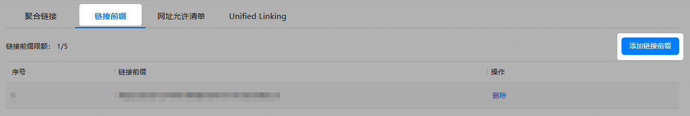

4. 在AGC提供的免费域名（例如中国站点的域名：drcn.agconnect.link）前再设置一个前缀字符串，前缀字符串仅支持小写字母和数字，且必须确保此前缀唯一。设置完成后点击“下一步”。

  
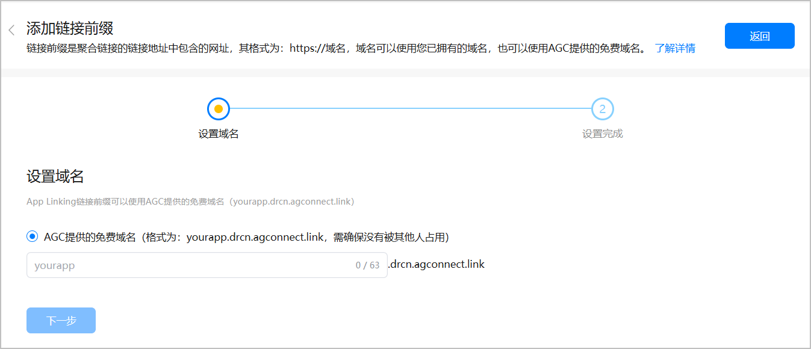

5. 等待域名地址验证通过后，页面将显示完整域名。

  
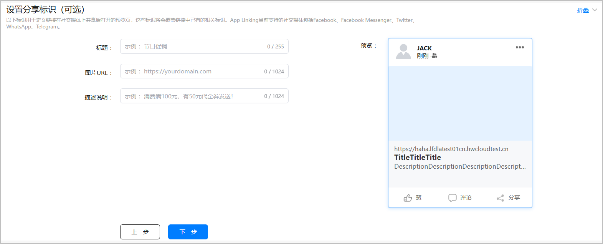

 
  

#### 添加网址允许清单

创建聚合链接前，需要添加网址允许清单来指定深度链接地址和自定义网址中允许使用的网址格式。设置后，聚合链接仅允许重定向到符合允许清单规则的网址，从而防止网站诱骗。
 1. 登录[AppGallery Connect](https://developer.huawei.com/consumer/cn/service/josp/agc/index.html)，点击“开发与服务”。
2. 在项目列表中点击HarmonyOS应用所在的项目（请确保所有平台的应用在同一项目下）。
3. 在左侧导航栏中选择“增长 > App Linking > 聚合链接”，选择“网址允许清单”页签，点击“添加允许清单规则”。

  
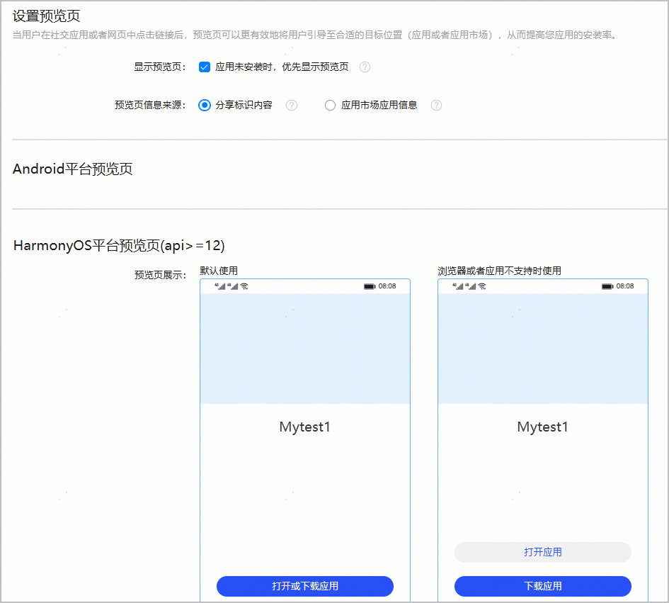

4. 使用正则表达式设置允许清单规则，设置完成后点击右上角的“发布”。

  
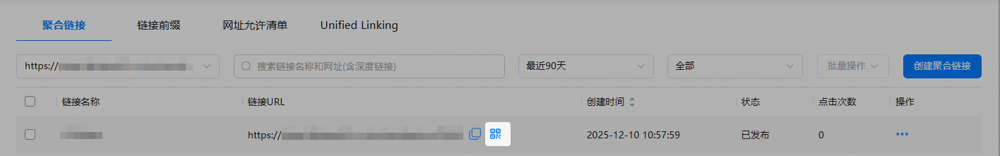

 
  

#### 创建聚合链接

配置聚合链接，按照指定的方式进行跳转。
 1. 登录[AppGallery Connect](https://developer.huawei.com/consumer/cn/service/josp/agc/index.html)，点击“开发与服务”。
2. 在项目列表中点击HarmonyOS应用所在的项目（请确保所有平台的应用在同一项目下）。
3. 在左侧导航栏中选择“增长 > App Linking > 聚合链接”，选择“聚合链接”页签，点击“创建聚合链接”。

  
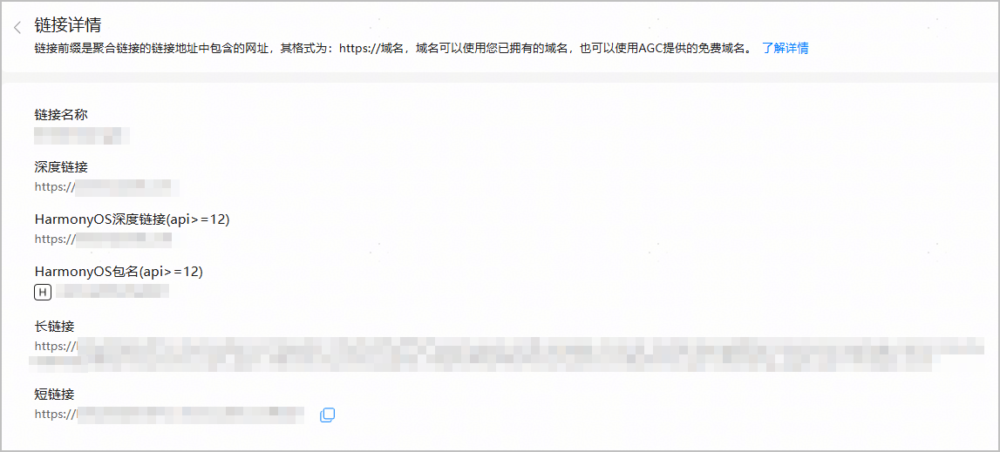

4. 设置短链接，完成后点击“下一步”。

  
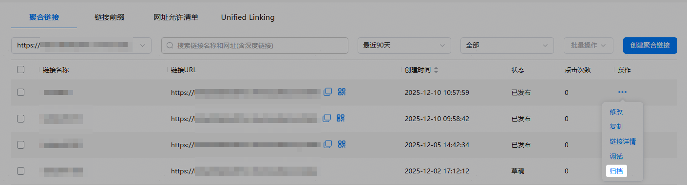


| 参数 | 参数说明 |

| --- | --- |

| 链接前缀 | 聚合链接的前缀。如果还未申请链接前缀，请参见申请链接前缀。 “链接前缀”下方的文本框中可设置聚合链接的短链接后缀字符串，默认由AGC自动生成。如果需要自行定义，请确保该字符串唯一。 |

| 链接预览 | 聚合链接向用户发送的短链接地址。 |
5. 设置深度链接，完成后点击“下一步”。

  
- 深度链接地址中使用的域名需满足“网址允许清单”要求。

6. 深度链接地址不允许设置为可执行文件格式。

7. 设置聚合链接在HarmonyOS系统的链接行为，完成后点击“下一步”。

  
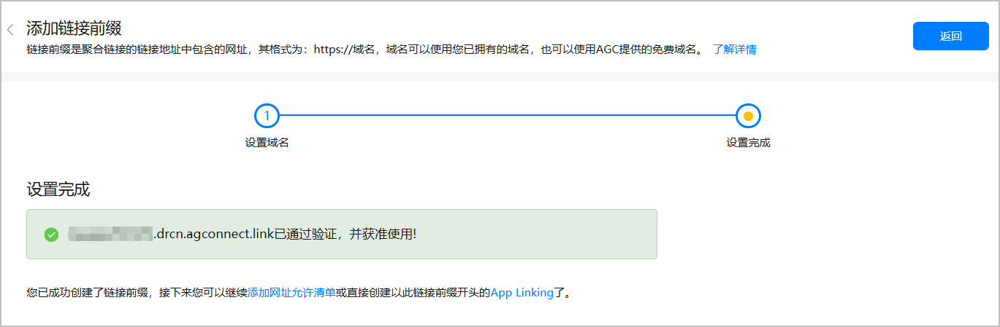


| 参数 | 参数说明 |

| --- | --- |

| 设置在HarmonyOS系统的链接行为(api>=12) | 1. 选择“在HarmonyOS应用中打开”，表示用户点击链接会跳转到HarmonyOS应用中的深度链接地址。 2. 选择或添加需要配置深度链接地址的HarmonyOS应用。 |

| 未安装应用时，则重定向到 | 如果用户未安装HarmonyOS应用，可通过此选项将用户引导到“华为应用市场页面详情页”或“自定义网址”。 说明： 如果选择“自定义网址”，链接不允许设置为可执行文件格式。 |

8. （可选）在“设置跟踪参数”页面，设置广告跟踪参数，可用于广告、流量跟踪。

  
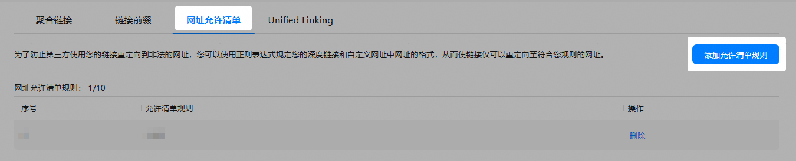


| 参数 | 参数说明 |

| --- | --- |

| 广告系列来源 | 广告渠道，如Huawei，也可自定义。 |

| 广告系列媒介 | 广告媒介的标识，如pic 、email。 |

| 广告系列名称 | 特定的推广活动描述，如“双11推广”。 |

9. （可选）设置社交分享标识，可用于社交软件之间的分享，设置完成后点击“下一步”。

  
> [!TIP]
> 设置了社交分享标识参数后，可通过 社交分享标识说明 了解设置效果。


  
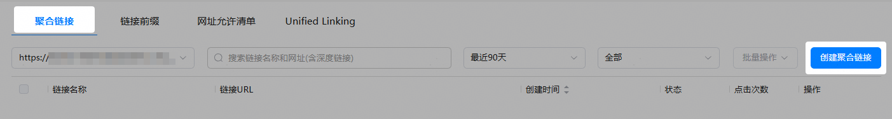


| 参数 | 参数说明 |

| --- | --- |

| 标题 | 聚合链接在社交平台上分享时展示的标题名称。 |

| 图片URL | 聚合链接在社交平台上分享时展示的图片地址。 |

| 描述说明 | 聚合链接在社交平台上分享时展示的说明信息。 |

10. （可选）设置预览页，可以将用户引导至合适的目标位置。

  
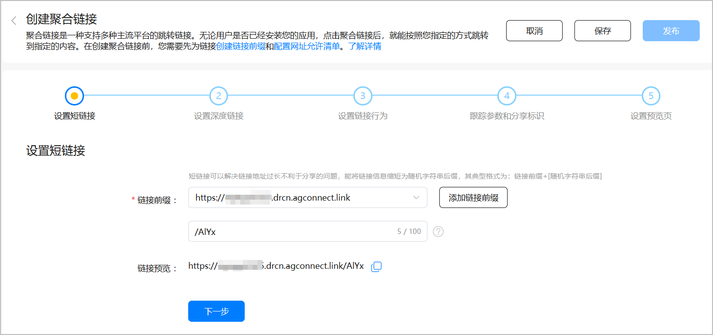


| 参数 | 参数说明 |

| --- | --- |

| 显示预览页 | 应用未安装，点击聚合链接时，预览页的显示情况。 - 勾选：在点击聚合链接时，应用如果未安装，则在重定向到应用市场详情页前优先显示预览页。 - 不勾选（默认）：在点击时，应用如果未安装，则会根据浏览器的类型，尽可能地优先拉起应用市场详情页。 说明： 目前仅支持华为浏览器。 |

| 预览页信息来源 | 勾选“显示预览页”后，可以选择预览页信息展示的内容。 - “分享标识内容”：采用分享标识信息构建预览页。 - “应用市场应用信息”：采用AGC中配置的应用信息构建预览页。 |

11. 全部设置完成后，点击右上角的“发布”，页签中将展示已发布的聚合链接列表。

  
点击网址中的二维码图标，或对应操作栏下方的“二维码下载”，可以下载该聚合链接的二维码图片。

  
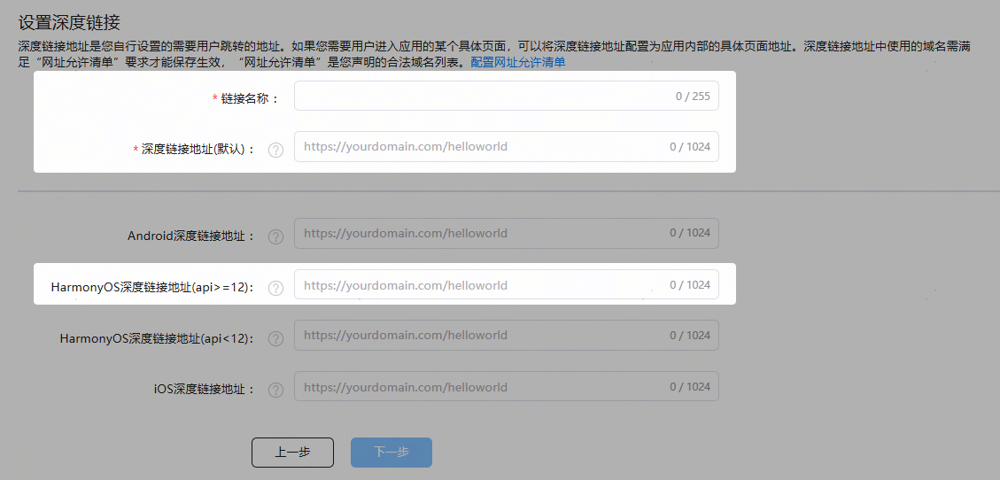


  点击对应操作栏下方的“链接详情”，可以查看该聚合链接的详情，包括深度链接地址、HarmonyOS应用包名、短链接地址等。

  
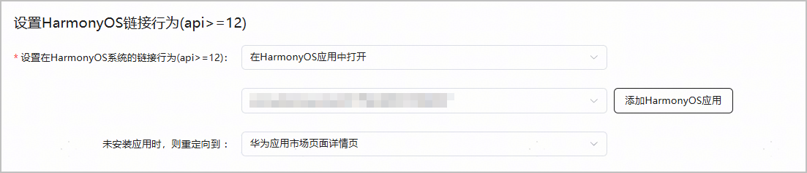


 
  

#### （可选）归档聚合链接

创建聚合链接后，如果不想继续管理该链接，而又不希望影响用户较长一段时间内的使用，可以选择归档聚合链接。
 
- 归档7天后的聚合链接将被隐藏，开发者无法通过AGC查看或撤销归档。
- 归档后的聚合链接默认从归档时起1年内有效，请谨慎操作。

 
**操作步骤如下：**
 1. 登录[AppGallery Connect](https://developer.huawei.com/consumer/cn/service/josp/agc/index.html)，点击“开发与服务”。
2. 在项目列表中点击HarmonyOS应用所在的项目。
3. 在左侧导航栏中选择“增长 > App Linking > 聚合链接”。
4. 选择“聚合链接”页签，对已创建的聚合链接进行归档。

  
- 单条归档：在聚合链接列表，选择待归档聚合链接对应“操作”列下方的“归档”。

  
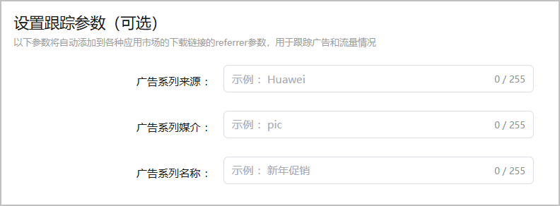


5. 批量归档：在列表，勾选多条待归档，选择右上角“批量操作”的下拉选项中的“归档”。

  


  

  #### 在module.json5中配置聚合链接

  在HarmonyOS应用的[module.json5文件](https://developer.huawei.com/consumer/cn/doc/harmonyos-guides/module-configuration-file)中进行如下配置，用于接收聚合链接，以获取聚合链接中传递的数据。

  
"entities"列表中必须包含"entity.system.browsable"。
- "actions"列表中必须包含"ohos.want.action.viewData"。
- "uris"列表中必须包含"scheme"为"https"且"host"为域名地址的元素，可选属性包含"path"、"pathStartWith"和"pathRegex"，具体请参见“[uris标签说明](https://developer.huawei.com/consumer/cn/doc/harmonyos-guides/app-uri-config#uris标签说明)”。
- "domainVerify"设置为true，表示开启域名校验开关。

 
> [!NOTE]
> skills标签下默认包含一个skill对象，用于标识应用入口。应用跳转链接不能在该skill对象中配置，需要创建独立的skill对象。 如果存在多个跳转场景，需要在skills标签下创建不同的skill对象，否则会导致配置无法生效。

 
例如，聚合链接的域名是example.drcn.agconnect.link，则需进行如下配置。
 
```ArkTS
{
  "module": {
    "abilities": [
      {
        "name": "EntryAbility",
        "srcEntry": "./ets/entryability/EntryAbility.ets",
        "icon": "$media:icon",
        "label": "$string:EntryAbility_label",
        // 请将exported配置为true；如果exported为false，仅具有权限的系统应用能够拉起该应用，否则无法拉起应用
        "exported": true,
        "startWindowIcon": "$media:icon",
        "startWindowBackground": "$color:start_window_background",
        "skills": [
          {
            "entities": [
              "entity.system.home"
            ],
            "actions": [
              "ohos.want.action.home"
            ]
          },
          {
            "entities": [
              // entities必须包含"entity.system.browsable"
              "entity.system.browsable"
            ],
            "actions": [
              // actions必须包含"ohos.want.action.viewData"
              "ohos.want.action.viewData"
            ],
            "uris": [
              {
                // scheme须配置为https
                "scheme": "https",
                // host须配置为聚合链接的域名
                "host": "example.drcn.agconnect.link",
                // path可选，表示聚合链接的短链接后缀字符串，例如example.drcn.agconnect.link/AIYx中的AIYx
                // 如果应用只能处理部分特定的path，则此处应该配置应用所支持的path，避免出现应用不能处理的path链接也被引流到应用中的问题
                "path": "AIYx"
              }
            ],
            // domainVerify须设置为true
           "domainVerify": true
          }
          // 若有其他跳转能力，如推送消息跳转、NFC跳转，可新增一个skill对象，防止与App Linking业务冲突
        ]
      }
    ]
  }
}
```
 
  

#### 处理拉起方应用传入的链接

在HarmonyOS应用的Ability（如EntryAbility）的[onCreate()](https://developer.huawei.com/consumer/cn/doc/harmonyos-references/js-apis-app-ability-uiability#oncreate)或者[onNewWant()](https://developer.huawei.com/consumer/cn/doc/harmonyos-references/js-apis-app-ability-uiability#onnewwant)生命周期回调中添加如下代码，以处理传入的链接。
 
```text
import { AbilityConstant, UIAbility, Want } from '@kit.AbilityKit';
import { hilog } from '@kit.PerformanceAnalysisKit';
import { url } from '@kit.ArkTS';
export default class EntryAbility extends UIAbility {
  onCreate(want: Want, launchParam: AbilityConstant.LaunchParam): void {
    // 从want中获取传入的链接信息。
    // 如传入的url为：https://example.drcn.agconnect.link/AIYx，开发者可根据自己的业务需求进行后续的处理。
    let uri = want?.uri;
    if (uri) {
      try {
        let urlObject = url.URL.parseURL(want?.uri);
        if (urlObject.toString() === "https://example.drcn.agconnect.link/AIYx"){
          // ...
        }
        // ...
      } catch (error) {
        hilog.error(0x0000, 'testTag', `Failed to parse url.`);
      }
    }
  }
}
```
 
若要根据链接参数启动UIAbility的指定页面组件，请参考“[启动UIAbility的指定页面](https://developer.huawei.com/consumer/cn/doc/harmonyos-guides/uiability-intra-device-interaction#启动uiability的指定页面)”。
 
  

#### 验证应用被拉起效果

- 方式一：[通过openLink接口拉起](#通过openlink接口拉起)。
- 方式二：[通过系统浏览器或ArkWeb拉起](#通过系统浏览器或arkweb拉起)。

 
  

#### 通过openLink接口拉起

拉起方应用可以调用[UIAbilityContext.openLink()](https://developer.huawei.com/consumer/cn/doc/harmonyos-references/js-apis-inner-application-uiabilitycontext#openlink12)接口，并将appLinkingOnly参数设为false或者不传，以App Linking优先的方式打开应用。
 1. 在“entry/src/main/ets/common”目录下添加GlobalContext.ets文件，开发初始化和获取应用上下文的接口。

  
```text
import { common } from '@kit.AbilityKit';

export class GlobalContext {
  private static context: common.UIAbilityContext;

  public static initContext(context: common.UIAbilityContext): void {
    GlobalContext.context = context;
  }

  public static getContext(): common.UIAbilityContext {
    return GlobalContext.context;
  }
}
```

2. 在“entry/src/main/ets/entryability/EntryAbility.ets”文件中导入GlobalContext，在onCreate方法中使用GlobalContext.initContext(this.context)初始化全局应用上下文。
3. 在“entry/src/main/ets/pages/Index.ets”文件中，使用[UIAbilityContext.openLink()](https://developer.huawei.com/consumer/cn/doc/harmonyos-references/js-apis-inner-application-uiabilitycontext#openlink12)接口配置聚合链接。

  
```text
import { hilog } from '@kit.PerformanceAnalysisKit';
import { BusinessError } from '@kit.BasicServicesKit';
import { GlobalContext } from '../common/GlobalContext';

@Entry
@Component
struct Index {
  build() {
    Button('start link', { type: ButtonType.Capsule, stateEffect: true })
      .width('87%')
      .height('5%')
      .margin({ bottom: '12vp' })
      .onClick(() => {
        let context = GlobalContext.getContext();
        // 如下link请填写开发者实际跳转的url
        let link: string = "https://example.drcn.agconnect.link/AIYx";
        context.openLink(link, { appLinkingOnly: false })
          .then(() => {
            hilog.info(0x0000, 'testTag', `Succeeded in opening link.`);
          })
          .catch((error: BusinessError) => {
            hilog.error(0x0000, 'testTag', `Failed to open link, code: ${error.code}, message: ${error.message}`);
          })
      })
  }
}
```

4. 安装拉起方应用，点击拉起方应用中的跳转按钮。

  此时目标方应用未安装，若有聚合链接匹配的应用，点击链接会按照[创建聚合链接](#创建聚合链接)时指定的方式进行跳转，例如跳转到HarmonyOS平台预览页、应用市场下载详情页、自定义网址等；若无聚合链接匹配的应用，则继续尝试以浏览器打开链接的方式打开应用。
5. 安装目标方应用后，首次启动时会跳转到深度链接指定的内容详情页面。
 
  

#### 通过系统浏览器或ArkWeb拉起

ArkWeb深度集成了App Linking的能力，当用户在系统浏览器或者集成ArkWeb的应用网页上点击某个链接时，若有聚合链接匹配的应用，会通过App Linking能力优先拉起目标方应用。此机制有如下限制：
 
- 如果该聚合链接配置了在HarmonyOS系统的链接行为，会跳转到HarmonyOS平台预览页，引导用户打开或下载应用。
- 如果该聚合链接仅配置了深度链接，会跳转到深度链接指定的内容详情页面。
