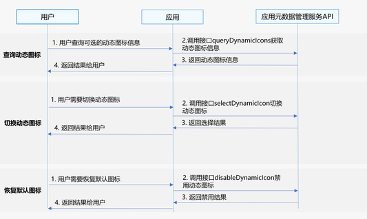

# 实现应用图标动态切换

更新时间：2026-04-20 06:34:33

来源：https://developer.huawei.com/consumer/cn/doc/harmonyos-guides/appgallery-appinfo-use

AppGallery Kit为使用动态图标的应用客户端提供查询动态图标信息、切换动态图标、恢复默认图标功能。


> [!NOTE]
> 从版本5.0.3(15)开始，支持实现应用图标动态切换。


## 场景介绍

查询动态图标信息 应用内查询可选的动态图标信息。 切换动态图标 用户点击切换可选的动态图标，系统切换对应的动态图标。 恢复默认图标 用于停止已选择的动态图标，系统切换默认图标。

## 业务流程



## 查询动态图标信息

用户查询可选的动态图标信息。 调用接口queryDynamicIcons获取动态图标信息。 接口返回动态图标信息给应用。 应用返回结果给用户。

## 切换动态图标

用户需要切换动态图标。 调用接口selectDynamicIcon切换动态图标。 接口返回选择结果给应用。 应用返回结果给用户。

## 恢复默认图标

用户需要恢复默认图标。 调用接口disableDynamicIcon禁用动态图标。 接口返回禁用结果给应用。 应用返回结果给用户。

## 约束与限制

图标管理服务不支持模拟器，请使用真机调试。 图标管理服务支持Phone、Tablet、PC/2in1设备。并且从5.1.1(18)版本开始，新增支持Wearable设备，从5.1.1(19)版本开始，新增支持TV设备。

## 接口说明

图标管理服务提供以下接口，具体API说明详见[接口文档](https://developer.huawei.com/consumer/cn/doc/harmonyos-references/appgallery-appinfomanager)。
| 接口名 | 描述 |
| --- | --- |
| [queryDynamicIcons](https://developer.huawei.com/consumer/cn/doc/harmonyos-references/appgallery-appinfomanager#appinfomanagerquerydynamicicons)(): Promise | 查询动态图标信息接口，用于查询动态图标信息。 |
| [selectDynamicIcon](https://developer.huawei.com/consumer/cn/doc/harmonyos-references/appgallery-appinfomanager#appinfomanagerselectdynamicicon)(iconId: string): Promise | 切换动态图标接口，用于切换动态图标。 |
| [disableDynamicIcon](https://developer.huawei.com/consumer/cn/doc/harmonyos-references/appgallery-appinfomanager#appinfomanagerdisabledynamicicon)(): Promise | 禁用动态图标接口，用于停止动态图标，恢复默认图标。 |


> [!NOTE]
> 从版本6.0.0(20)开始，切换动态图标接口支持返回1006800013错误码。


## 开发步骤


## 查询动态图标信息

导入appInfoManager模块及相关公共模块。
```text
import { appInfoManager } from '@kit.AppGalleryKit';
import { hilog } from '@kit.PerformanceAnalysisKit';
import { BusinessError } from '@kit.BasicServicesKit';
```

调用[queryDynamicIcons](https://developer.huawei.com/consumer/cn/doc/harmonyos-references/appgallery-appinfomanager#appinfomanagerquerydynamicicons)方法查询动态图标信息。
```text
try {
  appInfoManager.queryDynamicIcons()
    .then((queryResult: appInfoManager.DynamicIconInfo[]) => {
      hilog.info(0, 'TAG', "Succeeded in getting DynamicIconInfo size = " + queryResult.length);
      for (let i = 0; i  {
      hilog.error(0, 'TAG', "queryDynamicIcons failed, code: " + error.code + ", exception message: " + error.message);
    });
} catch (error) {
  hilog.error(0, 'TAG', "queryDynamicIcons exception code: " + error.code + ", exception message: " + error.message);
}
```


## 切换动态图标

导入appInfoManager模块及相关公共模块。
```text
import { appInfoManager } from '@kit.AppGalleryKit';
import { hilog } from '@kit.PerformanceAnalysisKit';
import { BusinessError } from '@kit.BasicServicesKit';
```

调用[selectDynamicIcon](https://developer.huawei.com/consumer/cn/doc/harmonyos-references/appgallery-appinfomanager#appinfomanagerselectdynamicicon)方法切换动态图标。
```text
try {
  let iconId: string = 'iconId';
  appInfoManager.selectDynamicIcon(iconId).then(() => {
      hilog.info(0, 'TAG', "Succeeded in selecting dynamic icon");
  }).catch((error: BusinessError) => {
    hilog.error(0, 'TAG', "selectDynamicIcon failed, code: " + error.code + ", exception message: " + error.message);
  });
} catch (error) {
  hilog.error(0, 'TAG', "selectDynamicIcon exception code: " + error.code + ", exception message: " + error.message);
}
```


## 恢复默认图标

导入appInfoManager模块及相关公共模块。
```text
import { appInfoManager } from '@kit.AppGalleryKit';
import { hilog } from '@kit.PerformanceAnalysisKit';
import { BusinessError } from '@kit.BasicServicesKit';
```

调用[disableDynamicIcon](https://developer.huawei.com/consumer/cn/doc/harmonyos-references/appgallery-appinfomanager#appinfomanagerdisabledynamicicon)方法恢复默认图标。
```text
try {
  appInfoManager.disableDynamicIcon().then(() => {
      hilog.info(0, 'TAG', "Succeeded in disabling dynamic icon");
  }).catch((error: BusinessError) => {
    hilog.error(0, 'TAG', "disableDynamicIcon failed, code: " + error.code + ", exception message: " + error.message);
  });
} catch (error) {
  hilog.error(0, 'TAG', "disableDynamicIcon exception code: " + error.code + ", exception message: " + error.message);
}
```
