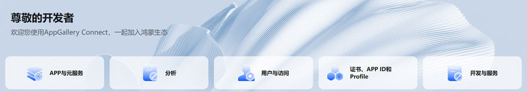
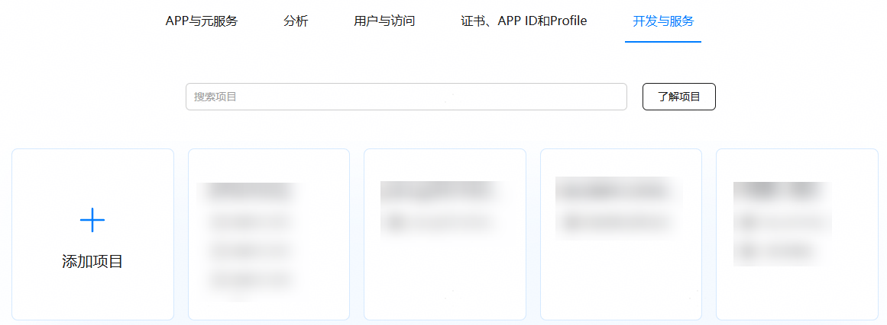
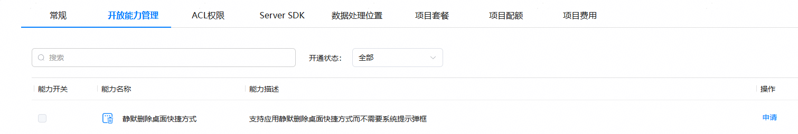
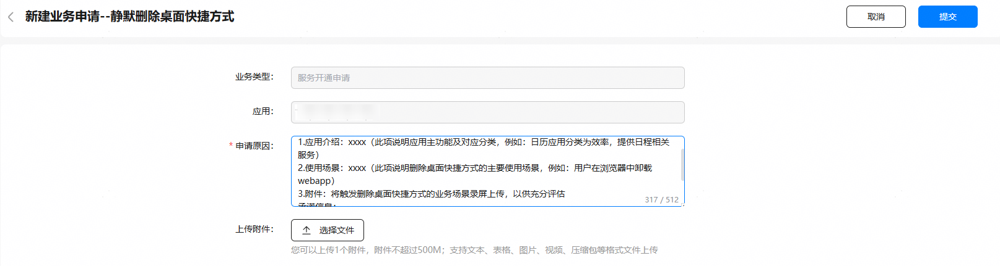

# 删除应用内快捷方式

更新时间：2026-04-30 02:41:24

来源：https://developer.huawei.com/consumer/cn/doc/harmonyos-guides/appgallery-productview-removeshortcut

> [!NOTE]
> 6.1.1(24)版本开始，新增删除桌面快捷方式接口，支持用户删除桌面快捷方式。


#### 场景介绍

当应用的桌面快捷方式功能发生变化或者用户希望删除不再使用的桌面快捷方式时，用户可以通过调用[removePinShortcut](https://developer.huawei.com/consumer/cn/doc/harmonyos-references/store-productviewmanager#productviewmanagerremovepinshortcut)接口删除当前应用的桌面快捷方式。


#### 业务流程




1. 用户需要删除桌面快捷方式。
2. 应用调用[removePinShortcut](https://developer.huawei.com/consumer/cn/doc/harmonyos-references/store-productviewmanager#productviewmanagerremovepinshortcut)接口删除快捷方式。
3. AppGallery Kit向应用弹出快捷方式删除确认框。
4. 用户确认是否删除快捷方式。


#### 约束与限制

 - 应用市场推荐服务不支持模拟器，请使用真机调试。在模拟器中使用该服务将会提示：无法获取内容，请点击屏幕重试。
 - 应用市场推荐服务支持Phone、Tablet、PC/2in1设备。并且从6.0.2(22)版本开始，新增支持TV设备。


#### 接口说明

详细接口说明可参考[接口文档](https://developer.huawei.com/consumer/cn/doc/harmonyos-references/store-productviewmanager)。

| 接口名 | 描述 |
| --- | --- |
| removePinShortcut(context: common.UIAbilityContext, shortcutId: string): Promise&lt;void&gt; | 删除桌面快捷方式。 |


#### 开发准备


#### （可选）静默删除桌面快捷方式开放能力申请

当应用已有自己的删除确认弹框并在弹框中提示用户删除桌面快捷方式时，开发者可以申请静默删除权限，实现在不显示系统确认弹框的情况下完成删除操作。
1. 登录AppGallery Connect，选择“开发与服务”。

  


2. 在项目列表中找到您的项目，并点击选择需申请静默删除桌面快捷方式能力的应用。

  


3. 在“开放能力管理”页面，点击静默删除桌面快捷方式对应的“申请”按钮。

  


4. 在“新建业务申请”窗口填写申请信息，然后点击“提交”。申请原因：必填，包括应用介绍、使用场景，不超过256个字符。上传附件：必填，提供应用的使用场景录屏，录屏中需要体现应用自己的弹框以及在弹框中显示提示用户删除桌面快捷方式，仅可上传1个附件，大小不超过500MB。支持文本、表格、图片、视频、压缩包格式。

  


5. 返回“开放能力管理”页面，原“申请”按钮变为“申请中”，1-3个工作日反馈申请结果。

  


6. 申请审批通过后，互动中心会发送通知给您，同时“申请中”按钮会变为置灰显示的“申请”。
7. 能力申请通过后，勾选删除桌面快捷方式的能力开关，点击右上角“保存”。至此，您的应用已成功接入开放能力。


#### 开发步骤
1. 导入productViewManager模块及相关公共模块。

  
```text
import { common } from '@kit.AbilityKit';
import { BusinessError } from '@kit.BasicServicesKit';
import { hilog } from '@kit.PerformanceAnalysisKit';
import { productViewManager } from '@kit.AppGalleryKit';
```

2. 调用[removePinShortcut](https://developer.huawei.com/consumer/cn/doc/harmonyos-references/store-productviewmanager#productviewmanagerremovepinshortcut)方法删除桌面快捷方式。

  
```text
const TAG: string = 'RemovePinShortcut';

@Entry
@Component
struct RemovePinShortcut {

build() {
  Column() {
    Button("RemovePinShortcut")
      .onClick(() => {
        try {
         const uiContext = this.getUIContext().getHostContext() as common.UIAbilityContext;
         const shortcutId = 'xxx'; // 通过checkPinShortcutPermitted接口获取
         productViewManager.removePinShortcut(uiContext, shortcutId)
           .then(() => {
             hilog.info(0x0001, TAG, `removePinShortcut success.`);
           }).catch((error: BusinessError) => {
           hilog.error(0x0001, TAG, `removePinShortcut error. code is ${error.code}, message is ${error.message}`);
         })
        } catch (err) {
          hilog.error(0x0001, TAG, `removePinShortcut failed, code is ${err.code}, message is ${err.message}`);
         }
        })
        .width('100%')
  }
  .margin(16)
  .height('100%')
  .justifyContent(FlexAlign.Center)
 }
}
```
