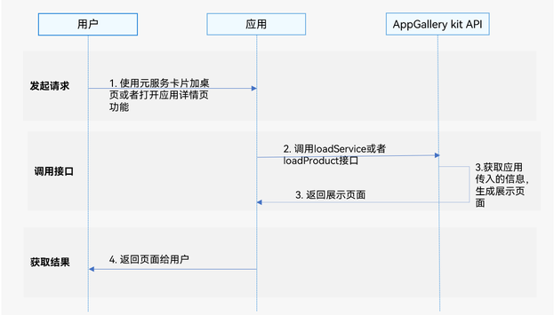

# 添加元服务卡片至桌面

更新时间：2026-04-30 02:41:24

来源：https://developer.huawei.com/consumer/cn/doc/harmonyos-guides/appgallery-productview-loadservice

#### 场景介绍

为了快速访问和管理元服务卡片信息，用户可以将常用的元服务卡片添加到桌面。应用可通过调用应用市场服务提供的[loadService](https://developer.huawei.com/consumer/cn/doc/harmonyos-references/store-productviewmanager#productviewmanagerloadservice)接口来加载元服务卡片加桌页面，用户点击“添加至桌面”按钮，将元服务卡片添加至桌面。


#### 业务流程




1. 用户使用元服务卡片加桌功能。
2. 应用调用AppGallery Kit的[loadService](https://developer.huawei.com/consumer/cn/doc/harmonyos-references/store-productviewmanager#productviewmanagerloadservice)接口。
3. AppGallery Kit API获取应用传入的信息，生成展示页面。
4. 展示生成的页面给用户，用户点击“添加至桌面”按钮，将元服务卡片添加至桌面。


#### 约束与限制

 - 应用市场推荐服务不支持模拟器，请使用真机调试。在模拟器中使用该服务将会提示：无法获取内容，请点击屏幕重试。
 - 应用市场推荐服务支持Phone、Tablet、PC/2in1设备。并且从6.0.2(22)版本开始，新增支持TV设备。


#### 接口说明

详细接口说明可参考[接口文档](https://developer.huawei.com/consumer/cn/doc/harmonyos-references/store-productviewmanager)。

| 接口名 | 描述 |
| --- | --- |
| loadService(context: common.UIAbilityContext, want: Want, callback?: ServiceViewCallback): void | 加载元服务加桌页面接口。 |


#### 开发步骤
1. 导入productViewManager模块及相关公共模块。

  
```text
import { productViewManager } from '@kit.AppGalleryKit';
import { hilog } from '@kit.PerformanceAnalysisKit';
import type { common, Want } from '@kit.AbilityKit';
import { BusinessError } from '@kit.BasicServicesKit';
```

2. 构造元服务卡片参数。

  
```json
@Entry
@Component
struct LoadServiceView {
  @State message: string = '拉起应用市场详情页';

  build() {
    Row() {
      Column() {
        Button(this.message)
          .fontSize(24)
          .fontWeight(FontWeight.Bold)
          .onClick(() => {
            const uiContext = this.getUIContext().getHostContext() as common.UIAbilityContext;
            const wantParam: Want = {
              // 此处填入要加载的元服务的加桌链接
              uri: 'xxx'
            }
            const callback: productViewManager.ServiceViewCallback = {
              // 接收元服务卡片加桌结果信息
              onReceive: (data: productViewManager.ServiceViewReceiveData) => {
                hilog.info(0x0001, 'TAG', `loadService onReceive.result is ${data.result}, msg is ${data.msg}, formInfo is ${JSON.stringify(data.formInfo)}`);
              },
              onError: (error: BusinessError) => {
                hilog.error(0, 'TAG', `loadService onError.code is ${error.code}, message is ${error.message}`)
           },
              // 当元服务卡片加桌页成功打开时回调
              onAppear: () => {
                hilog.info(0, 'TAG', `loadService onAppear.`);
              },
              // 当元服务卡片加桌页关闭时回调
              onDisappear: () => {
                hilog.info(0, 'TAG', `loadService onDisappear.`);
              }
            }
          })
      }
      .width('100%')
    }
    .height('100%')
  }
}
```

3. 调用[productViewManager.loadService](https://developer.huawei.com/consumer/cn/doc/harmonyos-references/store-productviewmanager#productviewmanagerloadservice)方法，将步骤2中构造的参数依次传入接口中。

  
```text
// 调用接口，加载元服务加桌页面
productViewManager.loadService(uiContext, wantParam, callback);
```
