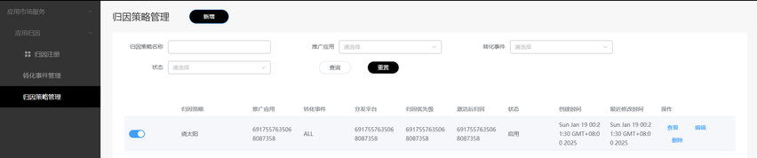
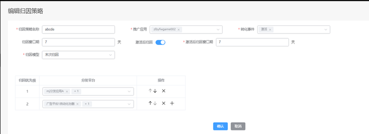
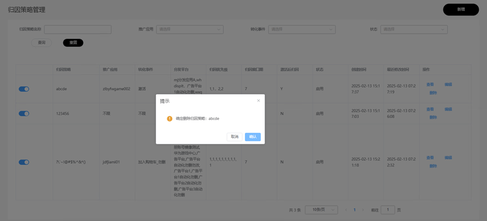

# 管理归因策略

更新时间：2026-04-20 06:34:33

来源：https://developer.huawei.com/consumer/cn/doc/harmonyos-guides/appgallery-attribution-strategy

通过归因策略管理，支持开发者在应用归因云端管理台维护可归因的分发平台及归因优先级、归因窗口期、归因节点设置，从而提升归因能力拓展性，适配开发者多样化归因诉求。
 
**开发者角色的合作伙伴在归因策略管理页面可以做如下操作**：
 
新增、编辑、查看、删除归因策略，创建完成即可生效（生效时间24小时）。
 
点击左侧归因策略管理菜单栏，进入归因策略管理页面，开发者基于推广应用、转化事件等维度进行归因策略的维护，所有的归因策略都是基于开发者下具体某个推广应用配置。
 

 
> [!NOTE]
> 支持在列表点滑块左右切换表示“暂停”和“启用”。

  

#### 新增

在归因策略管理页面点击“新增”按钮，进入“新增归因策略”页面。
 

 
参数填写说明如下：
  
| 名称 | 参数 | 其他说明 |
| --- | --- | --- |
| 归因策略名称 | 文本输入框，必填，支持输入最多30个字符，用于填写归因策略名称。 | _ |
| 推广应用 | 该参数为下拉多选框，必填，支持全选。 值范围：注册在归因角色下的所有推广应用名称。 可选项仅限HarmonyOS应用。 | 若有多个推广应用，支持下拉框输入关键字查询匹配。 |
| 转化事件 | 该参数为下拉多选框，选填，支持全选。 值范围：全部有效的标准转化事件和该推广应用下有效的自定义转化事件。 | 提供搜索框，以事件名称搜索，方便选择转化事件；支持以转化事件类型辅助筛选。 |
| 归因窗口期 | 数字输入框，必填；推广应用+转化事件维度的归因窗口期。 值范围：(0,180】,单位天，默认值：7。 | _ |
| 激活后归因 | 单选勾选框，选填，默认值：勾选 。 | _ |
| 激活后归因窗口期 | 数字输入框，必填，“激活后归因”开关打开后可见，否则隐藏。 值范围：(0,180】,单位天，默认值：7。 | _ |
| 归因模型 | 下拉单选框，必填。 说明： 目前暂支持：“末次归因”。 | _ |
| 归因优先级 | 归因优先级维护页面，显示所有已维护的分发平台，开发者只需维护对应的优先级即可。 通过“+”新增归因优先级行数配置不同分发平台的归因优先级，可以通过点击向上、向下箭头调整已选中分发平台优先级，也通过“x”删除当前归因优先级。每一级支持配置多个分发平台（不限个数），每个分发平台只能有一个归因优先级。 值范围：【1,10】，和分发平台最大量一致，值越小优先级越高。 | _ |
| 分发平台 | 该参数为下拉多选框，选填，默认为空。 值范围：应用归因服务上注册的有效的分发平台。 | 提供搜索框，支持按照分发平台名称搜索后筛选匹配结果展示，并支持选中搜索结果。 |
 
 
> [!NOTE]
> 开发者创建归因策略上限为20条，即最多同时有20条生效的归因策略记录。

 
  

#### 编辑

在归因策略管理页面点击右侧“编辑”按钮，弹出窗口期维护页面。
 

 
维护完成后，点击“确认”即可生成有效记录，若点击“取消”，则不创建相应记录。
 
  

#### 查看

在归因策略管理页面点击右侧“查看”按钮，弹出归因策略查看页面。
 

 
可点击“编辑”按钮进入编辑页面，或点击“取消”关闭当前页面返回列表页面。
 
  

#### 删除

在归因策略管理页面点击右侧“删除”按钮：
 

 
点击确认该记录状态变为“删除”，删除状态的记录仅可查看。
 
> [!NOTE]
> 新增、编辑、查看、删除等操作，无需审批，新增、编辑成功即为“启用”，支持在列表点滑块切换“暂停”和“启用”，删除完成即为“删除”。
