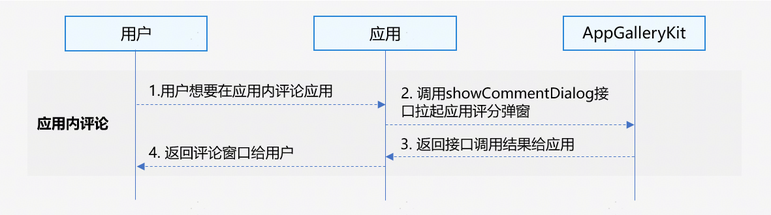

# 应用评论服务

更新时间：2026-04-30 02:41:24

来源：https://developer.huawei.com/consumer/cn/doc/harmonyos-guides/appgallery-comment

通过应用评论服务，用户无需进入应用市场应用详情页，可以直接在应用内进行评论。

> [!NOTE]
> 从版本6.0.0(20)开始，支持拉起应用评论弹框。


##### 场景介绍

开发者可以通过该接口拉起应用评论弹窗对应用进行评分及评论，无需进入应用市场应用详情页进行评论。





##### 业务流程


1. 用户需要在应用内评论应用。
2. 应用调用[showCommentDialog](https://developer.huawei.com/consumer/cn/doc/harmonyos-references/appgallery-commentmanager#commentmanagershowcommentdialog)接口拉起应用评论弹窗。
3. AppGalleryKit返回接口调用结果给应用。
4. 应用返回评论窗口给用户。


##### 约束与限制

应用评论服务不支持模拟器，请使用真机调试。


##### 接口说明

应用评论服务提供以下接口，具体API说明详见[接口文档](https://developer.huawei.com/consumer/cn/doc/harmonyos-references/appgallery-commentmanager)。

| 接口名 | 描述 |
| --- | --- |
| showCommentDialog(context: common.UIExtensionContext \| common.UIAbilityContext): Promise&lt;void&gt; | 拉起应用评论弹窗，用户可以在应用内评论应用。 |


##### 开发步骤
1. 导入commentManager模块及相关公共模块。

  
```text
import { commentManager} from '@kit.AppGalleryKit';
import { hilog } from '@kit.PerformanceAnalysisKit';
import { BusinessError } from '@kit.BasicServicesKit';
import type { common } from '@kit.AbilityKit';
```

2. 调用[showCommentDialog](https://developer.huawei.com/consumer/cn/doc/harmonyos-references/appgallery-commentmanager#commentmanagershowcommentdialog)方法拉起评论弹窗。

  
```text
try {
  const uiContext = this.getUIContext().getHostContext() as common.UIAbilityContext;
  commentManager.showCommentDialog(uiContext).then(()=>{
    hilog.info(0, 'TAG', "succeeded in showing commentDialog.");
  }).catch((error: BusinessError<Object>) => {
    hilog.error(0, 'TAG', `showCommentDialog failed, Code: ${error.code}, message: ${error.message}`);
  });
} catch (error) {
  hilog.error(0, 'TAG', `showCommentDialog failed, Code: ${error.code}, message: ${error.message}`);
}
```


##### 通过Deep Linking方式拉起写评论页

当应用需要跳转应用市场内对该应用进行评分与评论时，开发者可使用Deep Linking链接的方式拉起应用市场写评论页，通过拼接应用市场Deep Linking链接，在应用中调用或网页中点击Deep Linking链接在应用详情页拉起写评论页，用户可以在页面内进行评分与评论。

构造拼接bundleName和action的Deep Linking链接，其中bundleName为需要拉起写评论页的应用包名，action隐式指定为write-review，表示进入详情页后，下一步将拉起写评论页，其格式为：

```text
uri: 'store://appgallery.huawei.com/app/detail?id=' + bundleName + '&action=write-review',
```

在应用中调用[startAbility](https://developer.huawei.com/consumer/cn/doc/harmonyos-references/js-apis-inner-application-uiabilitycontext#startability-2)方法，拉起应用市场应用的写评论页：

```text
import { BusinessError } from '@kit.BasicServicesKit';
import { hilog } from '@kit.PerformanceAnalysisKit';
import type { common, Want } from '@kit.AbilityKit';

// 通过Deep Linking拉起应用市场指定的应用写评论页
function startAppGalleryDetailAbility(context: common.UIAbilityContext, bundleName: string): void {
  let want: Want = {
    action: 'ohos.want.action.appdetail', // 隐式指定action为ohos.want.action.appdetail
    uri: 'store://appgallery.huawei.com/app/detail?id=' + bundleName + '&action=write-review'// bundleName为需要拉起写评论页的应用包名，action隐式指定为write-review，表示进入详情页后，下一步将拉起写评论页。
  };
  context.startAbility(want).then(() => {
    hilog.info(0x0001, 'TAG', "Succeeded in starting Ability successfully.")
  }).catch((error: BusinessError) => {
    hilog.error(0x0001, 'TAG', `Failed to startAbility. Code: ${error.code}, message is ${error.message}`);
  });
}

@Entry
@Component
struct StartAppGalleryDetailAbilityView {
  @State message: string = '通过Deep Linking拉起应用市场写评论页'

  build() {
    Row() {
      Column() {
        Button(this.message)
          .fontSize(24)
          .fontWeight(FontWeight.Bold)
          .onClick(() => {
            const context: common.UIAbilityContext = this.getUIContext().getHostContext() as common.UIAbilityContext;
            // 按实际需求获取应用的bundleName，例如bundleName: 'com.huawei.hmsapp.books'
            const bundleName = 'xxxx';
            startAppGalleryDetailAbility(context, bundleName);
          })
      }
      .width('100%')
    }
    .height('100%')
  }
}
```

在网页中打开Deep Linking链接拉起应用市场应用的写评论页：

```text
<html lang="en">
  <head>
    <meta charset="UTF-8">
  </head>
  <body>
    <div>
      <button type="button" onclick="openDeepLink()">通过Deep Linking拉起应用市场写评论页</button>
    </div>
  </body>
</html>
<script>
  function openDeepLink() {
    window.open('store://appgallery.huawei.com/app/detail?id=com.xxxx.xxxx&action=write-review')
  }
</script>
```


##### 通过App Linking方式拉起写评论页

当应用需要跳转应用市场内对该应用进行评分与评论时，开发者可使用App Linking链接的方式拉起应用市场写评论页，通过拼接应用市场App Linking链接，在应用中调用或网页中点击App Linking链接在应用详情页拉起写评论页，用户可以在页面内进行评分与评论。

构造拼接bundleName的App Linking链接，其中bundleName为需要拉起写评论页的应用包名，action隐式指定为write-review，表示进入详情页后，下一步将拉起写评论页，其格式为：

```text
let link: string = 'https://appgallery.huawei.com/app/detail?id=' + bundleName + '&action=write-review';
```

在应用中调用[openLink](https://developer.huawei.com/consumer/cn/doc/harmonyos-references/js-apis-inner-application-uiabilitycontext#openlink12)接口拉起App Linking链接：

```text
import { BusinessError } from '@kit.BasicServicesKit';
import { hilog } from '@kit.PerformanceAnalysisKit';
import type { common } from '@kit.AbilityKit';

@Entry
@Component
struct Index {
  build() {
    Button('start app linking', { type: ButtonType.Capsule, stateEffect: true })
      .width('87%')
      .height('5%')
      .margin({ bottom: '12vp' })
      .onClick(() => {
        let context: common.UIAbilityContext = this.getUIContext().getHostContext() as common.UIAbilityContext;
        // 需要拼接不同的应用包名，用以打开不同的应用写评论页,例如：bundleName: 'com.huawei.hmsapp.books'
        let bundleName: string = 'xxxx';
        let link: string = 'https://appgallery.huawei.com/app/detail?id=' + bundleName + '&action=write-review';
        // 以App Linking优先的方式在应用市场打开指定包名的应用写评论页
        context.openLink(link, { appLinkingOnly: false })
          .then(() => {
            hilog.info(0x0001, 'TAG', 'openlink success.');
          })
          .catch((error: BusinessError) => {
            hilog.error(0x0001, 'TAG', `openlink failed. Code: ${error.code}, message is ${error.message}`);
          });
      })
  }
}
```

在网页中打开App Linking链接：

```text
<html lang="en">
  <head>
    <meta charset="UTF-8">
    <title>跳转示例</title>
  </head>
  <body>
    <a href='https://appgallery.huawei.com/app/detail?id=bundleName&action=write-review'>通过AppLinking拉起应用市场写评论页</a>
  </body>
</html>
```
