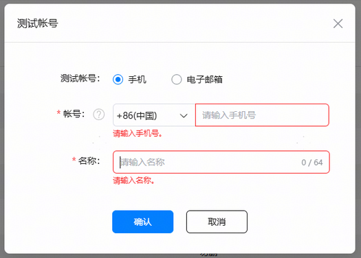
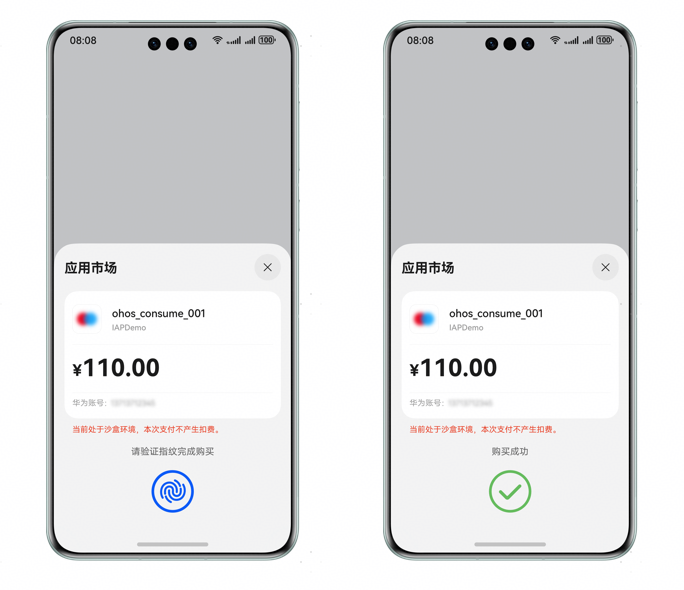
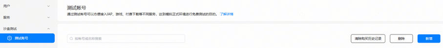
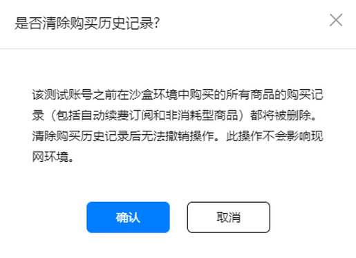

# 测试数字商品服务

更新时间：2026-04-20 06:34:33

来源：https://developer.huawei.com/consumer/cn/doc/harmonyos-guides/store-iap-sandbox

沙盒测试允许开发者在接入数字商品服务的调测过程中无需真实付款即可完成数字商品的购买等相关测试。

> [!NOTE]
> 沙盒订单并非真实订单，无法在[开发者中心]->[我的报表]->[支付报表]中查询。

#### 配置沙盒测试

 - 设置测试账号

  在进行测试前，需要在[AppGallery Connect](https://developer.huawei.com/consumer/cn/service/josp/agc/index.html)中的“用户与访问”中添加测试账号，这些测试账号都是真实的华为账号。开发者在HarmonyOS上接入IAP沙盒测试时，需要在测试设备上登录已配置的测试账号。添加沙盒测试账号步骤如下：

1. 登录[AppGallery Connect](https://developer.huawei.com/consumer/cn/service/josp/agc/index.html)网站，选择“用户与访问”。

2. 左侧导航栏选择“沙盒测试 > 测试账号”，点击“新增”。

  

3. 填写测试账号信息后，点击“确认”。

  

  
> [!NOTE]
> 沙盒测试账号必须填写已注册、真实的华为账号。添加完成之后需要5~10min才能生效。使用时请检查当前的账号是否支持沙盒测试。

 - 构建debug签名的应用

  接入的应用必须是debug签名的应用。构建debug签名应用步骤如下：

1. 参见[手动签名方式调试HarmonyOS应用/元服务](https://developer.huawei.com/consumer/cn/doc/app/agc-help-debug-app-0000001914423098)，申请应用调试证书->注册调试设备->申请调试Profile。
2. 参见[配置签名信息](https://developer.huawei.com/consumer/cn/doc/harmonyos-guides/ide-publish-app#section280162182818)，在DevEco Studio侧配置签名信息。
3. 在[AppGallery Connect](https://developer.huawei.com/consumer/cn/service/josp/agc/index.html)中[配置应用签名证书指纹](https://developer.huawei.com/consumer/cn/doc/app/agc-help-signature-info-0000001628566748#section5181019153511)。

#### 沙盒测试能力未生效自检

如果配置的沙盒账号未生效，可参见[配置沙盒测试](#配置沙盒测试)检查当前是否满足沙盒测试的两个条件：

 - 是否已在[AppGallery Connect](https://developer.huawei.com/consumer/cn/service/josp/agc/index.html)添加测试账号。
 - 应用是否是debug签名。

此外也可在应用中使用[isSandboxActivated](https://developer.huawei.com/consumer/cn/doc/harmonyos-references/iap-iap#iapissandboxactivated)接口来检查当前沙盒环境不可用的原因。

#### 测试消耗/非消耗型商品购买

在满足沙盒测试条件下，开发者调用[createPurchase](https://developer.huawei.com/consumer/cn/doc/harmonyos-references/iap-iap#iapcreatepurchase)接口拉起收银台，跳过实际支付环节，直接购买成功。

 - 沙盒环境下的购买流程与正式环境的购买流程一致，仍需要完成绑定付款方式，但该过程不会真实扣费。
 - 购买成功后的收据信息[PurchaseOrderPayload](https://developer.huawei.com/consumer/cn/doc/harmonyos-references/iap-data-model#purchaseorderpayload)中，会携带值为"SANDBOX"的environment字段，标识此次购买为沙盒测试的记录。
 - 沙盒环境下购买非消耗型商品，购买之后可以确认发货以完成购买，之后可以再次购买，以方便测试。

  
> [!NOTE]
> 正式环境下，非消耗型商品仅允许用户购买一次，不能重复购买。

 - 沙盒测试拉起收银台时，会在收银台展示沙盒测试提示，结果页也有沙盒环境的标志，如下图所示。

> [!NOTE]
> 如果未显示截图的提示页面，表示本次交易未进入沙盒测试环境，继续测试会实际扣费，请检查当前是否满足沙盒测试的两个条件。开发者也可在应用中使用 isSandboxActivated 接口来检查当前沙盒环境不可用的原因。

#### 测试自动续期订阅商品

自动续期订阅商品的购买流程和消耗型/非消耗型商品的购买流程类似，但订阅还有其他细节场景，比如续订成功或失败，续订周期时长。为了帮助开发者快速测试应用的订阅场景，沙盒环境下的订阅续订时间会比正常情况更快，引入“**时光机**”概念，沙盒环境中的订阅换算时间为10秒/天。比如订阅周期为1周，商品将在首次购买成功70秒后发生续期。

 - 沙盒环境下的订阅流程与正式环境的订阅流程一致，仍需要完成绑定付款方式，但该过程不会真实扣费。
 - IAP扣费成功后的收据信息[PurchaseOrderPayload](https://developer.huawei.com/consumer/cn/doc/harmonyos-references/iap-data-model#purchaseorderpayload)中，会携带值为"SANDBOX"的environment字段，标识此次购买为沙盒测试的记录。
 - 自动续期处理不需要完成真实扣款，IAP会直接返回成功。
 - 订阅在沙盒场景下会自动续期5次(一共6期)，5次之后需要用户主动发起恢复订阅。
 - 在沙盒测试环境下，订阅首期由用户发起后会自动续期五次（累计共六期），后续需用户手动操作以恢复订阅；若同时涉及[促销场景](https://developer.huawei.com/consumer/cn/doc/harmonyos-guides/iap-subscription-functions#提供优惠)，系统将优先完成优惠周期内的自动续期，再继续进行六次续期，此场景下总续期次数为优惠周期数与六次续期之和。
 - 沙盒测试拉起收银台时，会在收银台展示沙盒测试提示，结果页也有沙盒环境的标志，如下图所示。

#### 测试非续期订阅商品购买

在满足沙盒测试条件下，开发者调用[createPurchase](https://developer.huawei.com/consumer/cn/doc/harmonyos-references/iap-iap#iapcreatepurchase)接口拉起收银台，用户按照正常流程完成购买，但实际不会产生真实扣费。

 - 沙盒环境下的购买流程与正式环境的购买流程一致，仍需要完成绑定付款方式，但该过程不会真实扣费。
 - IAP购买成功后的收据信息[PurchaseOrderPayload](https://developer.huawei.com/consumer/cn/doc/harmonyos-references/iap-data-model#purchaseorderpayload)中，会携带值为"SANDBOX"的environment字段，标识此次购买为沙盒测试的记录。
 - 沙盒测试拉起收银台时，会在收银台展示沙盒测试提示，结果页也有沙盒环境的标志，如下图所示。

#### 清除沙盒账号的购买历史记录

开发者可以清除沙盒账号的购买历史记录，以便继续使用同一个沙盒账号进行测试。清除购买历史记录后，该测试账号在沙盒环境中产生的所有商品购买记录（包括自动续期订阅和消耗型/非消耗型商品）都将被删除，删除后该账号即可在沙盒环境中重新购买自动续期订阅商品、消耗型/非消耗型商品。清除购买历史记录后无法撤销操作。此操作不会影响生产环境数据。

清除沙盒账号购买历史记录的操作步骤如下：
1. 登录[AppGallery Connect](https://developer.huawei.com/consumer/cn/service/josp/agc/index.html)网站，选择“用户与访问”。

  

2. 左侧导航栏选择“沙盒测试 > 测试账号”，勾选对应的测试账号，点击右上角的“清除购买历史记录”按钮。

  

3. 在出现的提示弹窗中，点击“确认”按钮，随后该账号在沙盒环境中产生的购买历史记录将被清除，此操作无法被撤销。如果该沙盒账号的购买次数较多，则清除其购买历史记录可能需要更长时间。

