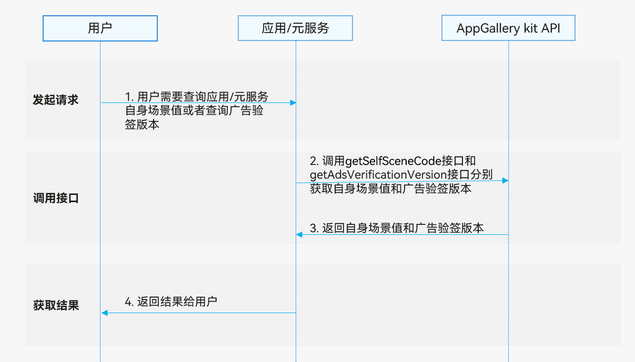

# 生态查询服务

更新时间：2026-04-20 06:34:33

来源：https://developer.huawei.com/consumer/cn/doc/harmonyos-guides/store-erms

## 场景介绍

生态查询服务可以为您提供应用/元服务运行信息的查询，当前提供场景值查询和广告验签信息查询。场景值是用来描述用户进入应用和元服务的路径。您可以通过本服务，来查询您的元服务/应用是通过何种场景被打开的（[场景值列表](https://developer.huawei.com/consumer/cn/doc/harmonyos-guides/appgallery-scene-list#场景值列表)）。当前我们支持元服务的场景值查询，后续我们会继续公布应用场景值的查询。广告验签版本查询只在您的应用涉及广告场景下才会被使用到。您可以通过本查询服务，查询广告验签参数处理逻辑。

## 业务流程


用户需要查询应用/元服务自身场景值或者查询广告验签版本。 应用调用[getSelfSceneCode](https://developer.huawei.com/consumer/cn/doc/harmonyos-references/store-scenemanager#scenemanagergetselfscenecode)接口和[getAdsVerificationVersion](https://developer.huawei.com/consumer/cn/doc/harmonyos-references/store-scenemanager#scenemanagergetadsverificationversion)接口分别获取自身场景值和广告验签版本。 返回自身场景值和广告验签版本给应用/元服务。 返回结果给用户。

## 约束与限制

生态查询服务支持Phone、Tablet、PC/2in1设备。并且从5.1.1(19)版本开始，新增支持TV设备。 如果应用或者元服务没有产生场景值，调用[getSelfSceneCode](https://developer.huawei.com/consumer/cn/doc/harmonyos-references/store-scenemanager#scenemanagergetselfscenecode)接口返回的场景值为空。 生态查询服务不支持模拟器，请使用真机调试。

## 接口说明

生态查询服务场景提供以下接口，具体API说明详见[接口文档](https://developer.huawei.com/consumer/cn/doc/harmonyos-references/store-scenemanager)。
| 接口名 | 描述 |
| --- | --- |
| [getSelfSceneCode](https://developer.huawei.com/consumer/cn/doc/harmonyos-references/store-scenemanager#scenemanagergetselfscenecode)():string | 获取自身场景值。 |
| [getAdsVerificationVersion](https://developer.huawei.com/consumer/cn/doc/harmonyos-references/store-scenemanager#scenemanagergetadsverificationversion)(): number | 查询广告验签版本。 |


## 开发步骤


## 查询自身场景值

导入模块。
```text
import { hilog } from '@kit.PerformanceAnalysisKit';
import { sceneManager } from '@kit.AppGalleryKit';
```

调用[getSelfSceneCode](https://developer.huawei.com/consumer/cn/doc/harmonyos-references/store-scenemanager#scenemanagergetselfscenecode)方法。
```text
try {
  const sceneCode: string = sceneManager.getSelfSceneCode();
  hilog.info(0, 'TAG', "Succeeded in getting SelfSceneCode res = " + sceneCode);
} catch (error) {
  hilog.error(0, 'TAG', `getSelfSceneCode failed. code is ${error.code}, message is ${error.message}`);
}
```


## 查询广告验签版本

导入模块。
```text
import { hilog } from '@kit.PerformanceAnalysisKit';
import { sceneManager } from '@kit.AppGalleryKit';
```

调用[getAdsVerificationVersion](https://developer.huawei.com/consumer/cn/doc/harmonyos-references/store-scenemanager#scenemanagergetadsverificationversion)方法。
```text
try {
  const version: number = sceneManager.getAdsVerificationVersion();
  hilog.info(0, 'TAG', "Succeeded in getting AdsVerificationVersion res = " + version);
} catch (error) {
  hilog.error(0, 'TAG', `getAdsVerificationVersion failed. code is ${error.code}, message is ${error.message}`);
}
```
