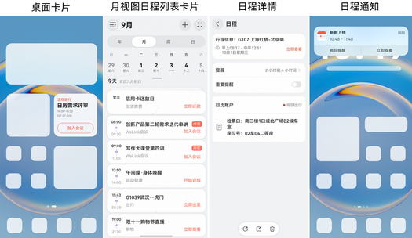
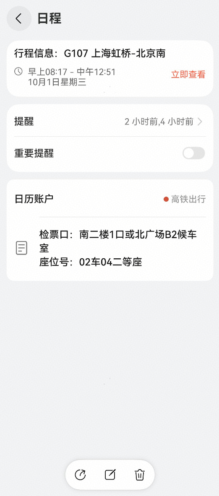
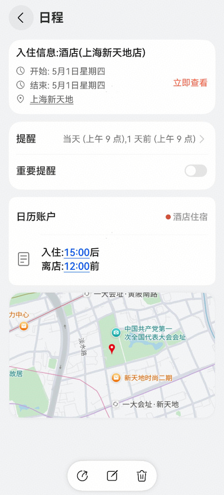
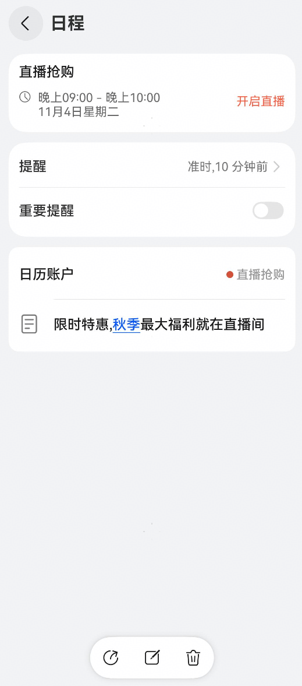
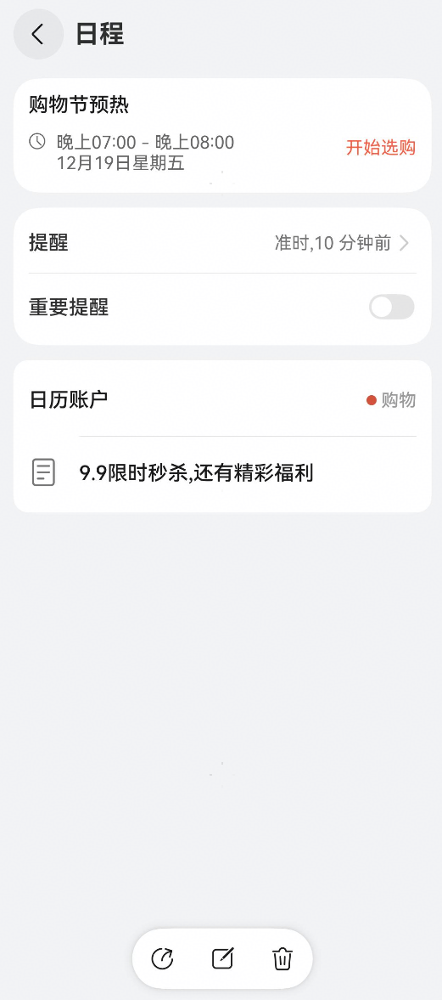
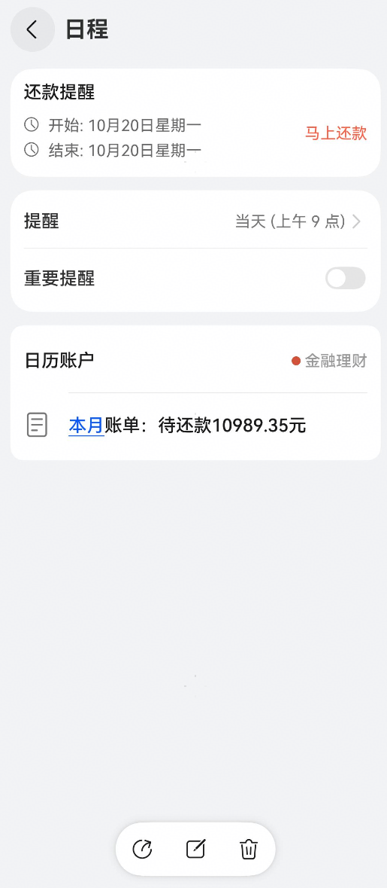
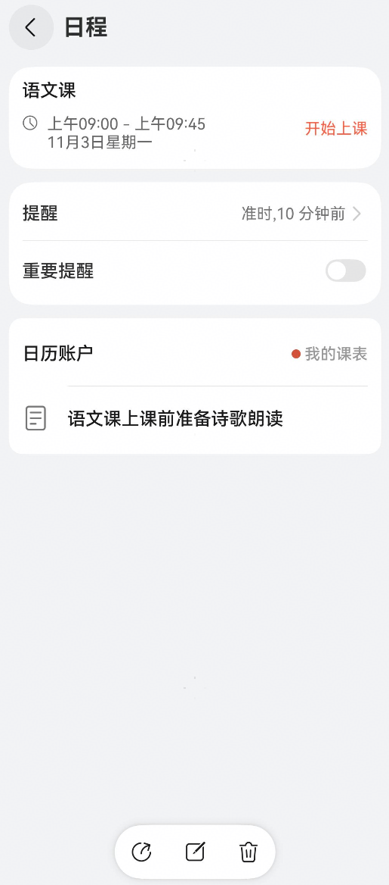
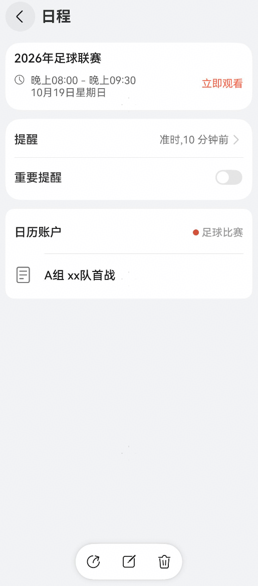
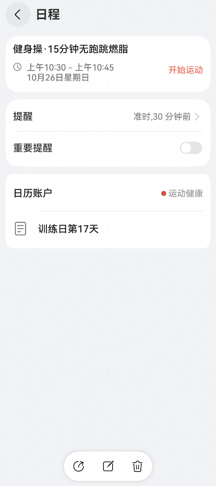
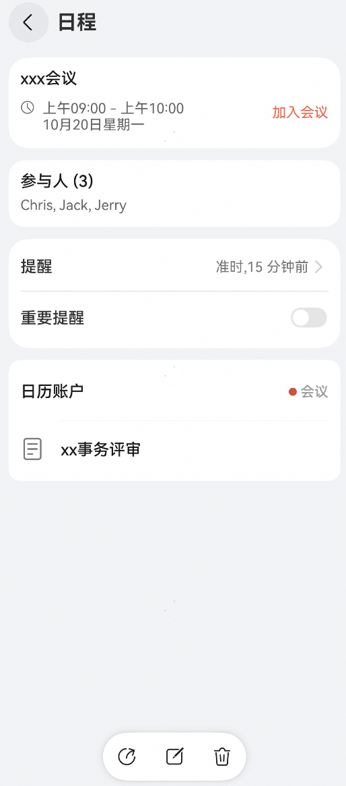

# 日历服务实践案例

更新时间：2026-04-20 06:34:33

来源：https://developer.huawei.com/consumer/cn/doc/harmonyos-guides/calendarmanager-practice-developer

## 场景介绍

通过日历服务，开发者可将带有时间属性的事件作为日程写入，并支持通过“[一键服务](https://developer.huawei.com/consumer/cn/doc/harmonyos-guides/calendar-service)”功能快速跳转，帮助用户快速直达对应服务，并完成各类信息的归一化管理。各典型场景选择适用的模板，并按照模板格式填写各个字段信息，确保用户体验完整、一致。 写入日历的日程可通过通知中心、桌面卡片以及日历应用内部等多种入口向用户展示。 不同场景下，一键服务按钮出现时机如下： 桌面卡片、月视图日程列表卡片：日程开始时间前15分钟显示，日程结束时自动隐藏。  日程详情：始终显示。  日程通知：通知弹出时显示，通知中心内点击对应日程卡片后显示。


## 开发准备

请参考日程管理前三步的[开发步骤](https://developer.huawei.com/consumer/cn/doc/harmonyos-guides/calendarmanager-calendar-developer#开发步骤)： 导入相关依赖。  申请权限。使用Calendar Kit时，需要在module.json5中声明申请读写日历日程所需的权限：ohos.permission.READ_CALENDAR和ohos.permission.WRITE_CALENDAR。具体指导可见[声明权限](https://developer.huawei.com/consumer/cn/doc/harmonyos-guides/declare-permissions)。  根据上下文获取日程管理器对象calendarMgr，用于对日历账户进行相关管理操作。推荐在EntryAbility.ets文件中进行操作。

## 一键服务典型场景

一键服务典型场景及对应显示内容如下表所示：
| 场景类型 | [ServiceType取值](https://developer.huawei.com/consumer/cn/doc/harmonyos-references/js-apis-calendarmanager#servicetype) | 按钮显示内容 |
| --- | --- | --- |
| 会议 | 'Meeting' | 加入会议 |
| 追剧 | 'Watching' | 立即观看 |
| 还款 | 'Repayment' | 马上还款 |
| 直播 | 'Live' | 开启直播 |
| 购物 | 'Shopping' | 开始选购 |
| 查看 | 'Trip' | 立即查看 |
| 上课 | 'Class' | 开始上课 |
| 赛事 | 'SportsEvents' | 立即观看 |
| 运动 | 'SportsExercise' | 开始运动 |

在进行各场景的开发前，请确保已导入相关依赖、申请相关权限等，具体可见[开发准备](#开发准备)。

## 出行服务场景

当用户通过购票平台预订火车票、机票或其他交通方式后，系统可以自动将其行程信息添加至日历，并在适当的时间节点进行提醒。 下表列出了该场景中主要字段的推荐配置及其说明：
| 字段名称 | 对应设置项 | 建议取值 |
| --- | --- | --- |
| 日程标题 | title | 航班、车次信息加出发地、目的地信息 |
| 开始时间 | startTime | 行程开始时间 |
| 结束时间 | endTime | 行程结束时间 |
| 提醒时间 | reminderTime | 2小时前、4小时前分别提醒 |
| 日历账户（在日历中对用户体现） | displayName | 生态应用名（建议与应用市场中名称一致） |
| 备注 | description | 可补充检票口信息、座位号信息 |
| 一键服务 | ServiceType | calendarManager.ServiceType.TRIP |

创建日程。
```text
// Index.ets
import { calendarMgr } from '../entryability/EntryAbility';
import { calendarManager } from '@kit.CalendarKit';

let tripCalendar: calendarManager.Calendar | undefined = undefined;
let oriEvent: calendarManager.Event | null = null;
let id: number = 0;

async createTripCalendarAndEvent(): Promise {
  // 指定日历账户信息
  const calendarAccount: calendarManager.CalendarAccount = {
    name: 'TripCalendar',
    type: calendarManager.CalendarType.LOCAL,
    // 日历账户显示名称：建议使用应用实际名称。
    displayName: '高铁出行'
  };
  // 日历配置信息
  const config: calendarManager.CalendarConfig = {
    // 设置日历账户颜色
    color: '#aabbcc'
  };
  const startTime = new Date('2025-10-01T08:17:00').getTime();
  const endTime = new Date('2025-10-01T12:51:00').getTime();
  // 日程配置信息
  const event: calendarManager.Event = {
    type: calendarManager.EventType.NORMAL,
    // 日程标题
    title: '行程信息：G107 上海虹桥-北京南',
    // 开始时间
    startTime: startTime,
    // 结束时间
    endTime: endTime,
    // 是否全天日程
    isAllDay:false,
    // 提醒时间
    reminderTime:[120, 240],
    // 备注
    description: '检票口：南二楼1口或北广场B2候车室 \n座位号：02车04二等座',
    // 一键服务
    service: {
      // 服务类型
      type: calendarManager.ServiceType.TRIP,
      // 服务的uri，格式为DeepLink类型。请根据“一键服务”指导文档配置。
      uri: 'demo://mobile/player?params='
    }
  }
  try {
    // 创建日历账户
    tripCalendar = await calendarMgr?.createCalendar(calendarAccount);
    if (!tripCalendar || tripCalendar === null) {
      console.error('Failed to create calendar. tripCalendar is null.');
      return;
    }
    // 请确保日历账户创建成功后，再进行相关日程的管理
    // 设置日历配置信息，设置日历账户颜色
    await tripCalendar.setConfig(config);
    // 添加日程
    id = await tripCalendar.addEvent(event);
    oriEvent = event;
    oriEvent.id = id;
    console.info(`Succeeded in creating calendar and event, result: ${JSON.stringify(id)}`);
  } catch (error) {
    console.error(`Failed to create calendar or event. Code: ${error.code}, message: ${error.message}`);
  }
}
```

查询日程。
```text
// Index.ets
async getTripEvent(): Promise {
  // 校验calendar是否为空
  if (!tripCalendar || tripCalendar === null) {
    console.error('Failed to get event, calendar is null.');
    return;
  }
  try {
    // 查询行程
    const filter = calendarManager.EventFilter.filterById([id]);
    let data: calendarManager.Event[] = await tripCalendar.getEvents(filter, ['title', 'type', 'startTime', 'endTime']);
    if (data && data.length > 0) {
      oriEvent = data[0];
    }
    console.info(`Succeeded in getting events, data -> ${JSON.stringify(data)}`);
  } catch (err) {
    console.error(`Failed to get events. Code: ${err.code}, message: ${err.message}`);
  }
}
```

更新日程。
```text
// Index.ets
async updateTripEvent(): Promise {
  // 校验calendar是否为空
  if (!tripCalendar || tripCalendar === null) {
    console.error('Failed to update event, calendar is null.');
    return;
  }
  if (!oriEvent || oriEvent === null) {
    console.error('Failed to update event, oriEvent is null');
    return;
  }
  // 修改行程的开始时间startTime和结束时间endTime
  oriEvent.startTime = new Date('2025-10-01T07:03:00').getTime();
  oriEvent.endTime = new Date('2025-10-01T11:51:00').getTime();
  try {
    // 更新行程
    await tripCalendar.updateEvent(oriEvent);
    console.info("Succeeded in updating event");
  } catch (err) {
    console.error(`Failed to update event. Code: ${err.code}, message: ${err.message}`);
  }
}
```

删除日程。
```text
// Index.ets
async deleteTripEvent(): Promise {
  // 校验calendar是否为空
  if (!tripCalendar || tripCalendar === null) {
    console.error('Failed to delete event, calendar is null.');
    return;
  }
  try {
    // 删除行程
    await tripCalendar.deleteEvent(id);
    oriEvent = null;
    console.info(`Succeeded in deleting Event`);
  } catch (err) {
    console.error(`Failed to delete Event, Code is ${err.code}, message is ${err.message}`);
  }
}
```

示意图如下：


## 酒店住宿场景

下表列出了该场景中主要字段的推荐配置及其说明：
| 字段名称 | 对应设置项 | 建议取值 |
| --- | --- | --- |
| 日程标题 | title | 酒店入住信息（酒店标题地址） |
| 地点 | [location](https://developer.huawei.com/consumer/cn/doc/harmonyos-references/js-apis-calendarmanager#location) | 酒店的地理位置 |
| 开始时间 | startTime | 入住时间 |
| 结束时间 | endTime | 离店时间 |
| 全天日程 | isAllDay | true：表示添加全天日程。 |
| 提醒时间 | reminderTime | 0：全天日程时表示当天上午9点提醒（非全天日程则是日程开始时间）。 1440：表示前一天上午9点提醒。 不填时，默认为不提醒。 |
| 日历账户（在日历中对用户体现） | displayName | 生态应用名（建议与应用市场中名称一致） |
| 备注 | description | 可补充入住时间、离店时间信息 |
| 一键服务 | ServiceType | calendarManager.ServiceType.TRIP |

创建日程示例和示意图如下：
```text
// Index.ets
async createHotelCalendarAndEvent(): Promise {
  // 指定日历账户信息
  const calendarAccount: calendarManager.CalendarAccount = {
    name: 'hotelCalendar',
    type: calendarManager.CalendarType.LOCAL,
    // 日历账户显示名称：建议使用应用实际名称。
    displayName: '酒店住宿'
  };
  // 日历配置信息
  const config: calendarManager.CalendarConfig = {
    // 设置日历账户颜色
    color: '#aabbcc'
  };
  const startTime = new Date('2025-05-01T15:00:00').getTime();
  const endTime = new Date('2025-05-02T12:00:00').getTime();
  // 日程配置信息
  const event: calendarManager.Event = {
    type: calendarManager.EventType.NORMAL,
    title: '入住信息:酒店(上海新天地店)',
    location: {
      location: '上海新天地',
      longitude: 121.47506199999998,
      latitude: 31.219150000000013
    },
    startTime: startTime,
    endTime: endTime,
    isAllDay: true,
    // 提醒时间：全天日程是按9点往前计算分钟数
    reminderTime: [0, 1440],
    description: '入住:15:00后\n离店:12:00前',
    // 一键服务
    service: {
      type: calendarManager.ServiceType.TRIP,
      uri: 'demo://mobile/player?params='
    }
  }
  try {
    // 创建日历账户
    let data: calendarManager.Calendar | undefined= await calendarMgr?.createCalendar(calendarAccount);
    if (!data || data === null) {
      console.error('Failed to create calendar. data is null.');
      return;
    }
    // 请确保日历账户创建成功后，再进行相关日程的管理
    // 设置日历配置信息，设置日历账户颜色
    await data.setConfig(config);
    // 添加日程
    id = await data.addEvent(event);
    console.info(`Succeeded in creating calendar and event, result: ${JSON.stringify(id)}`);
  } catch (error) {
    console.error(`Failed to create calendar or event. Code: ${error.code}, message: ${error.message}`);
  }
}
```

 

## 直播预约场景

下表列出了该场景中主要字段的推荐配置及其说明：
| 字段名称 | 对应设置项 | 建议取值 |
| --- | --- | --- |
| 日程标题 | title | 直播名称 |
| 开始时间 | startTime | 直播开始时间 |
| 结束时间 | endTime | 直播结束时间 |
| 提醒时间 | reminderTime | 准时、10分钟前分别提醒 |
| 日历账户（在日历中对用户体现） | displayName | 生态应用名（建议与应用市场中名称一致） |
| 备注 | description | 可补充直播相关详情介绍 |
| 一键服务 | ServiceType | calendarManager.ServiceType.LIVE |

创建日程示例和示意图如下：
```text
// Index.ets
async createLiveCalendarAndEvent(): Promise {
  // 指定日历账户信息
  const calendarAccount: calendarManager.CalendarAccount = {
    name: 'liveCalendar',
    type: calendarManager.CalendarType.LOCAL,
    // 日历账户显示名称：建议使用应用实际名称。
    displayName: '直播抢购'
  };
  // 日历配置信息
  const config: calendarManager.CalendarConfig = {
    // 设置日历账户颜色
    color: '#aabbcc'
  };
  const startTime = new Date('2025-11-04T21:00:00').getTime();
  const endTime = new Date('2025-11-04T22:00:00').getTime();
  // 日程配置信息
  const event: calendarManager.Event = {
    type: calendarManager.EventType.NORMAL,
    title: '直播抢购',
    startTime: startTime,
    endTime: endTime,
    isAllDay: false,
    reminderTime: [0, 10],
    description: '限时特惠,秋季最大福利就在直播间',
    // 一键服务
    service: {
      type: calendarManager.ServiceType.LIVE,
      uri: 'demo://mobile/player?params='
    }
  }
  try {
    // 创建日历账户
    let data: calendarManager.Calendar | undefined= await calendarMgr?.createCalendar(calendarAccount);
    if (!data || data === null) {
      console.error('Failed to create calendar. data is null.');
      return;
    }
    // 请确保日历账户创建成功后，再进行相关日程的管理
    // 设置日历配置信息，设置日历账户颜色
    await data.setConfig(config);
    // 添加日程
    id = await data.addEvent(event);
    console.info(`Succeeded in creating calendar and event, result: ${JSON.stringify(id)}`);
  } catch (error) {
    console.error(`Failed to create calendar or event. Code: ${error.code}, message: ${error.message}`);
  }
}
```

 

## 抢购预约场景

下表列出了该场景中主要字段的推荐配置及其说明：
| 字段名称 | 对应设置项 | 建议取值 |
| --- | --- | --- |
| 日程标题 | title | 购物节（抢购活动）名称 |
| 开始时间 | startTime | 抢购开始时间 |
| 结束时间 | endTime | 抢购结束时间 |
| 提醒时间 | reminderTime | 准时、10分钟前分别提醒 |
| 日历账户（在日历中对用户体现） | displayName | 生态应用名（建议与应用市场中名称一致） |
| 备注 | description | 可补充购物节相关介绍 |
| 一键服务 | ServiceType | calendarManager.ServiceType.SHOPPING |

创建日程示例和示意图如下：
```text
// Index.ets
async createShoppingCalendarAndEvent(): Promise {
  // 指定日历账户信息
  const calendarAccount: calendarManager.CalendarAccount = {
    name: 'shoppingCalendar',
    type: calendarManager.CalendarType.LOCAL,
    // 日历账户显示名称：建议使用应用实际名称。
    displayName: '购物'
  };
  // 日历配置信息
  const config: calendarManager.CalendarConfig = {
    // 设置日历账户颜色
    color: '#aabbcc'
  };
  const startTime = new Date('2025-12-19T19:00:00').getTime();
  const endTime = new Date('2025-12-19T20:00:00').getTime();
  // 日程配置信息
  const event: calendarManager.Event = {
    type: calendarManager.EventType.NORMAL,
    title: '购物节预热',
    startTime: startTime,
    endTime: endTime,
    isAllDay: false,
    reminderTime: [0, 10],
    description: '9.9限时秒杀,还有精彩福利',
    // 一键服务
    service: {
      type: calendarManager.ServiceType.SHOPPING,
      uri: 'demo://mobile/player?params='
    }
  }
  try {
    // 创建日历账户
    let data: calendarManager.Calendar | undefined= await calendarMgr?.createCalendar(calendarAccount);
    if (!data || data === null) {
      console.error('Failed to create calendar. data is null.');
      return;
    }
    // 请确保日历账户创建成功后，再进行相关日程的管理
    // 设置日历配置信息，设置日历账户颜色
    await data.setConfig(config);
    // 添加日程
    id = await data.addEvent(event);
    console.info(`Succeeded in creating calendar and event, result: ${JSON.stringify(id)}`);
  } catch (error) {
    console.error(`Failed to create calendar or event. Code: ${error.code}, message: ${error.message}`);
  }
}
```

 

## 还款提醒场景

下表列出了该场景中主要字段的推荐配置及其说明：
| 字段名称 | 对应设置项 | 建议取值 |
| --- | --- | --- |
| 日程标题 | title | 还款提醒 |
| 开始时间 | startTime | 还款日日期 |
| 结束时间 | endTime | 还款日日期 |
| 全天日程 | isAllDay | true：表示添加全天日程。 |
| 提醒时间 | reminderTime | 0：全天日程时表示当天上午9点提醒（非全天日程则是日程开始时间）。 不填时，默认为不提醒。 |
| 日历账户（在日历中对用户体现） | displayName | 生态应用名（建议与应用市场中名称一致） |
| 备注 | description | 可补充待还款金额信息 |
| 一键服务 | ServiceType | calendarManager.ServiceType.REPAYMENT |

创建日程示例和示意图如下：
```text
// Index.ets
async createRepaymentCalendarAndEvent(): Promise {
  // 指定日历账户信息
  const calendarAccount: calendarManager.CalendarAccount = {
    name: 'repaymentCalendar',
    type: calendarManager.CalendarType.LOCAL,
    // 日历账户显示名称：建议使用应用实际名称。
    displayName: '金融理财'
  };
  // 日历配置信息
  const config: calendarManager.CalendarConfig = {
    // 设置日历账户颜色
    color: '#aabbcc'
  };
  const startTime = new Date('2025-10-20T00:00:00').getTime();
  const endTime = new Date('2025-10-20T23:59:59').getTime();
  // 日程配置信息
  const event: calendarManager.Event = {
    type: calendarManager.EventType.NORMAL,
    title: '还款提醒',
    startTime: startTime,
    endTime: endTime,
    isAllDay: true,
    // 全天日程时，提醒时间为0表示当天上午9点提醒
    reminderTime: [0],
    description: '本月账单：待还款10989.35元',
    // 一键服务
    service: {
      type: calendarManager.ServiceType.REPAYMENT,
      uri: 'demo://mobile/player?params='
    }
  }
  try {
    // 创建日历账户
    let data: calendarManager.Calendar | undefined= await calendarMgr?.createCalendar(calendarAccount);
    if (!data || data === null) {
      console.error('Failed to create calendar. data is null.');
      return;
    }
    // 请确保日历账户创建成功后，再进行相关日程的管理
    // 设置日历配置信息，设置日历账户颜色
    await data.setConfig(config);
    // 添加日程
    id = await data.addEvent(event);
    console.info(`Succeeded in creating calendar and event, result: ${JSON.stringify(id)}`);
  } catch (error) {
    console.error(`Failed to create calendar or event. Code: ${error.code}, message: ${error.message}`);
  }
}
```

 

## 课程提醒场景

下表列出了该场景中主要字段的推荐配置及其说明：
| 字段名称 | 对应设置项 | 建议取值 |
| --- | --- | --- |
| 日程标题 | title | 课程名称 |
| 开始时间 | startTime | 课程开始时间 |
| 结束时间 | endTime | 课程结束时间 |
| 提醒时间 | reminderTime | 准时、10分钟前分别提醒 |
| 日历账户（在日历中对用户体现） | displayName | 生态应用名（建议与应用市场中名称一致） |
| 备注 | description | 可补充课程相关介绍 |
| 一键服务 | ServiceType | calendarManager.ServiceType.CLASS |

创建日程示例和示意图如下：
```text
// Index.ets
async createClassCalendarAndEvent(): Promise {
  // 指定日历账户信息
  const calendarAccount: calendarManager.CalendarAccount = {
    name: 'classCalendar',
    type: calendarManager.CalendarType.LOCAL,
    // 日历账户显示名称：建议使用应用实际名称。
    displayName: '我的课表'
  };
  // 日历配置信息
  const config: calendarManager.CalendarConfig = {
    // 设置日历账户颜色
    color: '#aabbcc'
  };
  const startTime = new Date('2025-11-03T09:00:00').getTime();
  const endTime = new Date('2025-11-03T09:45:00').getTime();
  // 日程配置信息
  const event: calendarManager.Event = {
    type: calendarManager.EventType.NORMAL,
    title: '语文课',
    startTime: startTime,
    endTime: endTime,
    isAllDay: false,
    reminderTime: [0, 10],
    description: '语文课上课前准备诗歌朗读',
    // 一键服务
    service: {
      type: calendarManager.ServiceType.CLASS,
      uri: 'demo://mobile/player?params='
    }
  }
  try {
    // 创建日历账户
    let data: calendarManager.Calendar | undefined= await calendarMgr?.createCalendar(calendarAccount);
    if (!data || data === null) {
      console.error('Failed to create calendar. data is null.');
      return;
    }
    // 请确保日历账户创建成功后，再进行相关日程的管理
    // 设置日历配置信息，设置日历账户颜色
    await data.setConfig(config);
    // 添加日程
    id = await data.addEvent(event);
    console.info(`Succeeded in creating calendar and event, result: ${JSON.stringify(id)}`);
  } catch (error) {
    console.error(`Failed to create calendar or event. Code: ${error.code}, message: ${error.message}`);
  }
}
```

 

## 影音娱乐场景

下表列出了该场景中主要字段的推荐配置及其说明：
| 字段名称 | 对应设置项 | 建议取值 |
| --- | --- | --- |
| 日程标题 | title | 赛事名称 |
| 开始时间 | startTime | 赛事开始时间 |
| 结束时间 | endTime | 赛事结束时间 |
| 提醒时间 | reminderTime | 准时、10分钟前分别提醒 |
| 日历账户（在日历中对用户体现） | displayName | 生态应用名（建议与应用市场中名称一致） |
| 备注 | description | 可补充赛事相关介绍 |
| 一键服务 | ServiceType | calendarManager.ServiceType.SPORTS_EVENTS |

创建日程示例和示意图如下：
```text
// Index.ets
async createSportsCalendarAndEvent(): Promise {
  // 指定日历账户信息
  const calendarAccount: calendarManager.CalendarAccount = {
    name: 'sportsEventsCalendar',
    type: calendarManager.CalendarType.LOCAL,
    // 日历账户显示名称：建议使用应用实际名称。
    displayName: '足球比赛'
  };
  // 日历配置信息
  const config: calendarManager.CalendarConfig = {
    // 设置日历账户颜色
    color: '#aabbcc'
  };
  const startTime = new Date('2025-10-19T20:00:00').getTime();
  const endTime = new Date('2025-10-19T21:30:00').getTime();
  // 日程配置信息
  const event: calendarManager.Event = {
    type: calendarManager.EventType.NORMAL,
    title: '2026年足球联赛',
    startTime: startTime,
    endTime: endTime,
    isAllDay: false,
    reminderTime: [0, 10],
    description: 'A组 xx队首战',
    // 一键服务
    service: {
      type: calendarManager.ServiceType.SPORTS_EVENTS,
      uri: 'demo://mobile/player?params='
    }
  }
  try {
    // 创建日历账户
    let data: calendarManager.Calendar | undefined= await calendarMgr?.createCalendar(calendarAccount);
    if (!data || data === null) {
      console.error('Failed to create calendar. data is null.');
      return;
    }
    // 请确保日历账户创建成功后，再进行相关日程的管理
    // 设置日历配置信息，设置日历账户颜色
    await data.setConfig(config);
    // 添加日程
    id = await data.addEvent(event);
    console.info(`Succeeded in creating calendar and event, result: ${JSON.stringify(id)}`);
  } catch (error) {
    console.error(`Failed to create calendar or event. Code: ${error.code}, message: ${error.message}`);
  }
}
```

 

## 运动训练场景

下表列出了该场景中主要字段的推荐配置及其说明：
| 字段名称 | 对应设置项 | 建议取值 |
| --- | --- | --- |
| 日程标题 | title | 训练课程名称 |
| 开始时间 | startTime | 训练开始时间 |
| 结束时间 | endTime | 训练结束时间 |
| 提醒时间 | reminderTime | 准时、30分钟前分别提醒 |
| 日历账户（在日历中对用户体现） | displayName | 生态应用名（建议与应用市场中名称一致） |
| 备注 | description | 可补充训练计划相关介绍 |
| 一键服务 | ServiceType | calendarManager.ServiceType.SPORTS_EXERCISE |

创建日程示例及示意图如下：
```text
// Index.ets
async createSportsExerciseEvent(): Promise {
  // 指定日历账户信息
  const calendarAccount: calendarManager.CalendarAccount = {
    name: 'sportsExerciseCalendar',
    type: calendarManager.CalendarType.LOCAL,
    // 日历账户显示名称：建议使用应用实际名称。
    displayName: '运动健康'
  };
  // 日历配置信息
  const config: calendarManager.CalendarConfig = {
    // 设置日历账户颜色
    color: '#aabbcc'
  };
  const startTime = new Date('2025-10-26T10:30:00').getTime();
  const endTime = new Date('2025-10-26T10:45:00').getTime();
  // 日程配置信息
  const event: calendarManager.Event = {
    type: calendarManager.EventType.NORMAL,
    title: '健身操·15分钟无跑跳燃脂',
    startTime: startTime,
    endTime: endTime,
    isAllDay: false,
    reminderTime: [0, 30],
    description: '训练日第17天',
    // 一键服务
    service: {
      type: calendarManager.ServiceType.SPORTS_EXERCISE,
      uri: 'demo://mobile/player?params='
    }
  }
  try {
    // 创建日历账户
    let data: calendarManager.Calendar | undefined= await calendarMgr?.createCalendar(calendarAccount);
    if (!data || data === null) {
      console.error('Failed to create calendar. data is null.');
      return;
    }
    // 请确保日历账户创建成功后，再进行相关日程的管理
    // 设置日历配置信息，设置日历账户颜色
    await data.setConfig(config);
    // 添加日程
    id = await data.addEvent(event);
    console.info(`Succeeded in creating calendar and event, result: ${JSON.stringify(id)}`);
  } catch (error) {
    console.error(`Failed to create calendar or event. Code: ${error.code}, message: ${error.message}`);
  }
}
```

 

## 会议场景

下表列出了该场景中主要字段的推荐配置及其说明：
| 字段名称 | 对应设置项 | 建议取值 |
| --- | --- | --- |
| 日程标题 | title | 会议主题 |
| 开始时间 | startTime | 会议开始时间 |
| 结束时间 | endTime | 会议结束时间 |
| 与会人 | attendee | 与会人信息 |
| 提醒时间 | reminderTime | 准时、15分钟前分别提醒 |
| 日历账户（在日历中对用户体现） | displayName | 生态应用名（建议与应用市场中名称一致） |
| 备注 | description | 可补充会议相关介绍 |
| 一键服务 | ServiceType | calendarManager.ServiceType.MEETING |

创建日程示例和示意图如下：
```text
// Index.ets
async createMeetingEvent(): Promise {
  // 指定日历账户信息
  const calendarAccount: calendarManager.CalendarAccount = {
    name: 'meetingCalendar',
    type: calendarManager.CalendarType.LOCAL,
    // 日历账户显示名称：建议使用应用实际名称。
    displayName: '会议'
  };
  // 日历配置信息
  const config: calendarManager.CalendarConfig = {
    // 设置日历账户颜色
    color: '#aabbcc'
  };
  // 与会人信息
  let attendee: calendarManager.Attendee[] = [
    {
      name: 'Chris',
      email: 'test1@example.com',
      role: calendarManager.AttendeeRole.ORGANIZER
    },
    {
      name: 'Jack',
      email: 'test2@example.com',
      role: calendarManager.AttendeeRole.PARTICIPANT,
      type: calendarManager.AttendeeType.REQUIRED
    },
    {
      name: 'Jerry',
      email: 'test3@example.com',
      role: calendarManager.AttendeeRole.PARTICIPANT,
      type: calendarManager.AttendeeType.REQUIRED
    }
  ];
  const startTime = new Date('2025-10-20T09:00:00').getTime();
  const endTime = new Date('2025-10-20T10:00:00').getTime();
  // 日程配置信息
  const event: calendarManager.Event = {
    type: calendarManager.EventType.NORMAL,
    title: 'xxx会议',
    startTime: startTime,
    endTime: endTime,
    isAllDay: false,
    reminderTime: [0, 15],
    attendee: attendee,
    description: 'xx事务评审',
    // 一键服务
    service: {
      type: calendarManager.ServiceType.MEETING,
      uri: 'demo://mobile/player?params='
    }
  }
  try {
    // 创建日历账户
    let data: calendarManager.Calendar | undefined= await calendarMgr?.createCalendar(calendarAccount);
    if (!data || data === null) {
      console.error('Failed to create calendar. data is null.');
      return;
    }
    // 请确保日历账户创建成功后，再进行相关日程的管理
    // 设置日历配置信息，设置日历账户颜色
    await data.setConfig(config);
    // 添加日程
    id = await data.addEvent(event);
    console.info(`Succeeded in creating calendar and event, result: ${JSON.stringify(id)}`);
  } catch (error) {
    console.error(`Failed to create calendar or event. Code: ${error.code}, message: ${error.message}`);
  }
}
```

 
