# 注册并管理一键服务日程

更新时间：2026-04-29 07:35:50

来源：https://developer.huawei.com/consumer/cn/doc/harmonyos-guides/calendar-service

#### 场景介绍

Calendar Kit提供日程一键服务功能，比如一键入会、一键追剧、一键购物、一键查看等。注册日程一键服务后，用户可通过点击对应按钮拉起跳转链接，一步直达服务落地页，方便快捷。
 
  

#### 服务器注册（配置一键服务跳转链接）

若需使用“日程一键服务”功能，需要按照以下步骤完成注册。
 1. 进入[开发者管理中心](https://developer.huawei.com/consumer/cn/console/overview)，登录[企业账号](https://developer.huawei.com/consumer/cn/doc/harmonyos-guides/store-attribution-config-agc)（暂不支持个人开发者）。企业主账号无需手动添加权限；若使用团队成员账号，请确保使用企业主账号为其添加“小艺开放平台”的管理员权限，具体添加可见下图。

  选择团队账号，点击编辑，为对应的账号添加权限。

  
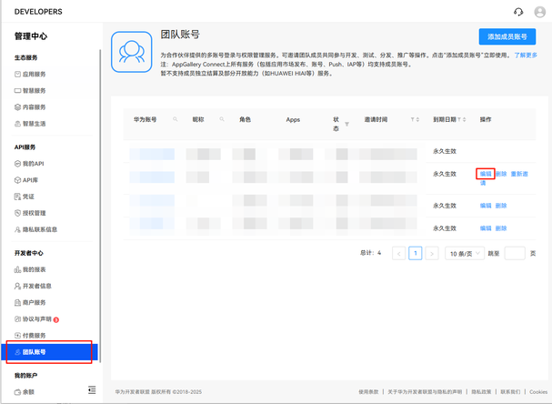


  确认对应的信息后，点击下一步。

  
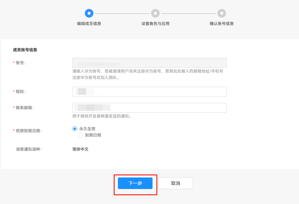


  勾选小艺开放平台管理员，选择下一步。

  
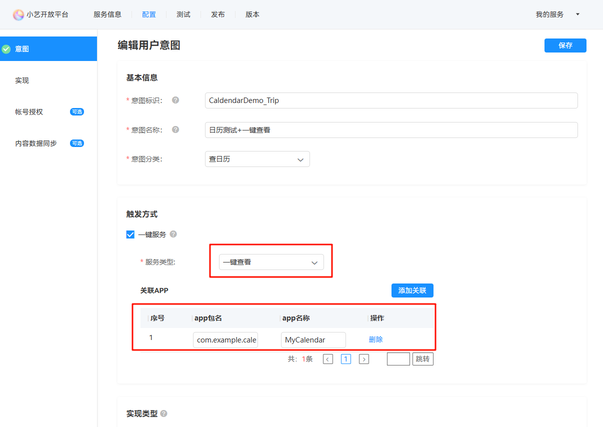

2. 登录成功后，在侧边栏菜单中**生态服务**下选择**智慧服务**，点击进入**小艺开放平台**。

  
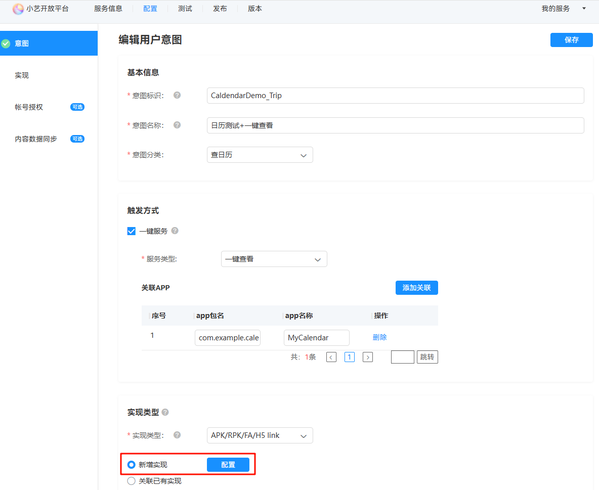

3. 进入页面后，选择右侧**资源管理**，点击选择**其他服务**。

  
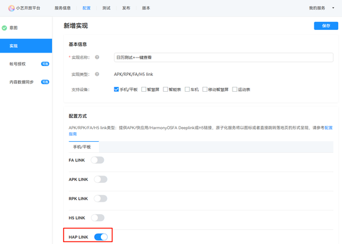

4. 进入页面后，点击右侧**创建服务**按钮。

  
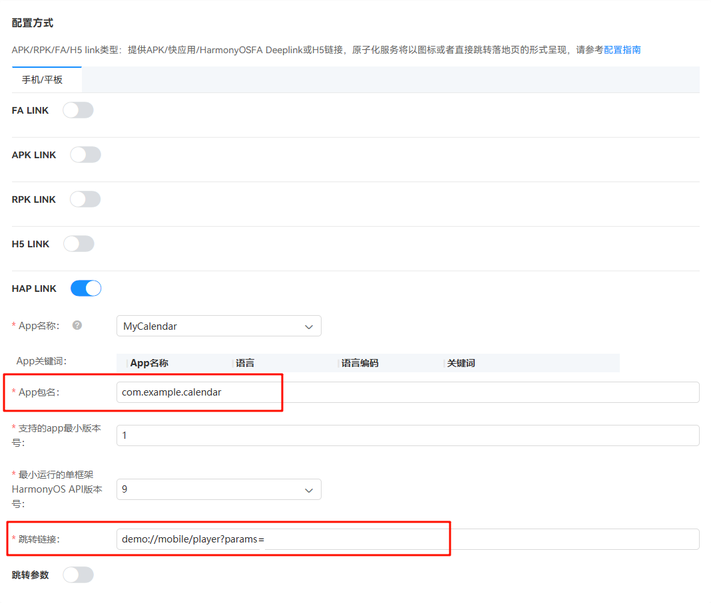

5. 选择服务模型。

  选择**自定义模型**，填写**服务名称**、**服务分类**、**默认语言**，点击**创建**按钮。

  **服务名称**：可由用户自定义，推荐使用“应用名+日历一键服务”的组合命名形式。

  **服务分类**：开发者根据实际业务类型自行选择。

  **默认语言**：由开发者根据业务选择配置。

  
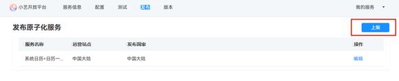

6. 创建完成后，填写服务的**基本信息**，点击**保存**按钮。

  **服务分类**：选择实用工具/日历。

  **服务版本号**和**版本描述**可由开发者自定义，平台审核不关注此信息。

  **服务分级**：由开发者根据业务选择配置。

  
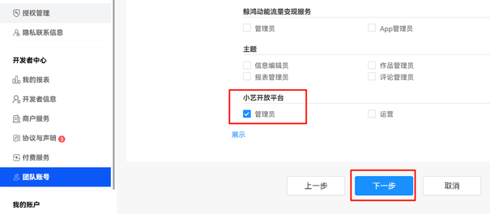

7. 填写**服务呈现信息**，点击**保存**按钮。

  此页面必填字段均由开发者根据业务选择配置。建议在服务预览处上传用户界面示意图。

  
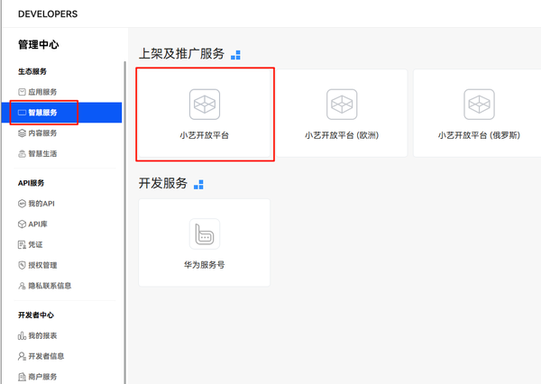

8. 进入**配置**，选择**新增用户意图**。

  
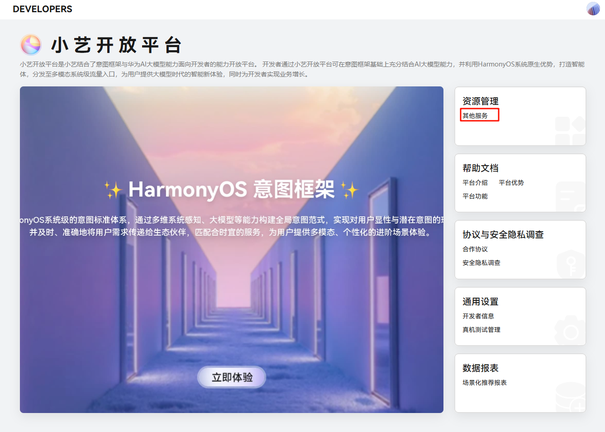

9. 配置意图。

  
- 设置**意图标识**、**意图名称**和**意图分类**，勾选一键服务。意图分类选择“查日历”。

10. 勾选一键服务之后，选择**服务类型**（请与Calendar Kit提供的日程服务类型[ServiceType](https://developer.huawei.com/consumer/cn/doc/harmonyos-references/js-apis-calendarmanager#servicetype)一致），点击**添加关联**按钮，输入**app包名**及**app名称**（请确保app包名及app名称准确匹配，否则一键服务无法生效）。

  
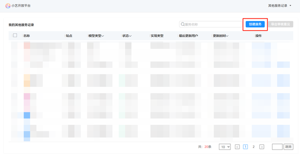

- 配置意图的**实现类型**，选择**APK/RPK/FA/H5 link**，选择**新增实现**，点击**配置**按钮。

  
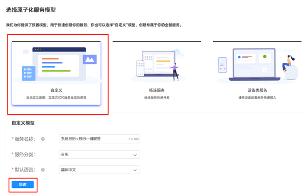

- 进入新增实现页面，填写**基本信息**和**配置方式**后，选择**保存**。

1. 填写基本信息。实现名称由开发者根据业务自定义，推荐使用“应用名+一键服务类型”命名。

2. 选择配置方式，勾选**HAP LINK**。

  填写准确的**App名称**（若下拉菜单中无匹配项，可直接输入）和**App包名**。

  填写**跳转链接**，即用户在系统日历中点击一键服务按钮拉起的落地页；请勿打开**跳转参数**开关。

  
> [!NOTE]
> 跳转链接为链接模板，实际 EventService 填入的uri需遵循此模板。例如，若填写跳转链接为“demo://mobile/player?params=”，则对应可匹配的uri为“demo://mobile/player?params=AAAABBBBCCCCDDDD”，其中“=”及“=”之前的部分为强校验，“=”之后的部分可由业务方根据需要自定义。


  其他必填字段，由开发者根据业务自行配置。

  
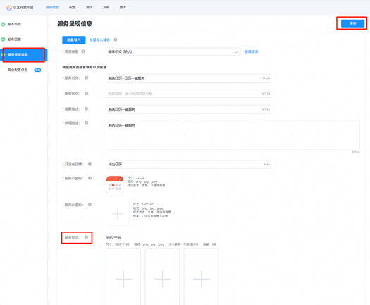


  
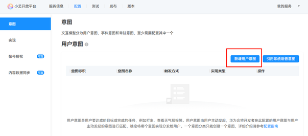

- 完成以上所有配置后，切换到**发布**模块，点击**上架**按钮，等待后台审核后，完成意图发布。

 
> [!NOTE]
> 若已完成上架的服务，支持根据上文步骤再次调整修改，修改完成后，点击 升级 。

 
 


 
  

#### 客户端添加一键服务日程

一键服务注册成功后，即完成系统日历跳转链接配置（支持在系统日历界面显示对应功能按钮）；若想实现一键服务体验，还需在客户端进行相关配置。
 
配置步骤如下：
 1. 在module.json5文件中，配置相关字段。

  需配置"exported"字段为true。

  并配置["skills"](https://developer.huawei.com/consumer/cn/doc/harmonyos-guides/module-configuration-file#skills标签)中的"actions"字段，"actions"标识能够接收的Action值集合，取值通常为系统预定义的action值，也允许自定义。actions不能为空，actions为空会造成目标方匹配失败，常见的action取值可见[action常数说明](https://developer.huawei.com/consumer/cn/doc/harmonyos-references/js-apis-ability-wantconstant#action)。

  最后配置"uris"字段，"uris"需与注册时的链接模板相匹配。

  比如，服务器端注册时填写的uri模板链接若为"demo://mobile/player?params="，则“=”前的内容为强校验，“=”后的内容为**业务需要使用的参数列表**，可在使用日历服务写入日程时根据各业务实际情况进行指定。参数列表中不得直接包含字符“=”或“&”，请注意使用decodeURI()/encodeURI()进行转换。

  
```json
{
  "module": {
    "name": "xxx",
    "type": "xxx",
    // ...
    "abilities": [
      {
        "name": "xxxxxxx",
        // ...
        "exported": true,
        "skills": [
          {
            // ...
           "actions": [
             "ohos.want.action.viewData"
            ],
            "uris": [
              {
                "scheme":"demo",
                "host":"mobile",
                "pathStartWith": "player"
              }
            ],
          }
        ]
      }
    ],
  }
}
```

2. 在被拉起的落地页EntryAbility中的onCreate、onNewWant接口中的[want对象](https://developer.huawei.com/consumer/cn/doc/harmonyos-references/js-apis-app-ability-want)内存在对应的拉起信息，开发者可通过对应参数实现对应跳转逻辑，本文不再赘述。
3. 调用[addEvent](https://developer.huawei.com/consumer/cn/doc/harmonyos-references/js-apis-calendarmanager#addevent)接口添加日程数据，后续即可见日历内出现含一键服务按钮的日程，点击即可跳转至对应落地页。
 
  

#### 约束限制

- 普通日程（EventType.NORMAL）可以提供一键服务按钮的露出；重要日程（EventType.IMPORTANT）因数据结构和产品规格限制，即使配置正确也无法提供一键服务。
- 该服务仅在用户设备联网下载对应协议后，开发者写入的日程才会显示对应按钮。
- 一键服务按钮的展示规则为：日程详情内始终展示，月视图、桌面卡片在日程开始前15分钟展示。
- 在服务器端注册的服务协议完成上架，审核通过后，设备恢复出厂设置，或待当天零点后，功能可正式生效。
- 请确保服务器端填写的链接模版（[服务器注册（配置一键服务跳转链接）](#服务器注册配置一键服务跳转链接)）、设备端三方应用侧写入的Event.Service.uri、module.json5配置的"uris"字段信息（[客户端添加一键服务日程](#客户端添加一键服务日程)）相互匹配。
