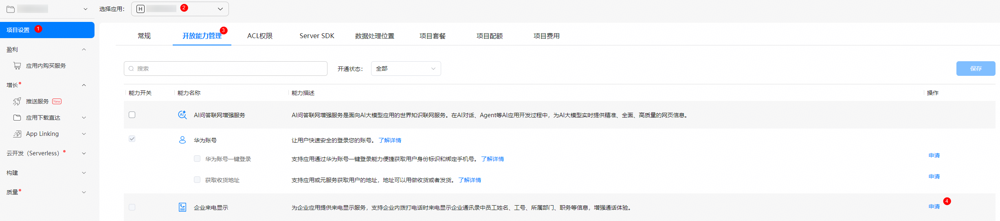
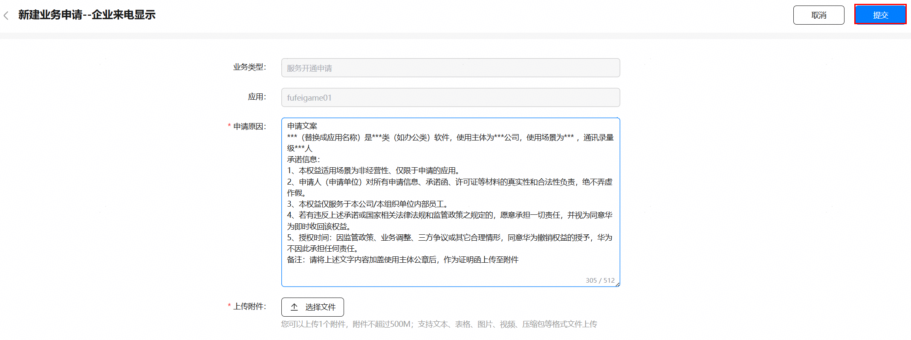

# 企业联系人信息来去电页面显示

更新时间：2026-04-20 06:34:33

来源：https://developer.huawei.com/consumer/cn/doc/harmonyos-guides/callservice-enterprise-contact-display

本功能仅供企业应用开发者接入。


## 场景介绍

来去电时，页面显示已安装企业应用的联系人信息，方便用户识别来去电人信息，快速回应，增强企业内部沟通效率。
> [!NOTE]
> 来去电页面或横幅仅展示一个联系人信息，对于多个应用里存在相同联系人的情况，按照应用包名的字典序排序，展示首个查询结果。


## 接口说明


| 接口名 | 描述 |
| --- | --- |
| [onQueryCallerInfo](https://developer.huawei.com/consumer/cn/doc/harmonyos-references/callservicekit-callerinfoquery-extension-ability#onquerycallerinfo)(phoneNumber: string)：Promise | 查询联系人信息接口。 |
| [queryNumberIdentifySwitchState](https://developer.huawei.com/consumer/cn/doc/harmonyos-references/callservicekit-numberldentify#querynumberidentifyswitchstate) (context: Context):SwitchState | 查询陌生号码与信息识别总开关状态以及调用该接口的应用号码识别开关状态。 |
| [isSupportEnterpriseNumberIdentify](https://developer.huawei.com/consumer/cn/doc/harmonyos-references/callservicekit-numberldentify#issupportenterprisenumberidentify)(context: Context): Promise | 查询是否已开通企业来电显示权限。 |


## 申请接入

企业来电显示能力使用受限，如需接入，需要在AGC网站申请对应权限。 1.登录[AGC网站](https://developer.huawei.com/consumer/cn/service/josp/agc/index.html#/)，选择“开发与服务”。 2.在项目列表选择项目，并在应用列表下选择需要申请企业来电显示的应用。 3.进入“项目设置 > 开放能力管理”页面，点击“企业来电显示”对应的“申请”。

4.请根据实际业务需求在弹框中填写对应信息，完成后，点击右上角“提交”，提交后将在3个工作日内回复。


## 替换调试Profile

当企业来电显示能力申请成功后，需要重新[申请调试Profile](https://developer.huawei.com/consumer/cn/doc/app/agc-help-add-debugprofile-0000001914423102)。并且在DevEco Studio中替换新申请的调试Profile。

## 开发步骤

在工程内创建一个[ExtensionAbility](https://developer.huawei.com/consumer/cn/doc/harmonyos-guides/extensionability-overview)类型的自定义组件并继承[CallerInfoQueryExtensionAbility](https://developer.huawei.com/consumer/cn/doc/harmonyos-references/callservicekit-callerinfoquery-extension-ability#callerinfoqueryextensionability)，完成onQueryCallerInfo方法的复写。 说明： 由于调用onQueryCallerInfo方法时，系统先创建应用的AbilityStage实例，请勿在AbilityStage中添加过于复杂耗时的逻辑，避免调用超时。 代码示例：
```text
import { CallerInfoQueryExtensionAbility, CallerInfo } from '@kit.CallServiceKit';

export default class EntryCallerInfoQueryExtAbility extends CallerInfoQueryExtensionAbility {
 // 来去电时由系统通话应用主动调用该接口查询企业联系人信息
  onQueryCallerInfo(phoneNumber: string): Promise {
    return new Promise((resolve, reject) => {
      let isSuccess = true;
      // 在此处实现根据号码查询企业联系人的业务逻辑
      if (isSuccess) {
        // 查询成功，返回结果
        resolve({
          contactName:"xxxx",
          employeeId:"xxxx",
          department:"xxxx",
          position:"xxxx"
        });
      } else {
        // 查询失败，返回错误原因
        reject("error reason");
      }
    });
  }
}
```

在应用配置文件module.json5中注册extensionAbilities，具体详见[module.json5配置](https://developer.huawei.com/consumer/cn/doc/harmonyos-guides/module-configuration-file)。 配置文件示例：
```text
{
    "extensionAbilities": [
      {
        "name": "EntryCallerInfoQueryExtAbility",
        "srcEntry": "./ets/callerinfoquery/EntryCallerInfoQueryExtAbility.ets",
        "type": "callerInfoQuery"
      }
    ]
}
```

type标签需设为"callerInfoQuery"，表示该拓展类型为CallerInfoQueryExtensionAbility。 srcEntry标签表示上述ExtensionAbility组件所对应的代码路径。 在调试设备上，前往“电话”，点击右上角的“更多”图标，前往“设置”>“陌生号码和信息识别”，打开对应企业应用的号码识别功能开关，进行调试。

## 应用跳转陌生号码和信息识别页面

从6.1.0(23)版本开始，新增支持从应用直接跳转到“电话 > 更多 > 设置 > 陌生号码和信息识别”。 通过[Deep Linking](https://developer.huawei.com/consumer/cn/doc/harmonyos-guides/deep-linking-startup)方式应用可以直接跳转“陌生号码和信息识别”页面。 以使用openLink实现应用跳转举例，在openLink接口的link字段中传入目标应用的URL信息，并将options字段中的appLinkingOnly配置为false、跳转的URL固定为"callsetting://number_identity"。 其他跳转方式参考使用Deep Linking实现应用间跳转[拉起方应用实现应用跳转](https://developer.huawei.com/consumer/cn/doc/harmonyos-guides/deep-linking-startup#拉起方应用实现应用跳转)章节。 示例代码：
```text
import { common, OpenLinkOptions } from '@kit.AbilityKit';
import { BusinessError } from '@kit.BasicServicesKit';
import { hilog } from '@kit.PerformanceAnalysisKit';

@Entry
@Component
struct Index {
  build() {
    Button('start link', { type: ButtonType.Capsule, stateEffect: true })
      .width('87%')
      .height('5%')
      .margin({ bottom: '12vp' })
      .onClick(() => {
        let context = this.getUIContext().getHostContext() as common.UIAbilityContext;
        let link: string = "callsetting://number_identity";
        let openLinkOptions: OpenLinkOptions = {
          appLinkingOnly: false
        };
       try {
          context.openLink(link, openLinkOptions)
            .then(() => {
              hilog.info(0, 'TAG', 'Successed in opening link.');
            }).catch((err: BusinessError) => {
              hilog.error(0, 'TAG',`Failed to open link. Code is ${err.code}, message is ${err.message}`);
            });
        } catch (paramError) {
          hilog.error(0, 'TAG',`Failed to start link. Code is ${paramError.code}, message is ${paramError.message}`);
        }
      })
  }
}
```
