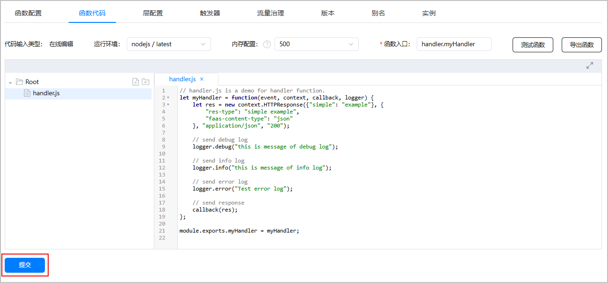
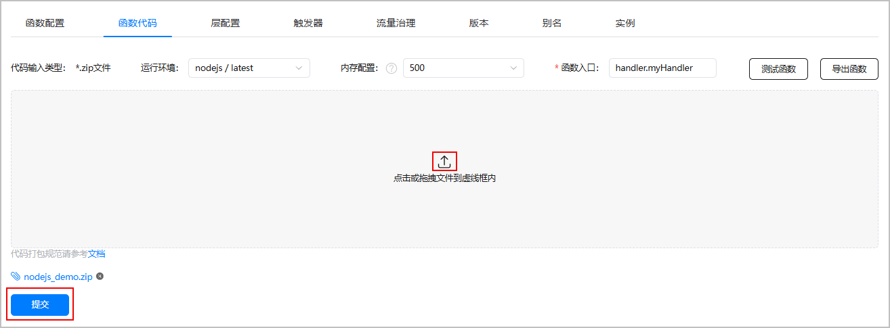

# 测试函数

更新时间：2026-04-20 06:34:33

来源：https://developer.huawei.com/consumer/cn/doc/harmonyos-guides/cloudfoundation-test-function

> [!NOTE]
> 下文以函数latest版本为例介绍测试方法。如果需要测试函数的已发布版本，可在已发布版本详情页面选择“函数代码”页签，参考方式二进行测试。

 
函数创建后可以在AGC控制台测试函数的代码运行是否正常。进入测试界面有两种方式：
 
- 方式一：函数列表中点击函数名称右侧“操作”列的“测试”，在右侧弹出的“测试函数”界面进行测试。

  

- 方式二：

1. 在函数列表中点击已创建的函数名称，进入函数详情页面。

  

2. 选择“函数代码”页签，点击“测试函数”。

  

3. 在右侧弹出的“测试函数”界面，使用默认测试事件、创建新测试事件或者使用已保存测试事件进行测试。

  
使用默认测试事件：直接点击“测试”对函数进行测试。

  

4. 创建新测试事件：如果需要设置调用函数的请求消息体，可按照如下步骤配置测试参数，并可保存为测试事件方便后续继续使用。

  
在“事件”文本框中输入JSON格式的事件参数，点击“保存”。然后在“提示”弹出框中输入事件名称，配置完成后点击弹出框右下角的“确认”。

  
> [!NOTE]
> “事件”文本框内输入的JSON对象，对应的是触发器的event事件格式，会透传给函数。

  

5. 点击“测试”，函数处理事件并返回测试结果。
- 使用已保存测试事件

1. 在“测试函数”界面，点击

展开已保存的测试事件列表，选择已配置的事件名称右侧的“加载”，然后点击“测试”，函数处理事件并返回测试结果。

  

2. （可选）如果需要删除已添加的测试事件，可在测试事件列表中点击事件名称右侧的“删除”即可删除测试事件。

  

  - 查看测试结果。

  
执行结果：展示测试后获得的响应结果。

  

- 运行日志：展示函数运行过程中，通过logger API打印的日志，支持输出debug级别及以上日志（以下仅为日志输出示例）。

  

- 执行摘要：展示该次测试请求相关信息。

  
请求ID：该条测试请求的RequestID，在后台日志中体现为X-Trace-ID。
- 持续时间：函数执行的端到端时间。
- 执行版本：该次调用测试的具体函数版本。

  
 

  
  - “代码输入类型”为“在线编辑”的函数，测试过程中，如果需要修改函数入口文件代码，可直接在“函数代码”页签的代码编辑器中修改，然后点击页面底部的“提交”。当界面提示更新函数成功时，则可以点击“测试函数”对更改后的代码进行测试。

  

  “代码输入类型”为“.zip文件”的函数，测试过程中，如果需要修改函数代码文件，可在本地修改且打包完成后，点击

重新上传函数部署包，然后点击页面底部的“提交”。当界面提示更新函数成功时，则可以点击“测试函数”对更改后的代码进行测试。

  
> [!NOTE]
> 如果代码更新量比较大，需要调整函数内存配置，可点击“内存配置”下拉框进行调整，然后再上传函数部署包。

  

- 函数测试无误后，可在“函数代码”页签点击“导出函数”导出函数部署包。导出包以“函数名称+函数版本.zip”格式命名，可查看函数结构和文件内容。
