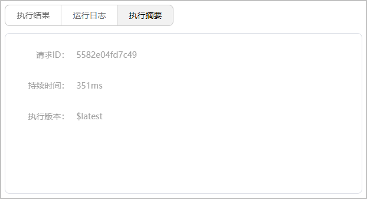

# 测试函数

更新时间：2026-04-20 06:34:33

来源：https://developer.huawei.com/consumer/cn/doc/harmonyos-guides/cloudfoundation-test-function

> [!NOTE]
> 下文以函数latest版本为例介绍测试方法。如果需要测试函数的已发布版本，可在已发布版本详情页面选择“函数代码”页签，参考方式二进行测试。

 函数创建后可以在AGC控制台测试函数的代码运行是否正常。进入测试界面有两种方式：

查看测试结果。

- 请求ID：该条测试请求的RequestID，在后台日志中体现为X-Trace-ID。
- 持续时间：函数执行的端到端时间。
- 执行版本：该次调用测试的具体函数版本。

“代码输入类型”为“在线编辑”的函数，测试过程中，如果需要修改函数入口文件代码，可直接在“函数代码”页签的代码编辑器中修改，然后点击页面底部的“提交”。当界面提示更新函数成功时，则可以点击“测试函数”对更改后的代码进行测试。

“代码输入类型”为“.zip文件”的函数，测试过程中，如果需要修改函数代码文件，可在本地修改且打包完成后，点击

重新上传函数部署包，然后点击页面底部的“提交”。当界面提示更新函数成功时，则可以点击“测试函数”对更改后的代码进行测试。

> [!NOTE]
> 如果代码更新量比较大，需要调整函数内存配置，可点击“内存配置”下拉框进行调整，然后再上传函数部署包。

函数测试无误后，可在“函数代码”页签点击“导出函数”导出函数部署包。导出包以“函数名称+函数版本.zip”格式命名，可查看函数结构和文件内容。
