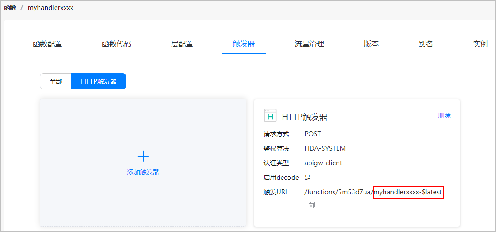

# 调用函数

更新时间：2026-04-20 06:34:33

来源：https://developer.huawei.com/consumer/cn/doc/harmonyos-guides/cloudfoundation-call-function

#### 约束与限制

支持Phone、Tablet设备。并且从5.1.0(18)版本开始，新增支持Wearable设备；从5.1.1(19)版本开始，新增支持TV设备；从6.1.0(23)版本开始，新增支持PC/2in1设备。


#### 设置云函数配置项

在“entry/src/main/module.json5”文件中添加网络权限。

```text
"requestPermissions": [
  {
    "name": "ohos.permission.INTERNET"
  }
]
```


#### 查询函数名和版本

在函数的触发器页面点击“HTTP触发器”，查看“触发URL”的后缀，获取触发器的标识，格式为“函数名-版本号”。如下图所示，“myhandlerxxxx-$latest”即为HTTP触发器标识，其中“myhandlerxxxx”为函数名，“$latest”为版本号。





#### 在应用中调用函数
1. 在项目中导入cloudFunction组件。

  
```text
import { cloudFunction } from '@kit.CloudFoundationKit';
import { BusinessError } from '@kit.BasicServicesKit';
```

2. 调用[call()](https://developer.huawei.com/consumer/cn/doc/harmonyos-references/cloudfoundation-cloudfunction#call)方法设置函数，在方法中传入函数名称，返回调用结果。

  
（可选）通过设置timeout属性对云函数设置超时时长，单位为毫秒。
3. （可选）通过设置version属性对云函数设置函数版本号，默认为最新版本'$latest'。
4. （可选）如果函数有入参，可以将data参数转化为JSON对象或JSON字符串传入，如果没有参数则不传。
5. 如果需要关注函数的返回值，可调用result属性获取。

  
```text
let returnValue = value.result;
```
value为步骤2中调用call()方法返回的cloudFunction.FunctionResult对象，返回值为云函数body返回的值，以[测试函数](https://developer.huawei.com/consumer/cn/doc/harmonyos-guides/cloudfoundation-test-function)时返回的结果为例，value.result = {"simple":"example"}。
