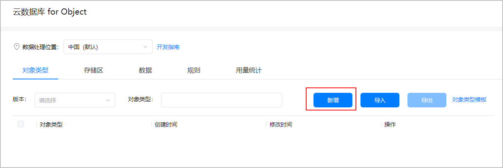
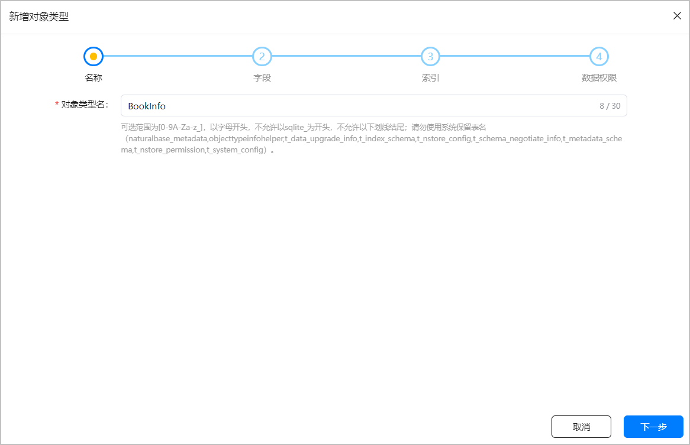
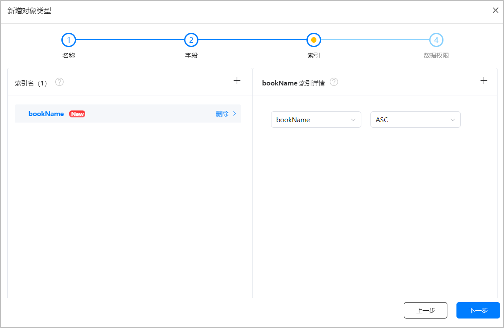
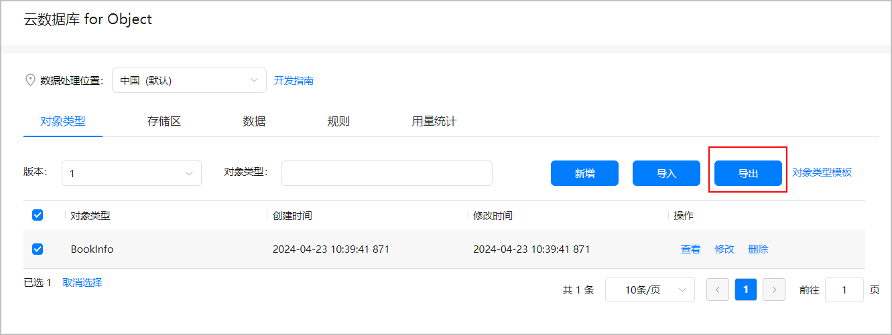
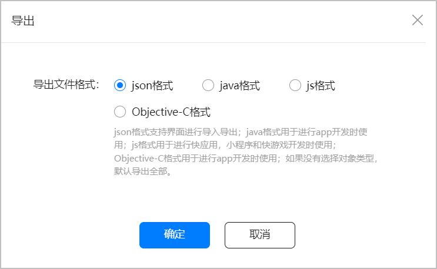

# 新增对象类型

更新时间：2026-04-20 06:34:33

来源：https://developer.huawei.com/consumer/cn/doc/harmonyos-guides/cloudfoundation-database-add-object

开发者需要基于AGC控制台创建对象类型。
  

##### 前提条件

已[开通云数据库服务](https://developer.huawei.com/consumer/cn/doc/harmonyos-guides/cloudfoundation-enable-database)。
 
  

##### 操作步骤
1. 登录[AppGallery Connect](https://developer.huawei.com/consumer/cn/service/josp/agc/index.html)，点击“开发与服务”。
2. 在项目列表中点击需要创建对象类型的项目。
3. 在左侧导航栏选择“云开发（Serverless）> 云数据库”，进入云数据库页面。
4. 点击“新增”，创建新的对象类型。

  

5. 输入“对象类型名”为“BookInfo”后，点击“下一步”。

  

6. 点击“+新增字段”，新增如下表字段后，点击“下一步”。

| 字段名称 | 类型 | 主键 | 非空 | 加密 | 默认值 |

| --- | --- | --- | --- | --- | --- |

| id | Integer | ✓ | ✓ | – | – |

| bookName | String | – | ✓ | – | – |

| author | String | – | – | – | – |

| price | Double | – | – | – | – |

| borrowerId | Integer | – | – | – | – |

| borrowerName | String | – | – | – | – |

| borrowerTime | Date | – | – | – | – |
7. 点击“+”新增索引，设置“索引名”为“bookName”，点击“下一步”。

  

8. 按照如下要求设置各角色权限后，点击“确定”。

| 角色 | query | upsert | delete | 说明 |

| --- | --- | --- | --- | --- |

| 所有人 | ✓ | ✓ | ✓ | 代表所有用户，包含认证和非认证用户。 该角色默认拥有query权限，可自定义配置upsert和delete权限。如：角色勾选了upsert权限，该角色可在本对象类型中写入数据。 但是，不建议将upsert和delete权限配置给所有人角色。 当对象类型中设置了加密字段之后，表示开启全程加密功能，此时所有人角色将不会拥有query、upsert和delete权限，且不允许修改。 |

| 认证用户 | ✓ | ✓ | ✓ | 经过AGC登录认证的用户。 该角色默认拥有query权限，可自定义配置upsert和delete权限。如：角色勾选了upsert权限，该角色可在本对象类型中写入数据。 当对象类型中设置了加密字段之后，表示开启全程加密功能，此时认证用户角色将不会拥有query、upsert和delete权限，且不允许修改。 |

| 数据创建者 | ✓ | ✓ | ✓ | 经过认证的数据创建用户。 该角色默认拥有所有权限，且可自定义配置所有权限。如：角色勾选了upsert权限，该角色可在本对象类型中写入数据。 每条数据都有其对应的数据创建人（即应用用户），每个数据创建者仅可以upsert或者delete自己创建的数据，不能upsert或者delete他人创建的数据。 数据创建者的信息保存在数据记录的系统表中。 |

| 管理员 | ✓ | ✓ | ✓ | 应用开发者，主要是指通过AGC控制台或FaaS（Function as a Service，函数即服务）侧访问云数据库的角色。 该角色默认拥有所有权限，且可自定义配置所有权限。如：角色勾选了upsert权限，该角色可在本对象类型中写入数据。 管理员可以管理并配置其他角色的权限。 |
9. 创建完成后返回对象类型列表，可以查看已创建的对象类型。
10. 勾选创建的BookInfo对象类型，点击“导出”。若不勾选对象类型，默认导出所有对象类型。

  

11. 导出“json格式”文件，点击“确定”。后续[引入对象类型文件](https://developer.huawei.com/consumer/cn/doc/harmonyos-guides/cloudfoundation-database-add-file)时，需要使用此文件。

  

