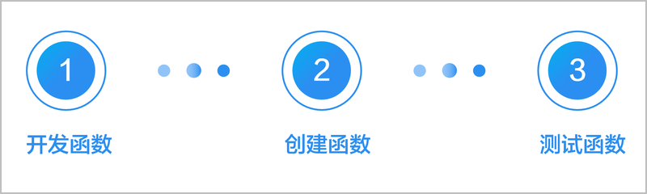

# 开发预加载资源接口

更新时间：2026-04-20 06:34:33

来源：https://developer.huawei.com/consumer/cn/doc/harmonyos-guides/cloudfoundation-prefetch-cloud-interdev

使用预加载服务之前，开发者需要完成云侧接口的开发，以提供预加载所需的资源数据。华为提供两种方式供开发者选择：云函数和开发者服务器，开发者可根据实际业务需要进行选择。


## 云函数

开发者需要先按照云函数接口规范开发函数，然后在AGC云端创建函数，并可测试函数运行是否正常。流程如下：

[开发函数](https://developer.huawei.com/consumer/cn/doc/harmonyos-guides/cloudfoundation-develop-function-nodejs)：按照云函数接口规范开发函数。  [创建函数](https://developer.huawei.com/consumer/cn/doc/harmonyos-guides/cloudfoundation-create-and-config-function)：函数业务代码开发完成后，即可在AGC云端创建函数。  [测试函数](https://developer.huawei.com/consumer/cn/doc/harmonyos-guides/cloudfoundation-test-function)：对函数进行测试，以确保函数代码运行正常。

## 云函数接口规范


| 预加载类型 | API名称 | 说明 | 参数 | 返回值 |
| --- | --- | --- | --- | --- |
| 安装预加载 | 自定义 | 获取预加载数据接口 | event.body.appId：应用ID，获取方法请参见[查看应用信息](https://developer.huawei.com/consumer/cn/doc/app/agc-help-view-app-info-0000002282674569)。 | 自定义JSON字符串 |
| 周期性预加载 | 自定义 | 获取预加载数据接口 | - event.body.appId：应用ID，获取方法请参见[查看应用信息](https://developer.huawei.com/consumer/cn/doc/app/agc-help-view-app-info-0000002282674569)。 - event.body.token：可选，注册周期性预加载任务时开发者自行传入的用户级认证信息，长度不超过2048个字符。 - event.body.params：可选，注册周期性预加载任务时开发者自行传入的自定义参数，长度不超过1024个字符。 | 自定义JSON字符串 |
| 跳链安装预加载 | 自定义 | 获取预加载数据接口 | - event.body.appId：应用ID，获取方法请参见[查看应用信息](https://developer.huawei.com/consumer/cn/doc/app/agc-help-view-app-info-0000002282674569)。 - event.body.link：可选，跳链安装预加载延迟链接。 | 自定义JSON字符串 |


## 示例

[端云一体化工程](https://developer.huawei.com/consumer/cn/doc/harmonyos-guides/agc-harmonyos-clouddev-funccoding)预加载云函数示例如下。其中，axios依赖库为网络请求库，需要在“cloudfunctions/云函数名称/package.json”的“dependencies”中添加axios的1.7.7或以上版本依赖。 安装预加载
```text
import axios from 'axios';

let myHandler = async function (event, context, callback, logger) {
  logger.info("event:" + JSON.stringify(event));
  let env1 = context.env.env1; // 环境变量
  logger.info("env1: " + env1)
  try {
    let body = event.body ? JSON.parse(event.body) : event;
    let appId = body.appId;

    logger.info("appId: " + appId);

    // http请求示例，请按照实际业务修改
    let url = 'https://example.com/prefetchApi';  // 页面资源数据的请求url
    let headers = { 'k1': 'v1' };  // 请求header
    let res;  // 返回数据
    await axios.post(url, {}, { headers })  // http post请求
      .then(response => {
        res = response.data;
      })
    logger.info("--------Finished-------");
    callback(res);
  } catch (error) {
    logger.error("--------Error-------");
    logger.error("error: " + error);
    callback(error);
  }
};

export { myHandler };
```

周期性预加载
```text
import axios from 'axios';

let myHandler = async function (event, context, callback, logger) {
  logger.info("event:" + JSON.stringify(event));
  let env1 = context.env.env1; // 环境变量
  logger.info("env1: " + env1)
  try {
    let body = event.body ? JSON.parse(event.body) : event;
    let appId = body.appId;
    let token = body.token;
    let paramsStr = body.params; // 如果需要解析json结构paramsStr中的参数，需要使用 let params = JSON.parse(paramsStr);

    logger.info("appId: " + appId + ",token:" + token + ",params:" + paramsStr);

    // http请求示例，请按照实际业务修改
    let url = 'https://example.com/prefetchApi'; // 页面资源数据的请求url
    let headers = { 'k1': 'v1' }; // 请求header
    let res; // 返回数据
    await axios.post(url, {}, { headers }) // http post请求
      .then(response => {
        res = response.data;
      })
    logger.info("--------Finished-------");
    callback(res);
  } catch (error) {
    logger.error("--------Error-------");
    logger.error("error: " + error);
    callback(error);
  }
};

export { myHandler };
```

跳链安装预加载
```text
import axios from 'axios';

let myHandler = async function (event, context, callback, logger) {
  logger.info("event:" + JSON.stringify(event));
  let env1 = context.env.env1; // 环境变量
  logger.info("env1: " + env1)
  try {
    let body = event.body ? JSON.parse(event.body) : event;
    let appId = body.appId;
    let link = body.link; // 跳链安装预加载link信息

    logger.info("appId: " + appId + ",link:" + link);

    // http请求示例，请按照实际业务修改
    let url = 'https://example.com/prefetchApi'; // 页面资源数据的请求url
    let headers = { 'k1': 'v1' }; // 请求header
    let res; // 返回数据
    await axios.post(url, {}, { headers }) // http post请求
      .then(response => {
        res = response.data;
      })
    logger.info("--------Finished-------");
    callback(res);
  } catch (error) {
    logger.error("--------Error-------");
    logger.error("error: " + error);
    callback(error);
  }
};

export { myHandler };
```


## 开发者服务器

申请开通开发者服务器权限之后，开发者使用自己的服务器自行开发和实现预加载资源接口，接口需遵循开发者服务器接口规范。

## 开发者服务器接口规范


| 预加载类型 | API/PATH名称 | 说明 | 参数 | 请求方式 | 返回值 |
| --- | --- | --- | --- | --- | --- |
| 安装预加载 | 自定义 | 获取预加载数据接口 | appId：应用ID，获取方法请参见[查看应用信息](https://developer.huawei.com/consumer/cn/doc/app/agc-help-view-app-info-0000002282674569)。 | GET | 自定义JSON字符串 |
| 周期性预加载 | 自定义 | 获取预加载数据接口 | - appId：应用ID，获取方法请参见[查看应用信息](https://developer.huawei.com/consumer/cn/doc/app/agc-help-view-app-info-0000002282674569)。 - token：可选，注册周期性预加载任务时开发者自行传入的用户级认证信息，长度不超过2048个字符。 - params：可选，注册周期性预加载任务时开发者自行传入的自定义参数，长度不超过1024个字符。 | GET | 自定义JSON字符串 |
| 跳链安装预加载 | 自定义 | 获取预加载数据接口 | - appId：应用ID，获取方法请参见[查看应用信息](https://developer.huawei.com/consumer/cn/doc/app/agc-help-view-app-info-0000002282674569)。 - link：可选，跳链安装预加载延迟链接。 | GET | 自定义JSON字符串 |


## 示例

定义名称为prefetchData的接口，示例如下：
```text
https://www.example.com/prefetchData?appId=1234&token=xxxx&params=yyyy
```
