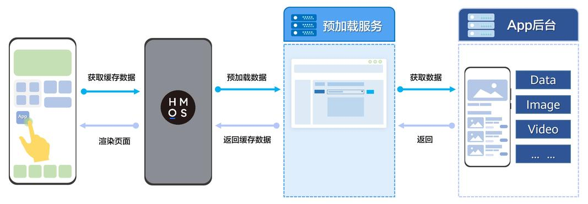
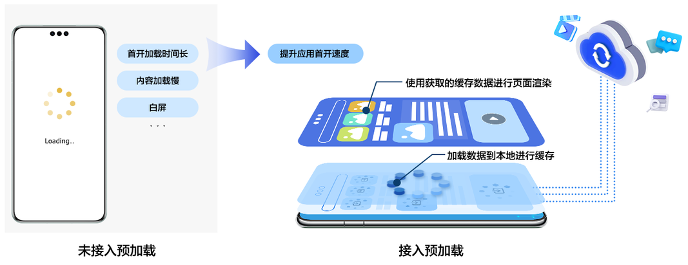
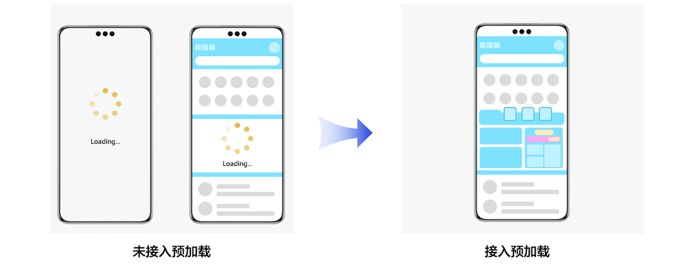

# 概述

更新时间：2026-04-20 06:34:33

来源：https://developer.huawei.com/consumer/cn/doc/harmonyos-guides/cloudfoundation-prefetch-overview

从5.0.3(15)版本开始，新增支持安装预加载和周期性预加载功能；从6.1.0(23)版本开始，新增支持跳链安装预加载功能。

 预加载是Cloud Foundation Kit提供的一种可提前加载所需资源的服务。通过预加载，可以将页面所需的文本、图片、音频、视频等资源数据提前加载到本地进行缓存，以提升应用页面加载速度。预加载仅以字符串数据形式进行缓存，应用使用预加载时不需要修改原有数据格式，获取缓存后可直接进行解析，并且可以对隐私、敏感数据进行加密。

 当前支持如下三种预加载类型：

 同时还支持**H5预加载组件FastWeb**，它是基于Open Harmony基础组件开发的高性能Web容器，具有预启动、预渲染、预编译JavaScript生成字节码缓存、离线资源免拦截注入等能力，可为应用中Web页面的加载进行提速。H5预加载组件FastWeb无需使用Cloud Foundation Kit能力，详细使用方法可参考[Web容器FastWeb](https://developer.huawei.com/consumer/cn/market/prod-detail/686766c4728d43cc9741728552a560bf/2adce9bbd4cb42d58a87e6add45594b3)。

## 工作原理

预加载服务根据配置的数据预加载策略从应用后台获取数据。  预加载服务将获取的数据在本地进行缓存。  应用使用获取的缓存数据，进行页面渲染。

## 典型应用场景

## 提升应用首开速度

在应用启动前或初始化阶段，为避免出现首页内容加载慢、白屏等情况，开发者可以使用预加载将一些必要的资源，例如图片、音频、视频或数据文件，提前加载到本地进行缓存。用户首次访问应用时，可直接从缓存中获取数据，这样就减少了从服务器重新下载资源的时间，提升了应用首开速度，从而提高用户留存率。

## 实现节日主题即发即现

很多应用会在节日更换特定主题内容进行活动营销，用户打开应用时需要从服务器上获取相关资源来呈现内容，可能会造成页面加载速度较慢而导致用户体验不佳。开发者可以使用预加载，在节日活动开始前通过周期性的数据拉取提前将主题资源获取到本地，活动开始用户访问时直接从本地获取即可，减少了网络请求的时间和带宽消耗，从而能够更快地展示节日主题，实现即发即现的效果，提升用户体验。

## 约束与限制

## 设备限制

支持Phone、Tablet设备。并且从6.1.0(23)版本开始，新增支持PC/2in1设备。

## 数据限制

| 限制项 | 说明 |
| --- | --- |
| 数据类型 | 仅支持缓存文本、图片、音频、视频等静态资源数据，不支持代码、脚本等动态资源数据。 |

## 配额限制

| 配额类型 | 配额 |
| --- | --- |
| 安装预加载缓存大小 | 2MB |
| 周期性预加载缓存大小 | 3MB |
| 跳链安装预加载缓存大小 | 3MB |
