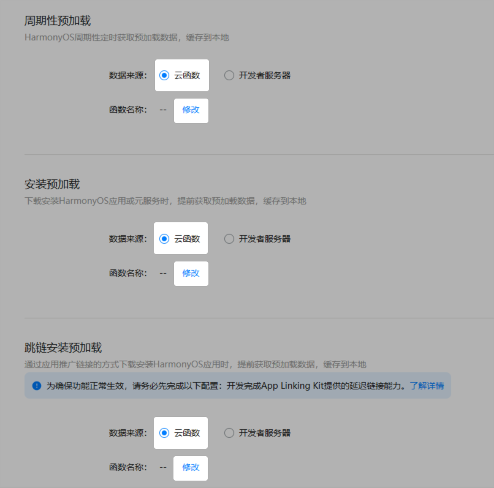
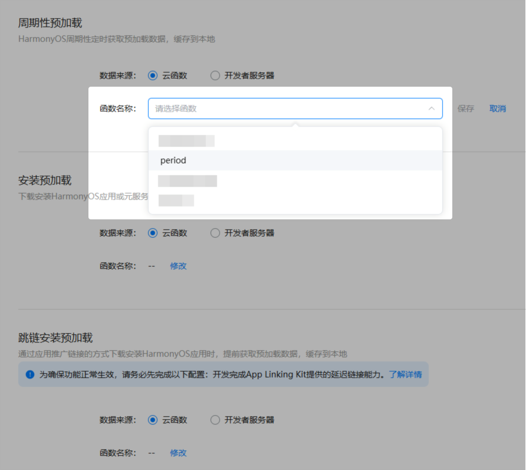
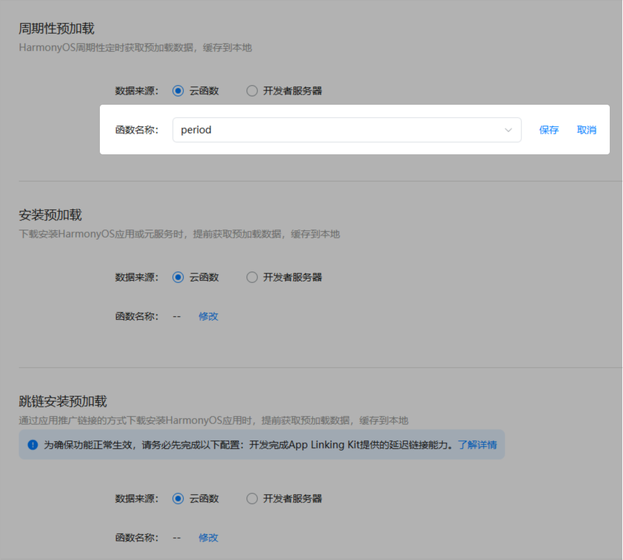
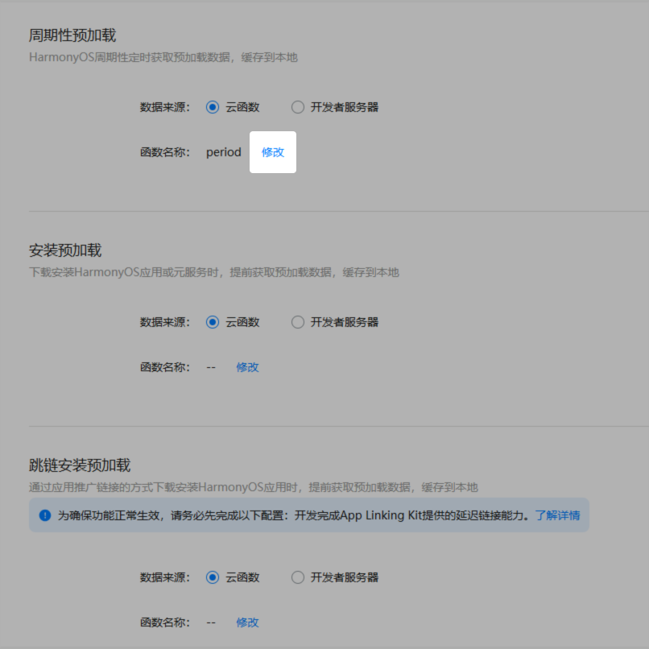
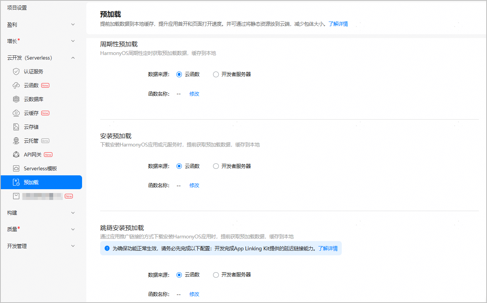
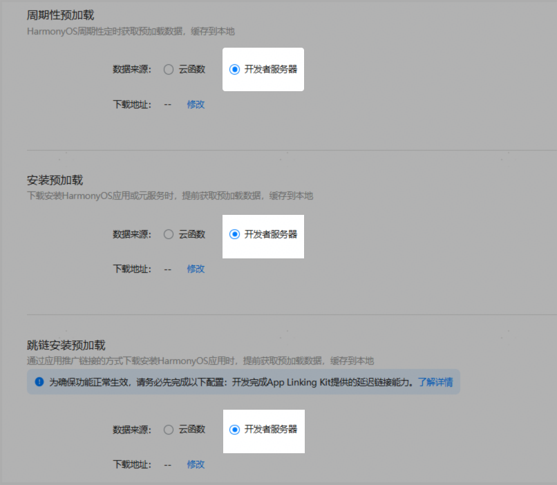
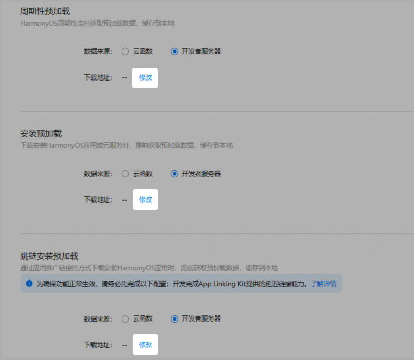
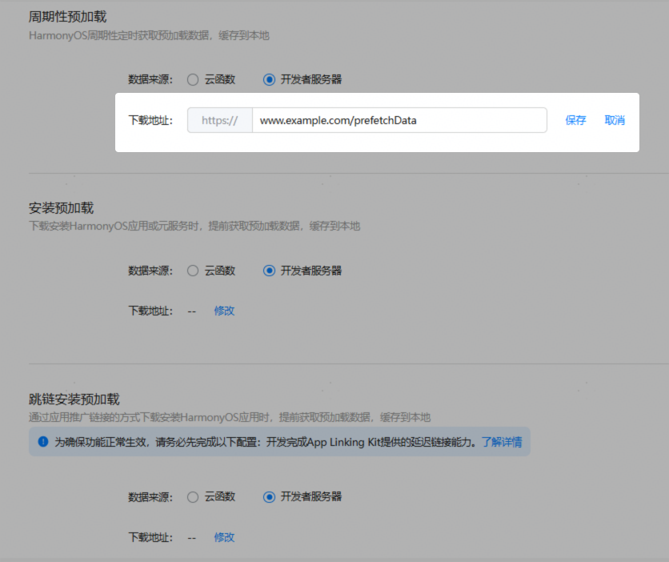
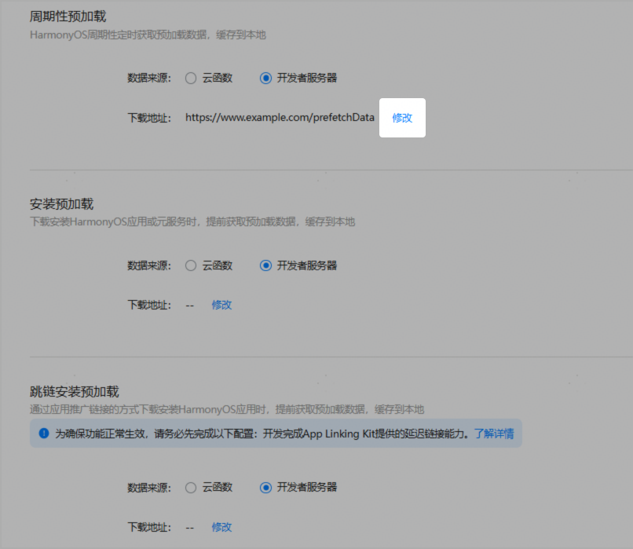

# 配置预加载

更新时间：2026-04-24 08:10:21

来源：https://developer.huawei.com/consumer/cn/doc/harmonyos-guides/cloudfoundation-prefetch-config

安装预加载、周期性预加载和跳链安装预加载需分别进行配置，且三者均可通过云函数和开发者服务器（即HTTPS请求）两种数据来源方式来实现。

 对于不同类型的开发者，支持的数据来源方式有所不同：

 下文介绍如何配置两种数据来源方式的预加载实现。

## 数据来源为云函数

## 前提条件

已[开通预加载服务](https://developer.huawei.com/consumer/cn/doc/harmonyos-guides/cloudfoundation-enable-prefetch)。  已[创建函数](https://developer.huawei.com/consumer/cn/doc/harmonyos-guides/cloudfoundation-create-and-config-function)。

## 绑定云函数

登录[AppGallery Connect](https://developer.huawei.com/consumer/cn/service/josp/agc/index.html)，点击“开发与服务”。  在项目列表中点击您的项目，在项目下的应用列表中选择需要配置预加载的HarmonyOS应用/元服务。  在左侧导航栏选择“云开发（Serverless）> 预加载”，进入预加载页面。

根据实际需要，在“周期性预加载”、“安装预加载”或者“跳链安装预加载”区域，“数据来源”选择“云函数”，然后点击“函数名称”后的“修改”。
> [!NOTE]
> 跳链安装预加载仅支持在HarmonyOS应用中调用。  由于跳链安装预加载功能需要使用App Linking Kit提供的延迟链接能力，因此在配置跳链安装预加载之前，请务必先完成延迟链接的开发。具体请参见通过延迟链接跳转至应用详情页。

以“周期性预加载”为例，在“函数名称”下拉框选择实现周期性预加载的函数名称。

点击“保存”完成周期性预加载配置。

若配置“安装预加载”或“跳链安装预加载”，重复步骤4-6即可。  （可选）若后续需要修改绑定的云函数，只需点击“函数名称”后的“修改”进行更新。

## 数据来源为开发者服务器

## 前提条件

已[开通预加载服务](https://developer.huawei.com/consumer/cn/doc/harmonyos-guides/cloudfoundation-enable-prefetch)。

## 配置服务器地址

登录[AppGallery Connect](https://developer.huawei.com/consumer/cn/service/josp/agc/index.html)，点击“开发与服务”。  在项目列表中点击您的项目，在项目下的应用列表中选择需要配置预加载的HarmonyOS应用/元服务。  在左侧导航栏选择“云开发（Serverless）> 预加载”，进入预加载页面。

根据实际需要，在“周期性预加载”、“安装预加载”或者“跳链安装预加载”区域，“数据来源”选择“开发者服务器”。
> [!NOTE]
> 跳链安装预加载仅支持在HarmonyOS应用中调用。  由于跳链安装预加载功能需要使用App Linking Kit提供的延迟链接能力，因此在配置跳链安装预加载之前，请务必先完成延迟链接的开发。具体请参见通过延迟链接跳转至应用详情页。

点击“下载地址”后的“修改”。

以“周期性预加载”为例，“下载地址”以“https://”开头，输入框中输入服务器地址，配置完成后点击“保存”。  需要注意以下几点：  仅支持填写一个服务器地址，需包含预加载资源接口路径，如图中示例：prefetchData。  域名：须填写完整的域名。例如www.example.com，不可写为example.com。  IP地址：须填写准确的IP地址，确保没有输入错误。  端口号：如果要指定端口号，可在服务器地址后面以冒号分隔，例如https://www.example.com:443。HTTPS协议的默认端口号（443）可以省略。

后续AGC会周期性地向该处配置的开发者服务器（即下载地址）发起一个HTTP GET请求，其中包含的query参数请参考[开发者服务器接口规范](https://developer.huawei.com/consumer/cn/doc/harmonyos-guides/cloudfoundation-prefetch-cloud-interdev#开发者服务器接口规范)，获取到数据后会将整个HTTP body缓存在本地。
> [!NOTE]
> 开发者服务器接口返回的数据内容需仅包含文本、图片、视频、音频等供页面展示的静态资源，不支持包含代码、脚本等动态数据。  开发者服务器接口返回的数据类型为其自定义格式的JSON或字符串数据，大小需限定在3MB以内。

若配置“安装预加载”，重复步骤4-6即可。  （可选）若后续需要修改下载地址，只需点击“下载地址”后的“修改”进行更新。

