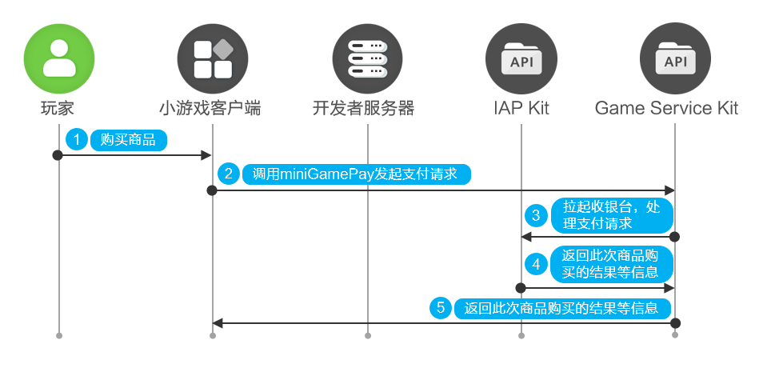

# 小游戏支付

更新时间：2026-04-30 02:41:24

来源：https://developer.huawei.com/consumer/cn/doc/harmonyos-guides/gameservice-gameplayer-minigame-pay

小游戏接入基础游戏服务的小游戏支付API后，支持在小游戏内提供付费商品，玩家可以在小游戏内进行购买。


## 前提条件

已完成[开发准备](https://developer.huawei.com/consumer/cn/doc/harmonyos-guides/gameservice-gameplayer-minigame-preparation)。 已开通[商户服务](https://developer.huawei.com/consumer/cn/doc/start/merchant-service-0000001053025967)。 已前往AGC控制台为小游戏[添加数字商品](https://developer.huawei.com/consumer/cn/doc/app/agc-help-release-minigame-goods-0000002424923350)。

## 业务流程


玩家在小游戏内购买商品。 小游戏调用[miniGamePay](https://developer.huawei.com/consumer/cn/doc/harmonyos-references/gameservice-gameplayer#gameplayerminigamepay)向Game Service Kit发起支付请求。 Game Service Kit向IAP Kit发送请求拉起收银台，IAP Kit处理支付请求，详情请参考[接入购买](https://developer.huawei.com/consumer/cn/doc/harmonyos-guides/iap-integrate-purchase)。 IAP Kit处理完成后向Game Service Kit返回此次商品购买的结果等信息。 Game Service Kit返回此次商品购买的结果等信息，开发者将接收到一个[CreatePurchaseResult](https://developer.huawei.com/consumer/cn/doc/harmonyos-references/gameservice-gameplayer#createpurchaseresult)对象，对象内的purchaseData字段包括了此次购买的结果信息。

## 接口说明

具体API说明详见[接口文档](https://developer.huawei.com/consumer/cn/doc/harmonyos-references/gameservice-gameplayer)。
| 接口名 | 描述 |
| --- | --- |
| [init](https://developer.huawei.com/consumer/cn/doc/harmonyos-references/gameservice-gameplayer#gameplayerinit-1)(context: common.UIAbilityContext, callback: AsyncCallback): void | 游戏初始化接口，使用默认的上下文信息，通过callback回调获取返回值。 |
| [miniGamePay](https://developer.huawei.com/consumer/cn/doc/harmonyos-references/gameservice-gameplayer#gameplayerminigamepay)(context: common.Context, parameter: PurchaseParameter): Promise | 小游戏支付接口，通过Promise对象获取返回值。 |


## 开发步骤


## 导入模块

导入Game Service Kit及公共模块。
```text
import { gamePlayer } from '@kit.GameServiceKit';
import { common } from '@kit.AbilityKit';
import { hilog } from '@kit.PerformanceAnalysisKit';
import { BusinessError } from '@kit.BasicServicesKit';
import { window } from '@kit.ArkUI';
```


## 初始化

调用[init](https://developer.huawei.com/consumer/cn/doc/harmonyos-references/gameservice-gameplayer#gameplayerinit-1)接口初始化Game Service Kit。
```text
onWindowStageCreate(windowStage: window.WindowStage) {
  windowStage.loadContent("pages/index", (err, data) => {
    try {
      gamePlayer.init(this.context,()=>{
        hilog.info(0x0000, 'testTag', `Succeeded in initializing.`);
      });
    } catch (error) {
      let err = error as BusinessError;
      hilog.error(0x0000, 'testTag', `Failed to init. Code: ${err.code}, message: ${err.message}`);
    }
  });
}
```


## 发起支付请求

调用[miniGamePay](https://developer.huawei.com/consumer/cn/doc/harmonyos-references/gameservice-gameplayer#gameplayerminigamepay)向Game Service Kit发起支付请求，Game Service Kit将向IAP Kit发送请求拉起收银台，IAP Kit处理支付请求。IAP Kit处理完成后向Game Service Kit返回此次商品购买的结果等信息，Game Service Kit将此次商品购买的结果等信息通过[CreatePurchaseResult](https://developer.huawei.com/consumer/cn/doc/harmonyos-references/gameservice-gameplayer#createpurchaseresult)对象返回给开发者。
```text
let context = this.getUIContext()?.getHostContext() as common.UIAbilityContext;
let request: gamePlayer.PurchaseParameter = {
  productId: 'xxx', // 待支付的商品ID
  productType: 0, // 待查询的商品类型
  developerPayload: 'xxx', // 商户侧保留信息，该参数长度限制为[0, 256]。若该字段有值，在支付成功后的回调结果中会原样返回给应用
  reservedInfo: 'xxx' // 要求JSON String格式，商户可以将额外需要传入的字段以key-value的形式设置在JSON String中，并通过该参数传入
};
try {
  gamePlayer.miniGamePay(context, request).then((result: gamePlayer.CreatePurchaseResult) => {
    hilog.info(0x0000, 'testTag', `Succeeded in paying`);
  }).catch((error: BusinessError) => {
    hilog.error(0x0000, 'testTag', `Failed to pay. Code: ${error.code}, message: ${error.message}`);
  });
} catch (error) {
  let err = error as BusinessError;
  hilog.error(0x0000, 'testTag', `Failed to pay. Code: ${err.code}, message: ${err.message}`);
}
```
