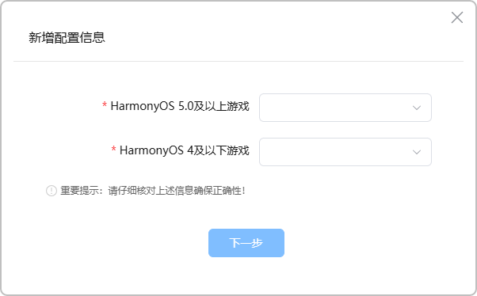
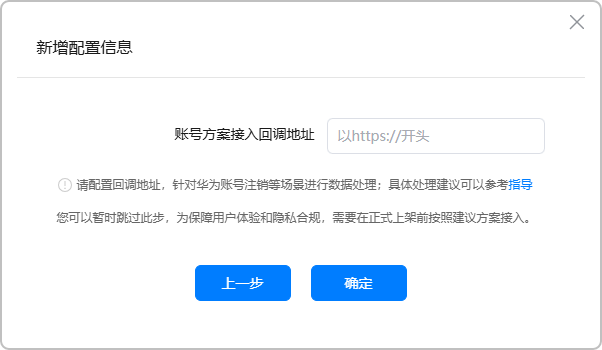
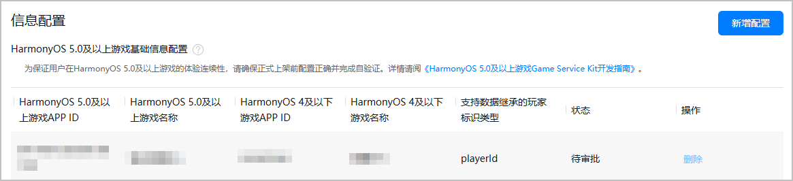
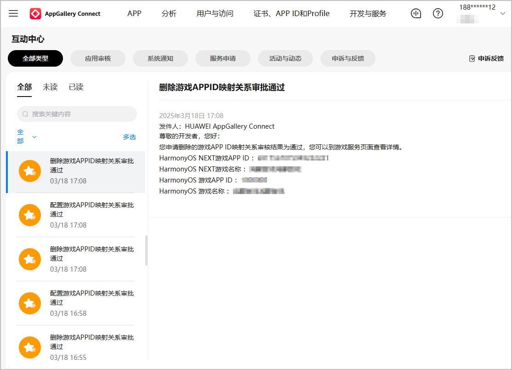

# 开发准备

更新时间：2026-04-30 02:41:24

来源：https://developer.huawei.com/consumer/cn/doc/harmonyos-guides/gameservice-gameplayer-minigame-preparation

##### 创建小游戏

在华为应用市场发布小游戏，要求前往AppGallery Connect创建小游戏类元服务，具体操作请参见[创建小游戏](https://developer.huawei.com/consumer/cn/doc/app/agc-help-create-minigame-0000002434138360)。其中：
 
- “应用类型”：选择“元服务”。
- “应用分类”：选择“小游戏”。

 
> [!NOTE]
> 用于正式上架的游戏包名建议不要包含test、dev等信息。

 
  

##### 申请版署实名认证

按照版署《关于开展网络游戏防沉迷实名认证系统接口对接工作的通知》，各游戏出版运营企业均要求在2021年6月1日前完成接入[网络游戏防沉迷实名认证系统](https://wlc.nppa.gov.cn/fcm_company/index.html#/login?redirect=/)，并获取“bizID（游戏备案识别码）”，再将bizID配置到AppGallery Connect，华为将为游戏自动对接国家新闻出版署的实名认证系统并开启强制实名认证，开发者无需进行额外的开发。具体操作请参见[版署实名认证申请](https://developer.huawei.com/consumer/cn/doc/games-guides/game-center-identification-applyfor-0000002392353221)。
 
  

##### 申请备案

请参考[APP核准（APP备案）指引](https://developer.huawei.com/consumer/cn/doc/App/50130)、[快游戏核准（备案）指南](https://developer.huawei.com/consumer/cn/doc/quickApp-Guides/quickgame-filing-guide-0000001806139508)和[国产游戏小程序核准（备案）准备](https://developer.huawei.com/consumer/cn/doc/games-guides/quickgame-filing-chinese-preparation-0000001979934858)完成小游戏备案，并保存好备案信息。
 
  

##### 申请JSVM权限和存储空间管理开放能力

小游戏上架必须申请JSVM权限和存储空间管理开放能力，具体操作请参见[申请ACL权限和开放能力](https://developer.huawei.com/consumer/cn/doc/app/agc-help-release-minigame-acl-and-ability-0000002425276004)。
 
  

##### 生成签名证书

数字证书和Profile文件等签名信息可以确保小游戏的完整性：
 
- 调试阶段：[手动签名](https://developer.huawei.com/consumer/cn/doc/harmonyos-guides/ide-signing#section297715173233)、[申请调试证书](https://developer.huawei.com/consumer/cn/doc/app/agc-help-debug-cert-0000002283256797)、[申请调试Profile](https://developer.huawei.com/consumer/cn/doc/app/agc-help-debug-profile-0000002248181278)。
- 发布阶段：[手动签名](https://developer.huawei.com/consumer/cn/doc/harmonyos-guides/ide-signing#section297715173233)、[申请发布证书](https://developer.huawei.com/consumer/cn/doc/app/agc-help-release-cert-0000002283336729)、[申请发布Profile](https://developer.huawei.com/consumer/cn/doc/app/agc-help-release-profile-0000002248341090)。

 
  

##### 配置签名证书指纹

AppGallery Connect会自动生成证书对应的公钥信息，并计算出对应的SHA256指纹。开发者前往AppGallery Connect获取并配置SHA256指纹，且每个游戏至多添加4个签名证书指纹，配置签名证书指纹的具体操作请参见[配置公钥指纹](https://developer.huawei.com/consumer/cn/doc/app/agc-help-cert-fingerprint-0000002278002933)。
 
> [!NOTE]
> 请在调试阶段添加调试证书对应的指纹，在发布阶段添加发布证书对应的指纹。

 
  

##### 配置APP ID、Client ID和权限信息
1. 登录[AppGallery Connect](https://developer.huawei.com/consumer/cn/service/josp/agc/index.html)，在“开发与服务”下选择项目及项目下的小游戏，获取“应用”下的APP ID和Client ID。

  


2. 在工程的entry模块module.json5文件中，新增metadata并配置client_id和app_id，同时新增requestPermissions以配置ACL权限和开放能力。如下所示：

  
```text
"module": {
  "name": "entry",
  "type": "xxx",
  "description": "xxxx",
  "mainElement": "xxxx",
  "deviceTypes": [],
  "pages": "xxxx",
  "abilities": [],
  "metadata": [ // 配置如下信息
    {
      "name": "client_id",
      "value": "xxxxxx" // 配置为前面步骤中获取的Client ID
    },
    {
      "name": "app_id",
      "value": "xxxxxx" // 配置为前面步骤中获取的APP ID
    }
  ],
  "requestPermissions": [ // 配置JSVM权限和存储空间管理开放能力
    {
      "name": "ohos.permission.kernel.ALLOW_EXECUTABLE_FORT_MEMORY"
    },
    {
      "name": "ohos.permission.atomicService.MANAGE_STORAGE"
    }
  ]
}
```

 
  

##### 配置APP ID映射关系
1. 登录[AppGallery Connect](https://developer.huawei.com/consumer/cn/service/josp/agc/index.html)，在“开发与服务”下选择项目及项目下的小游戏，左侧菜单选择“构建 > 游戏服务”，在右侧点击“新增配置”。

  


2. 在弹出的“新增配置信息”窗口中填写信息，完成后点击“下一步”。

  
> [!NOTE]
> 请正确配置HAP小游戏与RPK快游戏的映射关系。若开发者配置错误类型的游戏，将会提示重新选择游戏。


  



| 信息项 | 说明 |

| --- | --- |

| HarmonyOS 5.0及以上游戏 | 请选择待上架的HAP小游戏。 |

| HarmonyOS 4及以下游戏 | 请选择已上架或草稿态的RPK快游戏。 |
3. （可选）填写开发者服务器的回调地址，完成后点击“确定”提交APP ID映射关系的审批申请。

  


4. 若出现异常情况（例如在架状态不符合要求），将在提示框以红字提醒，建议点击“取消”并重新配置映射关系。若忽略异常情况点击“确定”继续提交申请，可能会造成映射关系审批不通过。

  


5. 提交申请后，华为工作人员完成审核需要1-3个工作日，请耐心等待。APP ID映射关系生效后如需重新配置，请先提交映射关系的删除申请。

  


  配置/删除APP ID映射关系的审核结果将通过互动中心或邮件进行通知。

  

