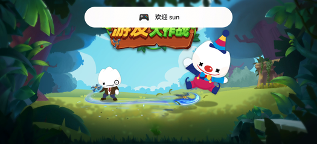
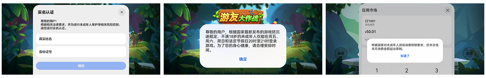
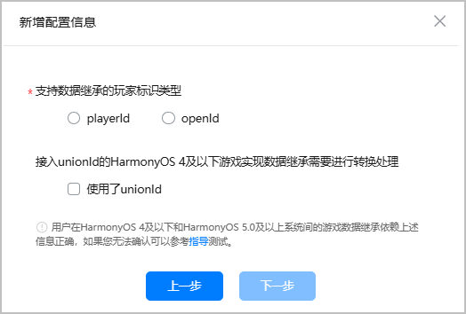
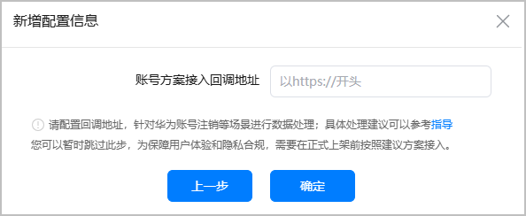
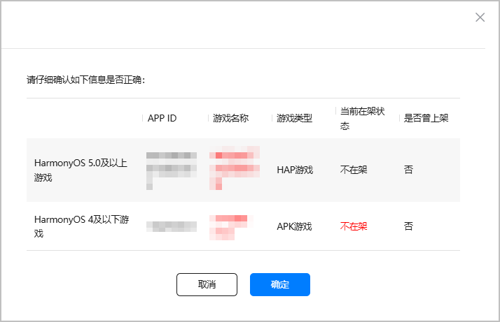
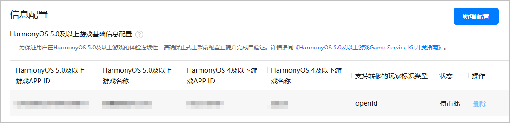
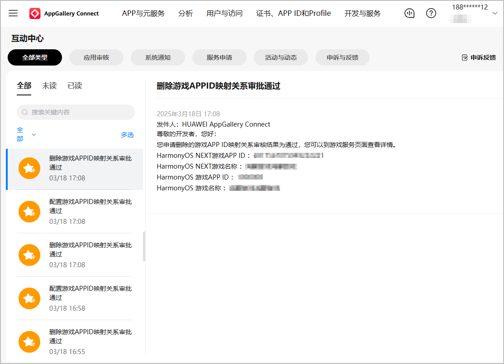
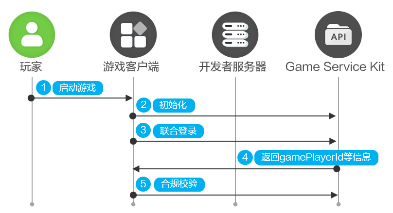
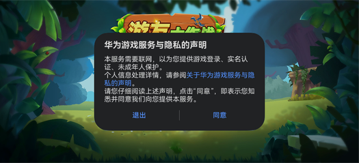

# 单机游戏登录

更新时间：2026-04-20 06:34:33

来源：https://developer.huawei.com/consumer/cn/doc/harmonyos-guides/gameservice-single-access

单机游戏是指数据本地化存储，不依赖服务器的游戏。

单机游戏接入基础游戏服务后，支持玩家使用华为账号快速进入游戏，且单机游戏的华为账号实名认证、未成年人防沉迷功能由基础游戏服务实现。


##### 开发准备


##### 创建游戏

在华为应用市场发布游戏，要求前往AppGallery Connect创建游戏类应用，具体操作请参见[创建HarmonyOS应用](https://developer.huawei.com/consumer/cn/doc/app/agc-help-create-app-0000002247955506)。其中：

 - “应用类型”：选择“HarmonyOS应用”。
 - “应用分类”：选择“游戏”。


> [!NOTE]
> 用于正式上架的游戏包名建议不要包含test、dev等信息。


##### 申请版署实名认证

按照版署《关于开展网络游戏防沉迷实名认证系统接口对接工作的通知》，各游戏出版运营企业均要求在2021年6月1日前完成接入[网络游戏防沉迷实名认证系统](https://wlc.nppa.gov.cn/fcm_company/index.html#/login?redirect=/)，并获取“bizID（游戏备案识别码）”，再将bizID配置到AppGallery Connect，华为将为游戏自动对接国家新闻出版署的实名认证系统并开启强制实名认证，开发者无需进行额外的开发。具体操作请参见[版署实名认证申请](https://developer.huawei.com/consumer/cn/doc/games-guides/game-center-identification-applyfor-0000002392353221)。


##### 生成签名证书

数字证书和Profile文件等签名信息可以确保游戏的完整性：

 - 调试阶段：[手动签名](https://developer.huawei.com/consumer/cn/doc/harmonyos-guides/ide-signing#section297715173233)、[申请调试证书](https://developer.huawei.com/consumer/cn/doc/app/agc-help-debug-cert-0000002283256797)、[申请调试Profile](https://developer.huawei.com/consumer/cn/doc/app/agc-help-debug-profile-0000002248181278)。
 - 发布阶段：[手动签名](https://developer.huawei.com/consumer/cn/doc/harmonyos-guides/ide-signing#section297715173233)、[申请发布证书](https://developer.huawei.com/consumer/cn/doc/app/agc-help-release-cert-0000002283336729)、[申请发布Profile](https://developer.huawei.com/consumer/cn/doc/app/agc-help-release-profile-0000002248341090)。


##### 配置签名证书指纹

AppGallery Connect会自动生成证书对应的公钥信息，并计算出对应的SHA256指纹。开发者前往AppGallery Connect获取并配置SHA256指纹，且每个游戏至多添加4个签名证书指纹，配置签名证书指纹的具体操作请参见[配置公钥指纹](https://developer.huawei.com/consumer/cn/doc/app/agc-help-cert-fingerprint-0000002278002933)。

> [!NOTE]
> 请在调试阶段添加调试证书对应的指纹，在发布阶段添加发布证书对应的指纹。


##### 配置APP ID和Client ID
1. 登录[AppGallery Connect](https://developer.huawei.com/consumer/cn/service/josp/agc/index.html)，在“开发与服务”下选择项目及项目下的游戏，获取“应用”下的APP ID和Client ID。

  


2. 在工程的entry模块module.json5文件中，新增metadata并配置client_id和app_id，同时新增requestPermissions以配置网络权限。如下所示：

  
```text
"module": {
  "name": "entry",
  "type": "xxx",
  "description": "xxxx",
  "mainElement": "xxxx",
  "deviceTypes": [],
  "pages": "xxxx",
  "abilities": [],
  "metadata": [ // 配置如下信息
    {
      "name": "client_id",
      "value": "xxxxxx" // 配置为前面步骤中获取的Client ID
    },
    {
      "name": "app_id",
      "value": "xxxxxx" // 配置为前面步骤中获取的APP ID
    }
  ],
  "requestPermissions": [ // 配置网络权限
    {
      "name": "ohos.permission.INTERNET"
    }
  ]
}
```


##### 配置APP ID映射关系
1. 登录[AppGallery Connect](https://developer.huawei.com/consumer/cn/service/josp/agc/index.html)，在“开发与服务”下选择项目及项目下的游戏，左侧菜单选择“构建 > 游戏服务”，在右侧点击“新增配置”。

  


2. 在弹出的“新增配置信息”窗口中选择HAP游戏和APK游戏，完成后点击“下一步”。

  
> [!NOTE]
> 请正确配置HAP游戏与APK游戏的映射关系。若开发者配置错误类型的游戏，将有提示框提示重新选择游戏。


  



| 信息项 | 说明 |

| --- | --- |

| HarmonyOS 5.0及以上游戏 | 请选择待上架的HAP游戏。 |

| HarmonyOS 4及以下游戏 | 请选择已上架或待上架的APK游戏。 |
3. 在弹出的窗口中继续填写信息，完成后点击“下一步”。

  


4. （可选）填写开发者服务器的回调地址，完成后点击“确定”提交APP ID映射关系的审批申请。

  


5. 若出现异常情况（例如在架状态不符合要求），将在提示框以红字提醒，建议点击“取消”并重新配置映射关系。若忽略异常情况点击“确定”继续提交申请，可能会造成映射关系审批不通过。

  


6. 提交申请后，华为工作人员完成审核需要1-3个工作日，请耐心等待。

  APP ID映射关系生效后如需重新配置，请先提交映射关系的删除申请。

  



  配置/删除APP ID映射关系的审核结果将通过互动中心或邮件进行通知。

  



##### 业务流程




1. 玩家启动游戏。
2. 游戏调用[init](https://developer.huawei.com/consumer/cn/doc/harmonyos-references/gameservice-gameplayer#gameplayerinit-1)接口初始化Game Service Kit。初始化后，弹出华为隐私协议窗口，玩家确认同意后，则继续往下执行。
3. 游戏调用[unionLogin](https://developer.huawei.com/consumer/cn/doc/harmonyos-references/gameservice-gameplayer#gameplayerunionlogin)接口，要求showLoginDialog参数为false，thirdAccountInfos参数传空数组。
4. 游戏顶部弹出欢迎横幅，并向游戏返回accountName（使用华为账号登录返回值为hw_account）、accountIdentifier（选择华为账号登录返回值为hw_account）、gamePlayerId等信息。
5. 调用[verifyLocalPlayer](https://developer.huawei.com/consumer/cn/doc/harmonyos-references/gameservice-gameplayer#gameplayerverifylocalplayer)接口，对用户设备登录的华为账号进行如下合规校验。合规校验通过后，玩家进入游戏。

  
 - 若玩家未完成实名认证，[verifyLocalPlayer](https://developer.huawei.com/consumer/cn/doc/harmonyos-references/gameservice-gameplayer#gameplayerverifylocalplayer)接口自动弹出实名认证窗口要求玩家进行实名认证。

6. 若玩家账号实名认证为未成年人，[verifyLocalPlayer](https://developer.huawei.com/consumer/cn/doc/harmonyos-references/gameservice-gameplayer#gameplayerverifylocalplayer)接口将自动检测未成年人的游戏时间。若玩家不在指定时间内登录游戏，将强制玩家退出游戏并返回[1002000006](https://developer.huawei.com/consumer/cn/doc/harmonyos-references/gameservice-error-code#section1002000006-玩家未成年并且当前不在可游戏时间)错误码。


##### 接口说明

具体API说明请详见[接口文档](https://developer.huawei.com/consumer/cn/doc/harmonyos-references/gameservice-gameplayer)。

| 接口名 | 描述 |
| --- | --- |
| init(context: common.UIAbilityContext, callback: AsyncCallback&lt;void&gt;): void | 游戏初始化接口，使用默认的上下文信息，使用callback回调。 |
| unionLogin(context: common.UIAbilityContext, loginParam: UnionLoginParam): Promise&lt;UnionLoginResult&gt; | 登录接口，通过Promise对象获取返回值。 |
| verifyLocalPlayer(context: common.UIAbilityContext, thirdUserInfo: ThirdUserInfo): Promise&lt;void&gt; | 合规校验接口，校验当前设备登录的华为账号的实名认证、游戏防沉迷信息，通过Promise对象获取返回值。 |


##### 开发步骤


##### 导入模块

导入Game Service Kit模块及相关公共模块。

```text
import { gamePlayer } from '@kit.GameServiceKit';
import { common } from '@kit.AbilityKit';
import { hilog } from '@kit.PerformanceAnalysisKit';
import { BusinessError } from '@kit.BasicServicesKit';
import { window } from '@kit.ArkUI';
```


##### 初始化

调用[init](https://developer.huawei.com/consumer/cn/doc/harmonyos-references/gameservice-gameplayer#gameplayerinit-1)接口初始化Game Service Kit。

> [!NOTE]
> 调用接口时严格要求继承UIAbility，并且获取上下文的时机是onWindowStageCreate生命周期中页面加载成功后。 要求游戏先成功调用初始化 init 接口后再调用其他接口，否则将导致审核被驳回。


```text
onWindowStageCreate(windowStage: window.WindowStage) {
  windowStage.loadContent("pages/index", (err, data) => {
    try {
      gamePlayer.init(this.context,()=>{
        hilog.info(0x0000, 'testTag', `Succeeded in initializing.`);
      });
    } catch (error) {
      let err = error as BusinessError;
      hilog.error(0x0000, 'testTag', `Failed to init. Code: ${err.code}, message: ${err.message}`);
    }
  });
}
```

初始化后，游戏弹出华为隐私协议窗口，用户同意签署协议，则继续往下执行。


若当前华为账号同意过游戏服务隐私协议，后续使用该华为账号登录的游戏将不会再弹出隐私协议窗口。


##### 登录游戏

调用[unionLogin](https://developer.huawei.com/consumer/cn/doc/harmonyos-references/gameservice-gameplayer#gameplayerunionlogin)接口登录游戏。

```text
let context = this.getUIContext()?.getHostContext() as common.UIAbilityContext;
let request: gamePlayer.UnionLoginParam = {
  showLoginDialog: false, // 是否弹出联合登录面板。true表示强制弹出面板，false表示优先使用玩家上一次的登录选择，不弹出联合登录面板，若玩家首次登录或卸载重装，则正常弹出
  thirdAccountInfos: [] // 单机游戏请传空数组
};
try {
  gamePlayer.unionLogin(context, request).then((result: gamePlayer.UnionLoginResult) => {
    hilog.info(0x0000, 'testTag', `Succeeded in logging in: ${result?.accountName}`);
  }).catch((error: BusinessError) => {
    hilog.error(0x0000, 'testTag', `Failed to login. Code: ${error.code}, message: ${error.message}`);
  });
} catch (error) {
  let err = error as BusinessError;
  hilog.error(0x0000, 'testTag', `Failed to login. Code: ${err.code}, message: ${err.message}`);
}
```

用户完成登录流程后，游戏顶部弹出欢迎横幅，并向游戏返回accountName（华为账号登录返回值为hw_account）、gamePlayerId等信息。


##### 合规校验

调用[verifyLocalPlayer](https://developer.huawei.com/consumer/cn/doc/harmonyos-references/gameservice-gameplayer#gameplayerverifylocalplayer)接口对用户设备登录华为账号的实名认证和未成年人防沉迷进行合规校验，校验通过后，玩家进入游戏。

```text
let context = this.getUIContext()?.getHostContext() as common.UIAbilityContext;
let request: gamePlayer.ThirdUserInfo = {
  thirdOpenId: '' // 单机游戏传空
};
try {
  gamePlayer.verifyLocalPlayer(context, request).then(() => {
    hilog.info(0x0000, 'testTag', `Succeeded in verifying.`);
  }).catch((error: BusinessError) => {
    hilog.error(0x0000, 'testTag', `Failed to verify. Code: ${error.code}, message: ${error.message}`);
  });
} catch (error) {
  let err = error as BusinessError;
  hilog.error(0x0000, 'testTag', `Failed to verify. Code: ${err.code}, message: ${err.message}`);
}
```

华为账号的实名认证、未成年人防沉迷由基础游戏服务实现，华为账号的支付合规控制（例如未成年人支付限额）由IAP Kit（应用内支付服务）实现。

| 合规校验 | 校验项 | 国家政策 | 解决方案 |
| --- | --- | --- | --- |
| 华为账号实名认证 | 校验用户设备登录的华为账号是否已实名认证。 | 根据相关法律法规要求，所有网络游戏玩家必须使用真实有效身份信息注册并登录网络游戏。 | 若玩家使用未实名认证的华为账号登录游戏时，基础游戏服务向玩家弹出实名认证窗口，要求玩家进行实名认证。若玩家取消实名认证，则返回1002000004错误码。 |
| 未成年人防沉迷 | 校验已实名认证为未成年人的华为账号是否在规定时间内登录游戏。 | 根据国家新闻出版署的最新规定，所有网络游戏企业仅可在周五、周六、周日和法定节假日每日20时至21时向未成年人提供1小时网络游戏服务，其他时间均不得以任何形式向未成年人提供网络游戏服务。 | - 已实名认证为未成年人的华为账号在规定时间内登录游戏，当游戏进行到晚上21时，基础游戏服务会弹窗提示玩家已到游戏时间，强制玩家退出游戏并返回1002000006错误码。 - 已实名认证为未成年人的华为账号在非规定游戏时间内登录游戏，基础游戏服务会弹框提示玩家不允许游戏，强制玩家退出游戏并返回1002000006错误码。 |
| 未成年人支付限额 | 校验已实名认证为未成年人的华为账号是否限额付费。 | 根据国家新闻出版署的最新规定，网络游戏企业不得为未满8周岁的用户提供游戏付费服务。同一网络游戏企业所提供的游戏付费服务，8周岁以上未满16周岁的用户，单次充值金额不得超过50元人民币，每月充值金额累计不得超过200元人民币；16周岁以上未满18周岁的用户，单次充值金额不得超过100元人民币，每月充值金额累计不得超过400元人民币。 | 已实名认证为未成年人的华为账号在游戏内超额付费，IAP Kit会弹窗提示消费金额超出限制。 用户在使用华为应用内支付时，华为会自动根据国家新闻出版署的要求进行支付限额控制，开发者无需处理。 |


