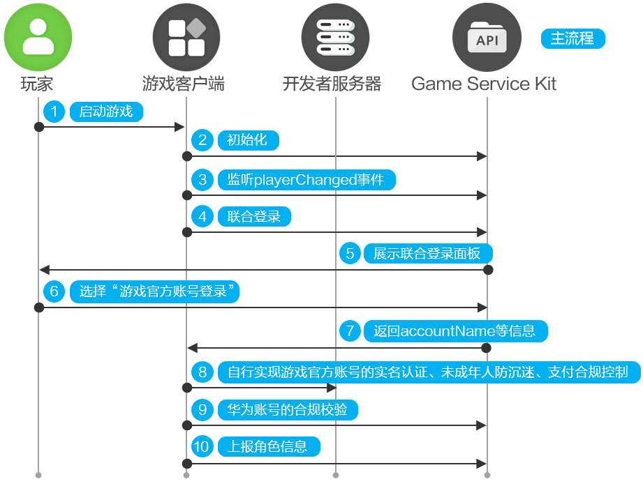
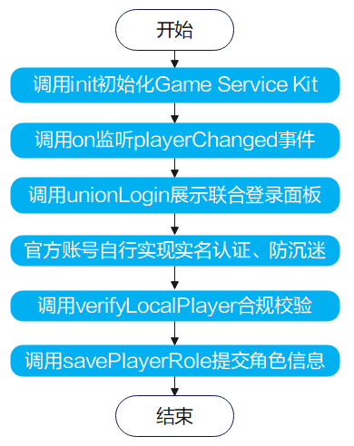
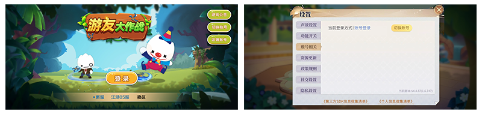

# 使用游戏官方账号登录

更新时间：2026-04-20 06:34:33

来源：https://developer.huawei.com/consumer/cn/doc/harmonyos-guides/gameservice-gameplayer-official

为了支持用户在HarmonyOS 5.0及以上系统上继承其他系统（例如HarmonyOS 4及以下）的官包进度继续游玩，基础游戏服务支持用户使用游戏官方账号登录HarmonyOS 5.0及以上游戏。

## 接入策略

若游戏有官包且有官方账号体系，游戏要求接入游戏官方账号登录。

## 业务流程

玩家启动游戏。 游戏调用[init](https://developer.huawei.com/consumer/cn/doc/harmonyos-references/gameservice-gameplayer#gameplayerinit-1)接口初始化Game Service Kit。初始化后，弹出华为隐私协议窗口，玩家确认同意后，则继续往下执行。 游戏调用[on](https://developer.huawei.com/consumer/cn/doc/harmonyos-references/gameservice-gameplayer#gameplayeronplayerchanged)接口注册事件监听。若监听到playerChanged事件，先清除本地缓存信息，再重新执行unionLogin登录逻辑。 游戏调用[unionLogin](https://developer.huawei.com/consumer/cn/doc/harmonyos-references/gameservice-gameplayer#gameplayerunionlogin)接口。
> [!NOTE]
> 建议使用session缓存登录状态，玩家下次登录进入游戏无需再调用unionLogin接口，但仍需调用verifyLocalPlayer接口。

向玩家展示联合登录面板。 玩家选择“游戏官方账号登录”。 游戏获取到accountName等信息。 游戏开发者要求自行实现官方账号的实名认证、未成年人防沉迷、支付合规控制。 游戏调用[verifyLocalPlayer](https://developer.huawei.com/consumer/cn/doc/harmonyos-references/gameservice-gameplayer#gameplayerverifylocalplayer)接口，实现华为账号的实名认证、未成年人防沉迷功能。游戏官方账号和华为账号均通过合规校验，玩家才能进入游戏。若有一方未通过校验，不允许玩家进入游戏。若校验未通过请根据返回的[错误码](https://developer.huawei.com/consumer/cn/doc/harmonyos-references/gameservice-error-code)进行相应处理。 若玩家在游戏内创建角色，建议游戏调用[savePlayerRole](https://developer.huawei.com/consumer/cn/doc/harmonyos-references/gameservice-gameplayer#gameplayersaveplayerrole)上报角色信息。
> [!NOTE]
> 若游戏无区服角色，或限制为1个区服角色，此时，建议游戏允许玩家直接进入游戏，而无需玩家点击“进入游戏”或者选择区服角色才能进入游戏。

## 接口说明

具体API说明请详见[接口文档](https://developer.huawei.com/consumer/cn/doc/harmonyos-references/gameservice-gameplayer)。
| 接口名 | 描述 |
| --- | --- |
| [init](https://developer.huawei.com/consumer/cn/doc/harmonyos-references/gameservice-gameplayer#gameplayerinit-1)(context: common.UIAbilityContext, callback: AsyncCallback): void | 游戏初始化接口，使用默认的上下文信息，使用callback回调。 |
| [on](https://developer.huawei.com/consumer/cn/doc/harmonyos-references/gameservice-gameplayer#gameplayeronplayerchanged)(type: 'playerChanged', callback: Callback): void | 玩家变化事件监听接口，通过Callback回调获取玩家变化结果信息。 |
| [unionLogin](https://developer.huawei.com/consumer/cn/doc/harmonyos-references/gameservice-gameplayer#gameplayerunionlogin)(context: common.UIAbilityContext, loginParam: UnionLoginParam): Promise | 华为账号和游戏官方账号联合登录接口，通过Promise对象获取返回值。 |
| [verifyLocalPlayer](https://developer.huawei.com/consumer/cn/doc/harmonyos-references/gameservice-gameplayer#gameplayerverifylocalplayer)(context: common.UIAbilityContext, thirdUserInfo: ThirdUserInfo): Promise | 合规校验接口，校验当前设备登录的华为账号的实名认证、游戏防沉迷信息，通过Promise对象获取返回值。 |
| [savePlayerRole](https://developer.huawei.com/consumer/cn/doc/harmonyos-references/gameservice-gameplayer#gameplayersaveplayerrole)(context: common.UIAbilityContext, request: GSKPlayerRole): Promise | 保存角色信息到华为游戏服务器，使用默认的上下文信息，通过Promise对象获取返回值。 |

## 开发步骤

请先参考华为账号登录的[开发准备](https://developer.huawei.com/consumer/cn/doc/harmonyos-guides/gameservice-gameplayer-huawei#开发准备)和[开发步骤](https://developer.huawei.com/consumer/cn/doc/harmonyos-guides/gameservice-gameplayer-huawei#开发步骤)完成华为账号登录的接入，再继续接入游戏官方账号登录。

## 接口调用流程图

接入游戏官方账号登录的接口调用流程如下：

## 合规校验

接入游戏官方账号登录时，要求游戏开发者自行实现游戏官方账号的实名认证、未成年人防沉迷、支付合规控制。
> [!NOTE]
> 用户使用游戏官方账号登录游戏时，设备上基础游戏服务也会基于设备上登录的华为账号实现实名认证、未成年人防沉迷，这属于HarmonyOS 5.0及以上设备的额外要求。使用游戏官方账号登录游戏时，开发者仍需要基于游戏官方账号实现实名认证、未成年人防沉迷、支付合规控制（例如基于官方账号年龄判断未成年人支付限额等）。 华为账号与游戏官方账号均通过合规校验，玩家才能进入游戏。若有一方未通过校验，不允许玩家进入游戏或成功完成支付。

## 游戏内切换账号

由于showLoginDialog设置为false，且玩家是非首次登录游戏时，默认沿用上次的登录账号，因此要求开发者在游戏页面上自行增加“切换账号”按钮，玩家点击按钮后强制弹出联合登录面板，允许玩家重新选择华为账号登录或游戏官方账号登录。 建议在游戏内为玩家提供一个“切换账号”按钮。按钮常见的位置如下：

玩家点击切换账号按钮时，开发者重新调用[unionLogin](https://developer.huawei.com/consumer/cn/doc/harmonyos-references/gameservice-gameplayer#gameplayerunionlogin)接口，将showLoginDialog参数设置为true，即可强制拉起联合登录面板，允许玩家重新选择华为账号登录或游戏官方账号登录。
