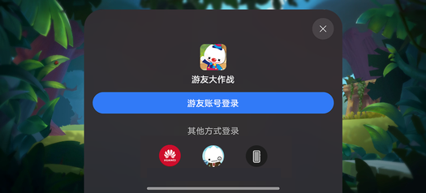
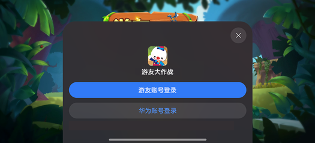

# 网络游戏登录概述

更新时间：2026-04-20 06:34:33

来源：https://developer.huawei.com/consumer/cn/doc/harmonyos-guides/gameservice-network-introduction

网络游戏是指需要联网的游戏。
 
接入基础游戏服务后，网络游戏支持用户在联合登录面板选择华为账号登录或游戏官方账号登录。
 

 

  

##### 网络游戏登录场景介绍

  

##### 使用华为账号登录

网络游戏必须接入华为账号登录。
 
接入后，华为平台会将HarmonyOS 4及以下游戏的玩家标识playerId/openId赋值给HarmonyOS 5.0及以上游戏的玩家标识gamePlayerId，为新老系统游戏的账号资产（角色、区服信息、游戏进度等）实现互通。互通前后，华为账号ID不会发生变化，也不涉及开发者服务器和数据库层面的变动。
 
使用华为账号登录的网络游戏，华为账号的实名认证、未成年人防沉迷由基础游戏服务实现，华为账号的支付合规控制（例如未成年人支付限额）由IAP Kit（应用内支付服务）实现。
 
  

##### 使用游戏官方账号登录

若游戏有官包且有官方账号体系，网络游戏还需要接入游戏官方账号登录，且游戏开发者需要正确实现HarmonyOS 5.0及以上系统游戏包与游戏官包之间账号资产的互通。
 
使用游戏官方账号登录的网络游戏，游戏官方账号的实名认证、未成年人防沉迷、支付合规控制需要游戏开发者自行实现。
 
> [!NOTE]
> 用户使用游戏官方账号登录游戏时，设备上基础游戏服务也会基于设备上登录的华为账号实现实名认证、未成年人防沉迷，这属于HarmonyOS 5.0及以上设备的额外要求。游戏官方账号登录游戏时，开发者仍需要基于游戏官方账号实现实名认证、未成年人防沉迷、支付合规控制。

 
  

##### 账号关系总览

 
  

##### 网络游戏用户体验

玩家侧的游戏登录体验。
 
  

##### 首次登录

首次启动游戏时，向用户展示联合登录面板。
 

 
- 点击游戏官方账号，弹出游戏官方账号的登录界面，用户正确输入账号后进入游戏。
- 点击华为账号，用户使用华为账号进入游戏，顶部展示欢迎横幅。

 
  

##### 非首次登录

用户非首次启动游戏时，游戏会沿用之前的登录账号。涉及切换账号再登录等特殊场景的接入方式请参见[游戏内切换账号](https://developer.huawei.com/consumer/cn/doc/harmonyos-guides/gameservice-gameplayer-official#游戏内切换账号)。
