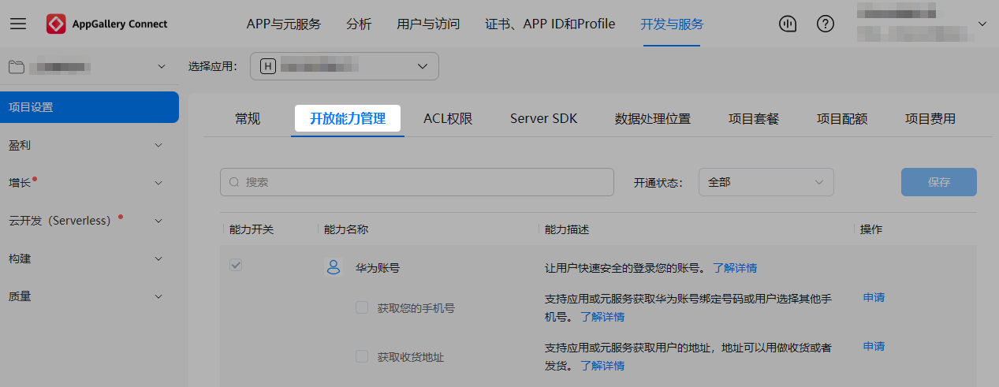
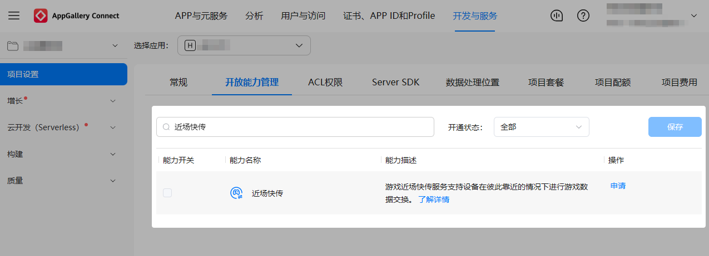
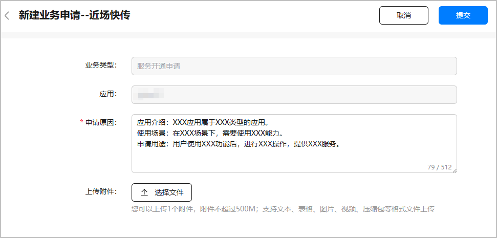
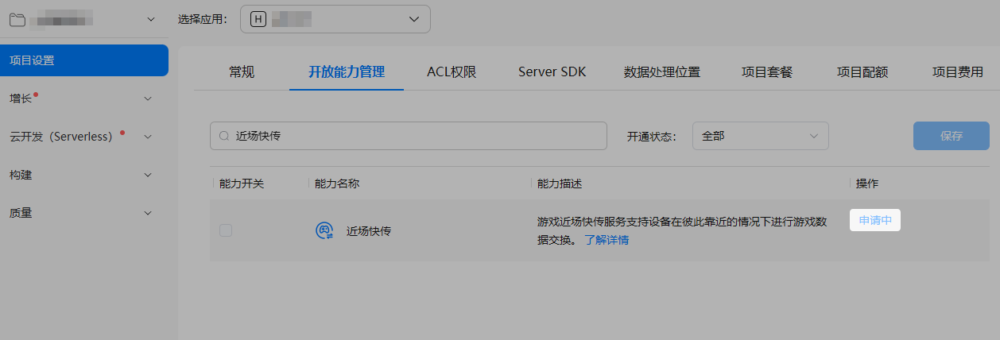
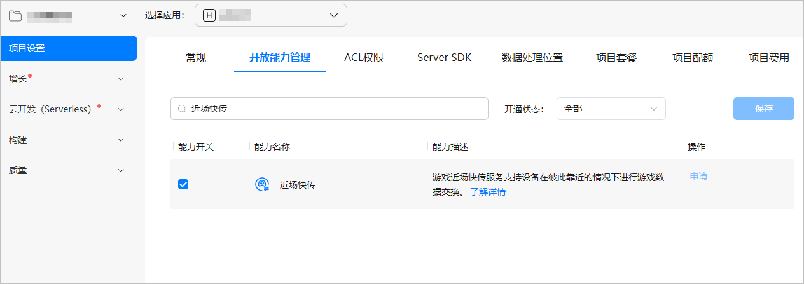
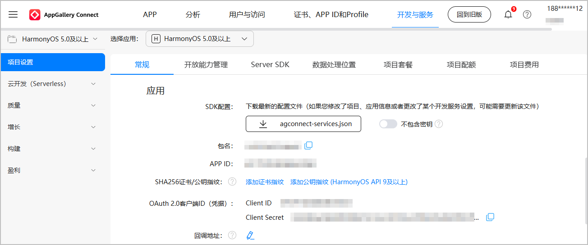

# 开发准备

更新时间：2026-04-28 03:31:56

来源：https://developer.huawei.com/consumer/cn/doc/harmonyos-guides/gameservice-nearbytransfer-config-agc

## 创建游戏

若在华为应用市场发布游戏，或使用AGC控制台提供的服务，需要前往AGC控制台创建游戏类应用，具体操作请参见[创建项目](https://developer.huawei.com/consumer/cn/doc/app/agc-help-create-project-0000002242804048)和[创建HarmonyOS应用](https://developer.huawei.com/consumer/cn/doc/app/agc-help-create-app-0000002247955506)。其中： “应用类型”：选择“HarmonyOS应用”。  “应用分类”：选择“游戏”。

## 申请近场快传开放能力

基于安全考虑，系统侧对近场快传功能做了权限保护处理，使用相关接口开发者需先提交“近场快传”能力开关的申请，在申请通过后，再使用该能力开关。 登录[AppGallery Connect](https://developer.huawei.com/consumer/cn/service/josp/agc/index.html#/)，点击“开发与服务”。在项目列表中找到项目，并点击选择需要申请权限的游戏。  在“项目设置”页面，选择“开放能力管理”页签，开始为游戏申请近场快传开放能力。

搜索“近场快传”，点击对应能力后面的“申请”，打开“新建业务申请”窗口。

在“新建业务申请”窗口填写申请信息，然后点击“提交”。

| 配置项 | 必填/选填 | 说明 |
| --- | --- | --- |
| 申请原因 | 必填 | 申请近场快传的原因，请按照模板填写相关信息，字数不超过512个字符。 |
| 上传附件 | 选填 | 仅可上传1个附件，大小不超过500MB。支持文本、表格、图片、视频、压缩包格式。 |

进入互动中心页面，可以看到申请已提交的消息。

返回“开放能力管理”页面，近场快传显示“申请中”，1-3个工作日反馈申请结果。

申请审批通过后，互动中心将会发送通知给您，同时近场快传的能力开关会为您自动开启，“申请中”也会变为置灰显示的“申请”。至此，游戏已成功开启近场快传开放能力。


## 生成签名证书

数字证书和Profile文件等签名信息可以确保游戏的完整性，请参见[配置签名信息](https://developer.huawei.com/consumer/cn/doc/harmonyos-guides/application-dev-overview#配置签名信息)完成配置。

## 配置APP ID和相关权限

登录[AppGallery Connect](https://developer.huawei.com/consumer/cn/service/josp/agc/index.html)平台，在“开发与服务”中选择目标应用，获取“项目设置 > 常规 > 应用”的**APP ID**。

在工程的entry模块module.json5文件中，新增metadata并配置app_id，同时新增requestPermissions并配置如下权限。
```text
"module": {
  "name": "entry",
  "type": "entry",
  "description": "xxxx",
  "mainElement": "xxxx",
  "deviceTypes": [
    "phone"
  ],
  "deliveryWithInstall": true,
  "pages": "$profile:main_pages",
  "abilities": [],
  "metadata": [ // 配置如下信息
    {
      "name": "app_id",
      "value": "xxxxxx" // 配置为前面步骤中获取的APP ID
    }
  ],
   "requestPermissions": [ // 配置权限
     {
       "name": "ohos.permission.INTERNET" // 允许使用Internet网络权限
     },
     {
       "name": "ohos.permission.GET_NETWORK_INFO"  // 允许应用获取数据网络信息权限
     },
     {
       "name": "ohos.permission.SET_NETWORK_INFO" // 允许应用配置数据网络权限
     },
     {
       "name": "ohos.permission.DISTRIBUTED_DATASYNC", // 允许不同设备间的数据交换权限
       "reason": "$string:distributed_permission",
       "usedScene": {
         "abilities": [
           "EntryAbility"
         ],
         "when": "inuse"
       }
     }
   ]
}
```
