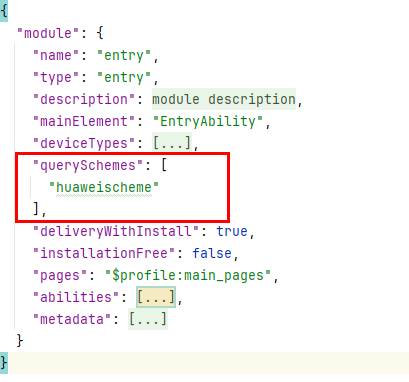

# 拉起运动健康App隐私授权

更新时间：2026-04-30 02:41:24

来源：https://developer.huawei.com/consumer/cn/doc/harmonyos-guides/health-privacy-authorization

#### 场景介绍

用户在设备上首次使用运动健康服务时，需要用户同意运动健康服务隐私协议，当前隐私授权依赖运动健康App，需引导用户打开运动健康App并完成隐私授权。

开发者调用后续章节的接口后，如果返回错误码[1002703001](https://developer.huawei.com/consumer/cn/doc/harmonyos-references/errorcode-healthservice#section1002703001-用户隐私未同意)，可参考本章节，引导用户同意运动健康服务隐私授权。


#### 开发步骤
1. 在module.json5文件中增加querySchemes字段，并在列表中配置"huaweischeme"。"huaweischeme"为需要跳转到的运动健康App首页的scheme，页面参考如下：

  


2. 导入相关功能模块。

  
```text
import { bundleManager, common, Want } from '@kit.AbilityKit';
import { BusinessError } from '@kit.BasicServicesKit';
import { productViewManager } from '@kit.AppGalleryKit';
import { hilog } from '@kit.PerformanceAnalysisKit';
```

3. 调用[canOpenLink](https://developer.huawei.com/consumer/cn/doc/harmonyos-references/js-apis-bundlemanager#bundlemanagercanopenlink12)判断运动健康App是否安装。

  
已安装则调用[openLink](https://developer.huawei.com/consumer/cn/doc/harmonyos-references/js-apis-inner-application-uiabilitycontext#openlink12)接口拉起运动健康App；
4. 未安装调用[应用市场推荐](https://developer.huawei.com/consumer/cn/doc/harmonyos-guides/appgallery-productview-loadproduct)接口，引导用户下载运动健康App。
