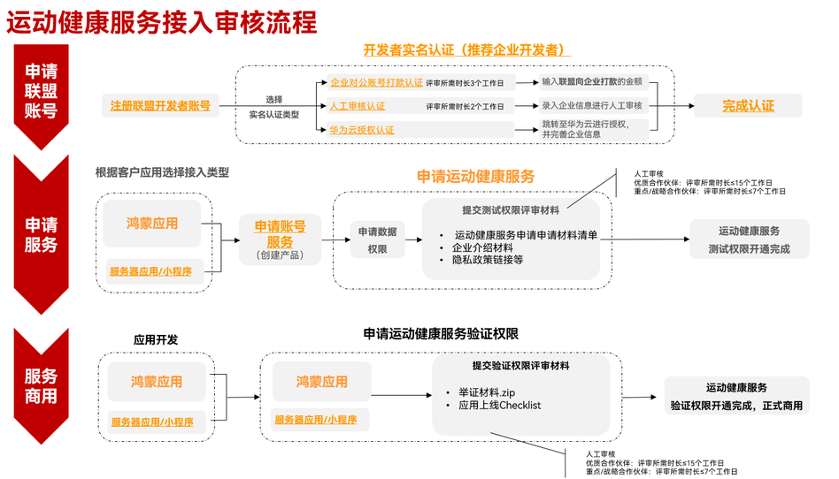

# 接入流程

更新时间：2026-04-20 06:34:33

来源：https://developer.huawei.com/consumer/cn/doc/harmonyos-guides/health-application-access

| 步骤 | 说明 |
| --- | --- |
| 开发准备 | 1. 参见[注册账号](https://developer.huawei.com/consumer/cn/doc/start/registration-and-verification-0000001053628148)和[实名认证](https://developer.huawei.com/consumer/cn/doc/start/itrna-0000001076878172)成为开发者并完成实名认证，同时需完成[HarmonyOS应用/元服务创建](https://developer.huawei.com/consumer/cn/doc/app/agc-help-createharmonyapp-0000001945392297)。 2. [申请运动健康服务](https://developer.huawei.com/consumer/cn/doc/harmonyos-guides/health-apply)：申请Health Service Kit服务，选择产品类型并开通对应数据的读写权限。      a.根据[应用开发者申请资质说明](https://developer.huawei.com/consumer/cn/doc/harmonyos-guides/health-application-qualifications)进行自评。满足各项要求后，进行权限申请。    b.根据您的数据使用场景选择权限，并按[申请运动健康服务](https://developer.huawei.com/consumer/cn/doc/harmonyos-guides/health-apply)指引，提供申请资料和企业介绍。预计15个工作日完成权限审批。 |
| 应用开发 | 根据需求完成应用开发。 |
| 申请验证 | 开发测试工作完成后，提交验证申请。按照[申请验证](https://developer.huawei.com/consumer/cn/doc/harmonyos-guides/health-verification)提供相关佐证视频和自检CheckList。平台收到申请后，将15个工作日内完成验收并开通验证权限。至此，您的应用可正式大规模商用。 |

> [!NOTE]
> 开发者可实名认证为个人开发者或者企业开发者，认证前，请先了解二者的权益区别。  提交运动健康服务测试权限申请前，请先查阅开发者申请资质说明和申请被驳回的常见问题。  运动健康服务测试阶段有100位用户数量的限制，申请验证并通过后将解除该限制。  开发者等级（是否为优质/重点/战略合作伙伴）将根据实际项目合作情况而定。
