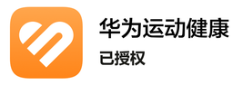
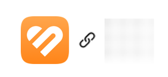
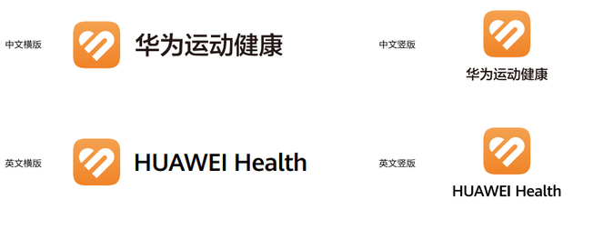
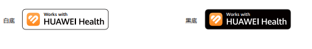
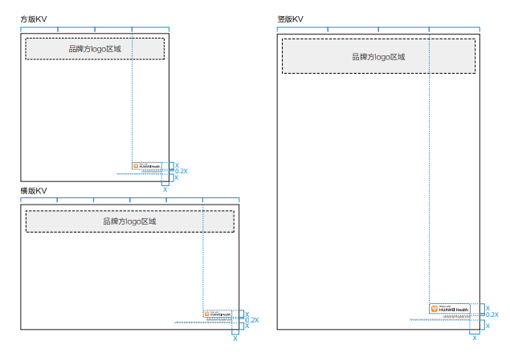
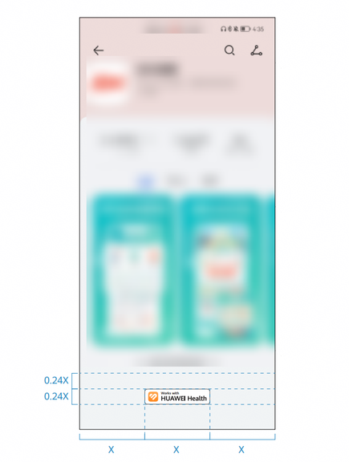
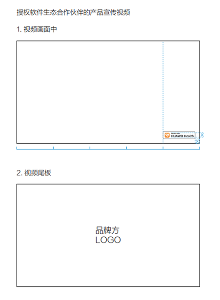
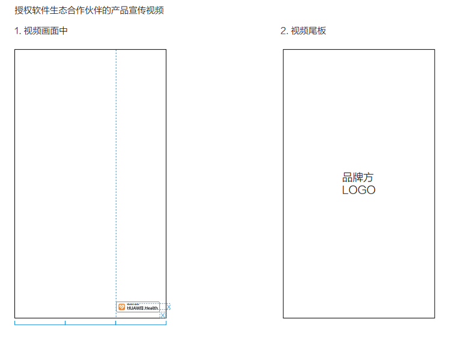

# 标志使用规范

更新时间：2026-04-20 06:34:33

来源：https://developer.huawei.com/consumer/cn/doc/harmonyos-guides/health-logo-usage-regulations

开发者应用在面向用户呈现华为运动健康品牌图标时，需要遵循《[HUAWEI Health授权使用规范](https://hihealthbase-drcn.things.hicloud.com/healthkit/fileServer/getFile/private/HuaweiHealthLicenseUsageGuidelines/000/001/044/0000100000000001044.20240417160150.64977181324752114137620022856507:20740405160241:100005355:DBEDC693E5482E439BFCDF5A73D1B74F41B5BEABF7F62F4AA2807330B8335543.pdf)》，图标样式请点击[资源下载](https://hihealthbase-drcn.things.hicloud.com/healthkit/fileServer/getFile/private/huaweiLogo/000/001/044/1000000000000001044.20231121144534.39714294158320889793671141568467:20731108144750:100005355:F16C5DE4AF6D9AC89675DAD1BB4D12821B5BCC039AFCADFF9ECEA7852757F9AA.zip)获取。
  

##### 标志说明

标志以“心形”为主要图形元素，并结合了运动跑道元素，凸显了运动健康品牌的专属性和识别性，品牌色用橙色来体现运动的活力。
 
 

 
  

##### 标志使用

  

##### 仅使用图标

单图标可用于授权入口、授权连接详情页面等场景，用于向用户展示数据来源。
 
- 在授权入口展示数据来源、授权状态信息等。

  

- 授权连接详情页面，展示应用连接情况。

  

 
  

##### 使用HUAWEI Health标志

包括英文和中文标志，且有横版和竖版两种版式，需要满足《[HUAWEI Health授权使用规范](https://hihealthbase-drcn.things.hicloud.com/healthkit/fileServer/getFile/private/HuaweiHealthLicenseUsageGuidelines/000/001/044/0000100000000001044.20240417151926.42901802932267224964253317308041:20740405152107:100005355:87328F4DFA033BC9DD8B6A03A0E9EB60C11ABA7EF92169AC42A4C205D3EA7514.pdf)》中横版和竖版网格正确比例的要求。
 

 
  

##### 仅使用文本

如开发者应用仅通过文本向用户展示数据来源时，请使用华为运动健康或HUAWEI Health。
 
  

##### 使用Work with HUAWEI Health徽章标志（以下简称：Health徽章）

**1.Health 徽章使用原则**
 
除联合品牌使用HUAWEI Health标志外，仅华为运动健康授权的软件生态合作伙伴可以使用Health徽章。
 

 
**2.Health 徽章使用场景及示例**
 
- Health徽章在已授权的软件生态合作伙伴产品KV中的使用规范

  **核心原则**

  
在已授权的软件生态合作伙伴的产品KV中，商标露出须主次分明，Health徽章位于画面次要位置，置于KV画面右下角，免责声明文字上方；
- KV中首选HUAWEI Health白底徽章。

  
**Health 徽章使用原则**
  
- 在方版或者竖版KV中，徽章的高度大小以KV的宽为准，徽章的宽度不超过KV宽度的1/4，取徽章的高度为X，徽章及免责声明距离画面右侧及底部均为X。
- 在横版KV中，徽章的高度大小以KV的宽为准，徽章的宽度不超过KV宽度的1/6，取徽章的高度为X，徽章及免责声明距离画面右侧及底部均为X。

  

  - Health徽章在已授权的软件生态合作伙伴App下载详情页的使用规范及示例

  **核心原则**

  当需要在App下载详情页面，提示用户下载的App支持连接华为运动健康数据功能时，Health徽章位于App简介图片下方，页面水平居中位置。

  **Health徽章大小比例规范**

  徽章的宽度为页面宽度的1/3，取徽章的宽度为X，徽章与上方信息内容的间距为0.24X，此间距可根据实际情况适配调整。

  

- Health徽章在已授权的合作伙伴产品宣传视频中的使用规范

  **核心原则**

  
**软件生态合作伙伴：**

  
在授权软件生态合作伙伴的产品宣传视频中，使用Health徽章，需置于视频画面右下角；
- 视频尾板仅显示且必须显示产品品牌方的Logo，禁止出现HUAWEI Health标志和徽章。
- 白色底/浅色底用白底徽章，黑色/深色底用黑底徽章。

  
 **图1** 横版样式参考
 
 

  
 **图2** 竖版样式参考
 
 

  - **硬件生态合作伙伴：**

  在已授权的硬件合作伙伴的产品宣传视频中，需要提示设备支持连接华为运动健康的功能时，使用文案方式书写为：**支持连接华为运动健康**。

  
 
> [!NOTE]
> 当您需要华为运动健康徽章使用授权，或对其使用场景有任何疑问，可邮件联系 hihealth@huawei.com 获取帮助。

 
  

##### 错误用法

HUAWEI Health标志的比例、颜色以及图形在任何情况下都不得改变。以下为常见错误用法示例。
 

