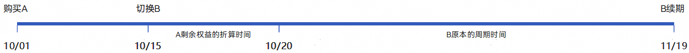
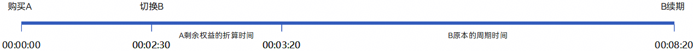

# 自动续期订阅商品，A切换B且立即生效时，新订阅有效期的组成

更新时间：2026-04-20 06:34:33

来源：https://developer.huawei.com/consumer/cn/doc/harmonyos-guides/iap-faq-23

订阅在发生切换且立即生效时，原订阅的剩余权益价值会自动按照比例，折算并叠加至新订阅。所以，切换后订阅有效期的组成 = 原订阅剩余权益的折算时间 + 新订阅原本的周期时间。
 
比如，某个用户首先购买了订阅A（普通会员，20元/30天），使用了15天后，切换成同订阅组下的订阅B（高级会员，60元/30天）。切换时，A订阅剩余权益自动按比例折算，折算至B订阅的时间为5天。则切换后，B订阅有效期的天数 = 5天 + 30天 = 35天。
 
时间轴（MM/dd）如下：
 

 
对于沙盒环境，按照生产1天 = 沙盒10s换算，等效时间轴（hh:mm:ss）如下：
 

