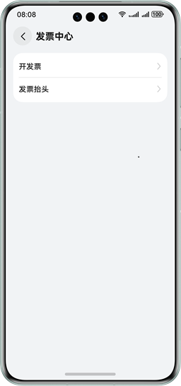
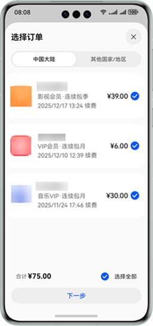
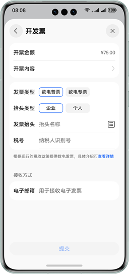
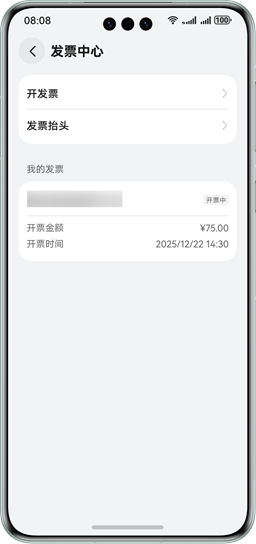

# 开票

更新时间：2026-04-20 06:34:33

来源：https://developer.huawei.com/consumer/cn/doc/harmonyos-guides/iap-invoicing

##### 用户申请开发票

从6.1.0（23）开始，支持开发票功能。若用户购买应用内数字商品后需要申请开发票，可选择需要申请开票的订单后根据页面指引，提交开发票信息。

用户可按照以下步骤：
1. 选择“手机设置 > 华为账号 > 付款与账单 > 发票中心”，点击“开发票”，在需要开发票的订单后，点击“下一步”，进入“开发票”页面。

  




2. 在“开发票”页面，选择发票类型、抬头类型，输入发票抬头、税号和电子邮箱，然后提交开发票申请，提交后等待即可。

  



  用户提交开发票申请后，返回“发票中心”页面，在“我的发票”中查看所有订单的开发票状态。

  



##### 应用内接入开发票入口

**拉起开发票页面**

用户发起申请开发票后，应用客户端向IAP Kit发送[showManagedInvoices](https://developer.huawei.com/consumer/cn/doc/harmonyos-references/iap-iap#iapshowmanagedinvoices)请求拉起开发票页面，请求中需携带待开发票的订单号（purchaseOrderId）。

**代码示例**

```text
import { iap } from '@kit.IAPKit';
import { BusinessError } from '@kit.BasicServicesKit';
import { common } from '@kit.AbilityKit';

@Entry
@Component
struct IapTest {
  /**
   * 拉起开发票界面
   */
  showManagedInvoices() {
    const context: common.UIAbilityContext = this.getUIContext().getHostContext() as common.UIAbilityContext;
    // 调用iap.showManagedInvoices拉起开发票页面，传入context和purchaseOrderId
    let purchaseOrderId = '';
    iap.showManagedInvoices(context, purchaseOrderId).then(() => {
      // 请求成功
      console.info('Succeeded in showing invoice page.');
      // ...
    }).catch((err: BusinessError) => {
      // 请求失败
      console.error(`Failed to show invoice page. Code is ${err.code}, message is ${err.message}`);
      // ...
    });
  }
  build() {
  }
}
```
