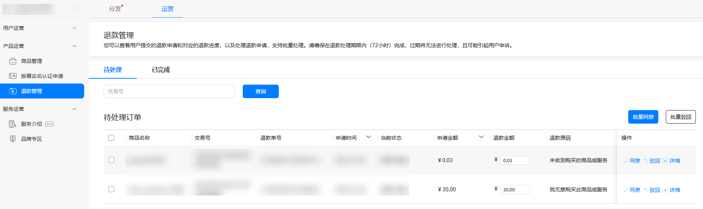
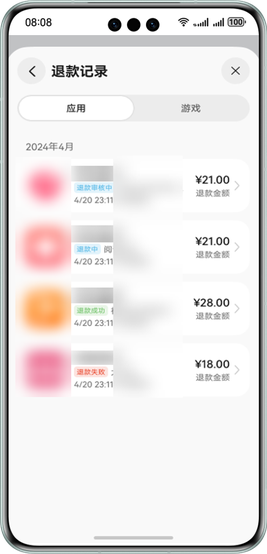
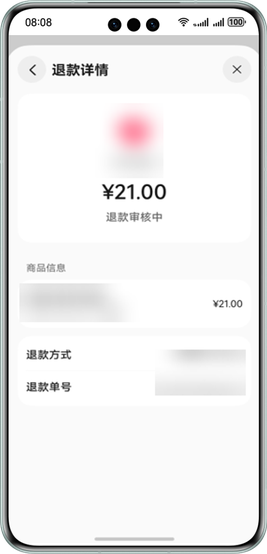
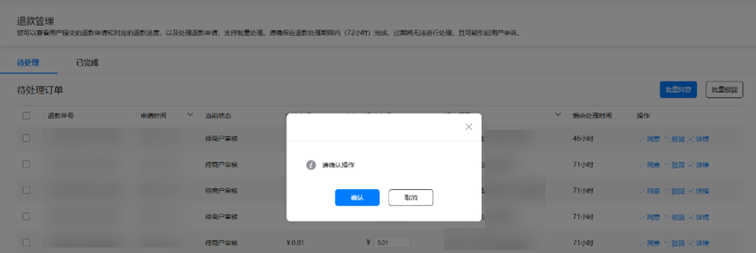
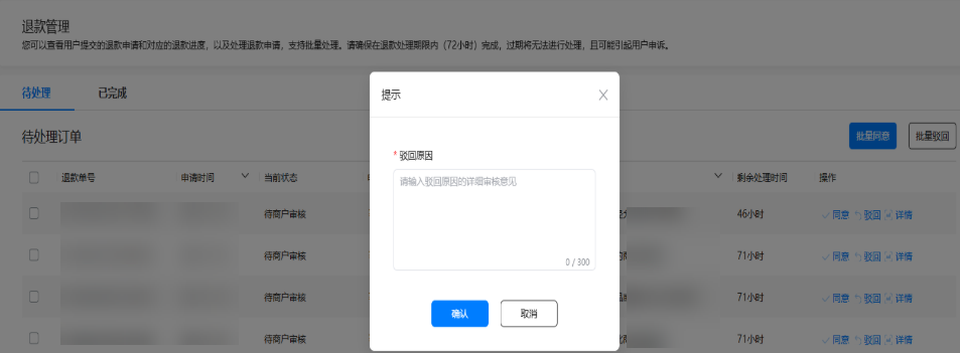
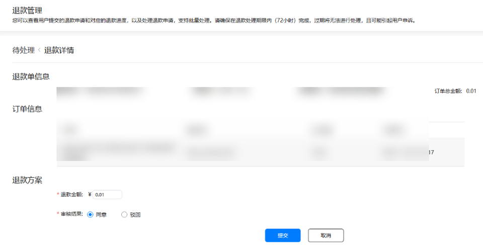
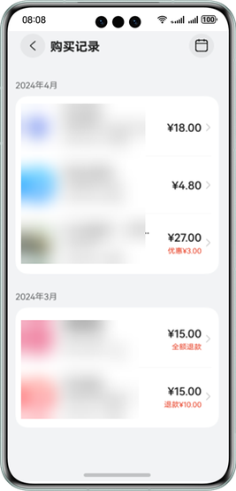
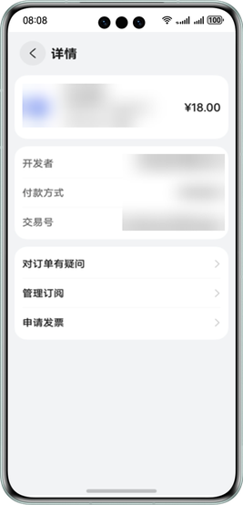
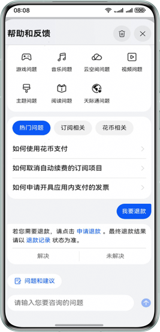
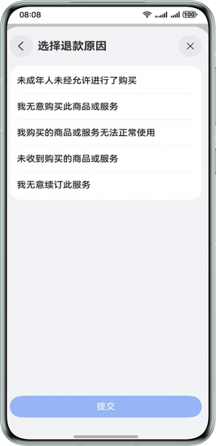

# 退款

更新时间：2026-04-20 06:34:33

来源：https://developer.huawei.com/consumer/cn/doc/harmonyos-guides/iap-refund

当[用户申请退款](#用户申请退款)时，对于非游戏类应用，开发者可以在[AppGallery Connect](https://developer.huawei.com/consumer/cn/service/josp/agc/index.html)上审核退款订单，实现用户的退款。

> [!NOTE]
> 退款只能由用户发起，具体参见 用户申请退款 。 对于游戏类应用， 用户申请退款 后，由华为游戏运营人员审核退款，开发者可跳过此章节。


#### 开发者审核退款订单

开发者使用退款管理功能，需要拥有至少一个具备退款权限的角色：账号持有者、管理员、App管理员、财务。具体可查看[添加成员账号](https://developer.huawei.com/consumer/cn/doc/app/agc-help-manageaccount-0000001099996700#section151241455193313)。

添加完账号后，开发者可按照以下步骤审核用户的退款订单：
1. 开发者登录[AppGallery Connect](https://developer.huawei.com/consumer/cn/service/josp/agc/index.html)，选择“APP”。 在应用列表中点击待处理退款订单的应用。

  


2. 在“运营”页签下，点击“产品运营 > 退款管理”，查看用户提交的退款申请，处理退款订单。

  


3. 审核或查询退款订单。

  **同意退款**：如果开发者同意退款，可在 “退款金额“下输入可退款金额，点击“同意”。在弹窗中点击“确认”，即可完成退款。

  



  **驳回退款**：开发者不同意退款，可点击“驳回”，输入驳回原因，点击“确认”。

  



  **退款详情页面审核退款**：开发者也可以在退款详情页面审核退款，输入退款金额后选择“同意”或“驳回”，点击提交，完成审核。

  



  **查询退款订单**：点击“已完成”页签，开发者可以查看所有已处理的退款订单。

  



  退款订单状态如下：

| 序号 | 退款订单状态 | 说明 |

| --- | --- | --- |

| 1 | 申请已拒绝 | 开发者驳回退款订单。 |

| 2 | 申请已通过 | 开发者同意退款订单。 |

| 3 | 退款成功 | 开发者同意退款，且华为操作退款成功。 |

| 4 | 退款失败 | 开发者同意退款，且华为操作退款失败。 |

| 5 | 超期未处理 | 开发者未按规定时间处理退款订单时，退款订单由华为运营进行审核。 |


#### 用户申请退款

> [!NOTE]
> 生态应用订单退款最低系统版本要求为6.16.10（检查版本可参考以下路径“系统设置-华为账号-付款与账单-更多设置-关于”）。 退款申请后到退款完成非实时，一般从发起申请退款到完成需要7个工作日左右。


若用户购买应用内数字商品后需要申请退款，可选择某笔订单后根据页面指引，提交退款信息。开发者审核完成后，用户可收到退款金额。

用户可按照以下步骤申请订单退款：
1. 在“手机设置 > 华为账号 > 付款与账单 > 购买记录”中点击待退款的订单，跳转至详情页面，点击“对订单有疑问”。

  




2. 在“对订单有疑问”页面，点击“申请退款”，选择退款原因后，提交退款申请，提交后等待应用审核。

  





  用户提交退款后，可点击“查看退款记录”，在“退款记录”查看所有退款订单的退款状态。

  


#### 应用内接入退款入口

> [!NOTE]
> 仅支持非游戏类应用接入。 该退款入口仅支持应用本身所产生的订单的退款。


**拉起退款**

用户发起退款后，应用客户端向IAP Kit发送[createRefundRequest](https://developer.huawei.com/consumer/cn/doc/harmonyos-references/iap-iap#iapcreaterefundrequest)请求拉起退款页面，请求中需携带待退款的订单号（purchaseOrderId）。

**代码示例**

```text
import { iap } from '@kit.IAPKit';
import { common } from '@kit.AbilityKit';
import { BusinessError } from '@kit.BasicServicesKit';

@Entry
@Component
struct Index {

  /**
   * 拉起退款界面
   */
  createRefundRequest(context: common.UIAbilityContext) {
    // 调用iap.createRefundRequest拉起退款，传入context和purchaseOrderId
    let purchaseOrderId = '';
    iap.createRefundRequest(context, purchaseOrderId).then(() => {
      // 退款成功
      console.info('Succeeded in creating refund request.');
      // ...
    }).catch((err: BusinessError) => {
      // 退款失败
      console.error(`Failed to create refund request. Code is ${err.code}, message is ${err.message}`);
      // ...
    });
  }

  build() {}
}
```
