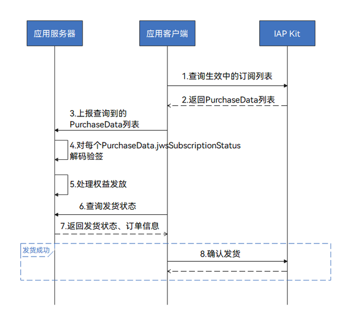

# 权益发放

更新时间：2026-04-20 06:34:33

来源：https://developer.huawei.com/consumer/cn/doc/harmonyos-guides/iap-delivering-subscriptions

##### 对生效中的订阅发放权益


##### 场景介绍

用户购买自动续期订阅商品后，若订阅处于生效状态，开发者需要及时给用户发放对应权益。

在应用启动时，获取用户当前处于生效状态的订阅列表，处理此部分订阅的权益发放。建议先检查当前订阅对应权益的发放状态，未发放再补充发放权益。在权益发放成功后，向IAP确认发货，完成购买。

建议单机应用将用户权益和订阅状态关联。如果订阅处于生效状态，始终为用户发放权益。


##### 业务流程




1. 应用客户端向IAP Kit发起[queryPurchases](https://developer.huawei.com/consumer/cn/doc/harmonyos-references/iap-iap#iapquerypurchases)请求，查询用户生效中的订阅列表。
2. IAP Kit返回[PurchaseData](https://developer.huawei.com/consumer/cn/doc/harmonyos-references/iap-data-model#purchasedata)列表。[PurchaseData](https://developer.huawei.com/consumer/cn/doc/harmonyos-references/iap-data-model#purchasedata)为JWS格式的字符串，承载了相关的订阅信息。
3. 应用客户端向应用服务器上报[PurchaseData](https://developer.huawei.com/consumer/cn/doc/harmonyos-references/iap-data-model#purchasedata)列表。
4. 应用服务器需对每个[PurchaseData](https://developer.huawei.com/consumer/cn/doc/harmonyos-references/iap-data-model#purchasedata).jwsSubscriptionStatus进行[解码验签](https://developer.huawei.com/consumer/cn/doc/harmonyos-references/iap-verifying-signature#jws解码和验签)，验证成功可得到对应的[SubGroupStatusPayload](https://developer.huawei.com/consumer/cn/doc/harmonyos-references/iap-data-model#subgroupstatuspayload)的JSON字符串。
5. 处理权益发放。检查[SubGroupStatusPayload](https://developer.huawei.com/consumer/cn/doc/harmonyos-references/iap-data-model#subgroupstatuspayload).lastSubscriptionStatus.lastPurchaseOrder是否已发放权益，未发放则需发放相关权益，并记录对应的订单信息（[PurchaseOrderPayload](https://developer.huawei.com/consumer/cn/doc/harmonyos-references/iap-data-model#purchaseorderpayload)）。

  
> [!NOTE]
> 建议单机应用将用户权益和订阅状态关联。如果订阅处于生效状态，始终为用户发放权益。

6. 应用客户端向应用服务器查询订单的发货状态。
7. 应用服务器返回对应的发货状态以及订单信息（[PurchaseOrderPayload](https://developer.huawei.com/consumer/cn/doc/harmonyos-references/iap-data-model#purchaseorderpayload)）。
8. 发放权益后应用客户端向IAP Kit发送[finishPurchase](https://developer.huawei.com/consumer/cn/doc/harmonyos-references/iap-iap#iapfinishpurchase)请求，以此通知IAP服务器更新商品的发货状态，完成购买流程。应用成功执行[finishPurchase](https://developer.huawei.com/consumer/cn/doc/harmonyos-references/iap-iap#iapfinishpurchase)之后，IAP服务器会将相应商品标记为已发货状态。此步骤也可放到应用服务器处理。应用服务器可通过请求服务端[订阅确认发货](https://developer.huawei.com/consumer/cn/doc/harmonyos-references/iap-confirm-purchase-for-sub)接口来确认发货，完成购买流程。

  
> [!NOTE]
> 对于自动续期订阅商品，如果不执行此步骤，会导致后续自动续期无法扣费 ，以及同一个订阅组不同自动续期订阅商品无法切换等问题。


##### 开发步骤
1. 应用客户端向IAP Kit发起[queryPurchases](https://developer.huawei.com/consumer/cn/doc/harmonyos-references/iap-iap#iapquerypurchases)请求，获取生效中的订阅列表。

  在请求参数[QueryPurchasesParameter](https://developer.huawei.com/consumer/cn/doc/harmonyos-references/iap-iap#querypurchasesparameter)中指定productType为[iap.ProductType.AUTORENEWABLE](https://developer.huawei.com/consumer/cn/doc/harmonyos-references/iap-iap#producttype)，同时指定queryType为[iap.PurchaseQueryType.CURRENT_ENTITLEMENT](https://developer.huawei.com/consumer/cn/doc/harmonyos-references/iap-iap#purchasequerytype)。当接口请求成功时，IAP Kit将返回一个[QueryPurchaseResult](https://developer.huawei.com/consumer/cn/doc/harmonyos-references/iap-iap#querypurchaseresult)对象，该对象包含承载了订阅信息的[PurchaseData](https://developer.huawei.com/consumer/cn/doc/harmonyos-references/iap-data-model#purchasedata)的列表。
2. 验证订单信息。对每个[purchaseData](https://developer.huawei.com/consumer/cn/doc/harmonyos-references/iap-data-model#purchasedata).jwsSubscriptionStatus进行[解码验签](https://developer.huawei.com/consumer/cn/doc/harmonyos-references/iap-verifying-signature#jws解码和验签)，验证成功可得到[SubGroupStatusPayload](https://developer.huawei.com/consumer/cn/doc/harmonyos-references/iap-data-model#subgroupstatuspayload)的JSON字符串。建议应用客户端将[purchaseData](https://developer.huawei.com/consumer/cn/doc/harmonyos-references/iap-data-model#purchasedata)发送至应用服务器，在应用服务器执行此操作。

  为了提高安全性，可从[SubGroupStatusPayload](https://developer.huawei.com/consumer/cn/doc/harmonyos-references/iap-data-model#subgroupstatuspayload).lastSubscriptionStatus.lastPurchaseOrder中解析出purchaseToken和purchaseOrderId信息，并通过服务端[订阅状态查询](https://developer.huawei.com/consumer/cn/doc/harmonyos-references/iap-query-subscription-status)接口向IAP服务器查询最新的订阅状态信息，进一步确认订阅信息的准确性。
3. 展示订阅状态。

  
如果[SubGroupStatusPayload](https://developer.huawei.com/consumer/cn/doc/harmonyos-references/iap-data-model#subgroupstatuspayload).lastSubscriptionStatus.status=1，表示订阅处于生效状态。
4. 如果[SubGroupStatusPayload](https://developer.huawei.com/consumer/cn/doc/harmonyos-references/iap-data-model#subgroupstatuspayload).lastSubscriptionStatus.status=1且[SubGroupStatusPayload](https://developer.huawei.com/consumer/cn/doc/harmonyos-references/iap-data-model#subgroupstatuspayload).lastSubscriptionStatus.renewalInfo.autoRenewStatusCode值为1时，表示订阅处于自动续期状态。此状态的商品无法再次购买，需要屏蔽相关的购买入口。
5. 权益发放。获取[SubGroupStatusPayload](https://developer.huawei.com/consumer/cn/doc/harmonyos-references/iap-data-model#subgroupstatuspayload).lastSubscriptionStatus.lastPurchaseOrder（下文标记为[PurchaseOrderPayload](https://developer.huawei.com/consumer/cn/doc/harmonyos-references/iap-data-model#purchaseorderpayload)），处理权益发放。

  可先检查此笔订单权益的发放状态，未发放则补充发放权益，成功后记录[PurchaseOrderPayload](https://developer.huawei.com/consumer/cn/doc/harmonyos-references/iap-data-model#purchaseorderpayload)等信息，用于后续检查权益发放状态。

  
> [!NOTE]
> 建议单机应用将用户权益和订阅状态关联。如果订阅处于生效状态，始终为用户发放权益。

6. 在发放权益后，如果[PurchaseOrderPayload](https://developer.huawei.com/consumer/cn/doc/harmonyos-references/iap-data-model#purchaseorderpayload).finishStatus不为1，应用需调用[finishPurchase](https://developer.huawei.com/consumer/cn/doc/harmonyos-references/iap-iap#iapfinishpurchase)接口确认发货，完成购买流程。

  发起请求时，需在请求参数[FinishPurchaseParameter](https://developer.huawei.com/consumer/cn/doc/harmonyos-references/iap-iap#finishpurchaseparameter)中携带[PurchaseOrderPayload](https://developer.huawei.com/consumer/cn/doc/harmonyos-references/iap-data-model#purchaseorderpayload)中的productType、purchaseToken、purchaseOrderId。请求成功后，IAP服务器会将相应商品标记为已发货。

  
> [!NOTE]
> 此步骤也可放到应用服务器处理。应用服务器可通过请求服务端 订阅确认发货 接口来确认发货，完成购买流程。


  
> [!NOTE]
> JWSUtil为自定义类，可参见 示例代码 。


```json
import { iap } from '@kit.IAPKit';
import { common } from '@kit.AbilityKit';
import { BusinessError } from '@kit.BasicServicesKit';
// JWSUtil为自定义类
import { JWSUtil } from '../common/JWSUtil';

@Entry
@Component
struct Index {

  queryPurchases(context: common.UIAbilityContext) {
    const param: iap.QueryPurchasesParameter = {
      productType: iap.ProductType.AUTORENEWABLE,
      queryType: iap.PurchaseQueryType.CURRENT_ENTITLEMENT
    };
    iap.queryPurchases(context, param).then((res: iap.QueryPurchaseResult) => {
      console.info('Succeeded in querying purchases.');
      const purchaseDataList: string[] = res.purchaseDataList;
      if (purchaseDataList === undefined || purchaseDataList.length <= 0) {
        return;
      }
      for (let i = 0; i < purchaseDataList.length; i++) {
        const jwsSubscriptionStatus: string = JSON.parse(purchaseDataList[i]).jwsSubscriptionStatus;
        if (!jwsSubscriptionStatus) {
          continue;
        }
        // 对jwsSubscriptionStatus进行解码验签
        const subscriptionStatus: string = JWSUtil.decodeJwsObj(jwsSubscriptionStatus);
        // 需自定义SubGroupStatusPayload类，包含的信息请参见SubGroupStatusPayload
        const subGroupStatusPayload: SubGroupStatusPayload = JSON.parse(subscriptionStatus);
        const lastSubscriptionStatus = subGroupStatusPayload.lastSubscriptionStatus;
        if (!lastSubscriptionStatus) {
          continue;
        }

        // 根据status判断订阅的状态
        const status = lastSubscriptionStatus.status;
        // 更新商品的订阅状态
        // ...

        // 处理权益发放
        const purchaseOrderPayload = lastSubscriptionStatus.lastPurchaseOrder;
        if (purchaseOrderPayload === undefined) {
          continue;
        }
        if (status === '1') {
          // 订阅处于生效状态
          // 处理权益发放。检查此笔订单权益的发放状态，未发放则补充发放权益
          // ...
        }
        // 发放权益后向IAP Kit发送finishPurchase请求，确认发货，完成购买
        if (purchaseOrderPayload && purchaseOrderPayload.finishStatus !== '1') {
          this.finishPurchase(context, purchaseOrderPayload);
        }
      }
    }).catch((err: BusinessError) => {
      // 请求失败
      console.error(`Failed to query purchases. Code is ${err.code}, message is ${err.message}`);
    })
  }

  finishPurchase(context: common.UIAbilityContext, purchaseOrder: PurchaseOrderPayload) {
    const finishPurchaseParam: iap.FinishPurchaseParameter = {
      productType: Number(purchaseOrder.productType),
      purchaseToken: purchaseOrder.purchaseToken,
      purchaseOrderId: purchaseOrder.purchaseOrderId
    };
    iap.finishPurchase(context, finishPurchaseParam).then(() => {
      // 请求成功
      console.info('Succeeded in finishing purchase.');
    }).catch((err: BusinessError) => {
      // 请求失败
      console.error(`Failed to finish purchase. Code is ${err.code}, message is ${err.message}`);
    });
  }

  build() {}
}
```


##### 确保权益发放

用户购买自动续期订阅成功或者自动续期成功后，开发者需要及时给用户发放相关权益。但实际应用场景中，若出现异常（网络错误等）将导致应用无法知道用户实际是否支付成功，从而无法及时发放权益，即出现掉单情况。

为了确保权益发放，需要在[createPurchase](https://developer.huawei.com/consumer/cn/doc/harmonyos-references/iap-iap#iapcreatepurchase)请求返回[iap.IAPErrorCode.PRODUCT_OWNED](https://developer.huawei.com/consumer/cn/doc/harmonyos-references/iap-iap#iaperrorcode)或[iap.IAPErrorCode.SYSTEM_ERROR](https://developer.huawei.com/consumer/cn/doc/harmonyos-references/iap-iap#iaperrorcode)时检查用户是否存在已购但未确认发货的商品，如果存在则发放相关权益，然后向IAP Kit确认发货，完成购买。


##### 业务流程


1. 应用客户端向IAP Kit发起[queryPurchases](https://developer.huawei.com/consumer/cn/doc/harmonyos-references/iap-iap#iapquerypurchases)请求，查询用户已购买但未确认发货的订阅列表。
2. IAP Kit返回[PurchaseData](https://developer.huawei.com/consumer/cn/doc/harmonyos-references/iap-data-model#purchasedata)列表。[PurchaseData](https://developer.huawei.com/consumer/cn/doc/harmonyos-references/iap-data-model#purchasedata)为JWS格式的字符串，承载了相关的订阅信息。
3. 应用客户端向应用服务器上报[PurchaseData](https://developer.huawei.com/consumer/cn/doc/harmonyos-references/iap-data-model#purchasedata)列表。
4. 应用服务器需对每个[PurchaseData](https://developer.huawei.com/consumer/cn/doc/harmonyos-references/iap-data-model#purchasedata).jwsSubscriptionStatus进行[解码验签](https://developer.huawei.com/consumer/cn/doc/harmonyos-references/iap-verifying-signature#jws解码和验签)，验证成功可得到对应的[SubGroupStatusPayload](https://developer.huawei.com/consumer/cn/doc/harmonyos-references/iap-data-model#subgroupstatuspayload)的JSON字符串。
5. 处理权益发放。检查[SubGroupStatusPayload](https://developer.huawei.com/consumer/cn/doc/harmonyos-references/iap-data-model#subgroupstatuspayload).lastSubscriptionStatus.lastPurchaseOrder是否已发放权益，未发放则需发放相关权益，并记录对应的订单信息（[PurchaseOrderPayload](https://developer.huawei.com/consumer/cn/doc/harmonyos-references/iap-data-model#purchaseorderpayload)）。

  
> [!NOTE]
> 建议单机应用将用户权益和订阅状态关联。如果订阅处于生效状态，始终为用户发放权益。

6. 应用客户端向应用服务器查询订单的发货状态。
7. 应用服务器返回对应的发货状态以及订单信息（[PurchaseOrderPayload](https://developer.huawei.com/consumer/cn/doc/harmonyos-references/iap-data-model#purchaseorderpayload)）。
8. 发放权益后应用客户端向IAP Kit发送[finishPurchase](https://developer.huawei.com/consumer/cn/doc/harmonyos-references/iap-iap#iapfinishpurchase)请求，以此通知IAP服务器更新商品的发货状态，完成购买流程。应用成功执行[finishPurchase](https://developer.huawei.com/consumer/cn/doc/harmonyos-references/iap-iap#iapfinishpurchase)之后，IAP服务器会将相应商品标记为已发货状态。此步骤也可放到应用服务器处理。应用服务器可通过请求服务端[订阅确认发货](https://developer.huawei.com/consumer/cn/doc/harmonyos-references/iap-confirm-purchase-for-sub)接口来确认发货，完成购买流程。

  
> [!NOTE]
> 对于自动续期订阅商品，如果不执行此步骤，会导致后续自动续期无法扣费 ，以及同一个订阅组不同自动续期订阅商品无法切换等问题。


##### 开发步骤
1. 应用客户端向IAP Kit发起[queryPurchases](https://developer.huawei.com/consumer/cn/doc/harmonyos-references/iap-iap#iapquerypurchases)请求，获取用户已购但未确认发货的订阅列表。

  在请求参数[QueryPurchasesParameter](https://developer.huawei.com/consumer/cn/doc/harmonyos-references/iap-iap#querypurchasesparameter)中指定productType为[iap.ProductType.AUTORENEWABLE](https://developer.huawei.com/consumer/cn/doc/harmonyos-references/iap-iap#producttype)，同时指定queryType为[iap.PurchaseQueryType.UNFINISHED](https://developer.huawei.com/consumer/cn/doc/harmonyos-references/iap-iap#purchasequerytype)。当接口请求成功时，IAP Kit将返回一个[QueryPurchaseResult](https://developer.huawei.com/consumer/cn/doc/harmonyos-references/iap-iap#querypurchaseresult)对象，该对象包含承载了订阅信息的[PurchaseData](https://developer.huawei.com/consumer/cn/doc/harmonyos-references/iap-data-model#purchasedata)的列表。
2. 验证订单信息。对每个[purchaseData](https://developer.huawei.com/consumer/cn/doc/harmonyos-references/iap-data-model#purchasedata).jwsSubscriptionStatus进行[解码验签](https://developer.huawei.com/consumer/cn/doc/harmonyos-references/iap-verifying-signature#jws解码和验签)，验证成功可得到[SubGroupStatusPayload](https://developer.huawei.com/consumer/cn/doc/harmonyos-references/iap-data-model#subgroupstatuspayload)的JSON字符串。建议应用客户端将[purchaseData](https://developer.huawei.com/consumer/cn/doc/harmonyos-references/iap-data-model#purchasedata)发送至应用服务器，在应用服务器执行此操作。

  为了提高安全性，可从[SubGroupStatusPayload](https://developer.huawei.com/consumer/cn/doc/harmonyos-references/iap-data-model#subgroupstatuspayload).lastSubscriptionStatus.lastPurchaseOrder中解析出purchaseToken和purchaseOrderId信息，并通过服务端[订阅状态查询](https://developer.huawei.com/consumer/cn/doc/harmonyos-references/iap-query-subscription-status)接口向IAP服务器查询最新的订阅状态信息，进一步确认订阅信息的准确性。
3. 处理权益发放。

  如果SubGroupStatusPayload.lastSubscriptionStatus.status=1，表示订阅处于生效状态。需要对生效状态的订阅处理权益发放。建议先检查此笔订单权益的发放状态，未发放则补充发放权益，成功后记录[PurchaseOrderPayload](https://developer.huawei.com/consumer/cn/doc/harmonyos-references/iap-data-model#purchaseorderpayload)等信息，用于后续检查权益发放状态。

  建议单机应用将用户权益和订阅状态关联。如果订阅处于生效状态，始终为用户发放权益。
4. 在发放权益后，如果PurchaseOrderPayload.finishStatus不为1，应用需调用[finishPurchase](https://developer.huawei.com/consumer/cn/doc/harmonyos-references/iap-iap#iapfinishpurchase)接口确认发货，完成购买流程。

  发起请求时，需在请求参数[FinishPurchaseParameter](https://developer.huawei.com/consumer/cn/doc/harmonyos-references/iap-iap#finishpurchaseparameter)中携带[PurchaseOrderPayload](https://developer.huawei.com/consumer/cn/doc/harmonyos-references/iap-data-model#purchaseorderpayload)中的productType、purchaseToken、purchaseOrderId。请求成功后，IAP服务器会将相应商品标记为已发货。

  
> [!NOTE]
> 此步骤也可放到应用服务器处理。应用服务器可通过请求服务端 订阅确认发货 接口来确认发货，完成购买流程。


  
> [!NOTE]
> JWSUtil为自定义类，可参见 示例代码 。


```json
import { iap } from '@kit.IAPKit';
import { common } from '@kit.AbilityKit';
import { BusinessError } from '@kit.BasicServicesKit';
// JWSUtil为自定义类
import { JWSUtil } from '../common/JWSUtil';

@Entry
@Component
struct Index {

  queryPurchases(context: common.UIAbilityContext) {
    const param: iap.QueryPurchasesParameter = {
      productType: iap.ProductType.AUTORENEWABLE,
      queryType: iap.PurchaseQueryType.UNFINISHED
    };
    iap.queryPurchases(context, param).then((res: iap.QueryPurchaseResult) => {
      console.info('Succeeded in querying purchases.');
      const purchaseDataList: string[] = res.purchaseDataList;
      if (purchaseDataList === undefined || purchaseDataList.length <= 0) {
        return;
      }
      for (let i = 0; i < purchaseDataList.length; i++) {
        const jwsSubscriptionStatus: string = JSON.parse(purchaseDataList[i]).jwsSubscriptionStatus;
        if (!jwsSubscriptionStatus) {
          continue;
        }
        // 对jwsSubscriptionStatus进行解码验签
        const subscriptionStatus: string = JWSUtil.decodeJwsObj(jwsSubscriptionStatus);
        // 需自定义SubGroupStatusPayload类，包含的信息请参见SubGroupStatusPayload
        const subGroupStatusPayload: SubGroupStatusPayload = JSON.parse(subscriptionStatus);
        const lastSubscriptionStatus = subGroupStatusPayload.lastSubscriptionStatus;
        if (!lastSubscriptionStatus) {
          continue;
        }

        // 根据status判断订阅的状态
        const status = lastSubscriptionStatus.status;
        // 更新商品的订阅状态
        // ...

        // 处理权益发放
        const purchaseOrderPayload = lastSubscriptionStatus.lastPurchaseOrder;
        if (purchaseOrderPayload === undefined) {
          continue;
        }
        if (status === '1') {
          // 订阅处于生效状态
          // 处理权益发放。检查此笔订单权益的发放状态，未发放则补充发放权益
          // ...
        }
        // 发放权益后向IAP Kit发送finishPurchase请求，确认发货，完成购买
        if (purchaseOrderPayload && purchaseOrderPayload.finishStatus !== '1') {
          this.finishPurchase(context, purchaseOrderPayload);
        }
      }
    }).catch((err: BusinessError) => {
      // 请求失败
      console.error(`Failed to query purchases. Code is ${err.code}, message is ${err.message}`);
    })
  }

  finishPurchase(context: common.UIAbilityContext, purchaseOrder: PurchaseOrderPayload) {
    const finishPurchaseParam: iap.FinishPurchaseParameter = {
      productType: Number(purchaseOrder.productType),
      purchaseToken: purchaseOrder.purchaseToken,
      purchaseOrderId: purchaseOrder.purchaseOrderId
    };
    iap.finishPurchase(context, finishPurchaseParam).then(() => {
      // 请求成功
      console.info('Succeeded in finishing purchase.');
    }).catch((err: BusinessError) => {
      // 请求失败
      console.error(`Failed to finish purchase. Code is ${err.code}, message is ${err.message}`);
    });
  }

  build() {}
}
```
