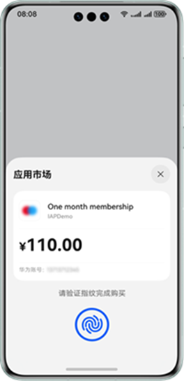

# 接入购买

更新时间：2026-07-28 11:23:46

来源：https://developer.huawei.com/consumer/cn/doc/harmonyos-guides/iap-integrate-nonrenewable

#### 场景介绍

用户在购买非续期订阅商品后，可以在一段时间访问App的增值功能或内容，周期结束后禁止访问，除非再次购买自动续期订阅或非续期订阅商品。

在接入非续期订阅商品购买能力前，需要提前[配置商品信息](https://developer.huawei.com/consumer/cn/doc/harmonyos-guides/iap-config-product)。用户在应用内购买时，应用拉起IAP Kit的收银台，收银台处会展示商品名称、商品价格等信息，用户根据需求完成商品购买。





#### 提供优惠

为了提供更有吸引力的非续期订阅商品购买，华为应用内支付支持开发者配置优惠促销（自定义人群促销）。

可以针对用户群体、优惠地域进行自定义选择，支持开发者进行个性化的优惠活动配置。开发者可以在发起购买前，查询该商品的优惠活动信息，在最终发起购买时，将优惠活动信息传递到华为应用内支付，最终将优惠活动信息展示给用户。

> [!NOTE]
> 当前优惠促销涉及 生成优惠签名购买参数 处理，推荐具备服务器的开发者接入使用。 优惠促销无使用次数限制。


#### 约束与限制

非续期订阅商品购买能力支持Phone、Tablet、PC/2in1设备，并且从5.1.1(19)版本开始，新增支持TV设备，从26.0.0版本开始，新增支持Car设备。


#### 业务流程

> [!NOTE]
> 如下业务流程对于单机应用同样适用。在单机应用中，应用服务器和应用客户端的交互放在应用客户端完成，应用服务器和IAP服务器交互的部分可不处理。


**展示商品**
1. 应用客户端向IAP Kit发起[queryEnvironmentStatus](https://developer.huawei.com/consumer/cn/doc/harmonyos-references/iap-iap#iapqueryenvironmentstatus)请求，检查当前用户登录的华为账号所在的服务地是否在IAP Kit支持结算的国家/地区中。

  如果接口返回错误码“[1001860054](https://developer.huawei.com/consumer/cn/doc/harmonyos-references/errorcode-iap#section1001860054-用户账号所在服务地不在iap-kit支持结算的国家地区中)：用户账号所在服务地不在IAP Kit支持结算的国家/地区中”，应用需隐藏相关IAP功能入口。
2. 应用客户端向IAP Kit发起[queryProducts](https://developer.huawei.com/consumer/cn/doc/harmonyos-references/iap-iap#iapqueryproducts)请求来获取在[AppGallery Connect](https://developer.huawei.com/consumer/cn/service/josp/agc/index.html)上配置的商品信息。
3. 应用客户端根据返回的商品信息展示可供购买的商品列表，包含商品名称、价格等信息。

**购买及结果确认**
1. 用户发起购买后，应用客户端向IAP Kit发起[createPurchase](https://developer.huawei.com/consumer/cn/doc/harmonyos-references/iap-iap#iapcreatepurchase)购买请求或通过[IAP嵌入式收银台组件](https://developer.huawei.com/consumer/cn/doc/harmonyos-references/iap-cashier-component)发起购买请求（只支持TV），请求中携带商品ID、商品类型等信息。IAP Kit创建订单并展示收银台。
2. 购买结果确认。如购买成功，可通过应用客户端或应用服务器接收购买结果，建议通过应用服务器接收购买结果。

  **方式一：通过客户端接收购买结果**

  
 - 用户购买成功时，IAP Kit返回包含订单信息的[PurchaseData](https://developer.huawei.com/consumer/cn/doc/harmonyos-references/iap-data-model#purchasedata)数据。

3. 应用客户端向应用服务器上报[PurchaseData](https://developer.huawei.com/consumer/cn/doc/harmonyos-references/iap-data-model#purchasedata)数据。

4. 应用服务器需对[PurchaseData](https://developer.huawei.com/consumer/cn/doc/harmonyos-references/iap-data-model#purchasedata).jwsPurchaseOrder进行[解码验签](https://developer.huawei.com/consumer/cn/doc/harmonyos-references/iap-verifying-signature#jws解码和验签)，成功后可得到[PurchaseOrderPayload](https://developer.huawei.com/consumer/cn/doc/harmonyos-references/iap-data-model#purchaseorderpayload)的JSON字符串。

  **（建议）方式二：通过服务器接收购买结果**

1. 为了提高安全性，开发者可以接入[服务端关键事件通知](https://developer.huawei.com/consumer/cn/doc/harmonyos-references/iap-key-event-notifications)，在用户购买成功时，IAP服务器将发送订单关键事件通知。

2. 应用服务器可从NotificationPayload.[NotificationMetaData](https://developer.huawei.com/consumer/cn/doc/harmonyos-references/iap-key-event-notifications#notificationmetadata)中解析出purchaseToken和purchaseOrderId信息，并通过服务端[订单状态查询](https://developer.huawei.com/consumer/cn/doc/harmonyos-references/iap-query-order-status)接口向IAP服务器查询最新的订单信息，进一步确认订单的准确性。

3. IAP服务器返回订单信息[jwsPurchaseOrder](https://developer.huawei.com/consumer/cn/doc/harmonyos-references/iap-query-order-status#response-body)。

4. 应用服务器需对[jwsPurchaseOrder](https://developer.huawei.com/consumer/cn/doc/harmonyos-references/iap-query-order-status#response-body)进行[解码验签](https://developer.huawei.com/consumer/cn/doc/harmonyos-references/iap-verifying-signature#jws解码和验签)，成功后可得到[PurchaseOrderPayload](https://developer.huawei.com/consumer/cn/doc/harmonyos-references/iap-data-model#purchaseorderpayload)的JSON字符串。


> [!NOTE]
> 如果购买失败，请参见 权益发放 处理，及时发放权益。


**发放权益**
1. 处理权益发放。检查当前[PurchaseOrderPayload](https://developer.huawei.com/consumer/cn/doc/harmonyos-references/iap-data-model#purchaseorderpayload)是否已发放权益，未发放则发放相关权益，并记录对应的订单信息（[PurchaseOrderPayload](https://developer.huawei.com/consumer/cn/doc/harmonyos-references/iap-data-model#purchaseorderpayload)），用于后续检查权益发放状态。
2. 应用客户端向应用服务器查询订单的发货状态。
3. 应用服务器返回对应的发货状态以及订单信息（[PurchaseOrderPayload](https://developer.huawei.com/consumer/cn/doc/harmonyos-references/iap-data-model#purchaseorderpayload)）。
4. 发货成功后应用客户端向IAP Kit发送[finishPurchase](https://developer.huawei.com/consumer/cn/doc/harmonyos-references/iap-iap#iapfinishpurchase)请求，以此通知IAP服务器更新商品的发货状态，完成购买流程。

  应用成功执行此步骤后，IAP服务器会将相应商品标记为已发货状态。对于非续期订阅商品，IAP服务器会将相应商品重新设置为可购买状态，用户即可再次购买该商品（商品权益时长是否叠加由开发者自行管理）。

  
> [!NOTE]
> 此步骤也可放到应用服务器处理。应用服务器可通过请求服务端 订单确认发货 接口来确认发货，完成购买流程。 确保在发货成功之后再执行此步骤，否则可能导致IAP服务器已经确认发货但是应用没有发货的问题。


#### 开发步骤


#### 展示商品
1. 检查应用引入IAP Kit的可用性。

  在使用应用内支付之前，应用客户端需要向IAP Kit发送[queryEnvironmentStatus](https://developer.huawei.com/consumer/cn/doc/harmonyos-references/iap-iap#iapqueryenvironmentstatus)请求，以此判断用户当前登录的华为账号所在的服务地是否在IAP Kit支持结算的国家/地区中。

  
> [!NOTE]
> 当前IAP Kit支持结算的国家/地区仅有中国境内（香港特别行政区、澳门特别行政区、中国台湾除外）。


```text
import { iap } from '@kit.IAPKit';
import { BusinessError } from '@kit.BasicServicesKit';
import { common } from '@kit.AbilityKit';
import Logger from '../common/Logger';
// ...
    const queryEnvCode = await this.queryEnv();
    if (queryEnvCode !== 0) {
      let queryEnvFailedText = 'This app does not support iap';
      if (queryEnvCode === iap.IAPErrorCode.ACCOUNT_NOT_LOGGED_IN) {
        // 如果接口返回错误码“1001860054 用户账号所在服务地不在IAP Kit支持结算的国家/地区中”，应用需隐藏相关IAP功能入口
        queryEnvFailedText = 'Go to Settings and log in to your Huawei ID and try again.';
      }
      this.showFailedPage(queryEnvFailedText);
      return;
    }
    // ...

  async queryEnv(): Promise<number> {
    return new Promise<number>((resolve) => {
      iap.queryEnvironmentStatus(this.context).then(() => {
        Logger.info(TAG, 'Succeeded in querying environment status.');
        resolve(0);
      }).catch((err: BusinessError) => {
        Logger.error(TAG, `Failed to query environment status. Code is ${err.code}, message is ${err.message}`);
        resolve(err.code);
      })
    });
  }
```
1. 展示商品列表。

  应用客户端通过[queryProducts](https://developer.huawei.com/consumer/cn/doc/harmonyos-references/iap-iap#iapqueryproducts)来获取在[AppGallery Connect](https://developer.huawei.com/consumer/cn/service/josp/agc/index.html)上配置的商品信息。发起请求时，需在请求参数[QueryProductsParameter](https://developer.huawei.com/consumer/cn/doc/harmonyos-references/iap-iap#queryproductsparameter)中携带相关的商品ID，并指定其商品类型productType为NONRENEWABLE。

  当接口请求成功时，IAP Kit将返回商品信息[Product](https://developer.huawei.com/consumer/cn/doc/harmonyos-references/iap-iap#product)的列表。 应用可以使用[Product](https://developer.huawei.com/consumer/cn/doc/harmonyos-references/iap-iap#product)包含的商品价格、名称和描述等信息，向用户展示可供购买的商品列表。

  
> [!NOTE]
> queryProducts 每次只能查询一种商品类型的商品，每次最多查询200个商品，否则请求将报错。


```text
import { iap } from '@kit.IAPKit';
import { BusinessError } from '@kit.BasicServicesKit';
import { common } from '@kit.AbilityKit';
import Logger from '../common/Logger';
// ...
  async queryProducts() {
    const queryProductParam: iap.QueryProductsParameter = {
      productType: iap.ProductType.NONRENEWABLE,
      productIds: ['NA0001']
    };
    await iap.queryProducts(this.context, queryProductParam).then((result) => {
      Logger.info(TAG, 'Succeeded in querying products.');
      // 展示产品详情
      this.productInfoArray = result;
      this.showNormalPage();
    }).catch((err: BusinessError) => {
      // 查询商品报错
      Logger.error(TAG, `Failed to query products. Code is ${err.code}, message is ${err.message}`);
      this.showFailedPage();
    });
  }
```


#### 发起购买

用户发起购买时，应用客户端向IAP Kit发送[createPurchase](https://developer.huawei.com/consumer/cn/doc/harmonyos-references/iap-iap#iapcreatepurchase)请求来拉起IAP Kit收银台或通过[IAP嵌入式收银台组件](https://developer.huawei.com/consumer/cn/doc/harmonyos-references/iap-cashier-component)发起购买请求（只支持TV）。发起请求时，需在请求参数[PurchaseParameter](https://developer.huawei.com/consumer/cn/doc/harmonyos-references/iap-iap#purchaseparameter)中携带此前已在华为[AppGallery Connect](https://developer.huawei.com/consumer/cn/service/josp/agc/index.html)网站上配置并生效的商品ID，并指定productType为NONRENEWABLE。

如需单次购买多个商品，可在[PurchaseParameter](https://developer.huawei.com/consumer/cn/doc/harmonyos-references/iap-iap#purchaseparameter)中拼接quantity参数，quantity取值范围1-10。

> [!NOTE]
> 开发过程中易出现频繁调用接口的现象，建议控制接口调用频度，具体可参见 1001860004 接口访问过频 。


```text
import { iap } from '@kit.IAPKit';
import { BusinessError } from '@kit.BasicServicesKit';
import { common } from '@kit.AbilityKit';
import Logger from '../common/Logger';
// ...
  createPurchase(id: string, type: iap.ProductType) {
    try {
      const createPurchaseParam: iap.PurchaseParameter = {
        productId: id,
        productType: type,
      }
      iap.createPurchase(this.context, createPurchaseParam).then((result) => {
        const msg: string = 'Succeeded in creating purchase.';
        Logger.info(TAG, msg);
        // 购买成功，处理购买结果
        this.dealPurchaseData(result.purchaseData);
      }).catch((err: BusinessError) => {
        const msg: string = `Failed to create purchase. Code is ${err.code}, message is ${err.message}`;
        Logger.error(TAG, msg);
        // 购买失败
        if (err.code === iap.IAPErrorCode.PRODUCT_OWNED || err.code === iap.IAPErrorCode.SYSTEM_ERROR) {
          // 参见权益发放检查是否需要补发货，确保权益发放
          // ...
          this.queryPurchases();
        }
      })
    } catch (err) {
      const e: BusinessError = err as BusinessError;
      const msg: string = `Failed to create purchase. Code is ${e.code}, message is ${e.message}`;
      Logger.error(TAG, msg);
    }
  }
```


#### 购买结果处理

**【结果1：购买成功】**

> [!NOTE]
> 为了提高安全性，建议应用服务器接入 服务端关键事件通知 以接收购买成功结果并通过应用服务器来处理 解码验签 、完成购买等操作。 请务必确保发货成功后再执行完成购买步骤，本步骤可通过请求服务端 订单确认发货 接口来确认发货，完成购买流程。


以下内容为**通过客户端接收购买结果**及处理的步骤说明。
1. 当用户购买成功时，应用客户端将接收到一个[CreatePurchaseResult](https://developer.huawei.com/consumer/cn/doc/harmonyos-references/iap-iap#createpurchaseresult)对象，其[purchaseData](https://developer.huawei.com/consumer/cn/doc/harmonyos-references/iap-data-model#purchasedata)字段包括了此次购买的结果信息。
2. 对[purchaseData](https://developer.huawei.com/consumer/cn/doc/harmonyos-references/iap-data-model#purchasedata).jwsPurchaseOrder进行[解码验签](https://developer.huawei.com/consumer/cn/doc/harmonyos-references/iap-verifying-signature#jws解码和验签)，验证成功可得到[PurchaseOrderPayload](https://developer.huawei.com/consumer/cn/doc/harmonyos-references/iap-data-model#purchaseorderpayload)的JSON字符串。建议应用客户端将[purchaseData](https://developer.huawei.com/consumer/cn/doc/harmonyos-references/iap-data-model#purchasedata)发送至应用服务器，在应用服务器执行此操作。
3. 验签成功后，如果[PurchaseOrderPayload](https://developer.huawei.com/consumer/cn/doc/harmonyos-references/iap-data-model#purchaseorderpayload).purchaseOrderRevocationReasonCode为空，则代表购买成功，即可发放相关权益。

  建议先检查此笔订单权益的发放状态，未发放则发放权益，成功后记录[PurchaseOrderPayload](https://developer.huawei.com/consumer/cn/doc/harmonyos-references/iap-data-model#purchaseorderpayload)等信息，用于后续检查权益发放状态。
4. 完成购买。

  发放权益后，应用客户端需要发送[finishPurchase](https://developer.huawei.com/consumer/cn/doc/harmonyos-references/iap-iap#iapfinishpurchase)请求确认发货，以此通知IAP服务器更新商品的发货状态，完成购买流程。发送[finishPurchase](https://developer.huawei.com/consumer/cn/doc/harmonyos-references/iap-iap#iapfinishpurchase)请求时，需在请求参数[FinishPurchaseParameter](https://developer.huawei.com/consumer/cn/doc/harmonyos-references/iap-iap#finishpurchaseparameter)中携带[PurchaseOrderPayload](https://developer.huawei.com/consumer/cn/doc/harmonyos-references/iap-data-model#purchaseorderpayload)中的productType、purchaseToken、purchaseOrderId。

  应用成功执行此步骤后，IAP服务器会将相应商品标记为已发货状态。对于非续期订阅商品，IAP服务器会将相应商品重新设置为可购买状态，用户即可再次购买该商品。

  
> [!NOTE]
> JWSUtil为自定义类，可参见 示例代码 。


```json
import { iap } from '@kit.IAPKit';
import { BusinessError } from '@kit.BasicServicesKit';
import { common } from '@kit.AbilityKit';
import Logger from '../common/Logger';
import { JWSUtil } from '../common/JWSUtil';
import { FinishStatus, PurchaseData, PurchaseOrderPayload } from '../common/IapDataModel';
// ...
  dealPurchaseData(purchaseData: string) {
    try {
      // 建议您将 purchaseData 发送到应用服务器进行签名验证。
      const jwsPurchaseOrder = (JSON.parse(purchaseData) as PurchaseData).jwsPurchaseOrder;
      if (!jwsPurchaseOrder) {
        Logger.error(TAG, 'dealPurchaseData, jwsPurchaseOrder invalid');
        return;
      }
      // 解码 jwsPurchaseOrder 并执行签名验证。
      const purchaseOrderStr = JWSUtil.decodeJwsObj(jwsPurchaseOrder);
      // 需自定义PurchaseOrderPayload类，包含的信息请参见PurchaseOrderPayload
      const purchaseOrderPayload = JSON.parse(purchaseOrderStr) as PurchaseOrderPayload;
      // 如果验证成功则发货。
      // ...
      // 在发货成功后，向IAP Kit发送finishPurchase请求，以确认交付并完成购买。
      if (purchaseOrderPayload && purchaseOrderPayload.finishStatus !== FinishStatus.FINISHED) {
        this.finishPurchase(purchaseOrderPayload);
      }
    } catch (e) {
      Logger.error(TAG, 'dealPurchaseData json error');
    }
  }

  finishPurchase(purchaseOrder: PurchaseOrderPayload) {
    if (!purchaseOrder.productType) {
      Logger.error(TAG, 'finishPurchase but productType is empty');
      return;
    }
    const finishPurchaseParam: iap.FinishPurchaseParameter = {
      productType: Number(purchaseOrder.productType),
      purchaseToken: purchaseOrder.purchaseToken,
      purchaseOrderId: purchaseOrder.purchaseOrderId
    };
    iap.finishPurchase(this.context, finishPurchaseParam).then(() => {
      Logger.info(TAG, 'Succeeded in finishing purchase.');
    }).catch((err: BusinessError) => {
      Logger.error(TAG, `Failed to finish purchase. Code is ${err.code}, message is ${err.message}`);
    });
  }
```

**【结果2：购买失败】**

当用户购买失败时，需要针对code为[iap.IAPErrorCode.PRODUCT_OWNED](https://developer.huawei.com/consumer/cn/doc/harmonyos-references/iap-iap#iaperrorcode)和[iap.IAPErrorCode.SYSTEM_ERROR](https://developer.huawei.com/consumer/cn/doc/harmonyos-references/iap-iap#iaperrorcode)的场景，检查是否需要补发货，确保权益发放，具体请参见[权益发放](https://developer.huawei.com/consumer/cn/doc/harmonyos-guides/iap-delivering-nonrenewable)。

```text
if (err.code === iap.IAPErrorCode.PRODUCT_OWNED || err.code === iap.IAPErrorCode.SYSTEM_ERROR) {
  // 参见权益发放检查是否需要补发货，确保权益发放
  // ...
  // ...
}
```
