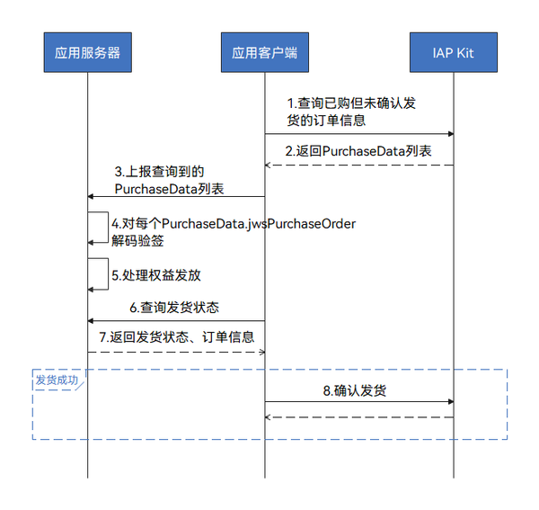

# 权益发放

更新时间：2026-07-28 11:23:46

来源：https://developer.huawei.com/consumer/cn/doc/harmonyos-guides/iap-delivering-nonrenewable

#### 场景介绍

用户购买商品后，开发者需要及时发放相关权益。但实际应用场景中，若出现异常（网络错误、进程被中止等）将导致应用无法知道用户实际是否支付成功，从而无法及时发放权益，即出现掉单情况。为了确保权益发放，需要在以下场景检查用户是否存在已购未发货的商品：
1. 应用启动时。
2. 购买请求（[createPurchase](https://developer.huawei.com/consumer/cn/doc/harmonyos-references/iap-iap#iapcreatepurchase)）返回[iap.IAPErrorCode.PRODUCT_OWNED](https://developer.huawei.com/consumer/cn/doc/harmonyos-references/iap-iap#iaperrorcode)或[iap.IAPErrorCode.SYSTEM_ERROR](https://developer.huawei.com/consumer/cn/doc/harmonyos-references/iap-iap#iaperrorcode)时。

如果存在已购未发货商品，则发放相关权益，然后向IAP Kit确认发货，完成购买。


#### 业务流程




1. 应用客户端向IAP Kit发起[queryPurchases](https://developer.huawei.com/consumer/cn/doc/harmonyos-references/iap-iap#iapquerypurchases)请求，查询用户已购买但未确认发货的订单信息。
2. IAP Kit返回[PurchaseData](https://developer.huawei.com/consumer/cn/doc/harmonyos-references/iap-data-model#purchasedata)列表。[数据类型说明](https://developer.huawei.com/consumer/cn/doc/harmonyos-references/iap-data-model)为JWS格式的字符串，承载了相关的订单信息。
3. 应用客户端向应用服务器上报[PurchaseData](https://developer.huawei.com/consumer/cn/doc/harmonyos-references/iap-data-model#purchasedata)列表。
4. 应用服务器需对每个[PurchaseData](https://developer.huawei.com/consumer/cn/doc/harmonyos-references/iap-data-model#purchasedata).jwsPurchaseOrder进行[解码验签](https://developer.huawei.com/consumer/cn/doc/harmonyos-references/iap-verifying-signature#jws解码和验签)，验证成功可得到对应的[PurchaseOrderPayload](https://developer.huawei.com/consumer/cn/doc/harmonyos-references/iap-data-model#purchaseorderpayload)的JSON字符串。
5. 处理权益发放。检查当前[PurchaseOrderPayload](https://developer.huawei.com/consumer/cn/doc/harmonyos-references/iap-data-model#purchaseorderpayload)是否已发放权益，未发放则发放相关权益，并记录对应的订单信息（[PurchaseOrderPayload](https://developer.huawei.com/consumer/cn/doc/harmonyos-references/iap-data-model#purchaseorderpayload)）。
6. 应用客户端向应用服务器查询订单的发货状态。
7. 应用服务器返回对应的发货状态以及订单信息（[PurchaseOrderPayload](https://developer.huawei.com/consumer/cn/doc/harmonyos-references/iap-data-model#purchaseorderpayload)）。
8. 发货成功后应用客户端向IAP Kit发送[finishPurchase](https://developer.huawei.com/consumer/cn/doc/harmonyos-references/iap-iap#iapfinishpurchase)请求，以此通知IAP服务器更新商品的发货状态，完成购买流程。应用成功执行[finishPurchase](https://developer.huawei.com/consumer/cn/doc/harmonyos-references/iap-iap#iapfinishpurchase)之后，IAP服务器会将相应商品标记为已发货状态。此步骤也可放到应用服务器处理。应用服务器可通过请求服务端[订单确认发货](https://developer.huawei.com/consumer/cn/doc/harmonyos-references/iap-confirm-purchase-for-order)接口来确认发货，完成购买流程。

  
> [!NOTE]
> 对于非续期订阅商品，如果不执行此步骤，会导致用户无法再次购买该商品。 确保在发货成功之后再执行此步骤，否则可能导致IAP服务器已经确认发货但是应用没有发货的问题。


#### 开发步骤
1. 应用客户端向IAP Kit发起[queryPurchases](https://developer.huawei.com/consumer/cn/doc/harmonyos-references/iap-iap#iapquerypurchases)请求，获取用户已购未发货的非续期订阅商品的购买数据。

  在请求参数[QueryPurchasesParameter](https://developer.huawei.com/consumer/cn/doc/harmonyos-references/iap-iap#querypurchasesparameter)中指定对应的productType为NONRENEWABLE，同时指定queryType为[iap.PurchaseQueryType.UNFINISHED](https://developer.huawei.com/consumer/cn/doc/harmonyos-references/iap-iap#purchasequerytype)。当接口请求成功时，IAP Kit将返回一个[QueryPurchaseResult](https://developer.huawei.com/consumer/cn/doc/harmonyos-references/iap-iap#querypurchaseresult)对象，该对象包含承载了订单信息的[PurchaseData](https://developer.huawei.com/consumer/cn/doc/harmonyos-references/iap-data-model#purchasedata)的列表。
2. 对[purchaseData](https://developer.huawei.com/consumer/cn/doc/harmonyos-references/iap-data-model#purchasedata).jwsPurchaseOrder进行[解码验签](https://developer.huawei.com/consumer/cn/doc/harmonyos-references/iap-verifying-signature#jws解码和验签)。建议应用客户端将[purchaseData](https://developer.huawei.com/consumer/cn/doc/harmonyos-references/iap-data-model#purchasedata)发送至应用服务器，在应用服务器执行此操作。
3. 验证成功可得到对应的[PurchaseOrderPayload](https://developer.huawei.com/consumer/cn/doc/harmonyos-references/iap-data-model#purchaseorderpayload)的JSON字符串，如果[PurchaseOrderPayload](https://developer.huawei.com/consumer/cn/doc/harmonyos-references/iap-data-model#purchaseorderpayload).purchaseOrderRevocationReasonCode为空，则代表购买成功，需要进行补发货处理。

  建议先检查此笔订单权益的发放状态，未发放则发放权益，成功后记录[PurchaseOrderPayload](https://developer.huawei.com/consumer/cn/doc/harmonyos-references/iap-data-model#purchaseorderpayload)等信息，用于后续检查权益发放状态。

  

 

  如果开发者在[发起购买](https://developer.huawei.com/consumer/cn/doc/harmonyos-guides/iap-integrate-nonrenewable#发起购买)时支持非续期订阅商品的批量购买，则需要在发货时校验下单的商品数量和[PurchaseOrderPayload](https://developer.huawei.com/consumer/cn/doc/harmonyos-references/iap-data-model#purchaseorderpayload).quantity是否一致，避免造成漏发、多发的情况。
4. 发货成功后，应用需调用[finishPurchase](https://developer.huawei.com/consumer/cn/doc/harmonyos-references/iap-iap#iapfinishpurchase)接口确认发货，以此通知IAP服务器更新商品的发货状态，完成购买流程。

  发起请求时，需在请求参数[FinishPurchaseParameter](https://developer.huawei.com/consumer/cn/doc/harmonyos-references/iap-iap#finishpurchaseparameter)中携带[PurchaseOrderPayload](https://developer.huawei.com/consumer/cn/doc/harmonyos-references/iap-data-model#purchaseorderpayload)中的productType、purchaseToken、purchaseOrderId。

  请求成功后，IAP服务器会将相应商品标记为已发货状态。

  
> [!NOTE]
> JWSUtil为自定义类，可参见 示例代码 。


```json
import { iap } from '@kit.IAPKit';
import { BusinessError } from '@kit.BasicServicesKit';
import { common } from '@kit.AbilityKit';
import Logger from '../common/Logger';
import { JWSUtil } from '../common/JWSUtil';
import { FinishStatus, PurchaseData, PurchaseOrderPayload } from '../common/IapDataModel';
// ...
  async queryPurchases(): Promise<void> {
    return new Promise<void>((resolve) => {
      const parameter: iap.QueryPurchasesParameter = {
        productType: iap.ProductType.NONRENEWABLE,
        queryType: iap.PurchaseQueryType.UNFINISHED,
      };
      iap.queryPurchases(this.context, parameter, (err: BusinessError, data: iap.QueryPurchaseResult) => {
        if (err) {
          Logger.error(TAG, `Failed to query purchases. Code is ${err.code}, message is ${err.message}`);
          resolve();
          return;
        }
        Logger.info(TAG, 'Succeeded in querying purchases.');
        const purchaseDataList: string[] = data.purchaseDataList;
        if (purchaseDataList === undefined || purchaseDataList.length <= 0) {
          Logger.info(TAG, 'queryPurchases, purchaseDataList empty');
          resolve();
          return;
        }
        for (let i = 0; i < purchaseDataList.length; i++) {
          this.dealPurchaseData(purchaseDataList[i]);
        }
        resolve();
      });
    });
  }

  dealPurchaseData(purchaseData: string) {
    try {
      // 建议您将 purchaseData 发送到应用服务器进行签名验证。
      const jwsPurchaseOrder = (JSON.parse(purchaseData) as PurchaseData).jwsPurchaseOrder;
      if (!jwsPurchaseOrder) {
        Logger.error(TAG, 'dealPurchaseData, jwsPurchaseOrder invalid');
        return;
      }
      // 解码 jwsPurchaseOrder 并执行签名验证。
      const purchaseOrderStr = JWSUtil.decodeJwsObj(jwsPurchaseOrder);
      // 需自定义PurchaseOrderPayload类，包含的信息请参见PurchaseOrderPayload
      const purchaseOrderPayload = JSON.parse(purchaseOrderStr) as PurchaseOrderPayload;
      // 如果验证成功则发货。
      // ...
      // 在发货成功后，向IAP Kit发送finishPurchase请求，以确认交付并完成购买。
      if (purchaseOrderPayload && purchaseOrderPayload.finishStatus !== FinishStatus.FINISHED) {
        this.finishPurchase(purchaseOrderPayload);
      }
    } catch (e) {
      Logger.error(TAG, 'dealPurchaseData json error');
    }
  }

  finishPurchase(purchaseOrder: PurchaseOrderPayload) {
    if (!purchaseOrder.productType) {
      Logger.error(TAG, 'finishPurchase but productType is empty');
      return;
    }
    const finishPurchaseParam: iap.FinishPurchaseParameter = {
      productType: Number(purchaseOrder.productType),
      purchaseToken: purchaseOrder.purchaseToken,
      purchaseOrderId: purchaseOrder.purchaseOrderId
    };
    iap.finishPurchase(this.context, finishPurchaseParam).then(() => {
      Logger.info(TAG, 'Succeeded in finishing purchase.');
    }).catch((err: BusinessError) => {
      Logger.error(TAG, `Failed to finish purchase. Code is ${err.code}, message is ${err.message}`);
    });
  }
```
