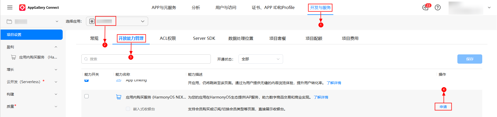
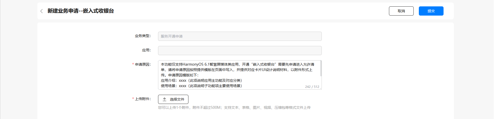

# （可选）申请嵌入式收银台开放能力权限

更新时间：2026-04-20 06:34:33

来源：https://developer.huawei.com/consumer/cn/doc/harmonyos-guides/iap-apply-for-open-capabilities

如果使用接入嵌入式收银台能力，则需要申请对应权限。

## 开放能力申请准备

请先参考[应用开发准备](https://developer.huawei.com/consumer/cn/doc/harmonyos-guides/application-dev-overview)完成基本准备工作，再继续以下开放能力准备项。

## 嵌入式收银台

为了更好的用户体验，系统侧对嵌入式收银台服务功能做了权限保护处理，使用相关接口开发者需先提交“嵌入式收银台”能力开关的申请，在申请通过后，再使用该能力。 登录[AppGallery Connect](https://developer.huawei.com/consumer/cn/service/josp/agc/index.html)，选择“开发与服务”。  在项目列表选择项目，并在应用列表下选择需要申请嵌入式收银台功能的应用。  进入“项目设置 > 开放能力管理”页面，选择能力名称为应用内购买服务（HarmonyOS NEXT），然后点击“嵌入式收银台”对应的“申请”。

参考“申请原因”中的模板，提供申请必需的相关信息，包括应用介绍、使用场景，然后点击“提交”按钮。

返回“开放能力管理”页面，原“申请”变为“申请中”，1~5个工作日内反馈申请结果，请留意互动中心的“服务开通申请”信息。

申请通过后，互动中心会发送通知给开发者，同时“申请中”会变为置灰显示的“申请”，至此，应用已成功开启嵌入式收银台开放能力。

