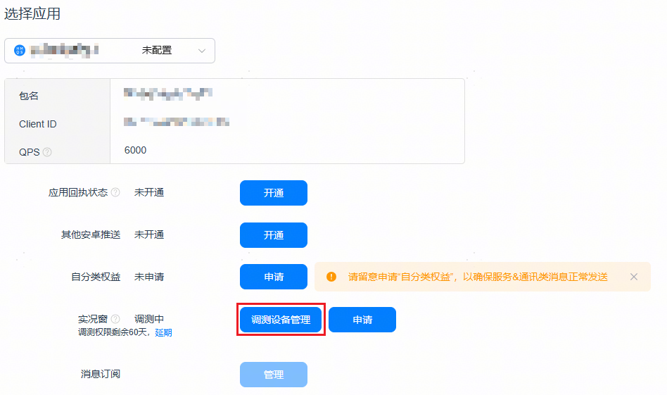
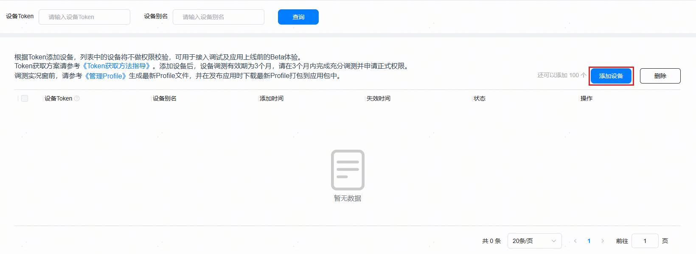

# 接入联调测试

更新时间：2026-04-20 06:34:33

来源：https://developer.huawei.com/consumer/cn/doc/harmonyos-guides/liveview-joint-commission-test

若开发者需要在设备上调试、验证实况窗，可通过“调测设备管理”入口，添加设备进行调测。添加到调测名单中的设备，不做本地构建实况窗权限的校验。
 
调测设备管理能力可用于应用实况窗场景上线前的用户验证，开发者可将用户设备添加至调测设备列表中，以体验应用即将上线的实况窗场景。
 
**在调测设备上对实况窗充分测试后，开发者可申请开通实况窗正式权限**（在申请权限时，请在附件中一并提交调测设备联调的交互效果截图）。
  

##### 约束和限制

- 添加的调测设备管理名单数据，系统将在24小时内处理并生效，调测权限有效期与Push Token有效期保持一致。
- 调测设备管理需根据Push Token添加调测设备，每个应用可添加的设备上限为100。

 
  

##### 添加调测设备
1. 登录[AppGallery Connect](https://developer.huawei.com/consumer/cn/service/josp/agc/index.html)网站，点击“开发与服务”，在项目列表中找到开发者的项目，通过“增长 > 推送服务 > 配置”导航到“配置”页签。
2. 选择开发者的应用，点击实况窗-调测设备管理，根据[Push Token](https://developer.huawei.com/consumer/cn/doc/harmonyos-guides/push-get-token)添加调测设备后即可进行接入调测。

  

  

