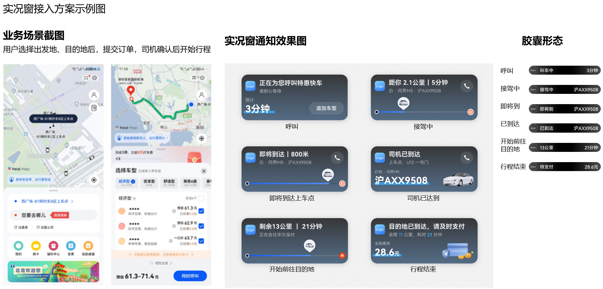

# 申请实况窗正式权限

更新时间：2026-04-20 06:34:33

来源：https://developer.huawei.com/consumer/cn/doc/harmonyos-guides/liveview-formal-authority

当开发者已对调测设备的实况窗业务进行了充分的调试，确认设计方案和功能体验均符合[《实况窗设计规范》](https://developer.huawei.com/consumer/cn/doc/harmonyos-guides/liveview-design-formula)，可提交申请正式权限。提交后实况窗将对开发者的方案设计、功能体验进行评审与验收。开发者将会在7个工作日内收到评审结果。
 1. 登录[AppGallery Connect](https://developer.huawei.com/consumer/cn/service/josp/agc/index.html)，选择“开发与服务”。

  


2. 在项目列表中找到需要开通实况窗的项目。

  


3. 通过“增长 > 推送服务 > 配置”导航到“配置”页签，选择需要开通实况窗的应用，并点击“实况窗”的“申请”。

  


4. 开发者可点击开通实况窗权限，进入实况窗介绍页面，点击“立即申请”。

  


5. 点击“立即申请”后进入实况窗页面。若开发者的应用月活数大于等于1000且为已上架应用，可点击“应用场景”列表中各场景的“申请”按钮，按需申请开通实况窗权益。

  


  


6. 按要求填写场景的描述信息、场景接入方案和备注信息后提交申请，等待审批结果即可。可参见[实况窗权益申请填写要求](#实况窗权益申请填写要求)进行申请。

  


  

##### 实况窗权益申请填写要求

  

##### 场景描述

需包含：接入场景的描述、消息的展示时机基本说明、展示的主要节点。开发者填写的内容将用于客服答疑等场景，请尽可能详细地描述。
 
示例：
 
```text
以打车场景接入为例，场景描述可按照如下字段描述提交
接入场景：用户打车后，通过实况窗通知展示接驾进展、行程进展等信息
展示时机：用户提交即时出行订单后，或预约订单开始前30分钟
展示节点：呼叫司机、司机赶来、司机到达上车点、前往目的地、到达目的地-待支付、到达目的地-已支付
```
 


 
 
若开发者的应用内支持使用其他应用的小程序，需明确说明本次申请的场景使用范围是否涉及到其他应用的小程序。若涉及，开发者需确保不会出现同一个任务多端推送实况窗的体验，在提交申请时需在附件中一并附上如下内容：
  
- 与小程序客户端的沟通对齐证明。需双方明确客户端对开发者应用内其小程序产生的任务的处理方式，如客户端不会对开发者应用内其小程序产生的任务进行实况窗通知等。
- 策略变更预案。若小程序客户端策略发生变更，针对继续保持上述体验的应对策略预案。

  
沟通证明和预案需按场景和小程序一对一制定。后续在该场景下若涉及新增其他小程序，需线下提交针对新增小程序的沟通对齐证明和对应预案。
  

 
  

##### 接入方案

请将应用已验收通过的接入方案现网效果截图（含每个状态节点的卡片、胶囊、锁屏效果、展示时机说明）、主要特殊场景方案效果放在同一张图片中，图片大小需控制在3M内。
 
示例：
 


 
实况窗接入方案请需满足《实况窗设计规范》中的要求，开发者可按照模板进行设计。
 
**申请前自验**
 
应用在申请实况窗权限时，需对应用当前实况窗的效果和体验进行自检验收，并在申请时将自检项结果通过备注说明，如某项内容已完成自检，可在“[ ]”中打√
 
- [ ]确认上传的截图满足实况窗设计规范要求。
- [ ]每个创建的实况窗活动均已添加结束事件。
- [ ]确认实况窗与应用内任务进度与信息一致。
- [ ]确认同一实时任务不存在多个实况窗。
- [ ]确认已考虑并提供主要特殊场景的方案。
- [ ]已经完成实况窗场景测试，满足上线要求。
- [ ]认可实况窗的管理规范，若出现不符合设计规范或者违背场景准入要求，同意华为对相关场景[场景名称]权限进行收回。

 


 
 
开通正式权益涉及方案评审与测试验收，方案评审阶段通过后，须开发者配合测试验收（如提供验收方式和验收版本）。整个流程周期约15个工作日，请留意[AppGallery Connect](https://developer.huawei.com/consumer/cn/service/josp/agc/index.html)平台申请结果或邮箱。
