# 构建本地实况窗

更新时间：2026-05-08 09:27:50

来源：https://developer.huawei.com/consumer/cn/doc/harmonyos-guides/liveview-create-locally

## 简介

开发者可以通过[liveViewManager](https://developer.huawei.com/consumer/cn/doc/harmonyos-references/liveview-liveviewmanager)模块构建本地实况窗，完成实况窗的整个生命周期流程（包括创建、更新与结束）。请注意，只有应用在前台运行，即用户实际使用应用并且产生了服务合约的情况下，开发者才可以创建实况窗；与此同时，本地更新或结束实况窗依赖于开发者的应用进程，所以我们更推荐开发者在本地创建实况窗后使用Push Kit更新或结束实况窗。
> [!NOTE]
> Live View Kit提供了“出行打车/即时配送/航班/高铁火车/排队叫号/取餐/赛事比分/共享租赁/计时/运动锻炼/导航/打卡/快递”共13个场景的包含实况窗整个生命周期流程的示例代码，如开发者想在正式开发实况窗前先行体验效果，请参考实况窗SampleCode。 其中打卡和快递场景基于地理位置的实况窗提醒，从6.1.0(23)开始支持。


## 导入liveViewManager

在项目中导入[liveViewManager](https://developer.huawei.com/consumer/cn/doc/harmonyos-references/liveview-liveviewmanager)，并新建实况窗控制类（例如LiveViewController），构造isLiveViewEnabled()方法，用于校验实况窗开关（设置>应用和元服务>应用名>实况窗）是否打开。打开实况窗开关是创建实况窗的前提条件。示例代码如下：
```text
import { liveViewManager } from '@kit.LiveViewKit';

export class LiveViewController {
  private static async isLiveViewEnabled(): Promise {
    return await liveViewManager.isLiveViewEnabled();
  }
}
```


## 创建实况窗

实况窗根据扩展区不同共有5种样式模板：进度可视化模板、强调文本模板、左右文本模板、赛事比分模板和导航模板。 调用[liveViewManager.startLiveView](https://developer.huawei.com/consumer/cn/doc/harmonyos-references/liveview-liveviewmanager#liveviewmanagerstartliveview)创建实况窗，该API接口传入参数为实况窗实例（liveViewManager.[LiveView](https://developer.huawei.com/consumer/cn/doc/harmonyos-references/liveview-liveviewmanager#liveview)）。

## 进度可视化模板

进度可视化模板适用于打车、外卖等场景。
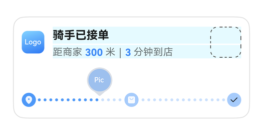
示例代码如下： 构建LiveViewController后，请在代码中初始化LiveViewController并调用LiveViewController.startLiveView()方法。
```text
import { liveViewManager } from '@kit.LiveViewKit';
import { Want, wantAgent } from '@kit.AbilityKit';

export class LiveViewController {
  public async startLiveView(): Promise {
    // 校验实况窗开关是否打开
    if (!await LiveViewController.isLiveViewEnabled()) {
      throw new Error("Live view is disabled.");
    }
    // 创建实况窗
    const defaultView = await LiveViewController.buildDefaultView();
    return await liveViewManager.startLiveView(defaultView);
  }

  private static async buildDefaultView(): Promise {
    return {
      // 构造实况窗请求体
      id: 0, // 实况窗ID，开发者生成。
      event: "DELIVERY", // 实况窗的应用场景。DELIVERY：即时配送（外卖、生鲜）
      liveViewData: {
        primary: {
          title: "骑手已接单",
          content: [
            { text: "距商家 " },
            { text: "300 ", textColor: "#FF0A59F7" },
            { text: "米 | " },
            { text: "3 ", textColor: "#FF0A59F7" },
            { text: "分钟到店" }
          ], // 设置textColor字段时，所有拥有textColor字段的对象仅能设置同一种颜色，不设置textColor时，默认展示#FF000000
          keepTime: 15,
          clickAction: await LiveViewController.buildWantAgent(),
          layoutData: {
            layoutType: liveViewManager.LayoutType.LAYOUT_TYPE_PROGRESS,
            progress: 40,
            color: "#FF317AF7",
            backgroundColor: "#f7819ae0",
            indicatorType: liveViewManager.IndicatorType.INDICATOR_TYPE_UP,
            indicatorIcon: "indicator.png", // 进度条指示器图标，取值为“/resources/rawfile”路径下的文件名或image.PixelMap
            lineType: liveViewManager.LineType.LINE_TYPE_DOTTED_LINE,
            nodeIcons: ["icon_1.png", "icon_2.png", "icon_3.png"] // 进度条每个节点图标，取值为“/resources/rawfile”路径下的文件名或image.PixelMap
          }
        }
      }
    };
  }

  private static async isLiveViewEnabled(): Promise {
    return await liveViewManager.isLiveViewEnabled();
  }

  private static async buildWantAgent(): Promise {
    const wantAgentInfo: wantAgent.WantAgentInfo = {
      wants: [
        {
          bundleName: 'xxx.xxx.xxx', // 应用实际bundleName
          abilityName: 'EntryAbility'
        } as Want
      ],
      actionType: wantAgent.OperationType.START_ABILITIES,
      requestCode: 0,
      actionFlags: [wantAgent.WantAgentFlags.UPDATE_PRESENT_FLAG]
    };
    const agent = await wantAgent.getWantAgent(wantAgentInfo);
    return agent;
  }
}
```

从6.0.2(22)开始，实况窗卡片进度可视化模板支持显示雨、雪天气动效背景。
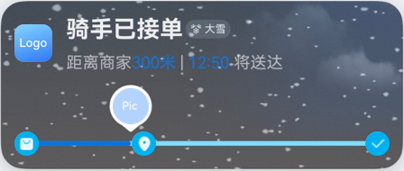
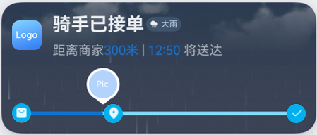
代码示例如下： 构建LiveViewController后，请在代码中初始化LiveViewController并调用LiveViewController.startLiveView()方法。
```text
import { liveViewManager } from '@kit.LiveViewKit';
import { Want, wantAgent } from '@kit.AbilityKit';

export class LiveViewController {
  public async startLiveView(): Promise {
    // 校验实况窗开关是否打开
    if (!await LiveViewController.isLiveViewEnabled()) {
      throw new Error("Live view is disabled.");
    }
    // 创建实况窗
    const defaultView = await LiveViewController.buildDefaultView();
    return await liveViewManager.startLiveView(defaultView);
  }

  private static async buildDefaultView() : Promise  {
    return {
      // 构造实况窗请求体
      id: 0, // 实况窗ID，开发者生成。
      event: "DELIVERY", // 实况窗的应用场景。DELIVERY：即时配送（外卖、生鲜）
      liveViewData: {
        primary: {
          title: "骑手已接单",
          content: [
            { text: "距商家 " },
            { text: "300 ", textColor: "#FF0A59F7" },
            { text: "米 | " },
            { text: "3 ", textColor: "#FF0A59F7" },
            { text: "分钟到店" }
          ], // 设置textColor字段时，所有拥有textColor字段的对象仅能设置同一种颜色，不设置textColor时，默认展示#FF000000
          keepTime: 15,
          clickAction: await LiveViewController.buildWantAgent(),
          layoutData: {
            layoutType: liveViewManager.LayoutType.LAYOUT_TYPE_PROGRESS,
            weatherInfo : {
              weatherType : liveViewManager.WeatherType.WEATHER_TYPE_LIGHT_RAIN,
              locationType : liveViewManager.WeatherLocationType.LOCATION_TYPE_LOCAL,
            },
            progress: 40,
            color: "#FF317AF7",
            backgroundColor: "#f7819ae0",
            indicatorType: liveViewManager.IndicatorType.INDICATOR_TYPE_UP,
            indicatorIcon: "indicator.png", // 进度条指示器图标，取值为“/resources/rawfile”路径下的文件名或image.PixelMap
            lineType: liveViewManager.LineType.LINE_TYPE_DOTTED_LINE,
            nodeIcons: ["icon_1.png", "icon_2.png", "icon_3.png"] // 进度条每个节点图标，取值为“/resources/rawfile”路径下的文件名或image.PixelMap
          }
        }
      }
    };
  }

  private static async isLiveViewEnabled(): Promise {
    return await liveViewManager.isLiveViewEnabled();
  }

  public static async buildWantAgent(): Promise {
    const wantAgentInfo: wantAgent.WantAgentInfo = {
      wants: [
        {
          bundleName: 'xxx.xxx.xxx', // 应用实际bundleName
          abilityName: 'EntryAbility'
        } as Want
      ],
      actionType: wantAgent.OperationType.START_ABILITIES,
      requestCode: 0,
      actionFlags: [wantAgent.WantAgentFlags.UPDATE_PRESENT_FLAG]
    };
    const agent = await wantAgent.getWantAgent(wantAgentInfo);
    return agent;
  }
}
```


## 强调文本模板

强调文本模板适用于取餐、排队等场景。
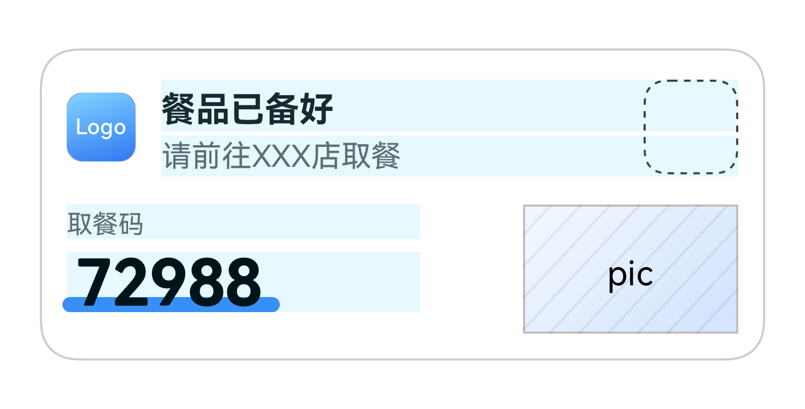
示例代码如下： 构建LiveViewController后，请在代码中初始化LiveViewController并调用LiveViewController.startLiveView()方法。
```text
import { liveViewManager } from '@kit.LiveViewKit';
import { Want, wantAgent } from '@kit.AbilityKit';

export class LiveViewController {
  public async startLiveView(): Promise {
    // 校验实况窗开关是否打开
    if (!await LiveViewController.isLiveViewEnabled()) {
      throw new Error("Live view is disabled.");
    }
    // 创建实况窗
    const defaultView = await LiveViewController.buildDefaultView();
    return await liveViewManager.startLiveView(defaultView);
  }

  private static async buildDefaultView(): Promise {
    return {
      // 构造实况窗请求体
      id: 0, // 实况窗ID，开发者生成。
      event: "PICK_UP", // 实况窗的应用场景。PICK_UP：取餐。
      liveViewData: {
        primary: {
          title: "餐品已备好",
          content: [
            { text: "请前往" },
            { text: " XXX店 ", textColor: "#FF0A59F7" },
            { text: "取餐" },
          ],
          keepTime: 15,
          clickAction: await LiveViewController.buildWantAgent(),
          layoutData: {
            layoutType: liveViewManager.LayoutType.LAYOUT_TYPE_PICKUP,
            title: "取餐码",
            content: "72988",
            underlineColor: "#FF0A59F7",
            descPic: "coffee.png" // 扩展区右侧产品描述图，取值为“/resources/rawfile”路径下的文件名或image.PixelMap
          }
        }
      }
    };
  }

  private static async isLiveViewEnabled(): Promise {
    return await liveViewManager.isLiveViewEnabled();
  }

  private static async buildWantAgent(): Promise {
    const wantAgentInfo: wantAgent.WantAgentInfo = {
      wants: [
        {
          bundleName: 'xxx.xxx.xxx', // 应用实际bundleName
          abilityName: 'EntryAbility'
        } as Want
      ],
      actionType: wantAgent.OperationType.START_ABILITIES,
      requestCode: 0,
      actionFlags: [wantAgent.WantAgentFlags.UPDATE_PRESENT_FLAG]
    };
    const agent = await wantAgent.getWantAgent(wantAgentInfo);
    return agent;
  }
}
```

从6.0.2(22)开始，实况窗卡片强调文本模板支持显示雨、雪天气动效背景。
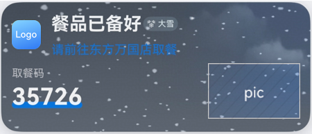
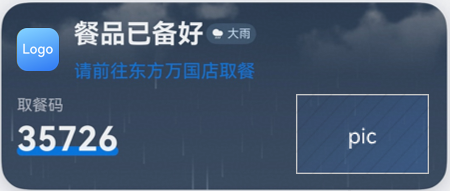
代码示例如下： 构建LiveViewController后，请在代码中初始化LiveViewController并调用LiveViewController.startLiveView()方法。
```text
import { liveViewManager } from '@kit.LiveViewKit';
import { Want, wantAgent } from '@kit.AbilityKit';

export class LiveViewController {
  public async startLiveView(): Promise {
    // 校验实况窗开关是否打开
    if (!await LiveViewController.isLiveViewEnabled()) {
      throw new Error("Live view is disabled.");
    }
    // 创建实况窗
    const defaultView = await LiveViewController.buildDefaultView();
    return await liveViewManager.startLiveView(defaultView);
  }

  private static async buildDefaultView() : Promise  {
    return {
      // 构造实况窗请求体
      id: 0, // 实况窗ID，开发者生成。
      event: "PICK_UP", // 实况窗的应用场景。PICK_UP：取餐。
      liveViewData: {
        primary: {
          title: "餐品已备好",
          content: [
            { text: "请前往" },
            { text: " XXX店 ", textColor: "#FF0A59F7" },
            { text: "取餐" },
          ],
          keepTime: 15,
          clickAction: await LiveViewController.buildWantAgent(),
          layoutData: {
            layoutType: liveViewManager.LayoutType.LAYOUT_TYPE_PICKUP,
            weatherInfo: {
              weatherType:liveViewManager.WeatherType.WEATHER_TYPE_HAZY,
              locationType:liveViewManager.WeatherLocationType.LOCATION_TYPE_LOCAL,
            },
            title: "取餐码",
            content: "72988",
            underlineColor: "#FF0A59F7",
            descPic: "coffee.png" // 扩展区右侧产品描述图，取值为“/resources/rawfile”路径下的文件名或image.PixelMap
          }
        }
      }
    };
  }

  private static async isLiveViewEnabled(): Promise {
    return await liveViewManager.isLiveViewEnabled();
  }

  public static async buildWantAgent(): Promise {
    const wantAgentInfo: wantAgent.WantAgentInfo = {
      wants: [
        {
          bundleName: 'xxx.xxx.xxx', // 应用实际bundleName
          abilityName: 'EntryAbility'
        } as Want
      ],
      actionType: wantAgent.OperationType.START_ABILITIES,
      requestCode: 0,
      actionFlags: [wantAgent.WantAgentFlags.UPDATE_PRESENT_FLAG]
    };
    const agent = await wantAgent.getWantAgent(wantAgentInfo);
    return agent;
  }
}
```


## 左右文本模板

左右文本模板适用于高铁、航班等场景。
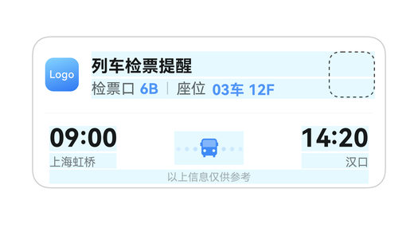
示例代码如下： 构建LiveViewController后，请在代码中初始化LiveViewController并调用LiveViewController.startLiveView()方法。
```text
import { liveViewManager } from '@kit.LiveViewKit';
import { Want, wantAgent } from '@kit.AbilityKit';

export class LiveViewController {
  public async startLiveView(): Promise {
    // 校验实况窗开关是否打开
    if (!await LiveViewController.isLiveViewEnabled()) {
      throw new Error("Live view is disabled.");
    }
    // 创建实况窗
    const defaultView = await LiveViewController.buildDefaultView();
    return await liveViewManager.startLiveView(defaultView);
  }

  private static async buildDefaultView(): Promise {
    return {
      // 构造实况窗请求体
      id: 0, // 实况窗ID，开发者生成。
      event: "TRAIN", // 实况窗的应用场景。TRAIN：高铁/火车。
      liveViewData: {
        primary: {
          title: "列车检票提醒",
          content: [
            { text: "检票口 " },
            { text: "6B ", textColor: "#FF0A59F7" },
            { text: "| 座位 " },
            { text: "03车 12F", textColor: "#FF0A59F7" }
          ], // 设置textColor字段时，所有拥有textColor字段的对象仅能设置同一种颜色，不设置textColor时，默认展示#FF000000
          keepTime: 15,
          clickAction: await LiveViewController.buildWantAgent(), // 点击实况窗默认动作。
          layoutData: {
            layoutType: liveViewManager.LayoutType.LAYOUT_TYPE_FLIGHT,
            firstTitle: "09:00",
            firstContent: "上海虹桥",
            lastTitle: "14:20",
            lastContent: "汉口",
            spaceIcon: "icon.png", // 扩展区中间间隔图标，取值为“/resources/rawfile”路径下的文件名或image.PixelMap
            isHorizontalLineDisplayed: true,
            additionalText: "以上信息仅供参考" // 扩展区底部内容，仅可用于左右文本模板。
          }
        }
      }
    };
  }

  private static async isLiveViewEnabled(): Promise {
    return await liveViewManager.isLiveViewEnabled();
  }

  private static async buildWantAgent(): Promise {
    const wantAgentInfo: wantAgent.WantAgentInfo = {
      wants: [
        {
          bundleName: 'xxx.xxx.xxx', // 应用实际bundleName
          abilityName: 'EntryAbility'
        } as Want
      ],
      actionType: wantAgent.OperationType.START_ABILITIES,
      requestCode: 0,
      actionFlags: [wantAgent.WantAgentFlags.UPDATE_PRESENT_FLAG]
    };
    const agent = await wantAgent.getWantAgent(wantAgentInfo);
    return agent;
  }
}
```

从6.0.0(20)开始，实况窗卡片左右文本模板支持显示雨、雪天气动效背景或夕阳、赏月氛围背景。
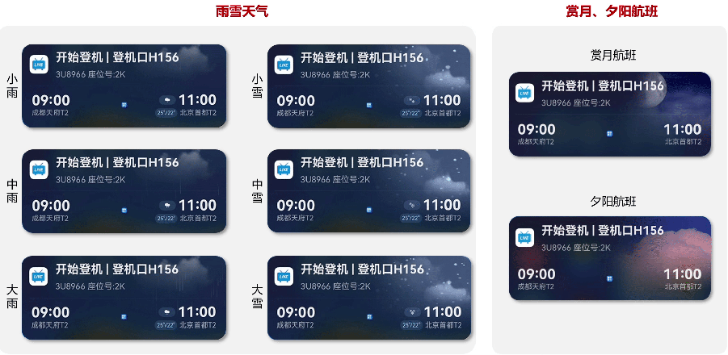
代码示例如下： 构建LiveViewController后，请在代码中初始化LiveViewController并调用LiveViewController.startLiveView()方法。
```text
import { liveViewManager } from '@kit.LiveViewKit';
import { Want, wantAgent } from '@kit.AbilityKit';

export class LiveViewController {
  public async startLiveView(): Promise {
    // 校验实况窗开关是否打开
    if (!await LiveViewController.isLiveViewEnabled()) {
      throw new Error("Live view is disabled.");
    }
    // 创建实况窗
    const defaultView = await LiveViewController.buildDefaultView();
    return await liveViewManager.startLiveView(defaultView);
  }

  private static async buildDefaultView() : Promise  {
    return {
      id : 6, // 实况窗ID，开发者生成。
      event : "FLIGHT", // 实况窗的应用场景。FLIGHT：航班。
      liveViewData : {
        primary : {
          title : "计划出发",
          content : [
            { text : "登机口"},
            { text : "32", textColor: "#FF0A59F7" },
            { text : "| 座位"},
            { text : " 17H", textColor: "#FF0A59F7" }
          ], // 设置textColor字段时，所有拥有textColor字段的对象仅能设置同一种颜色，不设置textColor时，默认展示#FF000000
          keepTime : 15,
          clickAction : await LiveViewController.buildWantAgent(),
          backgroundType : liveViewManager.BackgroundType.SYS_BACKGROUND_FLIGHT_SUNSET,  // 当传入实况窗卡片的背景氛围类型参数backgroundType值为赏月航班或夕阳航班时，且同时传入天气类型(WeatherInfo)为雨、雪特殊天气，卡片上优先展示天气背景，其余非特殊天气在卡片上展示赏月航班或夕阳航班背景氛围。
          layoutData : {
            layoutType : liveViewManager.LayoutType.LAYOUT_TYPE_FLIGHT,
            weatherInfo : {
              weatherType : liveViewManager.WeatherType.WEATHER_TYPE_LIGHT_RAIN,
                    locationType : liveViewManager.WeatherLocationType.LOCATION_TYPE_DESTINATION,
              highTemperature : 30,
                    lowTemperature : -10
              },
            firstTitle: "09:00",
                  firstContent: "上海虹桥",
            lastTitle: "14:20",
            lastContent: "汉口",
            spaceIcon : "icon_plane.png",// 扩展区中间间隔图标，取值为“/resources/rawfile”路径下的文件名或image.PixelMap
            isHorizontalLineDisplayed : false,
            additionalText : "以上信息仅供参考" // 扩展区底部内容，仅可用于左右文本模板。
          }
        }
      }
    };
  }

  private static async isLiveViewEnabled(): Promise {
    return await liveViewManager.isLiveViewEnabled();
  }

  private static async buildWantAgent(): Promise {
    const wantAgentInfo: wantAgent.WantAgentInfo = {
      wants: [
        {
          bundleName: 'xxx.xxx.xxx', // 应用实际bundleName
          abilityName: 'EntryAbility'
        } as Want
      ],
      actionType: wantAgent.OperationType.START_ABILITIES,
      requestCode: 0,
      actionFlags: [wantAgent.WantAgentFlags.UPDATE_PRESENT_FLAG]
    };
    const agent = await wantAgent.getWantAgent(wantAgentInfo);
    return agent;
  }
}
```


## 赛事比分模板

赛事比分模板适用于赛事场景。
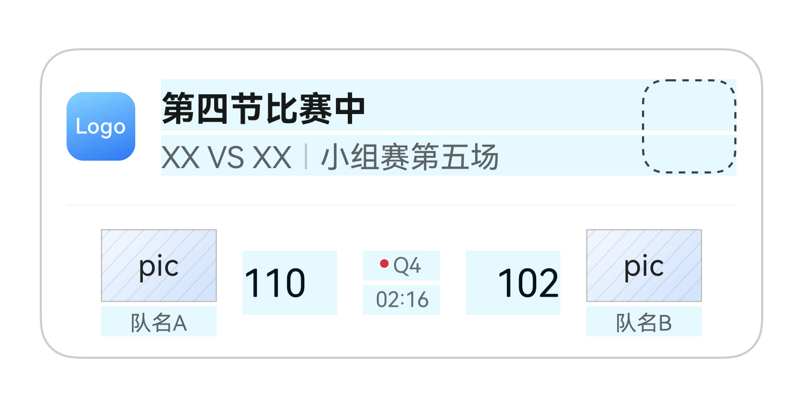
示例代码如下： 构建LiveViewController后，请在代码中初始化LiveViewController并调用LiveViewController.startLiveView()方法。
```text
import { liveViewManager } from '@kit.LiveViewKit';
import { Want, wantAgent } from '@kit.AbilityKit';

export class LiveViewController {
  public async startLiveView(): Promise {
    // 校验实况窗开关是否打开
    if (!await LiveViewController.isLiveViewEnabled()) {
      throw new Error("Live view is disabled.");
    }
    // 创建实况窗
    const defaultView = await LiveViewController.buildDefaultView();
    return await liveViewManager.startLiveView(defaultView);
  }

  private static async buildDefaultView(): Promise {
    return {
      // 构造实况窗请求体
      id: 0, // 实况窗ID，开发者生成。
      event: "SCORE", // 实况窗的应用场景。SCORE：赛事比分。
      liveViewData: {
        primary: {
          title: "第四节比赛中",
          content: [
            { text: "XX", textColor:"#FF0A59F7" },
            { text: " VS " },
            { text: "XX", textColor:"#FF0A59F7" },
            { text: " | " },
            { text: "小组赛 第五场", textColor:"#FF0A59F7" }
          ],
          keepTime: 1,
          clickAction: await LiveViewController.buildWantAgent(),
          layoutData: {
            layoutType: liveViewManager.LayoutType.LAYOUT_TYPE_SCORE,
            hostName: "队名A",
            hostIcon: "host.png", // 扩展区左侧图标，取值为“/resources/rawfile”路径下的文件名或image.PixelMap
            hostScore: "110",
            guestName: "队名B",
            guestIcon: "guest.png", // 扩展区右侧图标，取值为“/resources/rawfile”路径下的文件名或image.PixelMap
            guestScore: "102",
            competitionDesc: [
              { text: "●", textColor: "#FFFF0000" },
              { text: "Q4" }
            ],
            competitionTime: "02:16",
            isHorizontalLineDisplayed: true
          }
        }
      }
    };
  }

  private static async isLiveViewEnabled(): Promise {
    return await liveViewManager.isLiveViewEnabled();
  }

  private static async buildWantAgent(): Promise {
    const wantAgentInfo: wantAgent.WantAgentInfo = {
      wants: [
        {
          bundleName: 'xxx.xxx.xxx', // 应用实际bundleName
          abilityName: 'EntryAbility'
        } as Want
      ],
      actionType: wantAgent.OperationType.START_ABILITIES,
      requestCode: 0,
      actionFlags: [wantAgent.WantAgentFlags.UPDATE_PRESENT_FLAG]
    };
    const agent = await wantAgent.getWantAgent(wantAgentInfo);
    return agent;
  }
}
```


## 导航模板

导航模板适用于出行导航场景。
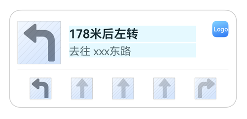
示例代码如下： 构建LiveViewController后，请在代码中初始化LiveViewController并调用LiveViewController.startLiveView()方法。
```text
import { liveViewManager } from '@kit.LiveViewKit';
import { Want, wantAgent } from '@kit.AbilityKit';

export class LiveViewController {
  public async startLiveView(): Promise {
    // 校验实况窗开关是否打开
    if (!await LiveViewController.isLiveViewEnabled()) {
      throw new Error("Live view is disabled.");
    }
    // 创建实况窗
    const defaultView = await LiveViewController.buildDefaultView();
    return await liveViewManager.startLiveView(defaultView);
  }

  private static async buildDefaultView(): Promise {
    return {
      // 构造实况窗请求体
      id: 0, // 实况窗ID，开发者生成。
      event: "NAVIGATION", // 实况窗的应用场景。NAVIGATION：导航。
      liveViewData: {
        primary: {
          title: "178米后左转",
          content: [
            { text: "去往"},
            { text: " 南京东路", textColor: "#FF0A59F7" }
          ],
          keepTime: 15,
          clickAction: await LiveViewController.buildWantAgent(),
          layoutData: {
            layoutType: liveViewManager.LayoutType.LAYOUT_TYPE_NAVIGATION,
            currentNavigationIcon: "navigation.png", // 当前导航方向，取值为“/resources/rawfile”路径下的文件名或image.PixelMap
            navigationIcons: ["left.png","straight.png","straight.png","right.png"] // 导航方向的箭头集合图片，每个元素取值为“/resources/rawfile”路径下的文件名或image.PixelMap
          }
        }
      }
    };
  }

  private static async isLiveViewEnabled(): Promise {
    return await liveViewManager.isLiveViewEnabled();
  }

  private static async buildWantAgent(): Promise {
    const wantAgentInfo: wantAgent.WantAgentInfo = {
      wants: [
        {
          bundleName: 'xxx.xxx.xxx', // 应用实际bundleName
          abilityName: 'EntryAbility'
        } as Want
      ],
      actionType: wantAgent.OperationType.START_ABILITIES,
      requestCode: 0,
      actionFlags: [wantAgent.WantAgentFlags.UPDATE_PRESENT_FLAG]
    };
    const agent = await wantAgent.getWantAgent(wantAgentInfo);
    return agent;
  }
}
```


## 基于地理位置的实况窗提醒

基于地理位置的实况窗提醒适用于打卡、快递等场景。 从6.1.0(23)开始，支持基于地理位置的实况窗提醒，在添加由地理围栏条件触发的实况窗后，满足以下条件可以触发创建或结束实况窗。 进入地理围栏。 离开地理围栏。 进入地理围栏并持续时间大于延迟触发时间。 离开地理围栏并持续时间大于延迟触发时间。 构建LiveViewController后，请在代码中初始化LiveViewController并调用LiveViewController.startLiveViewByTrigger()方法添加由地理围栏条件触发创建的实况窗。 代码示例如下：
```text
import { liveViewManager } from '@kit.LiveViewKit';
import { Want, wantAgent } from '@kit.AbilityKit';
import { geoLocationManager } from '@kit.LocationKit';

export class LiveViewController {
  public async startLiveViewByTrigger(): Promise {
    // 校验实况窗开关是否打开
    if (!await LiveViewController.isLiveViewEnabled()) {
      throw new Error("Live view is disabled.");
    }
    // 校验实况窗地理围栏开关是否打开
    if (!await LiveViewController.isGeofenceTriggerEnabled()) {
      throw new Error("Live view geofence trigger is disabled.");
    }
    // 校验GPS开关是否打开
    if (!geoLocationManager.isLocationEnabled()) {
      throw new Error("Live view geofence trigger is disabled.");
    }
    // 创建实况窗
    const defaultView = await LiveViewController.buildDefaultView();
    const trigger = await LiveViewController.buildTrigger();
    return await liveViewManager.startLiveViewByTrigger(defaultView, trigger);
  }

  private static async buildDefaultView(): Promise {
    return {
      // 构造实况窗请求体
      id: 0, // 实况窗ID，开发者生成。
      event: "EXPRESS", // 实况窗的应用场景。EXPRESS：快递。
      liveViewData: {
        primary: {
          title: "快递已送达",
          content: [
            { text: "请前往" },
            { text: " XXX店 ", textColor: "#FF0A59F7" },
            { text: "取快递" },
          ],
          keepTime: 15,
          clickAction: await LiveViewController.buildWantAgent(),
          layoutData: {
            layoutType: liveViewManager.LayoutType.LAYOUT_TYPE_PICKUP,
            title: "快递码",
            content: "72988",
            underlineColor: "#FF0A59F7",
            descPic: "express.png" // 扩展区右侧产品描述图，取值为“/resources/rawfile”路径下的文件名或image.PixelMap
          }
        }
      }
    };
  }

  private static async buildTrigger(): Promise {
    return {
      // 构造基于地理位置的实况窗提醒的触发条件
      type: liveViewManager.TriggerType.TRIGGER_TYPE_GEOFENCE,
      displayTime: 15,
      condition: {
        // 触发条件：设备进入坐标点半径2000米范围内
        longitude: 116.3971356415625,
        latitude: 39.91800603311188,
        coordinateSystemType: liveViewManager.CoordinateSystemType.COORDINATE_TYPE_GCJ02,
        monitorEvent: liveViewManager.MonitorEvent.MONITOR_TYPE_ENTRY,
        radius: 2000,
        delayTime: 0
      }
    }
  }

  private static async isLiveViewEnabled(): Promise {
    return await liveViewManager.isLiveViewEnabled();
  }

  private static async isGeofenceTriggerEnabled(): Promise {
    return await liveViewManager.isGeofenceTriggerEnabled();
  }

  private static async buildWantAgent(): Promise {
    const wantAgentInfo: wantAgent.WantAgentInfo = {
      wants: [
        {
          bundleName: 'xxx.xxx.xxx', // 应用实际bundleName
          abilityName: 'EntryAbility'
        } as Want
      ],
      actionType: wantAgent.OperationType.START_ABILITIES,
      requestCode: 0,
      actionFlags: [wantAgent.WantAgentFlags.UPDATE_PRESENT_FLAG]
    };
    const agent = await wantAgent.getWantAgent(wantAgentInfo);
    return agent;
  }
}
```

调用LiveViewController.stopLiveViewByTrigger()方法添加由地理围栏条件触发结束的实况窗。 代码示例如下：
```text
import { liveViewManager } from '@kit.LiveViewKit';
import { Want, wantAgent } from '@kit.AbilityKit';
import { geoLocationManager } from '@kit.LocationKit';

export class LiveViewController {
  public async startLiveView(): Promise {
    // 校验实况窗开关是否打开
    if (!await LiveViewController.isLiveViewEnabled()) {
      throw new Error("Live view is disabled.");
    }
    // 创建实况窗
    const defaultView = await LiveViewController.buildDefaultView();
    return await liveViewManager.startLiveView(defaultView);
  }

  public async stopLiveViewByTrigger(): Promise {
    // 校验实况窗开关是否打开
    if (!await LiveViewController.isLiveViewEnabled()) {
      throw new Error("Live view is disabled.");
    }
    // 校验实况窗地理围栏开关是否打开
    if (!await LiveViewController.isGeofenceTriggerEnabled()) {
      throw new Error("Live view geofence trigger is disabled.");
    }
    // 校验GPS开关是否打开
    if (!geoLocationManager.isLocationEnabled()) {
      throw new Error("Live view geofence trigger is disabled.");
    }
    // 本地结束地理围栏延时实况窗
    const defaultView = await LiveViewController.buildDefaultView();
    defaultView.liveViewData.primary.title = '快递已取完';
    defaultView.liveViewData.primary.content = [
      { text: '感谢您的认可'}
    ];
    const trigger = await LiveViewController.buildTrigger();
    trigger.condition.monitorEvent = liveViewManager.MonitorEvent.MONITOR_TYPE_LEAVE;
    return await liveViewManager.stopLiveViewByTrigger(defaultView, trigger);
  }

  private static async buildDefaultView(): Promise {
    return {
      // 构造实况窗请求体
      id: 0, // 实况窗ID，开发者生成。
      event: "EXPRESS", // 实况窗的应用场景。EXPRESS：快递。
      liveViewData: {
        primary: {
          title: "快递已送达",
          content: [
            { text: "请前往" },
            { text: " XXX店 ", textColor: "#FF0A59F7" },
            { text: "取快递" },
          ],
          keepTime: 15,
          clickAction: await LiveViewController.buildWantAgent(),
          layoutData: {
            layoutType: liveViewManager.LayoutType.LAYOUT_TYPE_PICKUP,
            title: "快递码",
            content: "72988",
            underlineColor: "#FF0A59F7",
            descPic: "express.png" // 扩展区右侧产品描述图，取值为“/resources/rawfile”路径下的文件名或image.PixelMap
          }
        }
      }
    };
  }

  private static async buildTrigger(): Promise {
    return {
      // 构造基于地理位置的实况窗提醒的触发条件
      type: liveViewManager.TriggerType.TRIGGER_TYPE_GEOFENCE,
      displayTime: 15,
      condition: {
        // 触发条件：设备进入坐标点半径2000米范围内
        longitude: 116.3971356415625,
        latitude: 39.91800603311188,
        coordinateSystemType: liveViewManager.CoordinateSystemType.COORDINATE_TYPE_GCJ02,
        monitorEvent: liveViewManager.MonitorEvent.MONITOR_TYPE_ENTRY,
        radius: 2000,
        delayTime: 0
      }
    }
  }

  private static async isLiveViewEnabled(): Promise {
    return await liveViewManager.isLiveViewEnabled();
  }

  private static async isGeofenceTriggerEnabled(): Promise {
    return await liveViewManager.isGeofenceTriggerEnabled();
  }

  private static async buildWantAgent(): Promise {
    const wantAgentInfo: wantAgent.WantAgentInfo = {
      wants: [
        {
          bundleName: 'xxx.xxx.xxx', // 应用实际bundleName
          abilityName: 'EntryAbility'
        } as Want
      ],
      actionType: wantAgent.OperationType.START_ABILITIES,
      requestCode: 0,
      actionFlags: [wantAgent.WantAgentFlags.UPDATE_PRESENT_FLAG]
    };
    const agent = await wantAgent.getWantAgent(wantAgentInfo);
    return agent;
  }
}
```


> [!NOTE]
> 结束地理围栏实况消息，复用原有stopLiveView接口，支持结束所有实况。 更新地理围栏实况消息，复用原有updateLiveView接口，已经调用stopLiveViewByTrigger后实况不支持调用updateLiveView更新。 查询地理围栏实况消息，复用原有getActiveLiveView接口。


## 实况胶囊

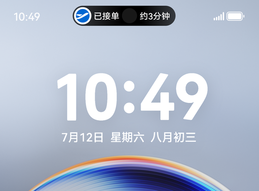
> [!NOTE]
> 胶囊形态各模板参数固定，与创建实况窗时的模板类型无关。可创建的胶囊类型有：文本胶囊、计时器胶囊、进度胶囊，详情请参见CapsuleData。

除了实况窗卡片形态，开发者还需考虑实况窗胶囊形态的展示效果。若开发者创建实况窗时还想同步创建实况窗胶囊，则需在liveViewManager.[LiveView](https://developer.huawei.com/consumer/cn/doc/harmonyos-references/liveview-liveviewmanager#liveview)（结构体）中携带胶囊所需的参数liveViewData.[capsule](https://developer.huawei.com/consumer/cn/doc/harmonyos-references/liveview-liveviewmanager#liveviewdata)（不同胶囊类型携带不同的参数）。示例代码如下：
```text
import { liveViewManager } from '@kit.LiveViewKit';
import { Want, wantAgent } from '@kit.AbilityKit';

export class LiveViewController {
  public async startLiveView(): Promise {
    // 校验实况窗开关是否打开
    if (!await LiveViewController.isLiveViewEnabled()) {
      throw new Error("Live view is disabled.");
    }
    // 创建实况窗
    const defaultView = await LiveViewController.buildDefaultView();
    return await liveViewManager.startLiveView(defaultView);
  }

  private static async buildDefaultView(): Promise {
    return {
      // 构造实况窗请求体
      id: 0, // 实况窗ID，开发者生成。
      event: "TAXI", // 实况窗的应用场景。TAXI：出行打车。
      liveViewData: {
        primary: {
          title: "司机预计5分钟后到达",
          content: [
            { text: "白", textColor: "#FF0A59F7" },
            { text: "●" },
            { text: "沪AXXXXXX", textColor: "#FF0A59F7" }
          ],
          keepTime: 15,
          clickAction: await LiveViewController.buildWantAgent(),
          layoutData: {
            layoutType: liveViewManager.LayoutType.LAYOUT_TYPE_PROGRESS,
            progress: 30,
            color: "#ff0959F8",
            backgroundColor: "#ffc9d7e4",
            indicatorType: liveViewManager.IndicatorType.INDICATOR_TYPE_UP,
            indicatorIcon: "indicator.png", // 进度条指示器图标，取值为“/resources/rawfile”路径下的文件名或image.PixelMap
            lineType: liveViewManager.LineType.LINE_TYPE_NORMAL_SOLID_LINE,
            nodeIcons: ["icon_1.png", "icon_2.png", "icon_3.png"] // 进度条节点图标集合，每个元素取值为“/resources/rawfile”路径下的文件名或image.PixelMap
          }
        },
        // 实况胶囊相关参数
        capsule: {
          type: liveViewManager.CapsuleType.CAPSULE_TYPE_TEXT,
          status: 1,
          icon: "capsule_store.png", // 胶囊图标，取值为“/resources/rawfile”路径下的文件名或image.PixelMap
          backgroundColor: "#ff0959F8",
          title: "5分钟"
        }
      }
    };
  }

  private static async isLiveViewEnabled(): Promise {
    return await liveViewManager.isLiveViewEnabled();
  }

  private static async buildWantAgent(): Promise {
    const wantAgentInfo: wantAgent.WantAgentInfo = {
      wants: [
        {
          bundleName: 'xxx.xxx.xxx', // 应用实际bundleName
          abilityName: 'EntryAbility'
        } as Want
      ],
      actionType: wantAgent.OperationType.START_ABILITIES,
      requestCode: 0,
      actionFlags: [wantAgent.WantAgentFlags.UPDATE_PRESENT_FLAG]
    };
    const agent = await wantAgent.getWantAgent(wantAgentInfo);
    return agent;
  }
}
```


## 小折叠外屏实况窗

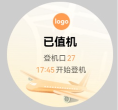
外屏实况窗适用于在小折叠屏的外屏显示实况窗的简要信息，方便用户可以在折叠状态便捷查看。 若开发者创建实况窗时需要同步创建，则需在liveViewManager.[LiveView](https://developer.huawei.com/consumer/cn/doc/harmonyos-references/liveview-liveviewmanager#liveview)（结构体）中携带外屏所需的参数liveViewData.[external](https://developer.huawei.com/consumer/cn/doc/harmonyos-references/liveview-liveviewmanager#liveviewdata)。示例代码如下：
```text
import { liveViewManager } from '@kit.LiveViewKit';
import { Want, wantAgent } from '@kit.AbilityKit';

export class LiveViewController {
  public async startLiveView(): Promise {
    // 校验实况窗开关是否打开
    if (!await LiveViewController.isLiveViewEnabled()) {
      throw new Error("Live view is disabled.");
    }
    // 创建实况窗
    const defaultView = await LiveViewController.buildDefaultView();
    return await liveViewManager.startLiveView(defaultView);
  }

  private static async buildDefaultView(): Promise {
    return {
      // 构造实况窗请求体
      id: 0, // 实况窗ID，开发者生成。
      event: "FLIGHT", // 实况窗的应用场景。FLIGHT：航班
      liveViewData: {
        primary: {
          title: "航班XXX 已值机",
          content: [
            { text: '登机口', },
            { text: '27 17:45', textColor: '#FFFF9C4F' },
            { text: '开始登机' }
          ], // 设置textColor字段时，所有拥有textColor字段的对象仅能设置同一种颜色，不设置textColor时，默认展示#FF000000
          keepTime: 15,
          clickAction: await LiveViewController.buildWantAgent(),
          layoutData: {
            layoutType: liveViewManager.LayoutType.LAYOUT_TYPE_FLIGHT,
            firstTitle: "18:15",
            firstContent: "上海",
            lastTitle: "20:30",
            lastContent: "成都",
            spaceIcon: "icon.png", // 扩展区中间间隔图标，取值为“/resources/rawfile”路径下的文件名或image.PixelMap
            isHorizontalLineDisplayed: true,
            additionalText: "以上信息仅供参考" // 扩展区底部内容，仅可用于左右文本模板
          }
        },
        external: {
          title: "已值机",
          content: [
            { text: '登机口' },
            { text: '27\n', textColor: '#FFFF9C4F' },
            { text: '17:45', textColor: '#FFFF9C4F' },
            { text: '开始登机' }
          ],
          type: liveViewManager.ExternalType.BACKGROUND_PICTURE, // 外屏实况的背景样式类型
          backgroundPicture: 'airplane.png' // 外屏实况的背景图片，取值为“/resources/rawfile”路径下的文件名或image.PixelMap
        }
      }
    };
  }

  private static async isLiveViewEnabled(): Promise {
    return await liveViewManager.isLiveViewEnabled();
  }

  private static async buildWantAgent(): Promise {
    const wantAgentInfo: wantAgent.WantAgentInfo = {
      wants: [
        {
          bundleName: 'xxx.xxx.xxx', // 应用实际bundleName
          abilityName: 'EntryAbility'
        } as Want
      ],
      actionType: wantAgent.OperationType.START_ABILITIES,
      requestCode: 0,
      actionFlags: [wantAgent.WantAgentFlags.UPDATE_PRESENT_FLAG]
    };
    const agent = await wantAgent.getWantAgent(wantAgentInfo);
    return agent;
  }
}
```


## 实况窗计时器

实况窗计时器适用于排队、抢票等场景。 开发者若需要使用实况窗计时器，则需在liveViewManager.[LiveView](https://developer.huawei.com/consumer/cn/doc/harmonyos-references/liveview-liveviewmanager#liveview)（结构体）中配置[timer](https://developer.huawei.com/consumer/cn/doc/harmonyos-references/liveview-liveviewmanager#liveview)字段，并在当前支持的字段中使用占位符：**\${placeholder.timer}**。 例如：固定区的文本内容中使用占位符，系统将替代占位符为实况窗计时器。
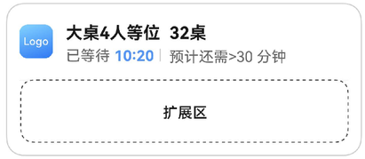
示例代码如下： 构建LiveViewController后，请在代码中初始化LiveViewController并调用LiveViewController.startLiveView()方法。
```text
import { liveViewManager } from '@kit.LiveViewKit';
import { Want, wantAgent } from '@kit.AbilityKit';

export class LiveViewController {
  public async startLiveView(): Promise {
    // 校验实况窗开关是否打开
    if (!await LiveViewController.isLiveViewEnabled()) {
      throw new Error("Live view is disabled.");
    }
    // 创建实况窗
    const defaultView = await LiveViewController.buildDefaultView();
    return await liveViewManager.startLiveView(defaultView);
  }

  private static async buildDefaultView(): Promise {
    return {
      // 构造实况窗请求体
      id: 0, // 实况窗ID，开发者生成。
      event: "QUEUE", // 实况窗的应用场景。QUEUE：排队
      timer: {
        time: 620000,
        isCountdown: false,
        isPaused: false
      },
      liveViewData: {
        primary: {
          title: "大桌4人等位  32桌",
          content: [
            { text: "已等待 " },
            { text: "${placeholder.timer}", textColor:"#ff10c1f7" },
            { text: " | 预计还需>30分钟" }
          ], // 设置textColor字段时，所有拥有textColor字段的对象仅能设置同一种颜色，不设置textColor时，默认展示#FF000000
          keepTime: 15,
          clickAction: await LiveViewController.buildWantAgent(),
          layoutData: {
            layoutType: liveViewManager.LayoutType.LAYOUT_TYPE_PROGRESS,
            progress: 0,
            color: "#FFFF0000",
            backgroundColor: "#FF000000",
            indicatorType: liveViewManager.IndicatorType.INDICATOR_TYPE_OVERLAY,
            indicatorIcon: "indicator.png", // 进度条指示器图标，取值为“/resources/rawfile”路径下的文件名或image.PixelMap
            lineType: liveViewManager.LineType.LINE_TYPE_DOTTED_LINE,
            nodeIcons: ["icon_1.png","icon_2.png"] // 进度条节点图标集合，每个元素取值为“/resources/rawfile”路径下的文件名或image.PixelMap
          }
        }
      }
    };
  }

  private static async isLiveViewEnabled(): Promise {
    return await liveViewManager.isLiveViewEnabled();
  }

  private static async buildWantAgent(): Promise {
    const wantAgentInfo: wantAgent.WantAgentInfo = {
      wants: [
        {
          bundleName: 'xxx.xxx.xxx', // 应用实际bundleName
          abilityName: 'EntryAbility'
        } as Want
      ],
      actionType: wantAgent.OperationType.START_ABILITIES,
      requestCode: 0,
      actionFlags: [wantAgent.WantAgentFlags.UPDATE_PRESENT_FLAG]
    };
    const agent = await wantAgent.getWantAgent(wantAgentInfo);
    return agent;
  }
}
```


## 点击实况窗动作

请调用wantAgent.[getWantAgent](https://developer.huawei.com/consumer/cn/doc/harmonyos-references/js-apis-app-ability-wantagent#wantagentgetwantagent-1)()构造点击动作字段所需的参数值，当前实况窗支持的点击动作如下： 点击实况窗的默认动作：在liveViewManager.[LiveView](https://developer.huawei.com/consumer/cn/doc/harmonyos-references/liveview-liveviewmanager#liveview)（结构体）中携带胶囊所需的参数liveViewData.primary.[clickAction](https://developer.huawei.com/consumer/cn/doc/harmonyos-references/liveview-liveviewmanager#primarydata)字段。 点击辅助区的跳转动作：在liveViewManager.[LiveView](https://developer.huawei.com/consumer/cn/doc/harmonyos-references/liveview-liveviewmanager#liveview)（结构体）中携带胶囊所需的参数liveViewData.primary.extensionData.[clickAction](https://developer.huawei.com/consumer/cn/doc/harmonyos-references/liveview-liveviewmanager#extensiondata)字段。

## 本地更新和结束实况窗

调用[liveViewManager.isLiveViewEnabled](https://developer.huawei.com/consumer/cn/doc/harmonyos-references/liveview-liveviewmanager#liveviewmanagerisliveviewenabled)()确认实况窗开关打开后，调用liveViewManager的[updateLiveView](https://developer.huawei.com/consumer/cn/doc/harmonyos-references/liveview-liveviewmanager#liveviewmanagerupdateliveview)更新实况窗，调用[stopLiveView](https://developer.huawei.com/consumer/cn/doc/harmonyos-references/liveview-liveviewmanager#liveviewmanagerstopliveview)结束实况窗。更新时需要修改请求体中对应的参数。示例代码如下：
```text
import { liveViewManager } from '@kit.LiveViewKit';
import { Want, wantAgent } from '@kit.AbilityKit';

export class LiveViewController {
  private static contentColor: string = '#FF000000';
  private static capsuleColor: string = '#FF308977';

  public async startLiveView(): Promise {
    // 校验实况窗开关是否打开
    if (!await LiveViewController.isLiveViewEnabled()) {
      throw new Error("Live view is disabled.");
    }
    // 创建实况窗
    const defaultView = await LiveViewController.buildDefaultView();
    return await liveViewManager.startLiveView(defaultView);
  }

  public async updateLiveView(): Promise {
    // 校验实况窗开关是否打开
    if (!await LiveViewController.isLiveViewEnabled()) {
      throw new Error("Live view is disabled.");
    }
    // 修改实况窗内容
    const defaultView = await LiveViewController.buildDefaultView();
    defaultView.liveViewData.primary.title = "预计23:49送达";
    defaultView.liveViewData.primary.content = [
      { text: "等待商家接单， " },
      { text: "03:20", textColor: "#FFFF9C4F" },
      { text: " 未接单自动取消" },
    ];
    defaultView.liveViewData.primary.layoutData = {
      layoutType: liveViewManager.LayoutType.LAYOUT_TYPE_PROGRESS,
      progress: 0,
      lineType: 0,
      nodeIcons: [
        'icon_store_white.png',
        'icon_finish.png'
      ] // 进度条节点图标集合，每个元素取值为“/resources/rawfile”路径下的文件名或image.PixelMap
    };
    defaultView.liveViewData.capsule = {
      type: liveViewManager.CapsuleType.CAPSULE_TYPE_TEXT,
      status: 1,
      icon: 'capsule_store.png', // 实况胶囊的图标，取值为“/resources/rawfile”路径下的文件名或image.PixelMap
      backgroundColor: LiveViewController.capsuleColor,
      title: "待接单"
    };
    // 更新实况窗
    return await liveViewManager.updateLiveView(defaultView);
  }

  public async stopLiveView(): Promise {
    // 校验实况窗开关是否打开
    if (!await LiveViewController.isLiveViewEnabled()) {
      throw new Error("Live view is disabled.");
    }
    // 修改实况窗内容
    const defaultView = await LiveViewController.buildDefaultView();
    defaultView.liveViewData.primary.title = '商品已送达';
    defaultView.liveViewData.primary.content = [
      { text: '感谢您的认可，' },
      { text: '期待下一次光临' }
    ];
    defaultView.liveViewData.primary.layoutData = {
      layoutType: liveViewManager.LayoutType.LAYOUT_TYPE_PROGRESS,
      progress: 100,
      lineType: 0,
      nodeIcons: [
        'icon_order.png',
        'icon_finish.png'
      ] // 进度条节点图标集合，每个元素取值为“/resources/rawfile”路径下的文件名或image.PixelMap
    };
    defaultView.liveViewData.capsule = {
      type: liveViewManager.CapsuleType.CAPSULE_TYPE_TEXT,
      status: 1,
      icon: 'capsule_gps.png', // 实况胶囊的图标，取值为“/resources/rawfile”路径下的文件名或image.PixelMap
      backgroundColor: LiveViewController.capsuleColor,
      title: '已送达'
    };
    // 结束实况窗
    return await liveViewManager.stopLiveView(defaultView);
  }

  private static async buildDefaultView(): Promise {
    return {
      // 构造实况窗请求体
      id: 0, // 实况窗ID，开发者生成。
      event: "DELIVERY", // 实况窗的应用场景。DELIVERY：即时配送（外卖、生鲜）
      liveViewData: {
        primary: {
          title: "餐品待支付",
          content: [
            { text: "咖啡 ", textColor: "#FF0A59F7" },
            { text: "等2件商品" }
          ],
          keepTime: 15,
          clickAction: await LiveViewController.buildWantAgent(),
          layoutData: {
            layoutType: liveViewManager.LayoutType.LAYOUT_TYPE_PICKUP,
            title: "待支付金额",
            content: "25.5元",
            underlineColor: "#FF0A59F7",
            descPic: "coffee.png" // 扩展区右侧产品描述图，取值为“/resources/rawfile”路径下的文件名或image.PixelMap
          }
        },
        // 实况胶囊相关参数
        capsule: {
          type: liveViewManager.CapsuleType.CAPSULE_TYPE_TEXT,
          status: 1,
          icon: "capsule_store.png", // 实况胶囊的图标，取值为“/resources/rawfile”路径下的文件名或image.PixelMap
          backgroundColor: "#FF308977",
          title: "待支付"
        }
      }
    };
  }

  private static async isLiveViewEnabled(): Promise {
    return await liveViewManager.isLiveViewEnabled();
  }

  private static async buildWantAgent(): Promise {
    const wantAgentInfo: wantAgent.WantAgentInfo = {
      wants: [
        {
          bundleName: 'xxx.xxx.xxx', // 应用实际bundleName
          abilityName: 'EntryAbility'
        } as Want
      ],
      actionType: wantAgent.OperationType.START_ABILITIES,
      requestCode: 0,
      actionFlags: [wantAgent.WantAgentFlags.UPDATE_PRESENT_FLAG]
    };
    const agent = await wantAgent.getWantAgent(wantAgentInfo);
    return agent;
  }
}
```

更详细的参数请参考[Live View Kit ArkTS API参考](https://developer.huawei.com/consumer/cn/doc/harmonyos-references/liveview-liveviewmanager)。
> [!NOTE]
> 以上是应用在本地创建、更新和结束实况窗通知的全部流程。此外，应用也可以通过Push Kit实现远程创建、更新和结束实况窗消息。
