# 构建本地实况窗

更新时间：2026-06-12 06:54:11

来源：https://developer.huawei.com/consumer/cn/doc/harmonyos-guides/liveview-create-locally

#### 简介

开发者可以通过[liveViewManager](https://developer.huawei.com/consumer/cn/doc/harmonyos-references/liveview-liveviewmanager)模块构建本地实况窗，完成实况窗的整个生命周期流程（包括创建、更新与结束）。请注意，只有应用在前台运行，即用户实际使用应用并且产生了服务合约的情况下，开发者才可以创建实况窗；与此同时，本地更新或结束实况窗依赖于开发者的应用进程，所以我们更推荐开发者在本地创建实况窗后使用Push Kit更新或结束实况窗。

> [!NOTE]
> Live View Kit提供了“出行打车/即时配送/航班/高铁火车/排队叫号/取餐/赛事比分/共享租赁/计时/运动锻炼/导航/打卡/快递”共13个场景的包含实况窗整个生命周期流程的示例代码，如开发者想在正式开发实况窗前先行体验效果，请参考 实况窗SampleCode 。 其中打卡和快递场景基于地理位置的实况窗提醒，从6.1.0(23)开始支持。


#### 导入liveViewManager

在项目中导入[liveViewManager](https://developer.huawei.com/consumer/cn/doc/harmonyos-references/liveview-liveviewmanager)，并新建实况窗控制类（例如LiveViewController），构造isLiveViewEnabled()方法，用于校验实况窗开关（设置>应用和元服务>应用名>实况窗）是否打开。打开实况窗开关是创建实况窗的前提条件。示例代码如下：

```text
import { liveViewManager } from '@kit.LiveViewKit';

export class LiveViewController {
  public static async isLiveViewEnabled(): Promise<boolean> {
    return await liveViewManager.isLiveViewEnabled();
  }
}
```


#### 创建实况窗

实况窗根据扩展区不同共有5种样式模板：进度可视化模板、强调文本模板、左右文本模板、赛事比分模板和导航模板。

调用[liveViewManager.startLiveView](https://developer.huawei.com/consumer/cn/doc/harmonyos-references/liveview-liveviewmanager#liveviewmanagerstartliveview)创建实况窗，该API接口传入参数为实况窗实例（liveViewManager.[LiveView](https://developer.huawei.com/consumer/cn/doc/harmonyos-references/liveview-liveviewmanager#liveview)）。


#### 进度可视化模板

进度可视化模板适用于打车、外卖等场景。


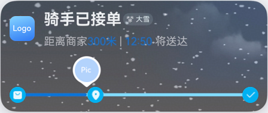


示例代码如下：

构建LiveViewController后，请在代码中初始化LiveViewController并调用LiveViewController.startLiveView()方法。

```json
import { liveViewManager } from '@kit.LiveViewKit';
import { Logger } from '../LogUtil';
import { ContextUtil } from '../ContextUtil';
import { BusinessError } from '@kit.BasicServicesKit';

export class ProgressLiveViewController {
  public async startLiveView(): Promise<boolean> {
    // 校验实况窗开关是否打开
    if (!await ProgressLiveViewController.isLiveViewEnabled()) {
      Logger.warn('startLiveView, live view is disabled.');
      return false;
    }
    // 创建实况窗
    try {
      const defaultView = await ProgressLiveViewController.buildDefaultView();
      if (!defaultView) {
        Logger.warn('buildDefaultView Failed.');
        return false;
      }
      Logger.info('Request startLiveView req: %{public}s', JSON.stringify(defaultView));
      const result = await liveViewManager.startLiveView(defaultView);
      Logger.info('Request startLiveView result: %{public}s', JSON.stringify(result));
      return true;
    } catch (e) {
      const err: BusinessError = e as BusinessError;
      Logger.error('Request startLiveView error: %{public}d %{public}s', err.code, err.message);
      return false;
    }
  }

  // ...

  private static async buildDefaultView() : Promise < liveViewManager.LiveView > {
    return {
      // 构造实况窗请求体
      id: 106, // 实况窗ID，开发者生成。
      event: 'DELIVERY', // 实况窗的应用场景。DELIVERY：即时配送（外卖、生鲜）
      isMute: false,
      liveViewData: {
        primary: {
          title: '骑手已接单',
          content: [
            { text: '距商家 ' },
            { text: '300 ', textColor: '#FF0A59F7' },
            { text: '米 | ' },
            { text: '3 ', textColor: '#FF0A59F7' },
            { text: '分钟到店' }
          ], // 设置textColor字段时，所有拥有textColor字段的对象仅能设置同一种颜色，不设置textColor时，默认展示#FF000000
          keepTime: 0,
          clickAction: await ContextUtil.buildWantAgent('GuideCode'),
          layoutData: {
            layoutType: liveViewManager.LayoutType.LAYOUT_TYPE_PROGRESS,
            weatherInfo : {
              weatherType : liveViewManager.WeatherType.WEATHER_TYPE_LIGHT_RAIN,
              locationType : liveViewManager.WeatherLocationType.LOCATION_TYPE_LOCAL,
            },
            progress: 40,
            color: '#FF317AF7',
            backgroundColor: '#f7819ae0',
            indicatorType: liveViewManager.IndicatorType.INDICATOR_TYPE_UP,
            indicatorIcon: 'icon_rider.png', // 进度条指示器图标，取值为“/resources/rawfile”路径下的文件名或image.PixelMap
            lineType: liveViewManager.LineType.LINE_TYPE_DOTTED_LINE,
            nodeIcons: ['icon_order.png', 'icon_store_white.png', 'icon_finish.png'] // 进度条每个节点图标，取值为“/resources/rawfile”路径下的文件名或image.PixelMap
          }
        }
      }
    };
  }

  private static async isLiveViewEnabled(): Promise<boolean> {
    let result: boolean = false;
    try {
      result = await liveViewManager.isLiveViewEnabled();
    } catch (e) {
      const err: BusinessError = e as BusinessError;
      Logger.error('Request isLiveViewEnabled error: %{public}d %{public}s', err.code, err.message);
    }
    Logger.info('Request isLiveViewEnabled result: %{public}s', result);
    return result;
  }
}
```

```json
import { common, Want, WantAgent, wantAgent } from '@kit.AbilityKit';
import { BusinessError } from '@kit.BasicServicesKit';
import { Logger } from './LogUtil';

export class ContextUtil {
  public static wantUrl: string | undefined;
  public static liveViewId: number;
  public static applicationContext: common.ApplicationContext;

  public static async buildWantAgent(page: string, liveViewId: number = -1): Promise<Want> {
    const wantAgentInfo: wantAgent.WantAgentInfo = {
      wants: [
        {
          bundleName: ContextUtil.applicationContext.applicationInfo.name,
          abilityName: 'EntryAbility',
          parameters: {
            page: page,
            liveViewId: liveViewId
          },
        } as Want
      ],
      actionType: wantAgent.OperationType.START_ABILITIES,
      requestCode: 0,
      actionFlags: [wantAgent.WantAgentFlags.UPDATE_PRESENT_FLAG]
    };
    try {
      const agent: WantAgent = await wantAgent.getWantAgent(wantAgentInfo);
      Logger.info('getWantAgent success! wantAgent: %{public}s', JSON.stringify(agent));
      return agent;
    } catch (e) {
      const err: BusinessError = e as BusinessError;
      Logger.error('getWantAgent failed! err: %{public}d %{public}s', err.code, err.message);
      throw e as Error;
    }
  }
}
```

从6.0.2(22)开始，实况窗卡片进度可视化模板支持显示雨、雪天气动效背景。


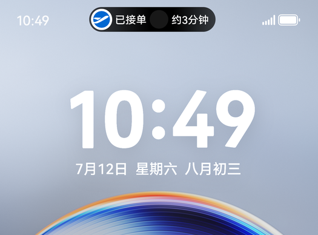


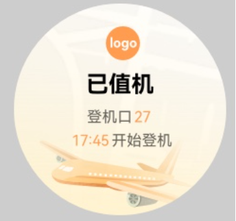


代码示例如下：

构建LiveViewController后，请在代码中初始化LiveViewController并调用LiveViewController.startLiveView()方法。

```json
import { liveViewManager } from '@kit.LiveViewKit';
import { Logger } from '../LogUtil';
import { ContextUtil } from '../ContextUtil';
import { BusinessError } from '@kit.BasicServicesKit';

export class ProgressLiveViewController {
  public async startLiveView(): Promise<boolean> {
    // 校验实况窗开关是否打开
    if (!await ProgressLiveViewController.isLiveViewEnabled()) {
      Logger.warn('startLiveView, live view is disabled.');
      return false;
    }
    // 创建实况窗
    try {
      const defaultView = await ProgressLiveViewController.buildDefaultView();
      if (!defaultView) {
        Logger.warn('buildDefaultView Failed.');
        return false;
      }
      Logger.info('Request startLiveView req: %{public}s', JSON.stringify(defaultView));
      const result = await liveViewManager.startLiveView(defaultView);
      Logger.info('Request startLiveView result: %{public}s', JSON.stringify(result));
      return true;
    } catch (e) {
      const err: BusinessError = e as BusinessError;
      Logger.error('Request startLiveView error: %{public}d %{public}s', err.code, err.message);
      return false;
    }
  }

  // ...

  private static async buildDefaultView() : Promise < liveViewManager.LiveView > {
    return {
      // 构造实况窗请求体
      id: 106, // 实况窗ID，开发者生成。
      event: 'DELIVERY', // 实况窗的应用场景。DELIVERY：即时配送（外卖、生鲜）
      isMute: false,
      liveViewData: {
        primary: {
          title: '骑手已接单',
          content: [
            { text: '距商家 ' },
            { text: '300 ', textColor: '#FF0A59F7' },
            { text: '米 | ' },
            { text: '3 ', textColor: '#FF0A59F7' },
            { text: '分钟到店' }
          ], // 设置textColor字段时，所有拥有textColor字段的对象仅能设置同一种颜色，不设置textColor时，默认展示#FF000000
          keepTime: 0,
          clickAction: await ContextUtil.buildWantAgent('GuideCode'),
          layoutData: {
            layoutType: liveViewManager.LayoutType.LAYOUT_TYPE_PROGRESS,
            weatherInfo : {
              weatherType : liveViewManager.WeatherType.WEATHER_TYPE_LIGHT_RAIN,
              locationType : liveViewManager.WeatherLocationType.LOCATION_TYPE_LOCAL,
            },
            progress: 40,
            color: '#FF317AF7',
            backgroundColor: '#f7819ae0',
            indicatorType: liveViewManager.IndicatorType.INDICATOR_TYPE_UP,
            indicatorIcon: 'icon_rider.png', // 进度条指示器图标，取值为“/resources/rawfile”路径下的文件名或image.PixelMap
            lineType: liveViewManager.LineType.LINE_TYPE_DOTTED_LINE,
            nodeIcons: ['icon_order.png', 'icon_store_white.png', 'icon_finish.png'] // 进度条每个节点图标，取值为“/resources/rawfile”路径下的文件名或image.PixelMap
          }
        }
      }
    };
  }

  private static async isLiveViewEnabled(): Promise<boolean> {
    let result: boolean = false;
    try {
      result = await liveViewManager.isLiveViewEnabled();
    } catch (e) {
      const err: BusinessError = e as BusinessError;
      Logger.error('Request isLiveViewEnabled error: %{public}d %{public}s', err.code, err.message);
    }
    Logger.info('Request isLiveViewEnabled result: %{public}s', result);
    return result;
  }
}
```

```json
import { common, Want, WantAgent, wantAgent } from '@kit.AbilityKit';
import { BusinessError } from '@kit.BasicServicesKit';
import { Logger } from './LogUtil';

export class ContextUtil {
  public static wantUrl: string | undefined;
  public static liveViewId: number;
  public static applicationContext: common.ApplicationContext;

  public static async buildWantAgent(page: string, liveViewId: number = -1): Promise<Want> {
    const wantAgentInfo: wantAgent.WantAgentInfo = {
      wants: [
        {
          bundleName: ContextUtil.applicationContext.applicationInfo.name,
          abilityName: 'EntryAbility',
          parameters: {
            page: page,
            liveViewId: liveViewId
          },
        } as Want
      ],
      actionType: wantAgent.OperationType.START_ABILITIES,
      requestCode: 0,
      actionFlags: [wantAgent.WantAgentFlags.UPDATE_PRESENT_FLAG]
    };
    try {
      const agent: WantAgent = await wantAgent.getWantAgent(wantAgentInfo);
      Logger.info('getWantAgent success! wantAgent: %{public}s', JSON.stringify(agent));
      return agent;
    } catch (e) {
      const err: BusinessError = e as BusinessError;
      Logger.error('getWantAgent failed! err: %{public}d %{public}s', err.code, err.message);
      throw e as Error;
    }
  }
}
```


#### 强调文本模板

强调文本模板适用于取餐、排队等场景。


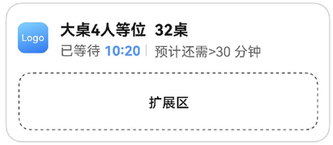


示例代码如下：

构建LiveViewController后，请在代码中初始化LiveViewController并调用LiveViewController.startLiveView()方法。

```json
import { liveViewManager } from '@kit.LiveViewKit';
import { Logger } from '../LogUtil';
import { ContextUtil } from '../ContextUtil';
import { BusinessError } from '@kit.BasicServicesKit';

export class PickupLiveViewController {
  public async startLiveView(): Promise<boolean> {
    // 校验实况窗开关是否打开
    if (!await PickupLiveViewController.isLiveViewEnabled()) {
      Logger.warn('startLiveView, live view is disabled.');
      return false;
    }
    // 创建实况窗
    try {
      const defaultView = await PickupLiveViewController.buildDefaultView();
      if (!defaultView) {
        Logger.warn('buildDefaultView Failed.');
        return false;
      }
      Logger.info('Request startLiveView req: %{public}s', JSON.stringify(defaultView));
      const result = await liveViewManager.startLiveView(defaultView);
      Logger.info('Request startLiveView result: %{public}s', JSON.stringify(result));
      return true;
    } catch (e) {
      const err: BusinessError = e as BusinessError;
      Logger.error('Request startLiveView error: %{public}d %{public}s', err.code, err.message);
      return false;
    }
  }

  // ...

  private static async buildDefaultView() : Promise < liveViewManager.LiveView > {
    return {
      // 构造实况窗请求体
      id: 105, // 实况窗ID，开发者生成。
      event: 'PICK_UP', // 实况窗的应用场景。PICK_UP：取餐。
      isMute: false,
      liveViewData: {
        primary: {
          title: '餐品已备好',
          content: [
            { text: '请前往' },
            { text: ' XXX店 ', textColor: '#FF0A59F7' },
            { text: '取餐' },
          ],
          keepTime: 0,
          clickAction: await ContextUtil.buildWantAgent('GuideCode'),
          layoutData: {
            layoutType: liveViewManager.LayoutType.LAYOUT_TYPE_PICKUP,
            weatherInfo: {
              weatherType:liveViewManager.WeatherType.WEATHER_TYPE_HAZY,
              locationType:liveViewManager.WeatherLocationType.LOCATION_TYPE_LOCAL,
            },
            title: '取餐码',
            content: '72988',
            underlineColor: '#FF0A59F7',
            descPic: 'coffee.png' // 扩展区右侧产品描述图，取值为“/resources/rawfile”路径下的文件名或image.PixelMap
          }
        }
      }
    };
  }

  private static async isLiveViewEnabled(): Promise<boolean> {
    let result: boolean = false;
    try {
      result = await liveViewManager.isLiveViewEnabled();
    } catch (e) {
      const err: BusinessError = e as BusinessError;
      Logger.error('Request isLiveViewEnabled error: %{public}d %{public}s', err.code, err.message);
    }
    Logger.info('Request isLiveViewEnabled result: %{public}s', result);
    return result;
  }
}
```

```json
import { common, Want, WantAgent, wantAgent } from '@kit.AbilityKit';
import { BusinessError } from '@kit.BasicServicesKit';
import { Logger } from './LogUtil';

export class ContextUtil {
  public static wantUrl: string | undefined;
  public static liveViewId: number;
  public static applicationContext: common.ApplicationContext;

  public static async buildWantAgent(page: string, liveViewId: number = -1): Promise<Want> {
    const wantAgentInfo: wantAgent.WantAgentInfo = {
      wants: [
        {
          bundleName: ContextUtil.applicationContext.applicationInfo.name,
          abilityName: 'EntryAbility',
          parameters: {
            page: page,
            liveViewId: liveViewId
          },
        } as Want
      ],
      actionType: wantAgent.OperationType.START_ABILITIES,
      requestCode: 0,
      actionFlags: [wantAgent.WantAgentFlags.UPDATE_PRESENT_FLAG]
    };
    try {
      const agent: WantAgent = await wantAgent.getWantAgent(wantAgentInfo);
      Logger.info('getWantAgent success! wantAgent: %{public}s', JSON.stringify(agent));
      return agent;
    } catch (e) {
      const err: BusinessError = e as BusinessError;
      Logger.error('getWantAgent failed! err: %{public}d %{public}s', err.code, err.message);
      throw e as Error;
    }
  }
}
```

从6.0.2(22)开始，实况窗卡片强调文本模板支持显示雨、雪天气动效背景。


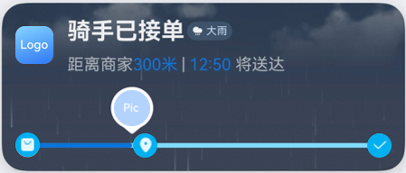


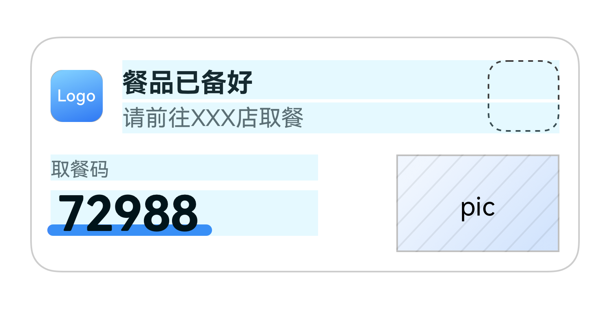


代码示例如下：

构建LiveViewController后，请在代码中初始化LiveViewController并调用LiveViewController.startLiveView()方法。

```json
import { liveViewManager } from '@kit.LiveViewKit';
import { Logger } from '../LogUtil';
import { ContextUtil } from '../ContextUtil';
import { BusinessError } from '@kit.BasicServicesKit';

export class PickupLiveViewController {
  public async startLiveView(): Promise<boolean> {
    // 校验实况窗开关是否打开
    if (!await PickupLiveViewController.isLiveViewEnabled()) {
      Logger.warn('startLiveView, live view is disabled.');
      return false;
    }
    // 创建实况窗
    try {
      const defaultView = await PickupLiveViewController.buildDefaultView();
      if (!defaultView) {
        Logger.warn('buildDefaultView Failed.');
        return false;
      }
      Logger.info('Request startLiveView req: %{public}s', JSON.stringify(defaultView));
      const result = await liveViewManager.startLiveView(defaultView);
      Logger.info('Request startLiveView result: %{public}s', JSON.stringify(result));
      return true;
    } catch (e) {
      const err: BusinessError = e as BusinessError;
      Logger.error('Request startLiveView error: %{public}d %{public}s', err.code, err.message);
      return false;
    }
  }

  // ...

  private static async buildDefaultView() : Promise < liveViewManager.LiveView > {
    return {
      // 构造实况窗请求体
      id: 105, // 实况窗ID，开发者生成。
      event: 'PICK_UP', // 实况窗的应用场景。PICK_UP：取餐。
      isMute: false,
      liveViewData: {
        primary: {
          title: '餐品已备好',
          content: [
            { text: '请前往' },
            { text: ' XXX店 ', textColor: '#FF0A59F7' },
            { text: '取餐' },
          ],
          keepTime: 0,
          clickAction: await ContextUtil.buildWantAgent('GuideCode'),
          layoutData: {
            layoutType: liveViewManager.LayoutType.LAYOUT_TYPE_PICKUP,
            weatherInfo: {
              weatherType:liveViewManager.WeatherType.WEATHER_TYPE_HAZY,
              locationType:liveViewManager.WeatherLocationType.LOCATION_TYPE_LOCAL,
            },
            title: '取餐码',
            content: '72988',
            underlineColor: '#FF0A59F7',
            descPic: 'coffee.png' // 扩展区右侧产品描述图，取值为“/resources/rawfile”路径下的文件名或image.PixelMap
          }
        }
      }
    };
  }

  private static async isLiveViewEnabled(): Promise<boolean> {
    let result: boolean = false;
    try {
      result = await liveViewManager.isLiveViewEnabled();
    } catch (e) {
      const err: BusinessError = e as BusinessError;
      Logger.error('Request isLiveViewEnabled error: %{public}d %{public}s', err.code, err.message);
    }
    Logger.info('Request isLiveViewEnabled result: %{public}s', result);
    return result;
  }
}
```

```json
import { common, Want, WantAgent, wantAgent } from '@kit.AbilityKit';
import { BusinessError } from '@kit.BasicServicesKit';
import { Logger } from './LogUtil';

export class ContextUtil {
  public static wantUrl: string | undefined;
  public static liveViewId: number;
  public static applicationContext: common.ApplicationContext;

  public static async buildWantAgent(page: string, liveViewId: number = -1): Promise<Want> {
    const wantAgentInfo: wantAgent.WantAgentInfo = {
      wants: [
        {
          bundleName: ContextUtil.applicationContext.applicationInfo.name,
          abilityName: 'EntryAbility',
          parameters: {
            page: page,
            liveViewId: liveViewId
          },
        } as Want
      ],
      actionType: wantAgent.OperationType.START_ABILITIES,
      requestCode: 0,
      actionFlags: [wantAgent.WantAgentFlags.UPDATE_PRESENT_FLAG]
    };
    try {
      const agent: WantAgent = await wantAgent.getWantAgent(wantAgentInfo);
      Logger.info('getWantAgent success! wantAgent: %{public}s', JSON.stringify(agent));
      return agent;
    } catch (e) {
      const err: BusinessError = e as BusinessError;
      Logger.error('getWantAgent failed! err: %{public}d %{public}s', err.code, err.message);
      throw e as Error;
    }
  }
}
```


#### 左右文本模板

左右文本模板适用于高铁、航班等场景。


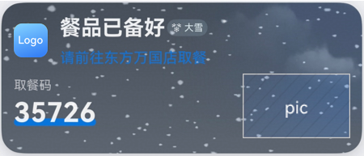


示例代码如下：

构建LiveViewController后，请在代码中初始化LiveViewController并调用LiveViewController.startLiveView()方法。

```json
import { liveViewManager } from '@kit.LiveViewKit';
import { Logger } from '../LogUtil';
import { ContextUtil } from '../ContextUtil';
import { BusinessError } from '@kit.BasicServicesKit';

export class FlightLiveViewController {
  public async startLiveView(): Promise<boolean> {
    // 校验实况窗开关是否打开
    if (!await FlightLiveViewController.isLiveViewEnabled()) {
      Logger.warn('startLiveView, live view is disabled.');
      return false;
    }
    // 创建实况窗
    try {
      const defaultView = await FlightLiveViewController.buildDefaultView();
      if (!defaultView) {
        Logger.warn('buildDefaultView Failed.');
        return false;
      }
      Logger.info('Request startLiveView req: %{public}s', JSON.stringify(defaultView));
      const result = await liveViewManager.startLiveView(defaultView);
      Logger.info('Request startLiveView result: %{public}s', JSON.stringify(result));
      return true;
    } catch (e) {
      const err: BusinessError = e as BusinessError;
      Logger.error('Request startLiveView error: %{public}d %{public}s', err.code, err.message);
      return false;
    }
  }

  // ...

  private static async buildDefaultView() : Promise < liveViewManager.LiveView > {
    return {
      id : 103, // 实况窗ID，开发者生成。
      event : 'FLIGHT', // 实况窗的应用场景。FLIGHT：航班。
      isMute: false,
      liveViewData : {
        primary : {
          title : '计划出发',
          content : [
            { text : '登机口'},
            { text : '32', textColor: '#FF0A59F7' },
            { text : ' | 座位'},
            { text : ' 17H', textColor: '#FF0A59F7' }
          ], // 设置textColor字段时，所有拥有textColor字段的对象仅能设置同一种颜色，不设置textColor时，默认展示#FF000000
          keepTime : 0,
          clickAction : await ContextUtil.buildWantAgent('GuideCode'),
          /**
           * 当传入实况窗卡片的背景氛围类型参数backgroundType值为赏月航班或夕阳航班时，
           * 且同时传入天气类型(WeatherInfo)为雨、雪特殊天气，卡片上优先展示天气背景，
           * 其余非特殊天气在卡片上展示赏月航班或夕阳航班背景氛围。
           */
          backgroundType : liveViewManager.BackgroundType.SYS_BACKGROUND_FLIGHT_SUNSET,
          layoutData : {
            layoutType : liveViewManager.LayoutType.LAYOUT_TYPE_FLIGHT,
            weatherInfo : {
              weatherType : liveViewManager.WeatherType.WEATHER_TYPE_LIGHT_RAIN,
              locationType : liveViewManager.WeatherLocationType.LOCATION_TYPE_DESTINATION,
              highTemperature : 30,
              lowTemperature : -10
            },
            firstTitle: '09:00',
            firstContent: '上海虹桥',
            lastTitle: '14:20',
            lastContent: '汉口',
            spaceIcon : 'icon_plane.png',// 扩展区中间间隔图标，取值为“/resources/rawfile”路径下的文件名或image.PixelMap
            isHorizontalLineDisplayed : false,
            additionalText : '以上信息仅供参考' // 扩展区底部内容，仅可用于左右文本模板。
          }
        }
      }
    };
  }

  private static async isLiveViewEnabled(): Promise<boolean> {
    let result: boolean = false;
    try {
      result = await liveViewManager.isLiveViewEnabled();
    } catch (e) {
      const err: BusinessError = e as BusinessError;
      Logger.error('Request isLiveViewEnabled error: %{public}d %{public}s', err.code, err.message);
    }
    Logger.info('Request isLiveViewEnabled result: %{public}s', result);
    return result;
  }
}
```

```json
import { common, Want, WantAgent, wantAgent } from '@kit.AbilityKit';
import { BusinessError } from '@kit.BasicServicesKit';
import { Logger } from './LogUtil';

export class ContextUtil {
  public static wantUrl: string | undefined;
  public static liveViewId: number;
  public static applicationContext: common.ApplicationContext;

  public static async buildWantAgent(page: string, liveViewId: number = -1): Promise<Want> {
    const wantAgentInfo: wantAgent.WantAgentInfo = {
      wants: [
        {
          bundleName: ContextUtil.applicationContext.applicationInfo.name,
          abilityName: 'EntryAbility',
          parameters: {
            page: page,
            liveViewId: liveViewId
          },
        } as Want
      ],
      actionType: wantAgent.OperationType.START_ABILITIES,
      requestCode: 0,
      actionFlags: [wantAgent.WantAgentFlags.UPDATE_PRESENT_FLAG]
    };
    try {
      const agent: WantAgent = await wantAgent.getWantAgent(wantAgentInfo);
      Logger.info('getWantAgent success! wantAgent: %{public}s', JSON.stringify(agent));
      return agent;
    } catch (e) {
      const err: BusinessError = e as BusinessError;
      Logger.error('getWantAgent failed! err: %{public}d %{public}s', err.code, err.message);
      throw e as Error;
    }
  }
}
```

从6.0.0(20)开始，实况窗卡片左右文本模板支持显示雨、雪天气动效背景或夕阳、赏月氛围背景。


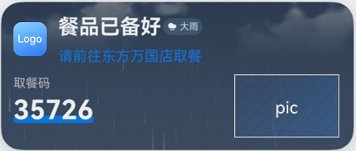


代码示例如下：

构建LiveViewController后，请在代码中初始化LiveViewController并调用LiveViewController.startLiveView()方法。

```json
import { liveViewManager } from '@kit.LiveViewKit';
import { Logger } from '../LogUtil';
import { ContextUtil } from '../ContextUtil';
import { BusinessError } from '@kit.BasicServicesKit';

export class FlightLiveViewController {
  public async startLiveView(): Promise<boolean> {
    // 校验实况窗开关是否打开
    if (!await FlightLiveViewController.isLiveViewEnabled()) {
      Logger.warn('startLiveView, live view is disabled.');
      return false;
    }
    // 创建实况窗
    try {
      const defaultView = await FlightLiveViewController.buildDefaultView();
      if (!defaultView) {
        Logger.warn('buildDefaultView Failed.');
        return false;
      }
      Logger.info('Request startLiveView req: %{public}s', JSON.stringify(defaultView));
      const result = await liveViewManager.startLiveView(defaultView);
      Logger.info('Request startLiveView result: %{public}s', JSON.stringify(result));
      return true;
    } catch (e) {
      const err: BusinessError = e as BusinessError;
      Logger.error('Request startLiveView error: %{public}d %{public}s', err.code, err.message);
      return false;
    }
  }

  // ...

  private static async buildDefaultView() : Promise < liveViewManager.LiveView > {
    return {
      id : 103, // 实况窗ID，开发者生成。
      event : 'FLIGHT', // 实况窗的应用场景。FLIGHT：航班。
      isMute: false,
      liveViewData : {
        primary : {
          title : '计划出发',
          content : [
            { text : '登机口'},
            { text : '32', textColor: '#FF0A59F7' },
            { text : ' | 座位'},
            { text : ' 17H', textColor: '#FF0A59F7' }
          ], // 设置textColor字段时，所有拥有textColor字段的对象仅能设置同一种颜色，不设置textColor时，默认展示#FF000000
          keepTime : 0,
          clickAction : await ContextUtil.buildWantAgent('GuideCode'),
          /**
           * 当传入实况窗卡片的背景氛围类型参数backgroundType值为赏月航班或夕阳航班时，
           * 且同时传入天气类型(WeatherInfo)为雨、雪特殊天气，卡片上优先展示天气背景，
           * 其余非特殊天气在卡片上展示赏月航班或夕阳航班背景氛围。
           */
          backgroundType : liveViewManager.BackgroundType.SYS_BACKGROUND_FLIGHT_SUNSET,
          layoutData : {
            layoutType : liveViewManager.LayoutType.LAYOUT_TYPE_FLIGHT,
            weatherInfo : {
              weatherType : liveViewManager.WeatherType.WEATHER_TYPE_LIGHT_RAIN,
              locationType : liveViewManager.WeatherLocationType.LOCATION_TYPE_DESTINATION,
              highTemperature : 30,
              lowTemperature : -10
            },
            firstTitle: '09:00',
            firstContent: '上海虹桥',
            lastTitle: '14:20',
            lastContent: '汉口',
            spaceIcon : 'icon_plane.png',// 扩展区中间间隔图标，取值为“/resources/rawfile”路径下的文件名或image.PixelMap
            isHorizontalLineDisplayed : false,
            additionalText : '以上信息仅供参考' // 扩展区底部内容，仅可用于左右文本模板。
          }
        }
      }
    };
  }

  private static async isLiveViewEnabled(): Promise<boolean> {
    let result: boolean = false;
    try {
      result = await liveViewManager.isLiveViewEnabled();
    } catch (e) {
      const err: BusinessError = e as BusinessError;
      Logger.error('Request isLiveViewEnabled error: %{public}d %{public}s', err.code, err.message);
    }
    Logger.info('Request isLiveViewEnabled result: %{public}s', result);
    return result;
  }
}
```

```json
import { common, Want, WantAgent, wantAgent } from '@kit.AbilityKit';
import { BusinessError } from '@kit.BasicServicesKit';
import { Logger } from './LogUtil';

export class ContextUtil {
  public static wantUrl: string | undefined;
  public static liveViewId: number;
  public static applicationContext: common.ApplicationContext;

  public static async buildWantAgent(page: string, liveViewId: number = -1): Promise<Want> {
    const wantAgentInfo: wantAgent.WantAgentInfo = {
      wants: [
        {
          bundleName: ContextUtil.applicationContext.applicationInfo.name,
          abilityName: 'EntryAbility',
          parameters: {
            page: page,
            liveViewId: liveViewId
          },
        } as Want
      ],
      actionType: wantAgent.OperationType.START_ABILITIES,
      requestCode: 0,
      actionFlags: [wantAgent.WantAgentFlags.UPDATE_PRESENT_FLAG]
    };
    try {
      const agent: WantAgent = await wantAgent.getWantAgent(wantAgentInfo);
      Logger.info('getWantAgent success! wantAgent: %{public}s', JSON.stringify(agent));
      return agent;
    } catch (e) {
      const err: BusinessError = e as BusinessError;
      Logger.error('getWantAgent failed! err: %{public}d %{public}s', err.code, err.message);
      throw e as Error;
    }
  }
}
```


#### 赛事比分模板

赛事比分模板适用于赛事场景。


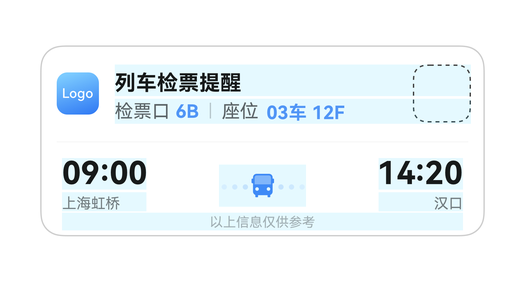


示例代码如下：

构建LiveViewController后，请在代码中初始化LiveViewController并调用LiveViewController.startLiveView()方法。

```json
import { liveViewManager } from '@kit.LiveViewKit';
import { Logger } from '../LogUtil';
import { ContextUtil } from '../ContextUtil';
import { BusinessError } from '@kit.BasicServicesKit';

export class ScoreLiveViewController {
  public async startLiveView(): Promise<boolean> {
    // 校验实况窗开关是否打开
    if (!await ScoreLiveViewController.isLiveViewEnabled()) {
      Logger.warn('startLiveView, live view is disabled.');
      return false;
    }
    // 创建实况窗
    try {
      const defaultView = await ScoreLiveViewController.buildDefaultView();
      if (!defaultView) {
        Logger.warn('buildDefaultView Failed.');
        return false;
      }
      Logger.info('Request startLiveView req: %{public}s', JSON.stringify(defaultView));
      const result = await liveViewManager.startLiveView(defaultView);
      Logger.info('Request startLiveView result: %{public}s', JSON.stringify(result));
      return true;
    } catch (e) {
      const err: BusinessError = e as BusinessError;
      Logger.error('Request startLiveView error: %{public}d %{public}s', err.code, err.message);
      return false;
    }
  }

  // ...

  private static async buildDefaultView(): Promise<liveViewManager.LiveView> {
    return {
      // 构造实况窗请求体
      id: 108, // 实况窗 ID，开发者生成。
      event: 'SCORE', // 实况窗的应用场景。SCORE：赛事比分。
      isMute: false,
      liveViewData: {
        primary: {
          title: '第四节比赛中',
          content: [
            { text: 'XX', textColor:'#FF0A59F7' },
            { text: ' VS ' },
            { text: 'XX', textColor:'#FF0A59F7' },
            { text: ' | ' },
            { text: '小组赛 第五场', textColor:'#FF0A59F7' }
          ],
          keepTime: 0,
          clickAction: await ContextUtil.buildWantAgent('GuideCode'),
          layoutData: {
            layoutType: liveViewManager.LayoutType.LAYOUT_TYPE_SCORE,
            hostName: '队名 A',
            hostIcon: 'score_firefox.png',
            hostScore: '110',
            guestName: '队名 B',
            guestIcon: 'score_m.png',
            guestScore: '102',
            competitionDesc: [
              { text: '●', textColor: '#FFFF0000' },
              { text: 'Q4' }
            ],
            competitionTime: '02:16',
            isHorizontalLineDisplayed: true
          }
        }
      }
    };
  }

  private static async isLiveViewEnabled(): Promise<boolean> {
    let result: boolean = false;
    try {
      result = await liveViewManager.isLiveViewEnabled();
    } catch (e) {
      const err: BusinessError = e as BusinessError;
      Logger.error('Request isLiveViewEnabled error: %{public}d %{public}s', err.code, err.message);
    }
    Logger.info('Request isLiveViewEnabled result: %{public}s', result);
    return result;
  }
}
```

```json
import { common, Want, WantAgent, wantAgent } from '@kit.AbilityKit';
import { BusinessError } from '@kit.BasicServicesKit';
import { Logger } from './LogUtil';

export class ContextUtil {
  public static wantUrl: string | undefined;
  public static liveViewId: number;
  public static applicationContext: common.ApplicationContext;

  public static async buildWantAgent(page: string, liveViewId: number = -1): Promise<Want> {
    const wantAgentInfo: wantAgent.WantAgentInfo = {
      wants: [
        {
          bundleName: ContextUtil.applicationContext.applicationInfo.name,
          abilityName: 'EntryAbility',
          parameters: {
            page: page,
            liveViewId: liveViewId
          },
        } as Want
      ],
      actionType: wantAgent.OperationType.START_ABILITIES,
      requestCode: 0,
      actionFlags: [wantAgent.WantAgentFlags.UPDATE_PRESENT_FLAG]
    };
    try {
      const agent: WantAgent = await wantAgent.getWantAgent(wantAgentInfo);
      Logger.info('getWantAgent success! wantAgent: %{public}s', JSON.stringify(agent));
      return agent;
    } catch (e) {
      const err: BusinessError = e as BusinessError;
      Logger.error('getWantAgent failed! err: %{public}d %{public}s', err.code, err.message);
      throw e as Error;
    }
  }
}
```


#### 导航模板

导航模板适用于出行导航场景。


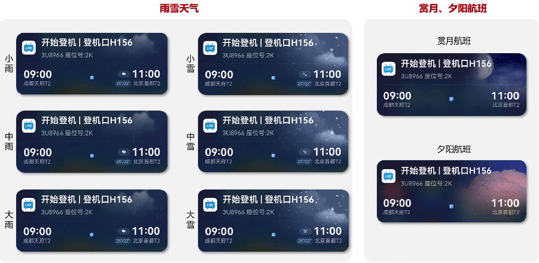


示例代码如下：

构建LiveViewController后，请在代码中初始化LiveViewController并调用LiveViewController.startLiveView()方法。

```json
import { liveViewManager } from '@kit.LiveViewKit';
import { Logger } from '../LogUtil';
import { ContextUtil } from '../ContextUtil';
import { BusinessError } from '@kit.BasicServicesKit';

export class NavigationLiveViewController {
  public async startLiveView(): Promise<boolean> {
    // 校验实况窗开关是否打开
    if (!await NavigationLiveViewController.isLiveViewEnabled()) {
      Logger.warn('startLiveView, live view is disabled.');
      return false;
    }
    // 创建实况窗
    try {
      const defaultView = await NavigationLiveViewController.buildDefaultView();
      if (!defaultView) {
        Logger.warn('buildDefaultView Failed.');
        return false;
      }
      Logger.info('Request startLiveView req: %{public}s', JSON.stringify(defaultView));
      const result = await liveViewManager.startLiveView(defaultView);
      Logger.info('Request startLiveView result: %{public}s', JSON.stringify(result));
      return true;
    } catch (e) {
      const err: BusinessError = e as BusinessError;
      Logger.error('Request startLiveView error: %{public}d %{public}s', err.code, err.message);
      return false;
    }
  }

  // ...

  private static async buildDefaultView(): Promise<liveViewManager.LiveView> {
    return {
      // 构造实况窗请求体
      id: 104, // 实况窗ID，开发者生成。
      event: 'NAVIGATION', // 实况窗的应用场景。NAVIGATION：导航。
      isMute: false,
      liveViewData: {
        primary: {
          title: '178米后左转',
          content: [
            { text: '去往'},
            { text: ' xxx东路', textColor: '#FF0A59F7' }
          ],
          keepTime: 0,
          clickAction: await ContextUtil.buildWantAgent('GuideCode'),
          layoutData: {
            layoutType: liveViewManager.LayoutType.LAYOUT_TYPE_NAVIGATION,
            currentNavigationIcon: 'arrow_left.png', // 当前导航方向，取值为“/resources/rawfile”路径下的文件名或image.PixelMap
            navigationIcons: ['arrow_left.png','arrow_up.png','arrow_up.png','arrow_right.png'] // 导航方向的箭头集合图片，每个元素取值为“/resources/rawfile”路径下的文件名或image.PixelMap
          }
        }
      }
    };
  }

  private static async isLiveViewEnabled(): Promise<boolean> {
    let result: boolean = false;
    try {
      result = await liveViewManager.isLiveViewEnabled();
    } catch (e) {
      const err: BusinessError = e as BusinessError;
      Logger.error('Request isLiveViewEnabled error: %{public}d %{public}s', err.code, err.message);
    }
    Logger.info('Request isLiveViewEnabled result: %{public}s', result);
    return result;
  }
}
```

```json
import { common, Want, WantAgent, wantAgent } from '@kit.AbilityKit';
import { BusinessError } from '@kit.BasicServicesKit';
import { Logger } from './LogUtil';

export class ContextUtil {
  public static wantUrl: string | undefined;
  public static liveViewId: number;
  public static applicationContext: common.ApplicationContext;

  public static async buildWantAgent(page: string, liveViewId: number = -1): Promise<Want> {
    const wantAgentInfo: wantAgent.WantAgentInfo = {
      wants: [
        {
          bundleName: ContextUtil.applicationContext.applicationInfo.name,
          abilityName: 'EntryAbility',
          parameters: {
            page: page,
            liveViewId: liveViewId
          },
        } as Want
      ],
      actionType: wantAgent.OperationType.START_ABILITIES,
      requestCode: 0,
      actionFlags: [wantAgent.WantAgentFlags.UPDATE_PRESENT_FLAG]
    };
    try {
      const agent: WantAgent = await wantAgent.getWantAgent(wantAgentInfo);
      Logger.info('getWantAgent success! wantAgent: %{public}s', JSON.stringify(agent));
      return agent;
    } catch (e) {
      const err: BusinessError = e as BusinessError;
      Logger.error('getWantAgent failed! err: %{public}d %{public}s', err.code, err.message);
      throw e as Error;
    }
  }
}
```


#### 基于地理位置的实况窗提醒

基于地理位置的实况窗提醒适用于打卡、快递等场景。

从6.1.0(23)开始，支持注册基于地理位置延迟触发的实况窗提醒，在注册由地理围栏条件触发的实况窗后，满足以下条件可触发创建或结束实况窗。

 - 进入地理围栏。
 - 离开地理围栏。
 - 进入地理围栏并持续时间大于[geofence](https://developer.huawei.com/consumer/cn/doc/harmonyos-references/liveview-liveviewmanager#geofence).delayTime（延迟触发时间）。
 - 离开地理围栏并持续时间大于[geofence](https://developer.huawei.com/consumer/cn/doc/harmonyos-references/liveview-liveviewmanager#geofence).delayTime（延迟触发时间）。


构建LiveViewController后，请在代码中初始化LiveViewController并调用LiveViewController.startLiveViewByTrigger()方法添加由地理围栏条件触发创建的实况窗。

代码示例如下：

```json
import { liveViewManager } from '@kit.LiveViewKit';
import { BusinessError } from '@kit.BasicServicesKit';
import { ContextUtil } from '../ContextUtil';
import { Logger } from '../LogUtil';
import { Model } from '../model';
import { GeofenceRightsUtil } from './GeofenceRightsUtil';

export class GeofenceExpressController {
  private static defaultView: liveViewManager.LiveView | undefined = undefined;
  private static trigger: liveViewManager.Trigger | undefined = undefined;
  private static underLineColor: string = '#FF0A59F7';
  private static capsuleColor: string = '#FF308977';

  public static async startLiveViewExpress(model: Model): Promise<string> {
    let checkRightsResult = await GeofenceRightsUtil.checkRights();
    if (checkRightsResult != '') {
      return checkRightsResult;
    }
    try {
      // 构建快递实况窗。
      GeofenceExpressController.defaultView = await GeofenceExpressController.buildExpressLiveView();
      // 构建实况窗提醒的触发条件
      GeofenceExpressController.trigger = await GeofenceExpressController.buildDefaultTrigger(model);
      let createResult = await GeofenceExpressController.startLiveViewByTrigger();
      if (createResult != 0) {
        return await ContextUtil.applicationContext.resourceManager
          .getStringValue($r('app.string.Create_failed').id);
      }
      return await ContextUtil.applicationContext.resourceManager
        .getStringValue($r('app.string.Create_success').id);
    } catch (e) {
      return await ContextUtil.applicationContext.resourceManager
        .getStringValue($r('app.string.Create_failed').id);
    }
  }

  private static async startLiveViewByTrigger(): Promise<number> {
    if (!GeofenceExpressController.defaultView || !GeofenceExpressController.trigger) {
      Logger.warn('startLiveViewByTrigger, buildDefaultView or buildDefaultTrigger failed.')
      return -1;
    }
    // 注册由地理围栏条件延迟触发创建的实况窗
    try {
      Logger.info('Request startLiveViewByTrigger req liveView: %{public}s, trigger: %{public}s',
        JSON.stringify(GeofenceExpressController.defaultView), JSON.stringify(GeofenceExpressController.trigger));
      const result = await liveViewManager.startLiveViewByTrigger(GeofenceExpressController.defaultView,
        GeofenceExpressController.trigger);
      Logger.info('Request startLiveViewByTrigger result: %{public}s', JSON.stringify(result));
      return result.resultCode;
    } catch (e) {
      const err: BusinessError = e as BusinessError;
      Logger.error('Request startLiveView error: %{public}d %{public}s', err.code, err.message);
      return -1;
    }
  }

  private static async buildExpressLiveView(): Promise<liveViewManager.LiveView | undefined> {
    try {
      return {
        id: 11, // 实况窗ID，开发者生成。
        event: 'EXPRESS', // 实况窗的应用场景。EXPRESS：快递。
        sequence: 1, // 序列号
        isMute: false,
        liveViewData: {
          primary: {
            title: await ContextUtil.applicationContext.resourceManager.getStringValue($r('app.string.Express_title')
              .id),
            content: [
              {
                text: await ContextUtil.applicationContext.resourceManager.getStringValue($r('app.string.Express_content')
                  .id),
              }
            ],
            keepTime: 0,
            clickAction: await ContextUtil.buildWantAgent('Geofence'),
            extensionData: {
              type: liveViewManager.ExtensionType.EXTENSION_TYPE_ICON,
              pic: 'express.png',
              clickAction: await ContextUtil.buildWantAgent('Geofence', 11)
            },
            layoutData: {
              layoutType: liveViewManager.LayoutType.LAYOUT_TYPE_PICKUP,
              title: await ContextUtil.applicationContext.resourceManager.getStringValue($r('app.string.Express_layoutData_title')
                .id),
              content: await ContextUtil.applicationContext.resourceManager.getStringValue($r('app.string.Express_layoutData_content')
                .id),
              underlineColor: GeofenceExpressController.underLineColor,
              // 扩展区右侧产品描述图，取值为“/resources/rawfile”路径下的文件名或image.PixelMap
              descPic: 'pick.png',
            },
          },
          capsule: {
            type: liveViewManager.CapsuleType.CAPSULE_TYPE_TEXT,
            status: 1,
            icon: 'pick.png',
            backgroundColor: GeofenceExpressController.capsuleColor,
            title: await ContextUtil.applicationContext.resourceManager.getStringValue($r('app.string.Express_layoutData_title')
              .id),
            content: await ContextUtil.applicationContext.resourceManager.getStringValue($r('app.string.Express_layoutData_content')
              .id),
          }
        }
      }
    } catch (e) {
      Logger.error('buildDefaultView failed:' + JSON.stringify(e))
      return undefined;
    }
  }

  private static async buildDefaultTrigger(model: Model): Promise<liveViewManager.Trigger | undefined> {
    try {
      return {
        // 构造实况窗提醒的地理围栏触发条件。
        type: liveViewManager.TriggerType.TRIGGER_TYPE_GEOFENCE,
        displayTime: 900,
        condition: {
          // 地理围栏触发条件：设备进入坐标点500米范围内。
          longitude: model.longitude,
          latitude: model.latitude,
          coordinateSystemType: liveViewManager.CoordinateSystemType.COORDINATE_TYPE_GCJ02,
          monitorEvent: liveViewManager.MonitorEvent.MONITOR_TYPE_ENTRY,
          radius: 500,
          delayTime: 0
        }
      }
    } catch (e) {
      Logger.error('buildDefaultTrigger failed:' + JSON.stringify(e))
      return undefined;
    }
  }
}
```

```text
import { liveViewManager } from '@kit.LiveViewKit';
import { BusinessError } from '@kit.BasicServicesKit';
import { ContextUtil } from '../ContextUtil';
import { Logger } from '../LogUtil';
import { geoLocationManager } from '@kit.LocationKit';

export class GeofenceRightsUtil {
  // 检查权限
  public static async checkRights(): Promise<string> {
    try {
      // 校验实况窗开关是否打开
      if (!await GeofenceRightsUtil.isLiveViewEnabled()) {
        Logger.warn('checkRights, 实况开关未开启.')
        return await ContextUtil.applicationContext.resourceManager
          .getStringValue($r('app.string.Live_view_enabled').id);
      }
      // 校验实况窗地理围栏开关是否打开
      if (!await GeofenceRightsUtil.isGeofenceTriggerEnabled()) {
        Logger.warn('checkRights, 地理围栏开关未开启.')
        return await ContextUtil.applicationContext.resourceManager
          .getStringValue($r('app.string.Live_view_geofence_enabled').id);
      }
      // 校验GPS开关是否打开
      if (!GeofenceRightsUtil.isLocationEnabled()) {
        Logger.warn('checkRights, GPS 开关未开启.')
        return await ContextUtil.applicationContext.resourceManager
          .getStringValue($r('app.string.Gps_enabled').id);
      }
    } catch (e) {
      const err: BusinessError = e as BusinessError;
      Logger.error('checkRights error: %{public}d %{public}s', err.code, err.message);
      return await ContextUtil.applicationContext.resourceManager
        .getStringValue($r('app.string.Create_success').id);
    }
    return '';
  }

  private static async isLiveViewEnabled(): Promise<boolean> {
    let result: boolean = false;
    try {
      result = await liveViewManager.isLiveViewEnabled();
    } catch (e) {
      const err: BusinessError = e as BusinessError;
      Logger.error('isLiveViewEnabled error: %{public}d %{public}s', err.code, err.message);
    }
    Logger.info('isLiveViewEnabled result: %{public}s', result);
    return result;
  }

  private static async isGeofenceTriggerEnabled(): Promise<boolean> {
    let result: boolean = false;
    try {
      result = await liveViewManager.isGeofenceTriggerEnabled();
    } catch (e) {
      const err: BusinessError = e as BusinessError;
      Logger.error('isGeofenceTriggerEnabled error: %{public}d %{public}s', err.code, err.message);
    }
    Logger.info('isGeofenceTriggerEnabled result: %{public}s', result);
    return result;
  }

  private static isLocationEnabled(): boolean {
    let result: boolean = false;
    try {
      result = geoLocationManager.isLocationEnabled();
    } catch (e) {
      const err: BusinessError = e as BusinessError;
      Logger.error('isLocationEnabled error: %{public}d %{public}s', err.code, err.message);
    }
    Logger.info('isLocationEnabled result: %{public}s', result);
    return result;
  }
}
```

```json
import { common, Want, WantAgent, wantAgent } from '@kit.AbilityKit';
import { BusinessError } from '@kit.BasicServicesKit';
import { Logger } from './LogUtil';

export class ContextUtil {
  public static wantUrl: string | undefined;
  public static liveViewId: number;
  public static applicationContext: common.ApplicationContext;

  public static async buildWantAgent(page: string, liveViewId: number = -1): Promise<Want> {
    const wantAgentInfo: wantAgent.WantAgentInfo = {
      wants: [
        {
          bundleName: ContextUtil.applicationContext.applicationInfo.name,
          abilityName: 'EntryAbility',
          parameters: {
            page: page,
            liveViewId: liveViewId
          },
        } as Want
      ],
      actionType: wantAgent.OperationType.START_ABILITIES,
      requestCode: 0,
      actionFlags: [wantAgent.WantAgentFlags.UPDATE_PRESENT_FLAG]
    };
    try {
      const agent: WantAgent = await wantAgent.getWantAgent(wantAgentInfo);
      Logger.info('getWantAgent success! wantAgent: %{public}s', JSON.stringify(agent));
      return agent;
    } catch (e) {
      const err: BusinessError = e as BusinessError;
      Logger.error('getWantAgent failed! err: %{public}d %{public}s', err.code, err.message);
      throw e as Error;
    }
  }
}
```

调用LiveViewController.stopLiveViewByTrigger()方法添加由地理围栏条件触发结束的实况窗。

代码示例如下：

```text
import { liveViewManager } from '@kit.LiveViewKit';
import { BusinessError } from '@kit.BasicServicesKit';
import { ContextUtil } from '../ContextUtil';
import { Logger } from '../LogUtil';
import { Model } from '../model';
import { GeofenceRightsUtil } from './GeofenceRightsUtil';

export class GeofenceFlightEndController {
  private static defaultView: liveViewManager.LiveView | undefined = undefined;
  private static trigger: liveViewManager.Trigger | undefined = undefined;
  private static underLineColor: string = '#FF0A59F7';
  private static capsuleColor: string = '#FF308977';

  public static async stopLiveViewFlightEnds(model: Model): Promise<string> {
    let checkRightsResult = await GeofenceRightsUtil.checkRights();
    if (checkRightsResult != '') {
      return checkRightsResult;
    }
    try {
      // 构造实况窗结构体
      GeofenceFlightEndController.defaultView = await GeofenceFlightEndController.buildFlightLiveView();
      // 创建实况窗
      let createResult = await GeofenceFlightEndController.startLiveView();
      if (createResult != 0) {
        return await ContextUtil.applicationContext.resourceManager
          .getStringValue($r('app.string.Create_failed').id);
      }
      if (GeofenceFlightEndController.defaultView) {
        if (GeofenceFlightEndController.defaultView.sequence) {
          GeofenceFlightEndController.defaultView.sequence += 1;
        }
        GeofenceFlightEndController.defaultView.liveViewData.primary.title =
          await ContextUtil.applicationContext.resourceManager
            .getStringValue($r('app.string.Flight_travel_end_title').id);
        GeofenceFlightEndController.defaultView.liveViewData.primary.content = [
          {
            text: await ContextUtil.applicationContext.resourceManager.getStringValue($r('app.string.Flight_travel_end_content')
              .id)
          },
        ];
      }
      // 构造地理围栏条件
      GeofenceFlightEndController.trigger = await GeofenceFlightEndController.buildTrigger(model);
      // 注册由地理围栏条件延迟触发结束的实况窗
      let stopTriggerLiveView = await GeofenceFlightEndController.stopLiveViewByTrigger();
      // ...
      return await ContextUtil.applicationContext.resourceManager
        .getStringValue($r('app.string.Create_success').id);
    } catch (e) {
      const err: BusinessError = e as BusinessError;
      Logger.error('Request startLiveView error: %{public}d %{public}s', err.code, err.message);
      return await ContextUtil.applicationContext.resourceManager
        .getStringValue($r('app.string.Create_failed').id);
    }
  }

  private static async startLiveView(): Promise<number> {
    if (!GeofenceFlightEndController.defaultView) {
      Logger.warn('startLiveViewByTrigger, buildDefaultView failed.')
      return -1;
    }
    try {
      // 创建实况窗
      // ...
      const result = await liveViewManager.startLiveView(GeofenceFlightEndController.defaultView);
      // ...
      return result.resultCode;
    } catch (e) {
      const err: BusinessError = e as BusinessError;
      Logger.error('Request startLiveView error: %{public}d %{public}s', err.code, err.message);
      return -1;
    }
  }

  private static async stopLiveViewByTrigger(): Promise<number> {
    if (!GeofenceFlightEndController.defaultView || !GeofenceFlightEndController.trigger) {
      Logger.warn('startLiveViewByTrigger, buildDefaultView or buildDefaultTrigger failed.')
      return -1;
    }
    try {
      // 注册由地理围栏条件延迟触发结束的实况窗
      // ...
      const result = await liveViewManager.stopLiveViewByTrigger(GeofenceFlightEndController.defaultView,
        GeofenceFlightEndController.trigger);
      // ...
      return result.resultCode;
    } catch (e) {
      const err: BusinessError = e as BusinessError;
      Logger.error('Request startLiveView error: %{public}d %{public}s', err.code, err.message);
      return -1;
    }
  }

  private static async buildFlightLiveView(): Promise<liveViewManager.LiveView | undefined> {
    try {
      return {
        id: 14, // 实况窗ID，开发者生成。
        event: 'FLIGHT', // 实况窗的应用场景。EXPRESS：快递。
        sequence: 1, // 序列号
        isMute: false,
        liveViewData: {
          primary: {
            title: await ContextUtil.applicationContext.resourceManager.getStringValue($r('app.string.Luggage_prompt_title')
              .id),
            content: [
              {
                text: await ContextUtil.applicationContext.resourceManager.getStringValue($r('app.string.Luggage_prompt_content1')
                  .id)
              },
              {
                text: await ContextUtil.applicationContext.resourceManager.getStringValue($r('app.string.Luggage_prompt_content2')
                  .id),
                textColor: GeofenceFlightEndController.underLineColor
              },
            ],
            keepTime: 15,
            clickAction: await ContextUtil.buildWantAgent('Geofence'),
            extensionData: {
              type: liveViewManager.ExtensionType.EXTENSION_TYPE_ICON,
              pic: 'flight.png',
              clickAction: await ContextUtil.buildWantAgent('Geofence')
            },
            layoutData: {
              layoutType: liveViewManager.LayoutType.LAYOUT_TYPE_FLIGHT,
              firstTitle: await ContextUtil.applicationContext.resourceManager.getStringValue($r('app.string.Flight_depart_layout_first_title')
                .id),
              firstContent: await ContextUtil.applicationContext.resourceManager.getStringValue($r('app.string.Flight_depart_layout_first_content')
                .id),
              lastTitle: await ContextUtil.applicationContext.resourceManager.getStringValue($r('app.string.Flight_depart_layout_last_title')
                .id),
              lastContent: await ContextUtil.applicationContext.resourceManager.getStringValue($r('app.string.Flight_depart_layout_last_content')
                .id),
              spaceIcon: 'icon_plane.png'
            },
          },
          capsule: {
            type: liveViewManager.CapsuleType.CAPSULE_TYPE_TEXT,
            status: 1,
            title: await ContextUtil.applicationContext.resourceManager
              .getStringValue($r('app.string.Luggage_prompt_capsule_title').id),
            content: await ContextUtil.applicationContext.resourceManager
              .getStringValue($r('app.string.Flight_arrived_capsule_content').id),
            icon: 'capsule_flight.png',
            backgroundColor: GeofenceFlightEndController.capsuleColor,
          }
        }
      }
    } catch (e) {
      // ...
      return undefined;
    }
  }

  private static async buildTrigger(model: Model): Promise<liveViewManager.Trigger | undefined> {
    try {
      return {
        type: liveViewManager.TriggerType.TRIGGER_TYPE_GEOFENCE,
        displayTime: 900,
        condition: {
          longitude: model.longitude,
          latitude: model.latitude,
          coordinateSystemType: liveViewManager.CoordinateSystemType.COORDINATE_TYPE_GCJ02,
          monitorEvent: liveViewManager.MonitorEvent.MONITOR_TYPE_LEAVE,
          radius: 500,
          delayTime: 0
        }
      }
    } catch (e) {
      // ...
      return undefined;
    }
  }
}
```

```text
import { liveViewManager } from '@kit.LiveViewKit';
import { BusinessError } from '@kit.BasicServicesKit';
import { ContextUtil } from '../ContextUtil';
import { Logger } from '../LogUtil';
import { geoLocationManager } from '@kit.LocationKit';

export class GeofenceRightsUtil {
  // 检查权限
  public static async checkRights(): Promise<string> {
    try {
      // 校验实况窗开关是否打开
      if (!await GeofenceRightsUtil.isLiveViewEnabled()) {
        Logger.warn('checkRights, 实况开关未开启.')
        return await ContextUtil.applicationContext.resourceManager
          .getStringValue($r('app.string.Live_view_enabled').id);
      }
      // 校验实况窗地理围栏开关是否打开
      if (!await GeofenceRightsUtil.isGeofenceTriggerEnabled()) {
        Logger.warn('checkRights, 地理围栏开关未开启.')
        return await ContextUtil.applicationContext.resourceManager
          .getStringValue($r('app.string.Live_view_geofence_enabled').id);
      }
      // 校验GPS开关是否打开
      if (!GeofenceRightsUtil.isLocationEnabled()) {
        Logger.warn('checkRights, GPS 开关未开启.')
        return await ContextUtil.applicationContext.resourceManager
          .getStringValue($r('app.string.Gps_enabled').id);
      }
    } catch (e) {
      const err: BusinessError = e as BusinessError;
      Logger.error('checkRights error: %{public}d %{public}s', err.code, err.message);
      return await ContextUtil.applicationContext.resourceManager
        .getStringValue($r('app.string.Create_success').id);
    }
    return '';
  }

  private static async isLiveViewEnabled(): Promise<boolean> {
    let result: boolean = false;
    try {
      result = await liveViewManager.isLiveViewEnabled();
    } catch (e) {
      const err: BusinessError = e as BusinessError;
      Logger.error('isLiveViewEnabled error: %{public}d %{public}s', err.code, err.message);
    }
    Logger.info('isLiveViewEnabled result: %{public}s', result);
    return result;
  }

  private static async isGeofenceTriggerEnabled(): Promise<boolean> {
    let result: boolean = false;
    try {
      result = await liveViewManager.isGeofenceTriggerEnabled();
    } catch (e) {
      const err: BusinessError = e as BusinessError;
      Logger.error('isGeofenceTriggerEnabled error: %{public}d %{public}s', err.code, err.message);
    }
    Logger.info('isGeofenceTriggerEnabled result: %{public}s', result);
    return result;
  }

  private static isLocationEnabled(): boolean {
    let result: boolean = false;
    try {
      result = geoLocationManager.isLocationEnabled();
    } catch (e) {
      const err: BusinessError = e as BusinessError;
      Logger.error('isLocationEnabled error: %{public}d %{public}s', err.code, err.message);
    }
    Logger.info('isLocationEnabled result: %{public}s', result);
    return result;
  }
}
```

```json
import { common, Want, WantAgent, wantAgent } from '@kit.AbilityKit';
import { BusinessError } from '@kit.BasicServicesKit';
import { Logger } from './LogUtil';

export class ContextUtil {
  public static wantUrl: string | undefined;
  public static liveViewId: number;
  public static applicationContext: common.ApplicationContext;

  public static async buildWantAgent(page: string, liveViewId: number = -1): Promise<Want> {
    const wantAgentInfo: wantAgent.WantAgentInfo = {
      wants: [
        {
          bundleName: ContextUtil.applicationContext.applicationInfo.name,
          abilityName: 'EntryAbility',
          parameters: {
            page: page,
            liveViewId: liveViewId
          },
        } as Want
      ],
      actionType: wantAgent.OperationType.START_ABILITIES,
      requestCode: 0,
      actionFlags: [wantAgent.WantAgentFlags.UPDATE_PRESENT_FLAG]
    };
    try {
      const agent: WantAgent = await wantAgent.getWantAgent(wantAgentInfo);
      Logger.info('getWantAgent success! wantAgent: %{public}s', JSON.stringify(agent));
      return agent;
    } catch (e) {
      const err: BusinessError = e as BusinessError;
      Logger.error('getWantAgent failed! err: %{public}d %{public}s', err.code, err.message);
      throw e as Error;
    }
  }
}
```

> [!NOTE]
> 结束地理围栏实况消息，复用原有stopLiveView接口，支持结束所有实况。 更新地理围栏实况消息，复用原有updateLiveView接口，已经调用stopLiveViewByTrigger后实况不支持调用updateLiveView更新。 查询地理围栏实况消息，复用原有getActiveLiveView接口。


#### 实况胶囊


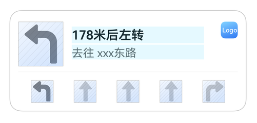


> [!NOTE]
> 胶囊形态各模板参数固定，与创建实况窗时的模板类型无关。可创建的胶囊类型有：文本胶囊、计时器胶囊、进度胶囊，详情请参见 CapsuleData 。


除了实况窗卡片形态，开发者还需考虑实况窗胶囊形态的展示效果。若开发者创建实况窗时还想同步创建实况窗胶囊，则需在liveViewManager.[LiveView](https://developer.huawei.com/consumer/cn/doc/harmonyos-references/liveview-liveviewmanager#liveview)（结构体）中携带胶囊所需的参数liveViewData.[capsule](https://developer.huawei.com/consumer/cn/doc/harmonyos-references/liveview-liveviewmanager#liveviewdata)（不同胶囊类型携带不同的参数）。示例代码如下：

```json
import { liveViewManager } from '@kit.LiveViewKit';
import { Logger } from '../LogUtil';
import { ContextUtil } from '../ContextUtil';
import { BusinessError } from '@kit.BasicServicesKit';

export class LiveViewCapsuleController {
  public async startLiveView(): Promise<boolean> {
    // 校验实况窗开关是否打开
    if (!await LiveViewCapsuleController.isLiveViewEnabled()) {
      Logger.warn('startLiveView, live view is disabled.');
      return false;
    }
    // 创建实况窗
    try {
      const defaultView = await LiveViewCapsuleController.buildDefaultView();
      if (!defaultView) {
        Logger.warn('buildDefaultView Failed.');
        return false;
      }
      Logger.info('Request startLiveView req: %{public}s', JSON.stringify(defaultView));
      const result = await liveViewManager.startLiveView(defaultView);
      Logger.info('Request startLiveView result: %{public}s', JSON.stringify(result));
      return true;
    } catch (e) {
      const err: BusinessError = e as BusinessError;
      Logger.error('Request startLiveView error: %{public}d %{public}s', err.code, err.message);
      return false;
    }
  }

  // ...

  private static async buildDefaultView(): Promise<liveViewManager.LiveView> {
    return {
      // 构造实况窗请求体
      id: 101, // 实况窗ID，开发者生成。
      event: 'TAXI', // 实况窗的应用场景。TAXI：出行打车。
      isMute: false,
      liveViewData: {
        primary: {
          title: '司机预计5分钟后到达',
          content: [
            { text: '白' },
            { text: ' | ' },
            { text: '沪AXXXXXX', textColor: '#FF0A59F7' }
          ],
          keepTime: 0,
          clickAction: await ContextUtil.buildWantAgent('GuideCode'),
          layoutData: {
            layoutType: liveViewManager.LayoutType.LAYOUT_TYPE_PROGRESS,
            progress: 30,
            color: '#ff0959F8',
            backgroundColor: '#ffc9d7e4',
            indicatorType: liveViewManager.IndicatorType.INDICATOR_TYPE_UP,
            // 进度条指示器图标，取值为“/resources/rawfile”路径下的文件名或image.PixelMap
            indicatorIcon: 'taxi-transport-icon.png',
            lineType: liveViewManager.LineType.LINE_TYPE_NORMAL_SOLID_LINE,
            // 进度条节点图标集合，每个元素取值为“/resources/rawfile”路径下的文件名或image.PixelMap
            nodeIcons: ['icon_order.png', 'icon_finish.png']
          }
        },
        // 实况胶囊相关参数
        capsule: {
          type: liveViewManager.CapsuleType.CAPSULE_TYPE_TEXT,
          status: 1,
          icon: 'capsule_taxi.png', // 胶囊图标，取值为“/resources/rawfile”路径下的文件名或image.PixelMap对象
          backgroundColor: '#ff0959F8',
          title: '已接单',
          content: '约3分钟'
        }
      }
    };
  }

  private static async isLiveViewEnabled(): Promise<boolean> {
    let result: boolean = false;
    try {
      result = await liveViewManager.isLiveViewEnabled();
    } catch (e) {
      const err: BusinessError = e as BusinessError;
      Logger.error('Request isLiveViewEnabled error: %{public}d %{public}s', err.code, err.message);
    }
    Logger.info('Request isLiveViewEnabled result: %{public}s', result);
    return result;
  }
}
```

```json
import { common, Want, WantAgent, wantAgent } from '@kit.AbilityKit';
import { BusinessError } from '@kit.BasicServicesKit';
import { Logger } from './LogUtil';

export class ContextUtil {
  public static wantUrl: string | undefined;
  public static liveViewId: number;
  public static applicationContext: common.ApplicationContext;

  public static async buildWantAgent(page: string, liveViewId: number = -1): Promise<Want> {
    const wantAgentInfo: wantAgent.WantAgentInfo = {
      wants: [
        {
          bundleName: ContextUtil.applicationContext.applicationInfo.name,
          abilityName: 'EntryAbility',
          parameters: {
            page: page,
            liveViewId: liveViewId
          },
        } as Want
      ],
      actionType: wantAgent.OperationType.START_ABILITIES,
      requestCode: 0,
      actionFlags: [wantAgent.WantAgentFlags.UPDATE_PRESENT_FLAG]
    };
    try {
      const agent: WantAgent = await wantAgent.getWantAgent(wantAgentInfo);
      Logger.info('getWantAgent success! wantAgent: %{public}s', JSON.stringify(agent));
      return agent;
    } catch (e) {
      const err: BusinessError = e as BusinessError;
      Logger.error('getWantAgent failed! err: %{public}d %{public}s', err.code, err.message);
      throw e as Error;
    }
  }
}
```


#### 小折叠外屏实况窗


外屏实况窗适用于在小折叠屏的外屏显示实况窗的简要信息，方便用户可以在折叠状态便捷查看。

若开发者创建实况窗时需要同步创建，则需在liveViewManager.[LiveView](https://developer.huawei.com/consumer/cn/doc/harmonyos-references/liveview-liveviewmanager#liveview)（结构体）中携带外屏所需的参数liveViewData.[external](https://developer.huawei.com/consumer/cn/doc/harmonyos-references/liveview-liveviewmanager#liveviewdata)。示例代码如下：

```json
import { liveViewManager } from '@kit.LiveViewKit';
import { Logger } from '../LogUtil';
import { ContextUtil } from '../ContextUtil';
import { BusinessError } from '@kit.BasicServicesKit';

export class LiveViewExternalController {
  public async startLiveView(): Promise<boolean> {
    // 校验实况窗开关是否打开
    if (!await LiveViewExternalController.isLiveViewEnabled()) {
      Logger.warn('startLiveView, live view is disabled.');
      return false;
    }
    // 创建实况窗
    try {
      const defaultView = await LiveViewExternalController.buildDefaultView();
      if (!defaultView) {
        Logger.warn('buildDefaultView Failed.');
        return false;
      }
      Logger.info('Request startLiveView req: %{public}s', JSON.stringify(defaultView));
      const result = await liveViewManager.startLiveView(defaultView);
      Logger.info('Request startLiveView result: %{public}s', JSON.stringify(result));
      return true;
    } catch (e) {
      const err: BusinessError = e as BusinessError;
      Logger.error('Request startLiveView error: %{public}d %{public}s', err.code, err.message);
      return false;
    }
  }

  // ...

  private static async buildDefaultView(): Promise<liveViewManager.LiveView> {
    return {
      // 构造实况窗请求体
      id: 102, // 实况窗 ID，开发者生成。
      event: 'FLIGHT', // 实况窗的应用场景。FLIGHT：航班
      isMute: false,
      liveViewData: {
        primary: {
          title: '航班 XXX 已值机',
          content: [
            { text: '登机口', },
            { text: '27 17:45', textColor: '#FFFF9C4F' },
            { text: '开始登机' }
          ], // 设置 textColor 字段时，所有拥有 textColor 字段的对象仅能设置同一种颜色，不设置 textColor 时，默认展示#FF000000
          keepTime: 0,
          clickAction: await ContextUtil.buildWantAgent('GuideCode'),
          layoutData: {
            layoutType: liveViewManager.LayoutType.LAYOUT_TYPE_FLIGHT,
            firstTitle: '18:15',
            firstContent: '上海',
            lastTitle: '20:30',
            lastContent: '成都',
            spaceIcon: 'icon_plane.png', // 扩展区中间间隔图标，取值为'/resources/rawfile'路径下的文件名或 image.PixelMap
            isHorizontalLineDisplayed: true,
            additionalText: '以上信息仅供参考' // 扩展区底部内容，仅可用于左右文本模板
          }
        },
        external: {
          title: '已值机',
          content: [
            { text: '登机口' },
            { text: '27\n', textColor: '#FFFF9C4F' },
            { text: '17:45', textColor: '#FFFF9C4F' },
            { text: '开始登机' }
          ],
          type: liveViewManager.ExternalType.BACKGROUND_PICTURE, // 外屏实况的背景样式类型
          backgroundPicture: 'airplane.png' // 外屏实况的背景图片，取值为'/resources/rawfile'路径下的文件名或 image.PixelMap
        }
      }
    };
  }

  private static async isLiveViewEnabled(): Promise<boolean> {
    let result: boolean = false;
    try {
      result = await liveViewManager.isLiveViewEnabled();
    } catch (e) {
      const err: BusinessError = e as BusinessError;
      Logger.error('Request isLiveViewEnabled error: %{public}d %{public}s', err.code, err.message);
    }
    Logger.info('Request isLiveViewEnabled result: %{public}s', result);
    return result;
  }
}
```

```json
import { common, Want, WantAgent, wantAgent } from '@kit.AbilityKit';
import { BusinessError } from '@kit.BasicServicesKit';
import { Logger } from './LogUtil';

export class ContextUtil {
  public static wantUrl: string | undefined;
  public static liveViewId: number;
  public static applicationContext: common.ApplicationContext;

  public static async buildWantAgent(page: string, liveViewId: number = -1): Promise<Want> {
    const wantAgentInfo: wantAgent.WantAgentInfo = {
      wants: [
        {
          bundleName: ContextUtil.applicationContext.applicationInfo.name,
          abilityName: 'EntryAbility',
          parameters: {
            page: page,
            liveViewId: liveViewId
          },
        } as Want
      ],
      actionType: wantAgent.OperationType.START_ABILITIES,
      requestCode: 0,
      actionFlags: [wantAgent.WantAgentFlags.UPDATE_PRESENT_FLAG]
    };
    try {
      const agent: WantAgent = await wantAgent.getWantAgent(wantAgentInfo);
      Logger.info('getWantAgent success! wantAgent: %{public}s', JSON.stringify(agent));
      return agent;
    } catch (e) {
      const err: BusinessError = e as BusinessError;
      Logger.error('getWantAgent failed! err: %{public}d %{public}s', err.code, err.message);
      throw e as Error;
    }
  }
}
```


#### 实况窗计时器

实况窗计时器适用于排队、抢票等场景。

开发者若需要使用实况窗计时器，则需在liveViewManager.[LiveView](https://developer.huawei.com/consumer/cn/doc/harmonyos-references/liveview-liveviewmanager#liveview)（结构体）中配置[timer](https://developer.huawei.com/consumer/cn/doc/harmonyos-references/liveview-liveviewmanager#liveview)字段，并在当前支持的字段中使用占位符：**${placeholder.timer}**。

例如：固定区的文本内容中使用占位符，系统将替代占位符为实况窗计时器。


示例代码如下：

构建LiveViewController后，请在代码中初始化LiveViewController并调用LiveViewController.startLiveView()方法。

```json
import { liveViewManager } from '@kit.LiveViewKit';
import { Logger } from '../LogUtil';
import { ContextUtil } from '../ContextUtil';
import { BusinessError } from '@kit.BasicServicesKit';

export class QueueLiveViewController {
  public async startLiveView(): Promise<boolean> {
    // 校验实况窗开关是否打开
    if (!await QueueLiveViewController.isLiveViewEnabled()) {
      Logger.warn('startLiveView, live view is disabled.');
      return false;
    }
    // 创建实况窗
    try {
      const defaultView = await QueueLiveViewController.buildDefaultView();
      if (!defaultView) {
        Logger.warn('buildDefaultView Failed.');
        return false;
      }
      Logger.info('Request startLiveView req: %{public}s', JSON.stringify(defaultView));
      const result = await liveViewManager.startLiveView(defaultView);
      Logger.info('Request startLiveView result: %{public}s', JSON.stringify(result));
      return true;
    } catch (e) {
      const err: BusinessError = e as BusinessError;
      Logger.error('Request startLiveView error: %{public}d %{public}s', err.code, err.message);
      return false;
    }
  }

  // ...

  private static async buildDefaultView(): Promise<liveViewManager.LiveView> {
    return {
      // 构造实况窗请求体
      id: 107, // 实况窗 ID，开发者生成。
      event: 'QUEUE', // 实况窗的应用场景。QUEUE：排队
      isMute: false,
      timer: {
        time: 300000,
        isCountdown: false,
        isPaused: false
      },
      liveViewData: {
        primary: {
          title: '大桌 4 人等位  32 桌',
          content: [
            { text: '已等待 ' },
            { text: ' ${placeholder.timer}', textColor:'#ff10c1f7' },
            { text: '分钟 | 预计还需>30 分钟' }
          ],
          keepTime: 0,
          clickAction: await ContextUtil.buildWantAgent('GuideCode'),
          layoutData: {
            layoutType: liveViewManager.LayoutType.LAYOUT_TYPE_PROGRESS,
            progress: 40,
            color: '#FF317AF7',
            backgroundColor: '#f7819ae0',
            indicatorType: liveViewManager.IndicatorType.INDICATOR_TYPE_UNDISPLAYED,
            lineType: liveViewManager.LineType.LINE_TYPE_DOTTED_LINE,
            nodeIcons: ['icon_order.png','icon_finish.png']
          }
        }
      }
    };
  }

  private static async isLiveViewEnabled(): Promise<boolean> {
    let result: boolean = false;
    try {
      result = await liveViewManager.isLiveViewEnabled();
    } catch (e) {
      const err: BusinessError = e as BusinessError;
      Logger.error('Request isLiveViewEnabled error: %{public}d %{public}s', err.code, err.message);
    }
    Logger.info('Request isLiveViewEnabled result: %{public}s', result);
    return result;
  }
}
```

```json
import { common, Want, WantAgent, wantAgent } from '@kit.AbilityKit';
import { BusinessError } from '@kit.BasicServicesKit';
import { Logger } from './LogUtil';

export class ContextUtil {
  public static wantUrl: string | undefined;
  public static liveViewId: number;
  public static applicationContext: common.ApplicationContext;

  public static async buildWantAgent(page: string, liveViewId: number = -1): Promise<Want> {
    const wantAgentInfo: wantAgent.WantAgentInfo = {
      wants: [
        {
          bundleName: ContextUtil.applicationContext.applicationInfo.name,
          abilityName: 'EntryAbility',
          parameters: {
            page: page,
            liveViewId: liveViewId
          },
        } as Want
      ],
      actionType: wantAgent.OperationType.START_ABILITIES,
      requestCode: 0,
      actionFlags: [wantAgent.WantAgentFlags.UPDATE_PRESENT_FLAG]
    };
    try {
      const agent: WantAgent = await wantAgent.getWantAgent(wantAgentInfo);
      Logger.info('getWantAgent success! wantAgent: %{public}s', JSON.stringify(agent));
      return agent;
    } catch (e) {
      const err: BusinessError = e as BusinessError;
      Logger.error('getWantAgent failed! err: %{public}d %{public}s', err.code, err.message);
      throw e as Error;
    }
  }
}
```


#### 点击实况窗动作

请调用wantAgent.[getWantAgent](https://developer.huawei.com/consumer/cn/doc/harmonyos-references/js-apis-app-ability-wantagent#wantagentgetwantagent-1)()构造点击动作字段所需的参数值，当前实况窗支持的点击动作如下：

 - 点击实况窗的默认动作：在liveViewManager.[LiveView](https://developer.huawei.com/consumer/cn/doc/harmonyos-references/liveview-liveviewmanager#liveview)（结构体）中携带胶囊所需的参数liveViewData.primary.[clickAction](https://developer.huawei.com/consumer/cn/doc/harmonyos-references/liveview-liveviewmanager#primarydata)字段。
 - 点击辅助区的跳转动作：在liveViewManager.[LiveView](https://developer.huawei.com/consumer/cn/doc/harmonyos-references/liveview-liveviewmanager#liveview)（结构体）中携带胶囊所需的参数liveViewData.primary.extensionData.[clickAction](https://developer.huawei.com/consumer/cn/doc/harmonyos-references/liveview-liveviewmanager#extensiondata)字段。


#### 本地更新和结束实况窗

调用[liveViewManager.isLiveViewEnabled](https://developer.huawei.com/consumer/cn/doc/harmonyos-references/liveview-liveviewmanager#liveviewmanagerisliveviewenabled)()确认实况窗开关打开后，调用liveViewManager的[updateLiveView](https://developer.huawei.com/consumer/cn/doc/harmonyos-references/liveview-liveviewmanager#liveviewmanagerupdateliveview)更新实况窗，调用[stopLiveView](https://developer.huawei.com/consumer/cn/doc/harmonyos-references/liveview-liveviewmanager#liveviewmanagerstopliveview)结束实况窗。更新时需要修改请求体中对应的参数。示例代码如下：

```text
import { liveViewManager } from '@kit.LiveViewKit';
import { BusinessError } from '@kit.BasicServicesKit';
import { ContextUtil } from './ContextUtil';
import { ImageUtil } from './ImageUtil'
import { Logger } from './LogUtil';

export class PickLiveViewController {
  private static defaultView: liveViewManager.LiveView | undefined = undefined;
  private static contentColor: string = '#FF0A59F7';
  private static underLineColor: string = '#FF0A59F7';
  private static capsuleColor: string = '#FF308977';

  public async startLiveView(): Promise<boolean> {
    // 校验实况窗开关是否打开
    if (!await PickLiveViewController.isLiveViewEnabled()) {
      return false;
    }
    // 构造实况窗对象
    PickLiveViewController.defaultView = await PickLiveViewController.buildDefaultView();
    if (!PickLiveViewController.defaultView) {
      return false;
    }

    // 创建实况窗
    try {
      const result = await liveViewManager.startLiveView(PickLiveViewController.defaultView);
    } catch (e) {
      const err: BusinessError = e as BusinessError;
      return false;
    }
    return true;
  }

  public async updateLiveView(): Promise<boolean> {
    try {
      // 校验实况窗开关是否打开
      if (!PickLiveViewController.defaultView) {
        return false;
      }
      // 修改实况窗内容
      PickLiveViewController.defaultView.isMute = false;
      PickLiveViewController.defaultView.liveViewData.primary.title =
        await ContextUtil.applicationContext.resourceManager
          .getStringValue($r('app.string.Pick_wait_primary_title').id);
      PickLiveViewController.defaultView.liveViewData.primary.content = [
        {
          text: await ContextUtil.applicationContext.resourceManager
            .getStringValue($r('app.string.Pick_wait_primary_content').id)
        }
      ];
      PickLiveViewController.defaultView.liveViewData.primary.layoutData = {
        layoutType: liveViewManager.LayoutType.LAYOUT_TYPE_PICKUP,
        title: await ContextUtil.applicationContext.resourceManager
          .getStringValue($r('app.string.Pick_wait_layout_title').id),
        content: await ContextUtil.applicationContext.resourceManager
          .getStringValue($r('app.string.Pick_wait_layout_content').id),
        underlineColor: PickLiveViewController.underLineColor,
        descPic: 'coffee.png'
      };
      PickLiveViewController.defaultView.liveViewData.capsule = {
        type: liveViewManager.CapsuleType.CAPSULE_TYPE_TEXT,
        status: 1,
        icon: 'capsule_to_pick.png',
        backgroundColor: PickLiveViewController.capsuleColor,
        title: await ContextUtil.applicationContext.resourceManager
          .getStringValue($r('app.string.Pick_wait_capsule_title').id)
      }

      // 更新实况窗

      const result = await liveViewManager.updateLiveView(PickLiveViewController.defaultView);

      return true;
    } catch (e) {
      const err: BusinessError = e as BusinessError;

      return false;
    }
  }

  public async stopLiveView(): Promise<void> {
    try {
      // 校验实况窗开关是否打开
      if (!await PickLiveViewController.isLiveViewEnabled() || !PickLiveViewController.defaultView) {
        return;
      }
      // 修改实况窗内容
      PickLiveViewController.defaultView.liveViewData.primary.title =
        await ContextUtil.applicationContext.resourceManager
          .getStringValue($r('app.string.Pick_finished_primary_title').id);
      PickLiveViewController.defaultView.liveViewData.primary.content = [
        {
          text: await ContextUtil.applicationContext.resourceManager
            .getStringValue($r('app.string.Pick_finished_primary_content1').id)
        },
        {
          text: await ContextUtil.applicationContext.resourceManager
            .getStringValue($r('app.string.Pick_finished_primary_content2').id)
        }
      ];
      PickLiveViewController.defaultView.liveViewData.primary.layoutData = {
        layoutType: liveViewManager.LayoutType.LAYOUT_TYPE_PICKUP,
        title: await ContextUtil.applicationContext.resourceManager.getStringValue($r('app.string.Pick_finished_primary_layout_title')
          .id),
        content: await ContextUtil.applicationContext.resourceManager.getStringValue($r('app.string.Pick_finished_primary_layout_content')
          .id),
        underlineColor: PickLiveViewController.underLineColor,
        descPic: 'icon_store.png'
      }
      // 结束实况窗
      const result = await liveViewManager.stopLiveView(PickLiveViewController.defaultView);
    } catch (e) {
      const err: BusinessError = e as BusinessError;
      Logger.error('Request stopLiveView error: %{public}d %{public}s', err.code, err.message);
    }
  }


  private static async isLiveViewEnabled(): Promise<boolean> {
    // 校验实况窗开关是否打开
    let result: boolean = false;
    try {
      result = await liveViewManager.isLiveViewEnabled();
    } catch (e) {
      const err: BusinessError = e as BusinessError;
      Logger.error('Request isLiveViewEnabled error: %{public}d %{public}s', err.code, err.message);
    }
    return result;
  }

  private static async buildDefaultView(): Promise<liveViewManager.LiveView | undefined> {
    try {
      return {
        id: 10, // 实况窗ID，开发者生成。
        event: 'PICK_UP', // 实况窗的应用场景。PICK_UP：取餐
        liveViewData: {
          primary: {
            title: await ContextUtil.applicationContext.resourceManager
              .getStringValue($r('app.string.Delivery_default_primary_title').id),
            content: [
              {
                text: await ContextUtil.applicationContext.resourceManager.getStringValue($r('app.string.Delivery_default_primary_content1')
                  .id),
                textColor: PickLiveViewController.contentColor
              },
              {
                text: ' ' +
                  await ContextUtil.applicationContext.resourceManager.getStringValue($r('app.string.Delivery_default_primary_content2')
                    .id)
              }
            ], // 设置 textColor 字段时，所有拥有 textColor 字段的对象仅能设置同一种颜色，不设置 textColor 时，默认展示#FF000000
            keepTime: 15,
            clickAction: await ContextUtil.buildWantAgent('PickUp'),
            extensionData: {
              // 辅助区
              type: liveViewManager.ExtensionType.EXTENSION_TYPE_ICON,
              pic: await ImageUtil.getNetworkPicture('', 'icon_merchant.png'),
              clickAction: await ContextUtil.buildWantAgent('PickUp')
            },
            layoutData: {
              // 扩展区
              layoutType: liveViewManager.LayoutType.LAYOUT_TYPE_PICKUP,
              title: await ContextUtil.applicationContext.resourceManager.getStringValue($r('app.string.Delivery_default_layout_title')
                .id),
              content: await ContextUtil.applicationContext.resourceManager.getStringValue($r('app.string.Delivery_default_layout_content')
                .id),
              underlineColor: PickLiveViewController.underLineColor,
              descPic: 'coffee.png'
            },
          },
          capsule: {
            // 实况胶囊
            type: liveViewManager.CapsuleType.CAPSULE_TYPE_TEXT,
            status: 1,
            icon: 'capsule_purse.png',
            backgroundColor: PickLiveViewController.capsuleColor,
            title: await ContextUtil.applicationContext.resourceManager.getStringValue($r('app.string.Delivery_default_capsule_title')
              .id)
          }
        }
      }
    } catch (e) {
      return undefined;
    }
  }
}
```

```json
import { common, Want, WantAgent, wantAgent } from '@kit.AbilityKit';
import { BusinessError } from '@kit.BasicServicesKit';
import { Logger } from './LogUtil';

export class ContextUtil {
  public static wantUrl: string | undefined;
  public static liveViewId: number;
  public static applicationContext: common.ApplicationContext;

  public static async buildWantAgent(page: string, liveViewId: number = -1): Promise<Want> {
    const wantAgentInfo: wantAgent.WantAgentInfo = {
      wants: [
        {
          bundleName: ContextUtil.applicationContext.applicationInfo.name,
          abilityName: 'EntryAbility',
          parameters: {
            page: page,
            liveViewId: liveViewId
          },
        } as Want
      ],
      actionType: wantAgent.OperationType.START_ABILITIES,
      requestCode: 0,
      actionFlags: [wantAgent.WantAgentFlags.UPDATE_PRESENT_FLAG]
    };
    try {
      const agent: WantAgent = await wantAgent.getWantAgent(wantAgentInfo);
      Logger.info('getWantAgent success! wantAgent: %{public}s', JSON.stringify(agent));
      return agent;
    } catch (e) {
      const err: BusinessError = e as BusinessError;
      Logger.error('getWantAgent failed! err: %{public}d %{public}s', err.code, err.message);
      throw e as Error;
    }
  }
}
```

更详细的参数请参考[Live View Kit ArkTS API参考](https://developer.huawei.com/consumer/cn/doc/harmonyos-references/liveview-liveviewmanager)。

> [!NOTE]
> 以上是应用在本地创建、更新和结束实况窗通知的全部流程。应用在本地结束实况窗的方法还可参照 关于实况窗生命周期的问题 。此外，应用也可以通过Push Kit实现远程 创建、更新和结束实况窗消息 。
