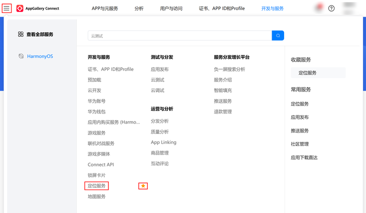
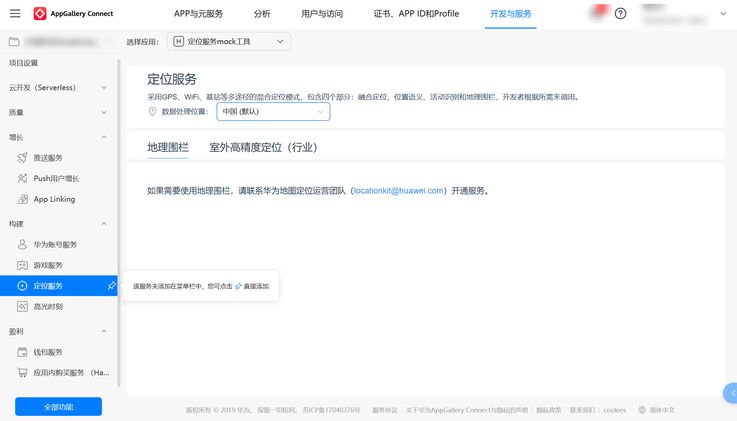
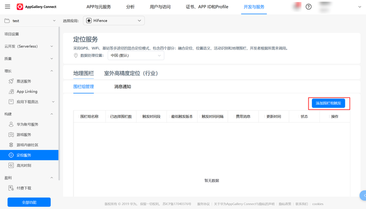
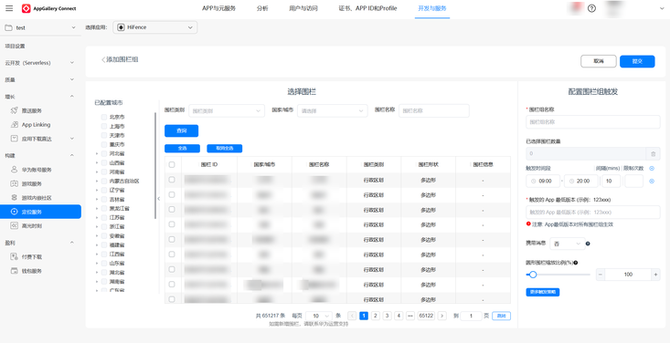

# 云侧围栏开发指导

更新时间：2026-04-20 06:34:33

来源：https://developer.huawei.com/consumer/cn/doc/harmonyos-guides/fenceextensionability

#### 概述

云侧围栏是指开发者直接使用云侧公共围栏，当用户进入这个区域，在移动设备上进行有针对性的提醒。
 
  

#### 开通云侧围栏服务

在开通定位服务前，请先参考“[应用开发准备](https://developer.huawei.com/consumer/cn/doc/harmonyos-guides/application-dev-overview)”创建项目和应用工程。
 
> [!NOTE]
> 从HarmonyOS NEXT Developer Beta2起，开发者无需配置公钥指纹和Client ID。

 
**操作步骤**
 1. 登录[AppGallery Connect](https://developer.huawei.com/consumer/cn/service/josp/agc/index.html)网站，选择“开发与服务”。

  


2. 在项目列表中找到您的项目，在项目下的应用列表中选择需要配置定位服务参数的应用。

  


3. 在左侧导航栏选择“定位服务”，并点击收藏。

  


4. 在左侧导航栏选择“构建 > 定位服务”。

  


 
  

#### 使用场景
1. 开发者可以通过该围栏扩展能力来使用云侧公共围栏。
2. 开发者首先需要在AGC（AppGallery Connect）平台定位服务选择右侧“添加围栏组触发”开始创建地理围栏。

  


3. 可以根据商圈、景点等类别，配置围栏组下发围栏策略。

  


4. 定位服务在满足围栏触发条件后，通过FenceExtensionAbility把围栏事件通知给APP，APP接收到围栏事件后完成相关的业务处理。
 
  

#### 接口介绍

接口详情参见[FenceExtensionAbility](https://developer.huawei.com/consumer/cn/doc/harmonyos-references/js-apis-app-ability-fenceextensionability)。
  
| 接口 | 描述 |
| --- | --- |
| onFenceStatusChange(transition: geoLocationManager.GeofenceTransition, additions: Record<string, string>): void | 接收系统通知的地理围栏事件，根据围栏事件类型和数据进行相应处理。 |
| onDestroy(): void | 接收FenceExtensionAbility的销毁事件并处理，会在FenceExtensionAbility销毁前回调。 |
 
 
  

#### 开发步骤

要实现一个地理围栏扩展服务，开发者需要实现[FenceExtensionAbility](https://developer.huawei.com/consumer/cn/doc/harmonyos-references/js-apis-app-ability-fenceextensionability)的能力，具体步骤如下：
 1. 在工程Module对应的ets目录下，右键选择“New > Directory”，新建一个目录并命名为fenceextensionability;
2. 在fenceextensionability目录，右键选择“New > File”，新建一个.ets文件并命名为MyFenceExtensionAbility.ets;
3. 打开MyFenceExtensionAbility.ets，导入FenceExtensionAbility的依赖包，自定义类继承FenceExtensionAbility并实现onFenceStatusChange和onDestroy接口;

  示例代码如下：

  
```text
import { FenceExtensionAbility, geoLocationManager } from '@kit.LocationKit';
import { wantAgent } from '@kit.AbilityKit';
import { notificationManager } from '@kit.NotificationKit';

export default class MyFenceExtensionAbility extends FenceExtensionAbility {
  async onFenceStatusChange(transition: geoLocationManager.GeofenceTransition, additions: Record<string, string>): Promise<void> {
    super.onFenceStatusChange(transition, additions);

    // 接收围栏触发信息
    console.info('MyFenceExtensionAbility onFenceStatusChange');

    let poiId: string = additions['poiId'];// 围栏id，唯一标识，示例：'999287512272780934'
    let policyType: string = additions['policyType'];// 策略类型：'0'-普通策略;'1'-标签策略
    let policyResult: string = additions['policyResult'];// 策略结果：标签等策略的额外信息

    console.info(`poiId:${poiId},policyType:${policyType},policyResult:${policyResult}`);

    // 可以发送围栏业务通知
    let wantAgentInfo: wantAgent.WantAgentInfo = {
      wants: [
        {
          bundleName: 'com.huawei.hmos.locationtest.smartfence',
          abilityName: 'EntryAbility'
        } as Want
      ],
      actionType: wantAgent.OperationType.START_ABILITY,
      requestCode: 100
    };
    let wantAgentMy = await wantAgent.getWantAgent(wantAgentInfo);
    let notificationRequest: notificationManager.NotificationRequest = {
      id: 1,
      content: {
        notificationContentType: notificationManager.ContentType.NOTIFICATION_CONTENT_BASIC_TEXT,
        normal: {
          title: `围栏通知`,
          text: `poiId:${poiId},policyType:${policyType},policyResult:${policyResult}`,
        }
      },
      notificationSlotType: notificationManager.SlotType.SOCIAL_COMMUNICATION,
      wantAgent: wantAgentMy
    };
    notificationManager.publish(notificationRequest);
  }

  onDestroy(): void {
    super.onDestroy();
    console.info('MyFenceExtensionAbility onDestroy');
  }
}
```

4. 在工程Module对应的[module.json5配置文件](https://developer.huawei.com/consumer/cn/doc/harmonyos-guides/module-configuration-file#extensionabilities标签)中注册FenceExtensionAbility，type标签需要设置为fence，srcEntry标签表示当前FenceExtensionAbility组件所对应的代码路径。

  
```ArkTS
{
  "module": {
    "extensionAbilities": [
      {
        "name": "MyFenceExtensionAbility",
        "srcEntry": "./ets/fenceextensionability/MyFenceExtensionAbility.ets",
        "description": "MyFenceExtensionAbility",
        "type": "fence",
        "exported": false
      },
    ]
  }
}
```
