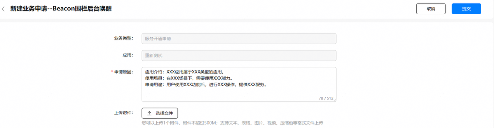

# 申请开放能力权限指导

更新时间：2026-05-07 09:37:20

来源：https://developer.huawei.com/consumer/cn/doc/harmonyos-guides/location-apply-open-capability

## 开放能力申请准备

请先参考[应用开发准备](https://developer.huawei.com/consumer/cn/doc/harmonyos-guides/application-dev-overview)完成基本准备工作，再继续以下开放能力准备项。

## 室内高精度定位

为了更好的用户体验，系统侧对室内高精度定位服务功能做了权限保护处理，使用相关接口开发者需先提交“室内高精度定位”能力开关的申请，请在申请通过后，再使用该能力。 室内高精度定位仅支持商场、高铁站、机场和医院等场所，支持的建筑列表如下。 [支持室内定位建筑列表](https://openlocation-portal-drcn.partner.petalmaps.com/indoormap/index.html#/homePage) 在这些建筑中支持楼层识别，定位精度约10~20米左右。 未开通室内高精度定位服务时Location Kit仍然支持在室内场景进行网络定位获取定位结果。 登录[AppGallery Connect](https://developer.huawei.com/consumer/cn/service/josp/agc/index.html)，选择“开发与服务”。  在项目列表选择项目，并在应用列表下选择需要申请室内高精度定位功能的应用。  进入“项目设置 > 开放能力管理”页面，选择能力名称为定位服务（HarmonyOS NEXT），然后点击“室内高精度定位”对应的“申请”。

参考“申请原因”中的模板，提供申请必需的相关信息，包括应用介绍、使用场景、申请用途，然后点击“提交”按钮。

返回“开放能力管理”页面，原“申请”变为“申请中”，1~3个工作日内反馈申请结果，请留意互动中心的“服务开通申请”信息。

申请通过后，互动中心会发送通知给您，同时“申请中”会变为置灰显示的“申请”，至此，应用已成功开启室内高精度定位开放能力。

## 位置语义

为了更好的用户体验，系统侧对位置语义服务功能做了权限保护处理，使用相关接口开发者需先提交“位置语义”能力开关的申请。 若您的鸿蒙应用需感知用户周围的位置语义（如店铺、地铁站等）信息，请在申请通过后，再使用该能力。 登录[AppGallery Connect](https://developer.huawei.com/consumer/cn/service/josp/agc/index.html)，选择“开发与服务”。  在项目列表选择项目，并在应用列表下选择需要申请位置语义功能的应用。  进入“项目设置 > 开放能力管理”页面，选择能力名称为定位服务（HarmonyOS NEXT），然后点击“位置语义”对应的“申请”。

参考“申请原因”中的模板，提供申请必需的相关信息，包括应用介绍、使用场景、申请用途，然后点击“提交”按钮。

返回“开放能力管理”页面，原“申请”变为“申请中”，1~3个工作日内反馈申请结果，请留意互动中心的“服务开通申请”信息。

申请通过后，互动中心会发送通知给您，同时“申请中”会变为置灰显示的“申请”，至此，应用已成功开启位置语义开放能力。

## 围栏后台唤醒

基于安全考虑，系统侧对围栏后台唤醒功能做了权限保护处理，使用相关接口开发者需先提交“围栏后台唤醒”能力开关的申请。 若您的鸿蒙应用在后台状态下需要接收用户进出围栏的事件通知，请在申请通过后，再使用该能力。 登录[AppGallery Connect](https://developer.huawei.com/consumer/cn/service/josp/agc/index.html)，选择“开发与服务”。  在项目列表选择项目，并在应用列表下选择需要申请围栏后台唤醒功能的应用。  进入“项目设置 > 开放能力管理”页面，选择能力名称为定位服务（HarmonyOS NEXT），然后点击“围栏后台唤醒”对应的“申请”。

参考“申请原因”中的模板，提供申请必需的相关信息，包括应用介绍、使用场景、申请用途，然后点击“提交”按钮。

返回“开放能力管理”页面，原“申请”变为“申请中”，1~3个工作日内反馈申请结果，请留意互动中心的“服务开通申请”信息。

申请通过后，互动中心会发送通知给您，同时“申请中”会变为置灰显示的“申请”，至此，应用已成功开启Beacon围栏后台唤醒开放能力。

## 获取蓝牙扫描信息

基于安全考虑，系统侧对获取蓝牙扫描信息功能做了权限保护处理，使用相关接口开发者需先提交“获取蓝牙扫描信息”能力开关的申请。 若您的鸿蒙应用需获取用户周围的蓝牙扫描信息，请在申请通过后，再使用该能力。 登录[AppGallery Connect](https://developer.huawei.com/consumer/cn/service/josp/agc/index.html)，选择“开发与服务”。  在项目列表选择项目，并在应用列表下选择需要申请获取蓝牙扫描信息功能的应用。  进入“项目设置 > 开放能力管理”页面，选择能力名称为定位服务（HarmonyOS NEXT），然后点击“获取蓝牙扫描信息”对应的“申请”。

参考“申请原因”中的模板，提供申请必需的相关信息，包括应用介绍、使用场景、申请用途，然后点击“提交”按钮。

返回“开放能力管理”页面，原“申请”变为“申请中”，1~3个工作日内反馈申请结果，请留意互动中心的“服务开通申请”信息。

申请通过后，互动中心会发送通知给您，同时“申请中”会变为置灰显示的“申请”，至此，应用已成功开启获取蓝牙扫描信息开放能力。

