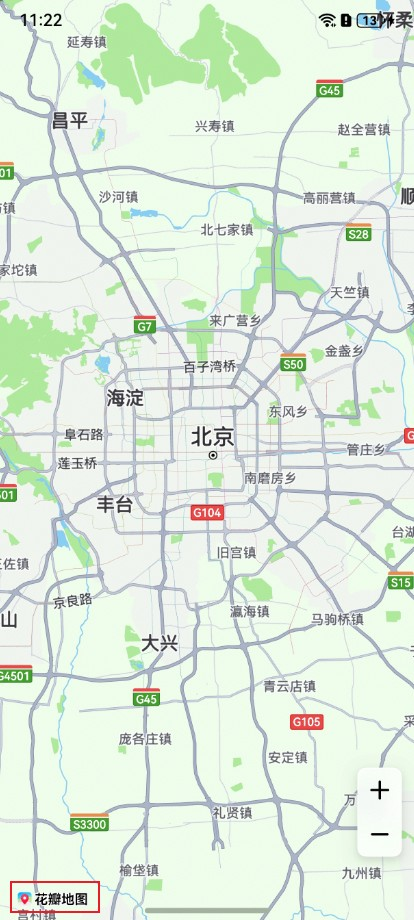

# 设置地图Logo始终显示

更新时间：2026-04-24 08:10:21

来源：https://developer.huawei.com/consumer/cn/doc/harmonyos-guides/map-faq-4

**现象描述**

 Map Kit地图Logo不可见。

 

 **可能原因**

 用户在开发过程中，若地图Logo被其他UI控件或页面元素覆盖，则可能导致Logo不可见。

 **处理步骤**

 Map Kit无法隐藏地图Logo，用户可通过调整地图组件的边距或布局，确保地图Logo不被其他控件遮挡。解决方案参考如下代码：


```text
import { MapComponent, mapCommon, map } from '@kit.MapKit';
import { AsyncCallback } from '@kit.BasicServicesKit';

@Entry
@Component
struct MapKitAppDemo {
  private mapOptions?: mapCommon.MapOptions;
  private callback?: AsyncCallback;
  private mapController?: map.MapComponentController;
  private mapEventManager?: map.MapEventManager;
  private TAG = 'MapKitAppDemo';
  @State isShowSheet: boolean = true;

  @Builder
  Panel() {
    Column() {
      Row() {
        Text() {
          SymbolSpan($r('sys.symbol.magnifyingglass'))
            .fontSize(24)
            .fontColor([Color.Gray])
        }

        TextInput()
          .layoutWeight(1)
          .backgroundColor('#33b1afaf')
          .borderRadius(24)
          .margin({ left: 8, right: 8 })
      }
      .backgroundColor(Color.White)
      .width('100%')
    }
    .borderRadius(10)
    .padding({
      top: 8,
      left: 8,
      right: 8,
      bottom: 4
    })
    .width('100%')
  }

  aboutToAppear() {
    // 地图初始化参数，设置地图中心点坐标及层级
    this.mapOptions = {
      position: {
        target: {
          latitude: 31.979227,
          longitude: 118.762245
        },
        zoom: 17
      }
    };

    // 地图初始化的回调
    this.callback = async (err, mapController) => {
      if (!err) {
        // 获取地图的控制器类，用来操作地图
        this.mapController = mapController;
        // 返回地图组件的监听事件管理接口
        this.mapEventManager = this.mapController.getEventManager();
        let callback = () => {
          console.info(this.TAG, `on-mapLoad`);
        }
        // 监听地图加载事件
        this.mapEventManager?.on('mapLoad', callback);
      } else {
        console.error(`Failed to initialize the map, code is：${err.code}, message is ${err.message}`);
      }
    }
  }

  aboutToDisappear(): void {
    this.mapEventManager?.off('mapLoad');
    this.mapController?.clear();
  }

  private bindSheetOptions() {
    let bindSheetOptions = {
      // 半模态框三个状态的高度
      detents: [100, 300, 500],
      // 半模态所在页面允许交互
      enableOutsideInteractive: true,
      maskColor: Color.Transparent,
      backgroundColor: Color.White,
      blurStyle: BlurStyle.Thick,
      showClose: false,
      preferType: SheetType.CENTER,
      onAppear: () => {
        this.mapController?.setPadding({
          bottom: 358
        })
      },
      onHeightDidChange: (height: number) => {
        // 动态设置地图底部边距，避免遮挡logo
        this.mapController?.setPadding({
          bottom: height + 8
        })
      }
    } as BindOptions
    return bindSheetOptions;
  }

  build() {
    Stack() {
      Column() {
        // 调用MapComponent组件初始化地图
        MapComponent({ mapOptions: this.mapOptions, mapCallback: this.callback })
          .width('100%')
          .height('100%')
        Column()
          .bindSheet(this.isShowSheet, this.Panel(), this.bindSheetOptions())
          .visibility(this.isShowSheet ? Visibility.Visible : Visibility.None)
          .justifyContent(FlexAlign.Start)
      }
    }
    .height('100%')
    .width('100%')
  }
}
```

 展示效果如图所示：

 
