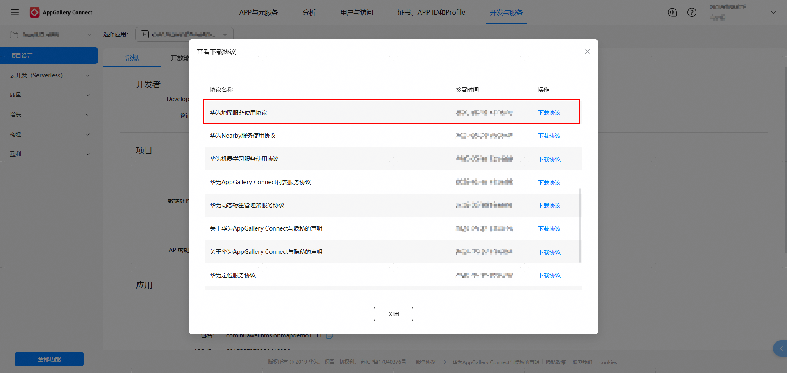

# 上架前准备-获取地图服务协议及资质证明

更新时间：2026-04-20 06:34:33

来源：https://developer.huawei.com/consumer/cn/doc/harmonyos-guides/preparations_before

#### 华为地图服务使用协议
1. 登录[AppGallery Connect](https://developer.huawei.com/consumer/cn/service/josp/agc/index.html)网站，选择“协议签署记录”。

  

2. 在查看下载协议中选择可查看“华为地图服务使用协议”。

  

 
  

#### 地图审图号

标准地图审图号：GS（2024）1955号
 
卫星地图审图号：GS（2025）2036号
 
送审单位：华为软件技术有限公司
