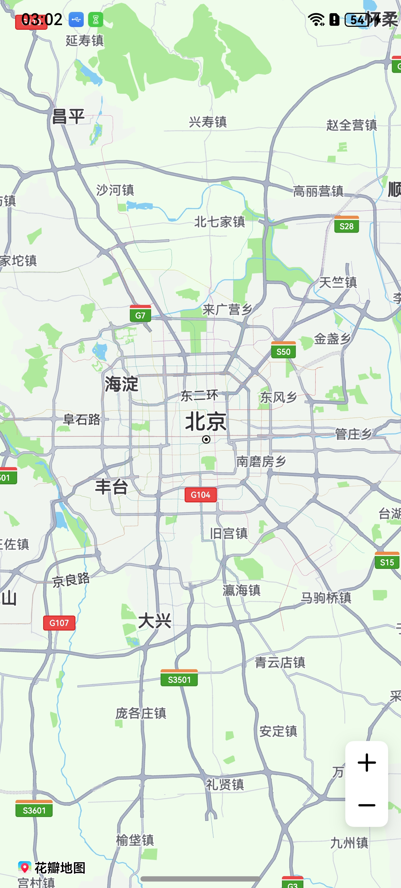
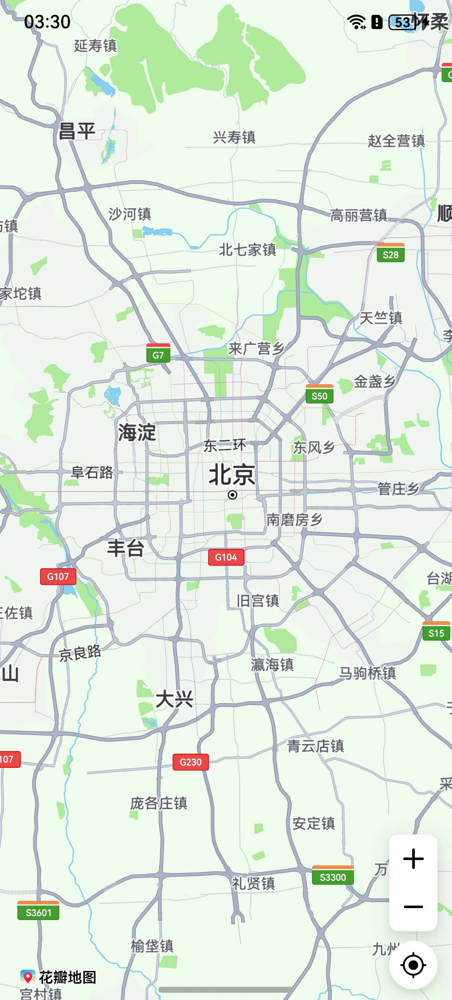
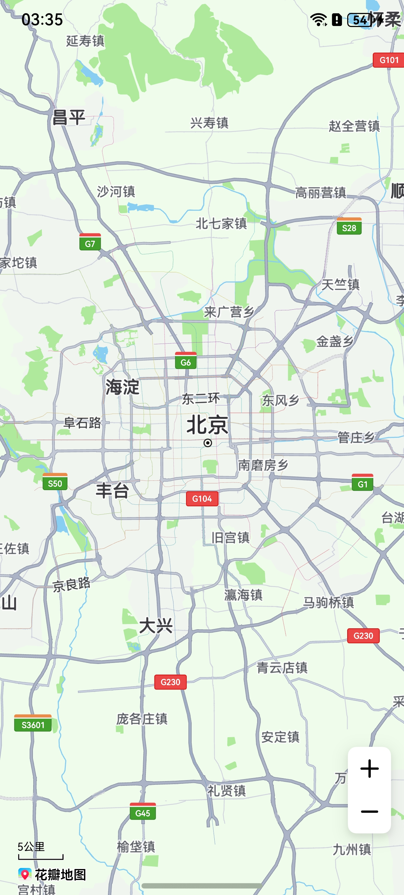
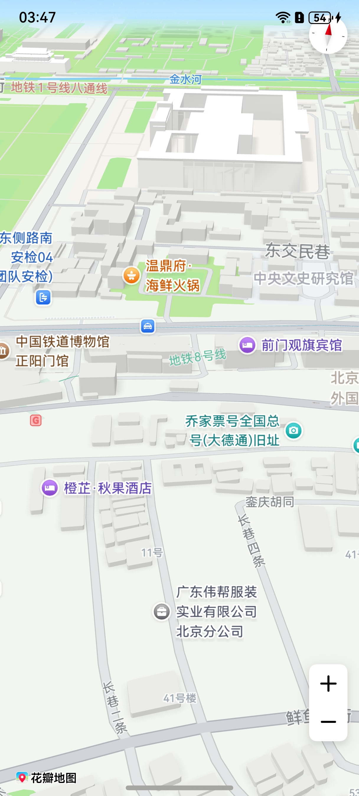
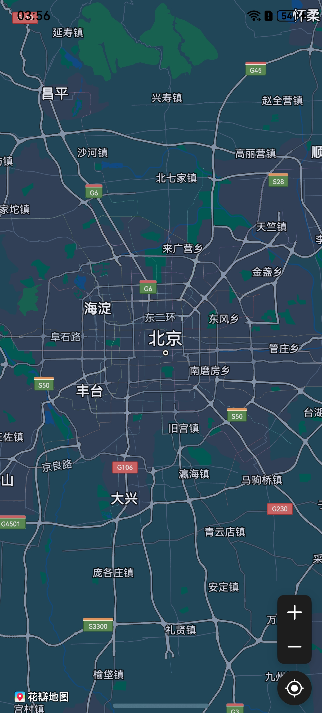
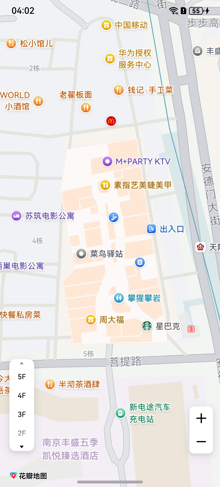
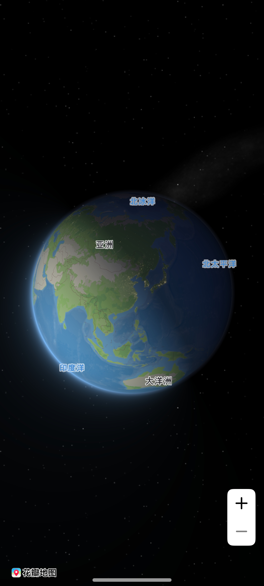
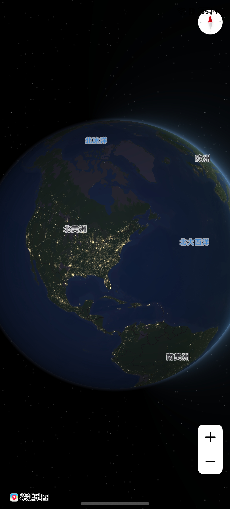

# 显示地图

更新时间：2026-04-20 06:34:33

来源：https://developer.huawei.com/consumer/cn/doc/harmonyos-guides/map-presenting

#### 场景介绍

从5.0.3(15)开始，支持Logo缩放功能和3D地球功能；从5.1.1(19)开始，支持室内图功能和设置比例尺单位功能；从6.0.0(20)开始，支持设置地图语言功能；从6.1.0(23)开始，支持设置3D地图城市灯光效果。

本章节将向您介绍如何使用地图组件[MapComponent](https://developer.huawei.com/consumer/cn/doc/harmonyos-references/map-mapcomponent#mapcomponent)和[MapComponentController](https://developer.huawei.com/consumer/cn/doc/harmonyos-references/map-map-mapcomponentcontroller)呈现地图，效果如下图所示。





#### 接口说明

显示地图功能主要由[MapComponent](https://developer.huawei.com/consumer/cn/doc/harmonyos-references/map-mapcomponent#mapcomponent)提供，更多接口及使用方法请参见[接口文档](https://developer.huawei.com/consumer/cn/doc/harmonyos-references/map-mapcomponent)。

| 接口 | 接口描述 |
| --- | --- |
| mapCommon.MapOptions | 提供Map组件初始化的属性。 |
| MapComponent(mapOptions: mapCommon.MapOptions, mapCallback: AsyncCallback<map.MapComponentController>) | 地图组件。 |
| map.MapComponentController | 地图组件的主要功能入口类，用来操作地图，与地图有关的所有方法从此处接入。它所承载的工作包括：地图类型切换（如标准地图、空地图）、改变地图状态（中心点坐标和缩放级别）、添加点标记（Marker）、绘制几何图形（如MapPolyline、MapPolygon、MapCircle）、监听各类事件等。 |


#### 开发步骤


#### 地图显示
1. 导入Map Kit相关模块。

  
```text
import { MapComponent, mapCommon, map } from '@kit.MapKit';
import { AsyncCallback } from '@kit.BasicServicesKit';
```

2. 新建地图初始化参数mapOptions，设置地图中心点坐标及层级。

  通过callback回调的方式获取[MapComponentController](https://developer.huawei.com/consumer/cn/doc/harmonyos-references/map-map-mapcomponentcontroller)对象，用来操作地图。

  调用[MapComponent](https://developer.huawei.com/consumer/cn/doc/harmonyos-references/map-mapcomponent#mapcomponent)组件，传入mapOptions和mapCallback参数，初始化地图。

  
```text
@Entry
@Component
struct HuaweiMapDemo {
  private TAG = "HuaweiMapDemo";
  private mapOptions?: mapCommon.MapOptions;
  private callback?: AsyncCallback<map.MapComponentController>;
  private mapController?: map.MapComponentController;
  private mapEventManager?: map.MapEventManager;

  aboutToAppear(): void {
    // 地图初始化参数，设置地图中心点坐标及层级
    this.mapOptions = {
      position: {
        target: {
          latitude: 39.9,
          longitude: 116.4
        },
        zoom: 10
      }
    };

    // 地图初始化的回调
    this.callback = async (err, mapController) => {
      if (!err) {
        // 获取地图的控制器类，用来操作地图
        this.mapController = mapController;
        this.mapEventManager = this.mapController.getEventManager();
        let callback = () => {
          console.info(this.TAG, `on-mapLoad`);
        }
        this.mapEventManager.on("mapLoad", callback);
      } else {
        console.error(`Failed to initialize the map, code is：${err.code}, message is ${err.message}`);
      }
    };
  }

  // 页面每次显示时触发一次，包括路由过程、应用进入前台等场景，仅@Entry装饰的自定义组件生效
  onPageShow(): void {
    // 将地图切换到前台
    if (this.mapController) {
      this.mapController.show();
    }
  }

  // 页面每次隐藏时触发一次，包括路由过程、应用进入后台等场景，仅@Entry装饰的自定义组件生效
  onPageHide(): void {
    // 将地图切换到后台
    if (this.mapController) {
      this.mapController.hide();
    }
  }

  build() {
    Stack() {
      // 调用MapComponent组件初始化地图
      MapComponent({ mapOptions: this.mapOptions, mapCallback: this.callback }).width('100%').height('100%');
    }.height('100%')
  }
}
```

3. 运行您刚完成的工程就可以在您的APP中看到地图了，运行后的效果如下图所示。

  如果没有成功加载地图，请参见[地图不显示](https://developer.huawei.com/consumer/cn/doc/harmonyos-guides/map-faq-1)。

  


#### 设置地图属性

[MapOptions](https://developer.huawei.com/consumer/cn/doc/harmonyos-references/map-common#mapoptions)包含以下属性。

| 属性 | 描述 |
| --- | --- |
| mapType | 地图类型，默认值：MapType.STANDARD。 |
| position | 地图相机位置。 |
| bounds | 地图展示框。 |
| minZoom | 地图最小层级，有效范围[2, 20]，默认值：2。 |
| maxZoom | 地图最大层级，有效范围[2, 20]，默认值：20。 |
| rotateGesturesEnabled | 是否支持旋转手势，默认值：true。 |
| scrollGesturesEnabled | 是否支持滑动手势，默认值：true。 |
| zoomGesturesEnabled | 是否支持缩放手势，默认值：true。 |
| tiltGesturesEnabled | 是否支持倾斜手势，默认值：true。 |
| zoomControlsEnabled | 是否展示缩放控件，默认值：true。 |
| myLocationControlsEnabled | 是否展示我的位置按钮，默认值：false。 |
| compassControlsEnabled | 是否展示指南针控件，默认值：true。 |
| scaleControlsEnabled | 是否展示比例尺，默认值：false。 |
| alwaysShowScaleEnabled | 是否始终显示比例尺，默认值：false。 |
| padding | 设置地图和边界的距离。 |
| styleId | 自定义样式ID。 |
| dayNightMode | 日间夜间模式，默认值：DayNightMode.DAY（日间模式）。 |
| logoScale | Logo缩放比例，取值范围是[0.8, 1]，默认值：1。 |
| sphereEnabled | 是否开启3D地球效果，默认值为false。 |
| indoorMapEnabled | 是否开启室内图，默认值：false。 |
| scaleUnit | 地图比例尺公英制单位，默认值：ScaleUnit.METRIC_UNIT（公制单位）。 |

1. 设置mapType，[切换地图类型](https://developer.huawei.com/consumer/cn/doc/harmonyos-guides/map-type)章节中有详细讲解。
2. 设置myLocationControlsEnabled，展示我的位置按钮。

  在mapOptions中设置myLocationControlsEnabled属性为true，可展示我的位置按钮

，显示效果如下图所示。

  也可通过调用[MapComponentController](https://developer.huawei.com/consumer/cn/doc/harmonyos-references/map-map-mapcomponentcontroller)对象的方法展示我的位置按钮，详情见[显示我的位置](https://developer.huawei.com/consumer/cn/doc/harmonyos-guides/map-location)章节。

  
```text
this.mapOptions = {
  position: {
    target: {
      latitude: 39.9,
      longitude: 116.4
    },
    zoom: 10
  },
  myLocationControlsEnabled: true
};
```



3. 展示比例尺。

  在mapOptions中设置scaleControlsEnabled属性为true，可展示比例尺，显示效果如下图所示。

  
```text
this.mapOptions = {
  position: {
    target: {
      latitude: 39.9,
      longitude: 116.4
    },
    zoom: 10
  },
  scaleControlsEnabled: true
};
```




#### 开启3D建筑图层

调用[MapComponentController](https://developer.huawei.com/consumer/cn/doc/harmonyos-references/map-map-mapcomponentcontroller)对象的[setBuildingEnabled](https://developer.huawei.com/consumer/cn/doc/harmonyos-references/map-map-mapcomponentcontroller#setbuildingenabled)方法开启3D建筑图层，把缩放层级调整为16级或以上，将两个手指放在地图上，向上滑动倾斜地图可看到3D建筑图层的效果。

```text
this.mapController.setBuildingEnabled(true);
```

显示效果如下：





#### 地图前后台切换

您可以通过[MapComponentController](https://developer.huawei.com/consumer/cn/doc/harmonyos-references/map-map-mapcomponentcontroller)对象来控制地图页面前后台切换的生命周期。应用触发前后台切换时，可以在Page生命周期里调用show/hide，以便申请/释放资源。

**地图切换至前台：**

```text
// 页面每次显示时触发一次，包括路由过程、应用进入前台等场景，仅@Entry装饰的自定义组件生效
onPageShow(): void {
  // 建议页面切换到前台，调用地图组件的show方法
  if (this.mapController) {
    this.mapController.show();
  }
}
```

**地图切换至后台：**

```text
// 页面每次隐藏时触发一次，包括路由过程、应用进入后台等场景，仅@Entry装饰的自定义组件生效
onPageHide(): void {
  // 建议页面切换到后台，调用地图组件的hide方法
  if (this.mapController) {
    this.mapController.hide();
  }
}
```


#### 深色模式

Map Kit提供2种方式设置地图的夜间模式：初始化地图时和创建地图后。

方式一：初始化地图时

在地图初始化参数中设置dayNightMode参数，参数可选值包括DAY（日间模式）、NIGHT（夜间模式）、AUTO（自动模式）。如果将参数值设置为AUTO，地图的深色模式会跟随系统，打开系统深色开关，显示夜间模式，否则显示日间模式。

```text
this.mapOptions = {
  position: {
    target: {
      latitude: 39.9,
      longitude: 116.4
    },
    zoom: 10
  },
  myLocationControlsEnabled: true,
  // 设置地图为夜间模式
  dayNightMode: mapCommon.DayNightMode.NIGHT
};
```





方式二：创建地图后

创建地图后，可调用[MapComponentController](https://developer.huawei.com/consumer/cn/doc/harmonyos-references/map-map-mapcomponentcontroller)对象的[setDayNightMode](https://developer.huawei.com/consumer/cn/doc/harmonyos-references/map-map-mapcomponentcontroller#setdaynightmode)方法设置夜间模式。下面的例子中将参数值设置为AUTO，在设置完之后，打开系统的深色开关，地图会自动变为夜间模式。

```text
// 设置地图为自动模式
this.mapController.setDayNightMode(mapCommon.DayNightMode.AUTO);
```


#### 室内图

使用室内图可查看楼层平面图，如查看购物中心、博物馆和医院等地点的内部情况。

Map Kit提供2种方式开启地图的室内图功能：初始化地图时和创建地图后。

方式一：初始化地图时

在地图初始化参数中设置将[MapOptions](https://developer.huawei.com/consumer/cn/doc/harmonyos-references/map-common#mapoptions)中的indoorMapEnabled参数设置为true即可开启室内图功能，而且仅17级及以上地图层级可见室内图和楼层调节控件，通过左下角的楼层调节控件可以切换当前室内图楼层。

```text
this.mapOptions = {
  position: {
    target: {
      latitude: 31.979227,
      longitude: 118.762245
    },
    zoom: 18
  },
  // 开启室内图功能
  indoorMapEnabled: true
};
```





方式二：创建地图后

创建地图后，可调用[MapComponentController](https://developer.huawei.com/consumer/cn/doc/harmonyos-references/map-map-mapcomponentcontroller)对象的[setIndoorMapEnabled](https://developer.huawei.com/consumer/cn/doc/harmonyos-references/map-map-mapcomponentcontroller#setindoormapenabled)方法来开启或关闭室内图功能。下面的例子中将室内图开启后，调用[isIndoorMapEnabled](https://developer.huawei.com/consumer/cn/doc/harmonyos-references/map-map-mapcomponentcontroller#isindoormapenabled)方法来查询当前室内图功能的开启状态，调用[setFloorControlsPosition](https://developer.huawei.com/consumer/cn/doc/harmonyos-references/map-map-mapcomponentcontroller#setfloorcontrolsposition)方法可以设置楼层调节控件的位置。室内图功能还提供了[switchIndoorMapFloor](https://developer.huawei.com/consumer/cn/doc/harmonyos-references/map-map-mapcomponentcontroller#switchindoormapfloor)方法，可以切换到指定的室内建筑和指定的楼层。

```text
// 开启室内图功能
this.mapController.setIndoorMapEnabled(true);
// 查询当前室内图开启状态
let isIndoorMapEnabled: boolean = this.mapController.isIndoorMapEnabled();
console.info('indoorMapEnabled is:' + isIndoorMapEnabled);
// 设置楼层调节控件的位置
this.mapController.setFloorControlsPosition({
  positionX: 500,
  positionY: 500
});
// 切换楼层,需要将第一个入参替换成用户需要的建筑物id，第二个参数替换成当前楼层，如'1F'、'B1'等等
this.mapController.switchIndoorMapFloor('822588304363886720', '3F');
```

通过调用[on('indoorMapEnter')](https://developer.huawei.com/consumer/cn/doc/harmonyos-references/map-map-mapeventmanager#onindoormapenter)方法和[on('indoorMapExit')](https://developer.huawei.com/consumer/cn/doc/harmonyos-references/map-map-mapeventmanager#onindoormapexit)可以分别设置进入和退出室内图的监听事件。

```text
let callbackEnter = (indoorMapInfo: map.IndoorMapInfo) => {
  console.info(this.TAG, `on-indoorMapEnter`);
};
let callbackExit = () => {
  console.info(this.TAG, `on-indoorMapExit`);
};
// 进入室内图监听回调
this.mapEventManager.on("indoorMapEnter", callbackEnter);
// 退出室内图监听回调
this.mapEventManager.on("indoorMapExit", callbackExit);
```


#### Logo缩放比例

Map Kit提供2种方式设置地图的Logo缩放比例：初始化地图时和创建地图后。

方式一：初始化地图时

在地图初始化参数中设置logoScale参数，取值范围是[0.8, 1]，默认值是1。

```text
this.mapOptions = {
  position: {
    target: {
      latitude: 39.9,
      longitude: 116.4
    },
    zoom: 10
  },
  myLocationControlsEnabled: true,
  // 设置logo缩放比例为0.9
  logoScale: 0.9
};
```

方式二：创建地图后
1. 创建地图后，调用[MapComponentController](https://developer.huawei.com/consumer/cn/doc/harmonyos-references/map-map-mapcomponentcontroller)对象的[setLogoScale](https://developer.huawei.com/consumer/cn/doc/harmonyos-references/map-map-mapcomponentcontroller#setlogoscale)方法设置Logo缩放比例。

  
```text
this.mapController.setLogoScale(0.9);
```

2. 获取Logo缩放比例。

  通过调用[MapComponentController](https://developer.huawei.com/consumer/cn/doc/harmonyos-references/map-map-mapcomponentcontroller)对象的[getLogoScale](https://developer.huawei.com/consumer/cn/doc/harmonyos-references/map-map-mapcomponentcontroller#getlogoscale)方法获取当前Logo缩放比例。

  
```text
let logoScale: number = this.mapController.getLogoScale();
```


#### 开启3D地球

Map Kit提供2种方式开启3D地球：初始化地图时和创建地图后。

开启3D地球后，当层级缩小到小于4时，可以清晰地看到3D地球。

方式一：初始化地图时

在地图初始化参数中设置3D地球的开启状态，默认值是false。

```text
this.mapOptions = {
  position: {
    target: {
      latitude: 39.9,
      longitude: 116.4
    },
    zoom: 2
  },
  // 开启3D地球
  sphereEnabled: true
};
```

方式二：创建地图后

创建地图后，调用[MapComponentController](https://developer.huawei.com/consumer/cn/doc/harmonyos-references/map-map-mapcomponentcontroller)对象的[setSphereEnabled](https://developer.huawei.com/consumer/cn/doc/harmonyos-references/map-map-mapcomponentcontroller#setsphereenabled)方法开启3D地球，通过调用[MapComponentController](https://developer.huawei.com/consumer/cn/doc/harmonyos-references/map-map-mapcomponentcontroller)对象的[isSphereEnabled](https://developer.huawei.com/consumer/cn/doc/harmonyos-references/map-map-mapcomponentcontroller#issphereenabled)方法可获取3D地球的开启状态。

```text
// 开启3D地球
this.mapController.setSphereEnabled(true);
// 获取3D地球的开启状态
let result: boolean = this.mapController.isSphereEnabled();
```

显示效果如下：





开启城市灯光效果

调用[MapComponentController](https://developer.huawei.com/consumer/cn/doc/harmonyos-references/map-map-mapcomponentcontroller)对象的[setSphereEnabled](https://developer.huawei.com/consumer/cn/doc/harmonyos-references/map-map-mapcomponentcontroller#setsphereenabled-2)(enabled: boolean, animateDuration: number, cityLight: boolean)方法开启城市灯光效果。



