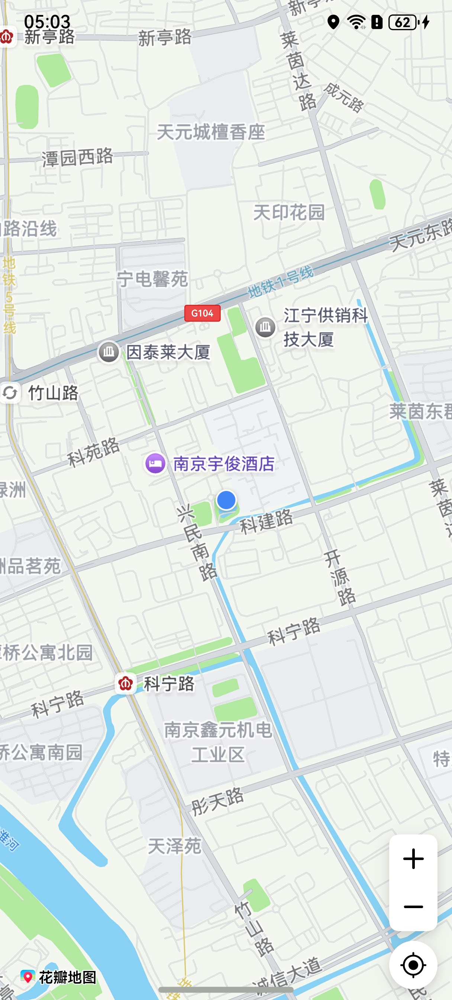
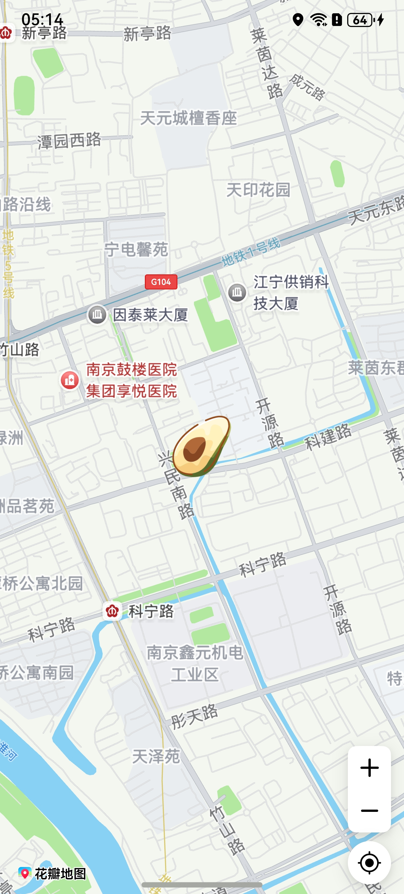
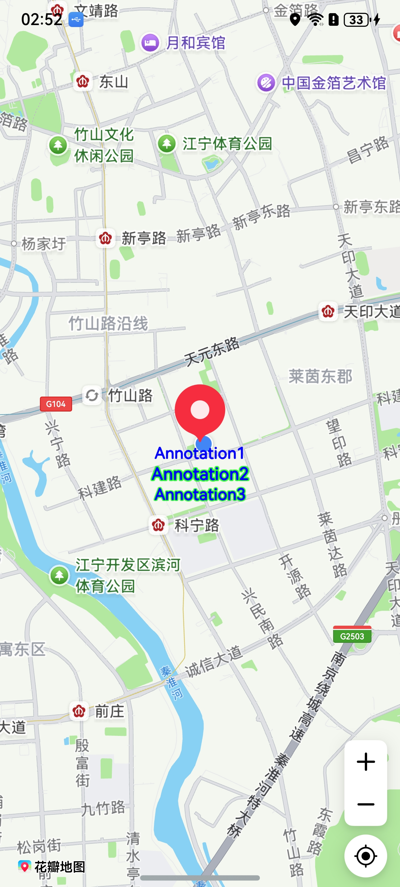

# 显示我的位置

更新时间：2026-04-24 08:10:21

来源：https://developer.huawei.com/consumer/cn/doc/harmonyos-guides/map-location

#### 场景介绍

从6.0.1(21)开始，支持更改我的位置相对覆盖物的顺序。

本章节将向您介绍如何开启和展示“我的位置”功能，“我的位置”指的是进入地图后点击“我的位置”显示当前位置点的功能。效果如下：





#### 接口说明

“我的位置”功能主要由[MapComponentController](https://developer.huawei.com/consumer/cn/doc/harmonyos-references/map-map-mapcomponentcontroller)的方法实现，更多接口及使用方法请参见[接口文档](https://developer.huawei.com/consumer/cn/doc/harmonyos-references/map-map-mapcomponentcontroller#setmylocationenabled)。

| 方法名 | 描述 |
| --- | --- |
| setMyLocationEnabled(myLocationEnabled: boolean): void | “我的位置”图层功能开关，默认使用系统的连续定位能力显示用户位置。开关打开后，“我的位置”按钮默认显示在地图的右下角。点击“我的位置”按钮，将会在屏幕中心显示当前定位，以蓝色圆点的形式呈现。 |
| setMyLocationControlsEnabled(enabled: boolean): void | 设置是否启用“我的位置”按钮。只显示按钮，在不开启“我的位置”图层功能的情况下，点击按钮没反应。 |
| setMyLocation(location: geoLocationManager.Location): void | 设置“我的位置”坐标。 如果不使用Map Kit提供的默认定位行为，可以通过Location Kit获取用户位置后，传给Map Kit。 |
| setMyLocationStyle(style: mapCommon.MyLocationStyle): Promise&lt;void&gt; | 设置“我的位置”样式。 |
| on(type: 'myLocationButtonClick', callback: Callback&lt;void&gt;): void | 监听“我的位置”按钮点击事件。 |
| off(type: 'myLocationButtonClick', callback?: Callback&lt;void&gt;): void | 取消监听“我的位置”按钮点击事件。 |


#### 开发步骤


#### 开启“我的位置”按钮
1. 在启用“我的位置”功能前，开发者应确保应用已申请并获得用户定位权限，以便正确显示用户当前位置。

  申请ohos.permission.LOCATION和ohos.permission.APPROXIMATELY_LOCATION权限，您需要在module.json5配置文件中声明所需要的权限，具体可参考[声明权限](https://developer.huawei.com/consumer/cn/doc/harmonyos-guides/declare-permissions)。

  
```json
{
  "module" : {
    // ...
    "requestPermissions":[
      {
        // 允许应用在前台运行时获取位置信息
        "name" : "ohos.permission.LOCATION",
        // reason需要在/resources/base/element/string.json中新建
        "reason": "$string:location_permission",
        "usedScene": {
          "abilities": [
            "EntryAbility"
          ],
          "when":"inuse"
        }
      },
      {
        // 允许应用获取设备模糊位置信息
        "name" : "ohos.permission.APPROXIMATELY_LOCATION",
        // reason需要在/resources/base/element/string.json中新建
        "reason": "$string:approximately_location_permission",
        "usedScene": {
          "abilities": [
            "EntryAbility"
          ],
          "when":"inuse"
        }
      }
    ]
  }
}
```

2. 初始化地图并获取[MapComponentController](https://developer.huawei.com/consumer/cn/doc/harmonyos-references/map-map-mapcomponentcontroller)地图操作类对象。调用mapController对象的[setMyLocationEnabled](https://developer.huawei.com/consumer/cn/doc/harmonyos-references/map-map-mapcomponentcontroller#setmylocationenabled)方法启用“我的位置”功能。

  建议在获得用户授权后开启“我的位置”功能。

  
```text
import { abilityAccessCtrl, bundleManager, common, PermissionRequestResult, Permissions } from '@kit.AbilityKit';
import { BusinessError, AsyncCallback } from '@kit.BasicServicesKit';
import { MapComponent, mapCommon, map } from '@kit.MapKit';

@Entry
@Component
struct LocationDemo {
  private mapOptions?: mapCommon.MapOptions;
  private callback?: AsyncCallback<map.MapComponentController>;
  private mapController?: map.MapComponentController;
  private mapEventManager?: map.MapEventManager;

  aboutToAppear(): void {
    // 地图初始化参数，设置地图中心点坐标及层级
    this.mapOptions = {
      position: {
        target: {
          latitude: 39.9,
          longitude: 116.4
        },
        zoom: 10
      }
    };

    // 地图初始化的回调
    this.callback = async (err, mapController) => {
      if (!err) {
        // 获取地图的控制器类，用来操作地图
        this.mapController = mapController;
        this.mapEventManager = this.mapController.getEventManager();
        let permission = await this.checkPermissions();
        if (!permission) {
          this.requestPermissions();
          // 启用我的位置按钮
          this.mapController?.setMyLocationControlsEnabled(true);
        }
      } else {
        console.error(`Failed to initialize the map, code is：${err.code}, message is ${err.message}`);
      }
    };
  }

  // 校验应用是否被授予定位权限，可以通过调用checkAccessToken()方法来校验当前是否已经授权。
  async checkPermissions(): Promise<boolean> {
    const permissions: Array<Permissions> = ['ohos.permission.LOCATION', 'ohos.permission.APPROXIMATELY_LOCATION'];
    for (let permission of permissions) {
      let grantStatus: abilityAccessCtrl.GrantStatus = await this.checkAccessToken(permission);
      if (grantStatus === abilityAccessCtrl.GrantStatus.PERMISSION_GRANTED) {
        // 启用我的位置图层，mapController为地图操作类对象
        this.mapController?.setMyLocationEnabled(true);
        // 启用我的位置按钮
        this.mapController?.setMyLocationControlsEnabled(true);
        return true;
      }
    }
    return false;
  }

  // 如果没有被授予定位权限，动态向用户申请授权
  requestPermissions(): void {
    let atManager: abilityAccessCtrl.AtManager = abilityAccessCtrl.createAtManager();
    atManager.requestPermissionsFromUser(this.getUIContext().getHostContext() as common.UIAbilityContext,
      ['ohos.permission.LOCATION', 'ohos.permission.APPROXIMATELY_LOCATION'])
      .then((data: PermissionRequestResult) => {
        // 启用我的位置图层
        this.mapController?.setMyLocationEnabled(true);
      })
      .catch((err: BusinessError) => {
        console.error(`Failed to request permissions from user. Code is ${err.code}, message is ${err.message}`);
      })
  }

  async checkAccessToken(permission: Permissions): Promise<abilityAccessCtrl.GrantStatus> {
    let atManager: abilityAccessCtrl.AtManager = abilityAccessCtrl.createAtManager();
    let grantStatus: abilityAccessCtrl.GrantStatus = abilityAccessCtrl.GrantStatus.PERMISSION_DENIED;

    // 获取应用程序的accessTokenID
    let tokenId: number = 0;
    let bundleInfo: bundleManager.BundleInfo =
      await bundleManager.getBundleInfoForSelf(bundleManager.BundleFlag.GET_BUNDLE_INFO_WITH_APPLICATION);
    console.info('Succeeded in getting Bundle.');
    let appInfo: bundleManager.ApplicationInfo = bundleInfo.appInfo;
    tokenId = appInfo.accessTokenId;

    // 校验应用是否被授予权限
    grantStatus = await atManager.checkAccessToken(tokenId, permission);
    console.info('Succeeded in checking access token.');
    return grantStatus;
  }

  build() {
    Stack() {
      // 调用MapComponent组件初始化地图
      MapComponent({ mapOptions: this.mapOptions, mapCallback: this.callback }).width('100%').height('100%');
    }.height('100%')
  }
}
```

3. 检查“我的位置”功能是否成功启用。

  “我的位置”按钮

默认显示在地图的右下角。点击“我的位置”按钮

，将会在屏幕中心显示当前定位，以蓝色圆点的形式呈现，效果如下图所示，效果根据获取到的用户位置会有变化。

  


4. 获取用户位置坐标并设置用户的位置。

  Map Kit默认使用系统的连续定位能力，如果您希望定制显示频率或者精准度，可以调用[geoLocationManager](https://developer.huawei.com/consumer/cn/doc/harmonyos-references/js-apis-geolocationmanager)相关接口获取用户位置坐标（WGS84坐标系）。注意访问设备的位置信息必须申请权限，并且获得用户授权，详情见[geoLocationManager](https://developer.huawei.com/consumer/cn/doc/harmonyos-references/js-apis-geolocationmanager)。

  下面的示例仅显示一次定位结果，在获取到用户坐标后，调用mapController对象的[setMyLocation](https://developer.huawei.com/consumer/cn/doc/harmonyos-references/map-map-mapcomponentcontroller#setmylocation)设置用户的位置，[setMyLocation](https://developer.huawei.com/consumer/cn/doc/harmonyos-references/map-map-mapcomponentcontroller#setmylocation)接口使用的是WGS84坐标系。

  
```text
// 需要引入@kit.LocationKit模块
import { geoLocationManager } from '@kit.LocationKit';
// ...

// 获取用户位置坐标
let location = await geoLocationManager.getCurrentLocation();

// 设置用户的位置
this.mapController.setMyLocation(location);
```


#### 监听“我的位置”按钮点击事件

通过调用[on('myLocationButtonClick')](https://developer.huawei.com/consumer/cn/doc/harmonyos-references/map-map-mapeventmanager#onmylocationbuttonclick)方法，设置'myLocationButtonClick'事件监听。设置监听后“我的位置按钮”点击事件自定义，反之不设置则由Map Kit执行点击后默认事件，即地图移动到当前用户位置。

```text
let callback = () => {
  console.info("myLocationButtonClick", `myLocationButtonClick`);
};
this.mapEventManager.on("myLocationButtonClick", callback);
```


#### 隐藏“我的位置”按钮

控制是否显示“我的位置”按钮。

```text
this.mapController.setMyLocationControlsEnabled(false);
```


#### 自定义位置图标样式

通过调用mapController.[setMyLocationStyle](https://developer.huawei.com/consumer/cn/doc/harmonyos-references/map-map-mapcomponentcontroller#setmylocationstyle)方法，设置用户位置图标样式。效果如下：

```text
let style: mapCommon.MyLocationStyle = {
  anchorU: 0.5,
  anchorV: 0.5,
  radiusFillColor: 0xffff0000,
  // icon为自定义图标资源，使用时需要替换
  // 图标存放在resources/rawfile，icon参数传入rawfile文件夹下的相对路径
  icon: 'test.png'
};
await this.mapController.setMyLocationStyle(style);
```





#### 更改我的位置图层相对于覆盖物的压盖顺序

通过调用mapController.[changeMyLocationLayerOrder](https://developer.huawei.com/consumer/cn/doc/harmonyos-references/map-map-mapcomponentcontroller#changemylocationlayerorder)方法，更改我的位置图层相对于覆盖物的压盖顺序。效果如下：

```text
// true：我的位置图层位于覆盖物之下
this.mapController?.changeMyLocationLayerOrder(true);
```



