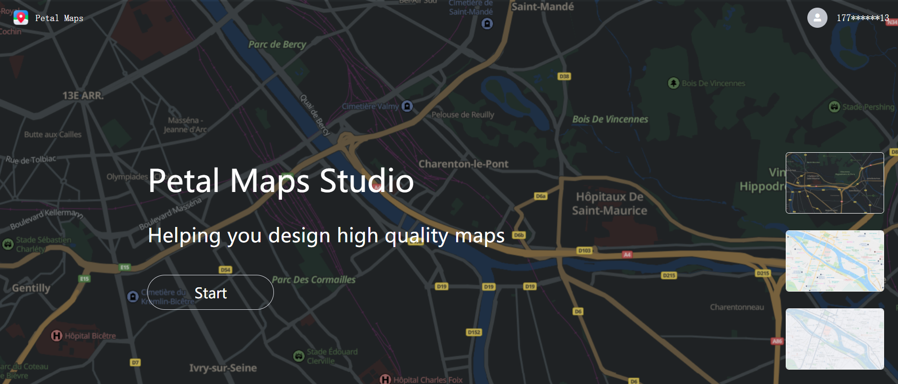
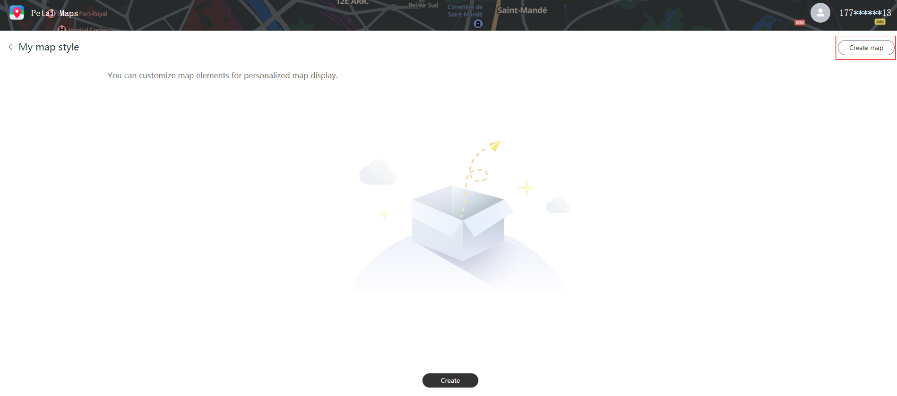
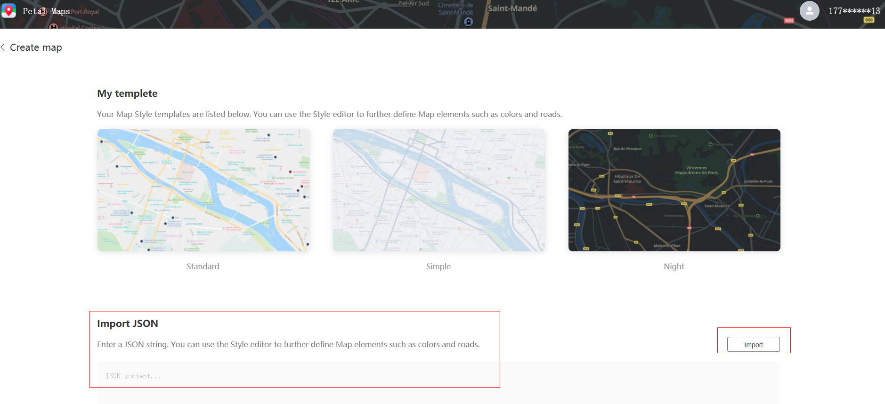
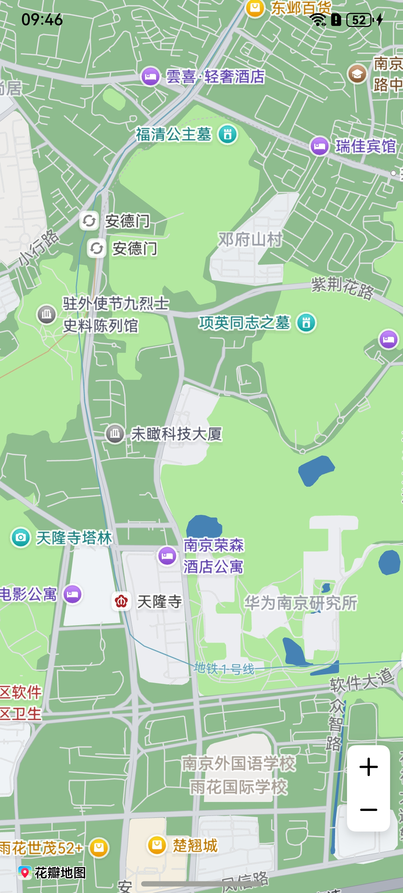

# 显示自定义地图

更新时间：2026-04-20 06:34:33

来源：https://developer.huawei.com/consumer/cn/doc/harmonyos-guides/map-style

#### 场景介绍

本章节将向您介绍如何在应用中添加自定义样式的地图。


#### 接口说明

自定义样式功能主要由[CustomMapStyleOptions](https://developer.huawei.com/consumer/cn/doc/harmonyos-references/map-common#custommapstyleoptions)、[setCustomMapStyle](https://developer.huawei.com/consumer/cn/doc/harmonyos-references/map-map-mapcomponentcontroller#setcustommapstyle)提供，更多接口及使用方法请参见[接口文档](https://developer.huawei.com/consumer/cn/doc/harmonyos-references/map-map-mapcomponentcontroller#setcustommapstyle)。

| 接口名 | 描述 |
| --- | --- |
| CustomMapStyleOptions | 自定义样式参数。 |
| setCustomMapStyle(customMapStyleOptions: mapCommon.CustomMapStyleOptions): Promise&lt;void&gt; | 将地图样式修改为自定义样式。 |


#### 开发步骤

Map Kit提供两种方法设置自定义地图样式：

 - 设置样式ID：使用[Petal Maps Studio](https://developer.petalmaps.com/console/studio/)管理地图样式，并使用样式ID将它们链接到您的地图上。您可以在[Petal Maps Studio](https://developer.petalmaps.com/console/studio/)上创建新样式，或导入现有样式定义。样式一旦发布，使用此样式的应用都会自动应用新样式。
 - 设置样式内容：通过传入自定义JSON更改地图样式，JSON的定义参见[样式参考](#样式参考)。


#### 设置样式ID
1. 导入相关模块。

  
```text
import { MapComponent, mapCommon, map } from '@kit.MapKit';
import { AsyncCallback, BusinessError } from '@kit.BasicServicesKit';
```

2. 创建样式ID。

  a.登录[Petal Maps Studio](https://developer.petalmaps.com/console/studio/)。

  



  b.点击“Create map”创建自定义样式。

  



  c.导入JSON样式文件，点击“Import”。

  



  d.在编辑器里修改样式。

  


  e.点击“SAVE”生成预览ID，预览ID在编辑样式时会重新生成，您可以通过预览ID测试样式效果。点击“PUBLISH”发布生成样式ID，样式ID是唯一ID，一旦发布生效不会变化。

  


  


3. Map Kit提供两种方法设置样式ID：

  
 - 在创建地图后设置样式ID

  
```text
@Entry
@Component
struct CustomMapStyleDemo {
  private TAG = "CustomMapStyleDemo";
  private mapOptions?: mapCommon.MapOptions;
  private mapController?: map.MapComponentController;
  private callback?: AsyncCallback<map.MapComponentController>;

  aboutToAppear(): void {
    // 地图初始化参数
    this.mapOptions = {
      position: {
        target: {
          latitude: 31.984410259206815,
          longitude: 118.76625379397866
        },
        zoom: 15
      }
    };
    this.callback = async (err, mapController) => {
      if (!err) {
        this.mapController = mapController;
        // 自定义样式参数，styleId需要替换为您自己的样式ID或者预览ID，样式ID或者预览ID可在Petal Maps Studio平台上创建
        let param: mapCommon.CustomMapStyleOptions = {
           styleId: "XXX"
        };
        // 设置自定义样式
        await this.mapController.setCustomMapStyle(param).then(() => {
          console.info(this.TAG + `setCustomMapStyle OK`);
        }).catch((error: BusinessError) => {
          console.error(this.TAG + `Failed in getting CustomMapStyle, code is：${error.code},message is ${error.message}`);
        })
      } else {
        console.error(`Failed to initialize the map, code is：${err.code}, message is ${err.message}`);
      }
    };
  }

  build() {
    Stack() {
      Column() {
        MapComponent({ mapOptions: this.mapOptions, mapCallback: this.callback });
      }.width('100%')
    }.height('100%')
  }
}
```


4. 在初始化地图时设置样式ID

  
```text
@Entry
@Component
struct CustomMapStyleDemo {
  private mapOptions?: mapCommon.MapOptions;
  private mapController?: map.MapComponentController;
  private callback?: AsyncCallback<map.MapComponentController>;

  aboutToAppear(): void {
    // 地图初始化参数
    this.mapOptions = {
      position: {
        target: {
          latitude: 31.984410259206815,
          longitude: 118.76625379397866
        },
        zoom: 15
      },
      // 自定义样式参数，styleId需要替换为您自己的样式ID或者预览ID，样式ID或者预览ID可在Petal Maps Studio平台上创建
      styleId: "XXX"
    };
    this.callback = async (err, mapController) => {
      if (!err) {
        this.mapController = mapController;
      } else {
        console.error(`Failed to initialize the map, code is：${err.code}, message is ${err.message}`);
      }
    };
  }

  build() {
    Stack() {
      Column() {
        MapComponent({ mapOptions: this.mapOptions, mapCallback: this.callback });
      }.width('100%')
    }.height('100%')
  }
}
```
设置样式ID之后效果如下：

  


  

  #### 设置样式内容

1. 导入相关模块。

  
```text
import { MapComponent, mapCommon, map } from '@kit.MapKit';
import { AsyncCallback } from '@kit.BasicServicesKit';
```


2. 设置样式内容。

  
```text
@Entry
@Component
struct CustomMapStyleDemo {
  private mapOptions?: mapCommon.MapOptions;
  private mapController?: map.MapComponentController;
  private callback?: AsyncCallback<map.MapComponentController>;

  aboutToAppear(): void {
    // 地图初始化参数
    this.mapOptions = {
      position: {
        target: {
          latitude: 31.984410259206815,
          longitude: 118.76625379397866
        },
        zoom: 15
      }
    };
    this.callback = async (err, mapController) => {
      if (!err) {
        this.mapController = mapController;
        // 自定义样式参数
        let param: mapCommon.CustomMapStyleOptions = {
               styleContent: `[{
                   "mapFeature": "landcover.natural",
                   "options": "geometry.fill",
                   "paint": {
                       "color": "#8FBC8F"
                   }},
                   {
                  "mapFeature": "water",
                  "options": "geometry.fill",
                  "paint": {
                      "color": "#4682B4"
                  }}]`
        };
        // 设置自定义样式
        await this.mapController.setCustomMapStyle(param);
      } else {
        console.error(`Failed to initialize the map, code is：${err.code}, message is ${err.message}`);
      }
    };
  }

  build() {
    Stack() {
      Column() {
        MapComponent({ mapOptions: this.mapOptions, mapCallback: this.callback });
      }.width('100%')
    }.height('100%')
  }
}
```




  

  #### 样式参考

  自定义地图样式JSON内容通过下列4个元素来定义地图样式：

  
mapFeature：地图要素
 - options：元素选项

  
geometry.fill：几何填充
 - geometry.stroke：几何描边
 - geometry.icon：几何图标
 - labels.text.fill：文本填充
 - labels.text.stroke：文本描边

      - paint：绘制属性

  
color：颜色，16进制颜色，例如“#FFFF00”
 - weight：线条宽度。整型值，[1, 24]，默认为1，大于1表示加宽
 - icon-type：图标类型，目前支持night、simple、standard

      - visibility：可见属性，默认为可见

  
true：可见
 - false：不可见


下列各表将向您展示支持修改的地图元素。

> [!NOTE]
> 图标类型icon-type支持范围为：standard/night/simple。

1. All

  All代表全部，即所有类别的集合，支持能力范围同其他所有列表，All仅可调整visibility（可见属性）。
2. Administrative

| 元素类型 Feature type | 填充颜色 Geometry. fill. color | 填充宽度 Geometry. fill. weight | 描边颜色 Geometry. stroke. color | 描边宽度 Geometry. stroke. weight | 填充颜色 Labels. fill. color | 文本大小 Labels. fill. weight | 描边颜色 Labels. stroke. color | 描边大小 Labels. stroke. weight | 图标类型 Icon. icon-type |

| --- | --- | --- | --- | --- | --- | --- | --- | --- | --- |

| Capital 首都 | - | - | - | - |  |  |  |  |  |

| Country 国家 |  |  |  |  |  |  |  |  | - |

| District 区/县 | - | - | - | - |  |  |  |  |  |

| Locality 乡村、城镇 | - | - | - | - |  |  |  |  |  |

| Major-city 1-4级城市 | - | - | - | - |  |  |  |  |  |

| Province 省 |  |  |  |  |  |  |  |  | - |
3. Landcover

| 元素类型 Feature type | 填充颜色 Geometry. fill. color | 描边颜色 Geometry. stroke. color | 填充颜色 Labels. fill. color | 文本大小 Labels. fill. weight | 描边颜色 Labels. stroke. color | 描边大小 Labels. stroke. weight |

| --- | --- | --- | --- | --- | --- | --- |

| Attraction 游乐场、动植物园等 |  | - |  |  |  |  |

| Business 购物中心、商业区等 |  | - |  |  |  |  |

| College 学校 |  | - |  |  |  |  |

| Hospital 医院 |  | - |  |  |  |  |

| Human-made 聚集区、小区、工业区、监狱地面等 |  |  |  |  |  |  |

| Human-made 建筑物 |  |  | - | - | - | - |

| Natural 陆地、岛屿、海滩、冰川等 |  | - |  |  |  |  |

| Parkland 森林、公园、荒地、高尔夫球场等 |  | - |  |  |  |  |
4. Poi

| 元素类型 Feature type | 填充颜色 Labels. fill. color | 文本大小 Labels. fill. weight | 描边颜色 Labels. stroke. color | 描边大小 Labels. stroke. weight | 图标类型 Icon. icon-type |

| --- | --- | --- | --- | --- | --- |

| Airport 飞机场 |  |  |  |  |  |

| Automotive 汽修、充电桩、洗车等 |  |  |  |  |  |

| Beauty 美容中心 |  |  |  |  |  |

| Business 公司、商业楼等 |  |  |  |  |  |

| Eating&drinking 饮食快餐 |  |  |  |  |  |

| Health-care 医院、诊所、药店等 |  |  |  |  |  |

| Leisure 休闲娱乐 |  |  |  |  |  |

| Lodging 酒店、住宿点 |  |  |  |  |  |

| Miscellaneous 自然地物 |  |  |  |  |  |

| Natural 山峰、森林等 |  |  |  |  |  |

| Public-service 医院、诊所、药店等 |  |  |  |  |  |

| Railway 铁路 |  |  |  |  |  |

| Shopping 购物中心、市场等 |  |  |  |  |  |

| Sports-outdoor 户外运动、爬山、骑车等 |  |  |  |  |  |

| Tourism 旅游景点、历史遗迹、教堂等 |  |  |  |  |  |
5. Road

| 元素类型 Feature type | 填充颜色 Geometry. fill. color | 填充宽度 Geometry. fill. weight | 描边颜色 Geometry. stroke. color | 描边宽度 Geometry. stroke. weight | 填充颜色 Labels. fill. color | 文本大小 Labels. fill. weight | 描边颜色 Labels. stroke. color | 描边大小 Labels. stroke. weight | 图标类型 Icon. icon-type |

| --- | --- | --- | --- | --- | --- | --- | --- | --- | --- |

| City-arterial 城市主干道 |  |  |  |  |  |  |  |  |  |

| Highway 城市高速 |  |  |  |  |  |  |  |  |  |

| Minor-road 市区内支线等 |  |  |  |  |  |  |  |  | - |

| National 国道 |  |  |  |  |  |  |  |  |  |

| Province 省道 |  |  |  |  |  |  |  |  |  |

| Sidewalk 人行道 |  |  |  |  |  |  |  |  | - |
6. Trafficinfo

| 元素类型 Feature type | 填充颜色 Geometry. fill. color | 填充颜色 Labels. fill. color | 文本大小 Labels. fill. weight |

| --- | --- | --- | --- |

| Closed 封路 |  |  |  |
7. Transit

| 元素类型 Feature type | 填充颜色 Geometry. fill. color | 填充宽度 Geometry. fill. weight | 描边颜色 Geometry. stroke. color | 描边宽度 Geometry. stroke. weight | 填充颜色 Labels. fill. color | 文本大小 Labels. fill. weight | 描边颜色 Labels. stroke. color | 描边大小 Labels. stroke. weight | 图标类型 Icon. icon-type |

| --- | --- | --- | --- | --- | --- | --- | --- | --- | --- |

| Airport 机场 |  | - | - | - |  |  |  |  |  |

| Airport Runway 机场跑道 |  |  |  |  | - | - | - | - | - |

| Airport Runway Taxiway 机场跑道滑行道 |  |  |  |  | - | - | - | - | - |

| Bus 公交 | - | - | - | - |  |  |  |  |  |

| Ferry-line 航线 |  | - | - | - |  |  |  |  | - |

| Ferry-terminal 港口 |  | - | - | - |  |  |  |  |  |

| Other 出租车、 出入口等 | - | - | - | - |  |  |  |  |  |

| Rail-station 火车站、 高铁站 |  | - | - | - |  |  |  |  |  |

| Railway 铁路线、 高铁线 |  |  |  |  | - | - | - | - | - |

| Subway 地铁 |  |  |  |  |  |  |  |  |  |

| Traffic_light 交通灯 | - | - | - | - | - | - | - | - |  |
8. Water

| 元素类型 Feature type | 填充颜色 Geometry. fill. color | 填充颜色 Labels. fill. color | 文本大小 Labels. fill. weight |

| --- | --- | --- | --- |

| Ocean 水系、海洋、湖泊、河流 |  |  |  |
