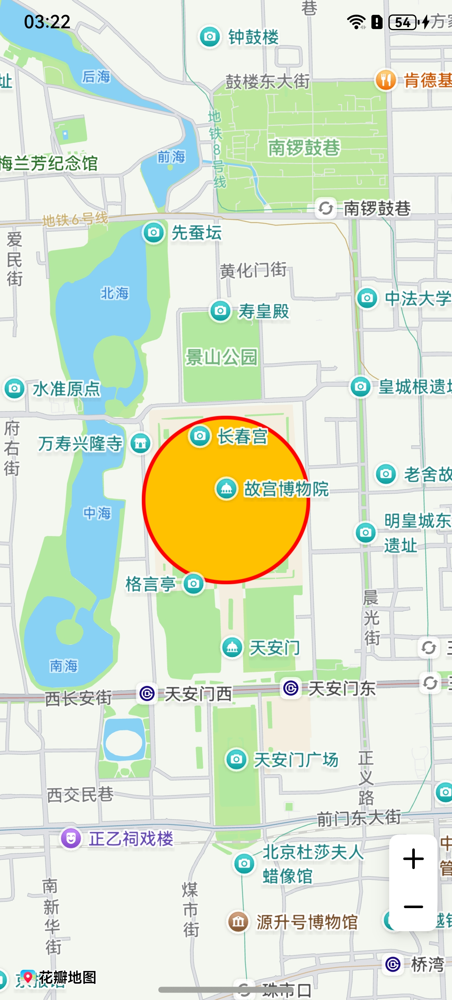

# 圆形

更新时间：2026-04-20 06:34:33

来源：https://developer.huawei.com/consumer/cn/doc/harmonyos-guides/map-circle

## 场景介绍

本章节将向您介绍如何在地图上绘制圆形。


## 接口说明

添加圆形功能主要由[MapCircleOptions](https://developer.huawei.com/consumer/cn/doc/harmonyos-references/map-common#mapcircleoptions)、[addCircle](https://developer.huawei.com/consumer/cn/doc/harmonyos-references/map-map-mapcomponentcontroller#addcircle)和[MapCircle](https://developer.huawei.com/consumer/cn/doc/harmonyos-references/map-map-mapcircle)提供，更多接口及使用方法请参见[接口文档](https://developer.huawei.com/consumer/cn/doc/harmonyos-references/map-map-mapcircle)。
| 接口名 | 描述 |
| --- | --- |
| [MapCircleOptions](https://developer.huawei.com/consumer/cn/doc/harmonyos-references/map-common#mapcircleoptions) | 圆形参数。 |
| [addCircle](https://developer.huawei.com/consumer/cn/doc/harmonyos-references/map-map-mapcomponentcontroller#addcircle)(options: [mapCommon.MapCircleOptions](https://developer.huawei.com/consumer/cn/doc/harmonyos-references/map-common#mapcircleoptions)): Promise | 在地图上添加一个圆，指定圆心经纬度和圆的半径，用于表示某个位置的周边范围。 |
| [MapCircle](https://developer.huawei.com/consumer/cn/doc/harmonyos-references/map-map-mapcircle) | 圆形，支持更新和查询相关属性。 |


## 开发步骤

导入相关模块。
```text
import { MapComponent, mapCommon, map } from '@kit.MapKit';
import { AsyncCallback } from '@kit.BasicServicesKit';
```

添加圆，在callback方法中创建初始化参数并新建Circle。
```text
@Entry
@Component
struct MapCircleDemo {
  private mapOptions?: mapCommon.MapOptions;
  private mapController?: map.MapComponentController;
  private callback?: AsyncCallback;
  private mapCircle?: map.MapCircle;

  aboutToAppear(): void {
    // 地图初始化参数
    this.mapOptions = {
      position: {
        target: {
          latitude: 39.918,
          longitude: 116.397
        },
        zoom: 14
      }
    };

    this.callback = async (err, mapController) => {
      if (!err) {
        this.mapController = mapController;
        // Circle初始化参数
        let mapCircleOptions: mapCommon.MapCircleOptions = {
          center: {
            latitude: 39.918,
            longitude: 116.397
          },
          radius: 500,
          clickable: true,
          fillColor: 0xFFFFC100,
          strokeColor: 0xFFFF0000,
          strokeWidth: 10,
          visible: true,
          zIndex: 15
        }
        // 创建Circle
        try {
          this.mapCircle = await this.mapController.addCircle(mapCircleOptions);
        } catch (e) {
          console.error(`Failed to create the mapCircle, code is：${e.code}, message is ${e.message}`);
        }
      } else {
        console.error(`Failed to initialize the map, code is：${err.code}, message is ${err.message}`);
      }
    };
  }

  build() {
    Stack() {
      Column() {
        MapComponent({ mapOptions: this.mapOptions, mapCallback: this.callback });
      }.width('100%')
    }.height('100%')
  }
}
```


