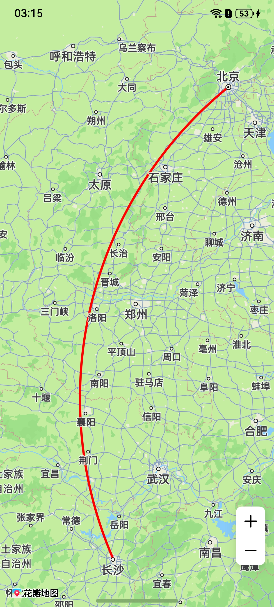

# 弧线

更新时间：2026-05-18 03:44:20

来源：https://developer.huawei.com/consumer/cn/doc/harmonyos-guides/map-arc

#### 场景介绍
本章节将向您介绍如何在地图上绘制弧线，通过[MapArcParams](https://developer.huawei.com/consumer/cn/doc/harmonyos-references/map-common#maparcparams)类设置弧线的位置、宽度、颜色等参数。
弧线主要用于展示飞机、轮船等出行路线，直观呈现弧形轨迹，同时可在交叉路口等位置指示转向方向。

#### 接口说明
添加弧线功能主要由[MapArcParams](https://developer.huawei.com/consumer/cn/doc/harmonyos-references/map-common#maparcparams)、[addArc](https://developer.huawei.com/consumer/cn/doc/harmonyos-references/map-map-mapcomponentcontroller#addarc)和[MapArc](https://developer.huawei.com/consumer/cn/doc/harmonyos-references/map-map-maparc)提供，更多接口及使用方法请参见[接口文档](https://developer.huawei.com/consumer/cn/doc/harmonyos-references/map-map-maparc)。

| 接口名 | 描述 |
| --- | --- |
| [MapArcParams](https://developer.huawei.com/consumer/cn/doc/harmonyos-references/map-common#maparcparams) | 弧线参数。 |
| [addArc](https://developer.huawei.com/consumer/cn/doc/harmonyos-references/map-map-mapcomponentcontroller#addarc)(params: [mapCommon.MapArcParams](https://developer.huawei.com/consumer/cn/doc/harmonyos-references/map-common#maparcparams)): [MapArc](https://developer.huawei.com/consumer/cn/doc/harmonyos-references/map-map-maparc) | 添加一条弧线。 |
| [MapArc](https://developer.huawei.com/consumer/cn/doc/harmonyos-references/map-map-maparc) | 弧线，支持更新和查询相关属性。 |

#### 开发步骤
#### 添加弧线
1. 导入相关模块。 import { map, mapCommon, MapComponent } from '@kit.MapKit';
import { AsyncCallback } from '@kit.BasicServicesKit';
2. 添加弧线，在callback方法中创建初始化参数并新建MapArc。 @Entry
@Component
struct MapArcDemo {
  private TAG = "OHMapSDK_MapArcDemo";
  private mapOptions?: mapCommon.MapOptions;
  private mapController?: map.MapComponentController;
  private callback?: AsyncCallback&lt;map.MapComponentController&gt;;
  private mapArc?: map.MapArc;

  aboutToAppear(): void {
 this.mapOptions = {
 position: {
 target: {
 latitude: 34.757975,
 longitude: 113.665412
 },
 zoom: 6
 }
 }

 this.callback = async (err, mapController) => {
 if (!err) {
 this.mapController = mapController;
 if (!this.mapController) {
 console.error(this.TAG, "mapController is null");
 return;
 }
 // 设置弧线参数
 let mapArcParams: mapCommon.MapArcParams = {
 // 弧线起点坐标
 startPoint: {
 latitude: 39.913138,
 longitude: 116.415112
 },
 // 弧线终点坐标
 endPoint: {
 latitude: 28.239473,
 longitude: 112.954094
 },
 // 弧线中心点坐标
 centerPoint: {
 latitude: 33.86970399048567,
 longitude: 112.08633528544145
 },
 width: 10,
 color: 0xffff0000,
 visible: true,
 zIndex: 100
 };
 // 添加弧线
 try {
 this.mapArc = await this.mapController.addArc(mapArcParams);
 } catch (e) {
 console.error(`Failed to create the mapArc, code is：${e.code}, message is ${e.message}`);
 }
 } else {
 console.error(`Failed to initialize the map, code is：${err.code}, message is ${err.message}`);
 }
 }
  }

  build() {
 Stack() {
 Column() {
 MapComponent({
 mapOptions: this.mapOptions,
 mapCallback: this.callback
 })
 .width('100%')
 .height('100%');
 }.width('100%')
 }.height('100%')
  }
}