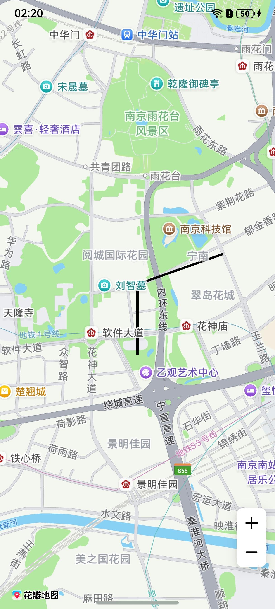
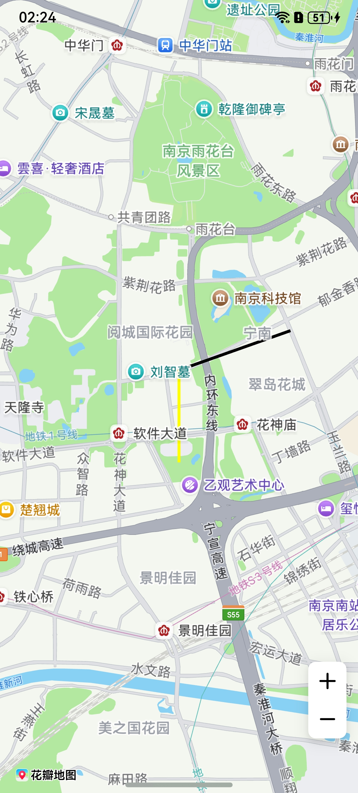
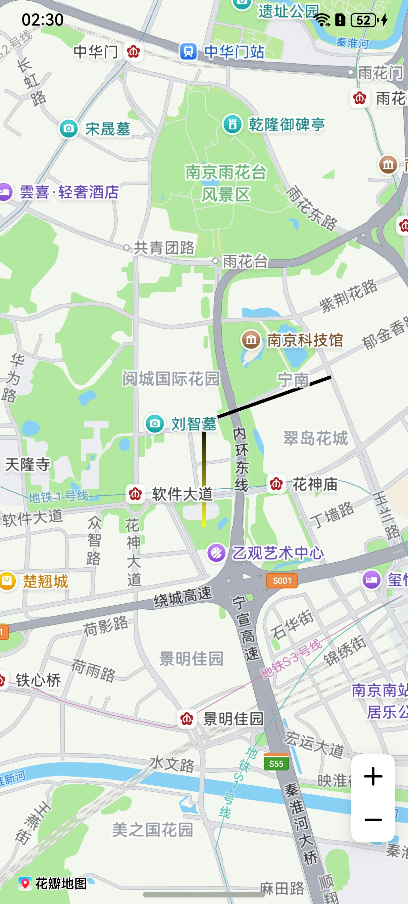
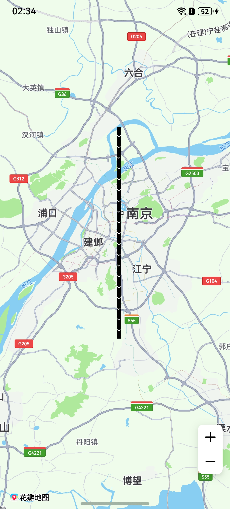
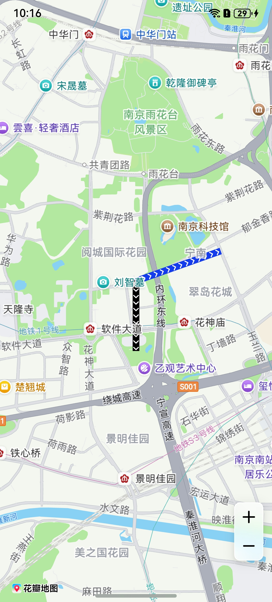

# 折线

更新时间：2026-05-18 03:44:20

来源：https://developer.huawei.com/consumer/cn/doc/harmonyos-guides/map-polyline

##### 场景介绍

本章节将向您介绍如何在地图上绘制折线、设置折线分段颜色、设置折线可渐变、绘制纹理。

折线主要用于展示步行、驾车、骑行等各类导航路线，同时可记录并呈现用户的运动轨迹及历史行程信息。此外，在区域边界标注、距离测量、管网线路布局以及活动路径可视化等场景中也有广泛应用。

5.0.3(15)开始，支持折线绘制纹理功能。





##### 接口说明

添加折线功能主要由[MapPolylineOptions](https://developer.huawei.com/consumer/cn/doc/harmonyos-references/map-common#mappolylineoptions)、[addPolyline](https://developer.huawei.com/consumer/cn/doc/harmonyos-references/map-map-mapcomponentcontroller#addpolyline)和[MapPolyline](https://developer.huawei.com/consumer/cn/doc/harmonyos-references/map-map-mappolyline)提供，更多接口及使用方法请参见[接口文档](https://developer.huawei.com/consumer/cn/doc/harmonyos-references/map-map-mappolyline)。

| 接口名 | 描述 |
| --- | --- |
| MapPolylineOptions | 折线参数。 |
| addPolyline(options: mapCommon.MapPolylineOptions): Promise&lt;MapPolyline&gt; | 在地图上添加一条折线。 |
| MapPolyline | 折线，支持更新和查询相关属性。 |


##### 开发步骤


##### 添加折线
1. 导入相关模块。

  
```text
import { MapComponent, mapCommon, map } from '@kit.MapKit';
import { AsyncCallback } from '@kit.BasicServicesKit';
```

2. 添加折线，在callback方法中创建初始化参数并新建[MapPolyline](https://developer.huawei.com/consumer/cn/doc/harmonyos-references/map-map-mappolyline)。

  
```text
@Entry
@Component
struct MapPolylineDemo {
  private mapOptions?: mapCommon.MapOptions;
  private mapController?: map.MapComponentController;
  private callback?: AsyncCallback<map.MapComponentController>;
  private mapPolyline?: map.MapPolyline;

  aboutToAppear(): void {
    // 地图初始化参数
    this.mapOptions = {
      position: {
        target: {
          latitude: 31.98,
          longitude: 118.78
        },
        zoom: 14
      }
    };
    this.callback = async (err, mapController) => {
      if (!err) {
        this.mapController = mapController;

        // polyline初始化参数
        let polylineOption: mapCommon.MapPolylineOptions = {
          points: [
            { longitude: 118.78, latitude: 31.975 },
            { longitude: 118.78, latitude: 31.982 },
            { longitude: 118.79, latitude: 31.985 }
          ],
          clickable: true,
          startCap: mapCommon.CapStyle.BUTT,
          endCap: mapCommon.CapStyle.BUTT,
          geodesic: false,
          jointType: mapCommon.JointType.BEVEL,
          visible: true,
          width: 10,
          zIndex: 10,
          gradient: false
        }
        // 创建polyline
        try {
          this.mapPolyline = await this.mapController.addPolyline(polylineOption);
        } catch (e) {
          console.error(`Failed to create the mapPolyline, code is：${e.code}, message is ${e.message}`);
        }
      } else {
        console.error(`Failed to initialize the map, code is：${err.code}, message is ${err.message}`);
      }
    };
  }

  build() {
    Stack() {
      Column() {
        MapComponent({ mapOptions: this.mapOptions, mapCallback: this.callback });
      }.width('100%')
    }.height('100%')
  }
}
```


##### 设置折线分段颜色

方法一：新建折线时在[MapPolylineOptions](https://developer.huawei.com/consumer/cn/doc/harmonyos-references/map-common#mappolylineoptions)的colors属性中设置折线分段颜色值。

```text
let polylineOption: mapCommon.MapPolylineOptions = {
  points: [
    { longitude:118.78, latitude:31.975 },
    { longitude:118.78, latitude:31.982 },
    { longitude:118.79, latitude:31.985 }
  ],
  clickable: true,
  startCap: mapCommon.CapStyle.BUTT,
  endCap: mapCommon.CapStyle.BUTT,
  geodesic: false,
  jointType: mapCommon.JointType.BEVEL,
  visible: true,
  width: 10,
  zIndex: 10,
  // 设置颜色
  colors: [0xffffff00, 0xff000000],
  gradient: false
};
```

方法二：调用[MapPolyline](https://developer.huawei.com/consumer/cn/doc/harmonyos-references/map-map-mappolyline)的[setColors](https://developer.huawei.com/consumer/cn/doc/harmonyos-references/map-map-mappolyline#setcolors)()方法。

```text
let colors = [0xffffff00, 0xff000000];
this.mapPolyline.setColors(colors);
```





##### 设置折线可渐变

方法一：[MapPolylineOptions](https://developer.huawei.com/consumer/cn/doc/harmonyos-references/map-common#mappolylineoptions)的gradient属性设置为true。

```text
let polylineOption: mapCommon.MapPolylineOptions = {
  points: [
    { longitude:118.78, latitude:31.975 },
    { longitude:118.78, latitude:31.982 },
    { longitude:118.79, latitude:31.985 }
  ],
  clickable: true,
  startCap: mapCommon.CapStyle.BUTT,
  endCap: mapCommon.CapStyle.BUTT,
  geodesic: false,
  jointType: mapCommon.JointType.BEVEL,
  visible: true,
  width: 10,
  zIndex: 10,
  colors: [0xffffff00, 0xff000000],
  // 设置颜色折线可渐变
  gradient: true
};
```

方法二：调用[MapPolyline](https://developer.huawei.com/consumer/cn/doc/harmonyos-references/map-map-mappolyline)的[setGradient](https://developer.huawei.com/consumer/cn/doc/harmonyos-references/map-map-mappolyline#setgradient)()方法。

```text
this.mapPolyline.setGradient(true);
```





##### 绘制纹理

方法一：新建折线时在[MapPolylineOptions](https://developer.huawei.com/consumer/cn/doc/harmonyos-references/map-common#mappolylineoptions)的customTexture属性设置折线纹理。

```text
let polylineOption: mapCommon.MapPolylineOptions = {
  points: [
    { latitude: 32.220750, longitude: 118.788765 },
    { latitude: 32.120750, longitude: 118.788765 },
    { latitude: 32.020750, longitude: 118.788765 },
    { latitude: 31.920750, longitude: 118.788765 },
    { latitude: 31.820750, longitude: 118.788765 }
  ],
  clickable: true,
  jointType: mapCommon.JointType.DEFAULT,
  width: 20,
  // 图标需存放在resources/rawfile目录下
  customTexture: "icon/naviline_arrow.png"
}
```

方法二：调用[MapPolyline](https://developer.huawei.com/consumer/cn/doc/harmonyos-references/map-map-mappolyline)的[setCustomTexture](https://developer.huawei.com/consumer/cn/doc/harmonyos-references/map-map-mappolyline#setcustomtexture)方法。

```text
await this.mapPolyline.setCustomTexture("icon/naviline_arrow.png");
```





##### 折线设置分段纹理

新建折线时利用在[MapPolylineOptions](https://developer.huawei.com/consumer/cn/doc/harmonyos-references/map-common#mappolylineoptions)的customTextures和customTextureIndexes属性设置折线分段纹理。

```text
import { image } from '@kit.ImageKit';

// 数组存放图片内容
let customTextures: Array<ResourceStr | image.PixelMap> = new Array();
// 图标存放在resources/rawfile，'icon/img.png'参数值传入rawfile文件夹下的相对路径
customTextures.push('icon/img.png');
customTextures.push('icon/img_1.png');
let cusIndexNumber: Array<number> = new Array();
// cusIndexNumber数组长度与折线点数量必须相同，数组元素内容与customTextures下标相对应，图片从数组第二个元素开始选择
cusIndexNumber.push(0, 0, 1);
// polyline初始化参数
let polylineOption: mapCommon.MapPolylineOptions = {
  points: [
    { longitude: 118.78, latitude: 31.975 },
    { longitude: 118.78, latitude: 31.982 },
    { longitude: 118.79, latitude: 31.985 }
  ],
  clickable: true,
  startCap: mapCommon.CapStyle.BUTT,
  endCap: mapCommon.CapStyle.BUTT,
  jointType: mapCommon.JointType.BEVEL,
  width: 30,
  // 图标需存放在resources/rawfile目录下
  customTextures: customTextures,
  customTextureIndexes: cusIndexNumber
};
let mapPolyline = await this.mapController.addPolyline(polylineOption);
```



