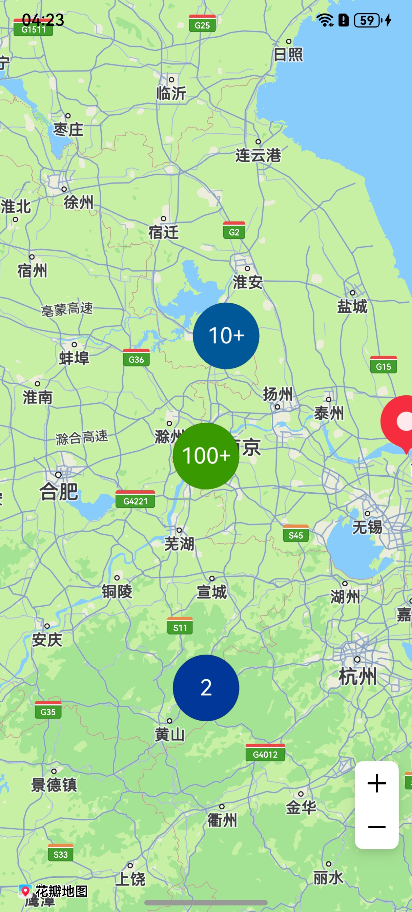

# 点聚合

更新时间：2026-04-24 08:10:21

来源：https://developer.huawei.com/consumer/cn/doc/harmonyos-guides/map-aggregate

## 场景介绍

本章节将详细介绍如何基于地图数据实现点聚合功能。 您可以通过比例尺缩放自适应聚合效果，聚合图标可点击。聚合支持功能： 支持按距离聚合[ClusterItem](https://developer.huawei.com/consumer/cn/doc/harmonyos-references/map-common#clusteritem)。 支持绘制聚合覆盖物的默认图标。 支持绘制聚合覆盖物的[自定义图标](https://developer.huawei.com/consumer/cn/doc/harmonyos-references/map-common#getcustomicon)。 支持监听聚合覆盖物的点击事件。 支持添加单个[ClusterItem](https://developer.huawei.com/consumer/cn/doc/harmonyos-references/map-common#clusteritem)到聚合覆盖物中。 支持删除聚合覆盖物。 支持移动地图时重绘聚合覆盖物。 5.0.3(15)开始，支持聚合标记点击事件监听功能。


## 接口说明

聚合功能主要由[ClusterOverlayParams](https://developer.huawei.com/consumer/cn/doc/harmonyos-references/map-common#clusteroverlayparams)、[addClusterOverlay](https://developer.huawei.com/consumer/cn/doc/harmonyos-references/map-map-mapcomponentcontroller#addclusteroverlay)、[ClusterOverlay](https://developer.huawei.com/consumer/cn/doc/harmonyos-references/map-map-clusteroverlay)提供，更多接口及使用方法请参见[接口文档](https://developer.huawei.com/consumer/cn/doc/harmonyos-references/map-map-clusteroverlay)。
| 接口名 | 描述 |
| --- | --- |
| [ClusterOverlayParams](https://developer.huawei.com/consumer/cn/doc/harmonyos-references/map-common#clusteroverlayparams) | 点聚合参数。 |
| [addClusterOverlay](https://developer.huawei.com/consumer/cn/doc/harmonyos-references/map-map-mapcomponentcontroller#addclusteroverlay)(params: [mapCommon.ClusterOverlayParams](https://developer.huawei.com/consumer/cn/doc/harmonyos-references/map-common#clusteroverlayparams)): Promise | 聚合接口，支持节点聚合能力。 |
| [ClusterOverlay](https://developer.huawei.com/consumer/cn/doc/harmonyos-references/map-map-clusteroverlay) | 点聚合，支持更新和查询相关属性。 |


## 开发步骤

导入相关模块。
```text
import { map, mapCommon, MapComponent } from '@kit.MapKit';
import { AsyncCallback } from '@kit.BasicServicesKit';
```

新增聚合图层。
```text
@Entry
@Component
struct ClusterOverlayDemo {
  private mapOptions?: mapCommon.MapOptions;
  private mapController?: map.MapComponentController;
  private callback?: AsyncCallback;

  aboutToAppear(): void {
    this.mapOptions = {
      position: {
        target: {
          latitude: 31.98,
          longitude: 118.7
        },
        zoom: 7
      }
    }

    this.callback = async (err, mapController) => {
      if (!err) {
        this.mapController = mapController;
        // 生成待聚合点
        let clusterItem1: mapCommon.ClusterItem = {
          position: {
            latitude: 31.98,
            longitude: 118.7
          }
        };
        let clusterItem2: mapCommon.ClusterItem = {
          position: {
            latitude: 32.99,
            longitude: 118.9
          }
        };
        let clusterItem3: mapCommon.ClusterItem = {
          position: {
            latitude: 31.5,
            longitude: 118.7
          }
        };
        let clusterItem4: mapCommon.ClusterItem = {
          position: {
            latitude: 30,
            longitude: 118.7
          }
        };
        let clusterItem5: mapCommon.ClusterItem = {
          position: {
            latitude: 29.98,
            longitude: 117.7
          }
        };
        let clusterItem6: mapCommon.ClusterItem = {
          position: {
            latitude: 31.98,
            longitude: 120.7
          }
        };
        let clusterItem7: mapCommon.ClusterItem = {
          position: {
            latitude: 25.98,
            longitude: 119.7
          }
        };
        let clusterItem8: mapCommon.ClusterItem = {
          position: {
            latitude: 30.98,
            longitude: 110.7
          }
        };
        let clusterItem9: mapCommon.ClusterItem = {
          position: {
            latitude: 30.98,
            longitude: 115.7
          }
        };
        let clusterItem10: mapCommon.ClusterItem = {
          position: {
            latitude: 28.98,
            longitude: 122.7
          }
        };
        let array: Array = [
          clusterItem1,
          clusterItem2,
          clusterItem3,
          clusterItem4,
          clusterItem5,
          clusterItem6,
          clusterItem7,
          clusterItem8,
          clusterItem9,
          clusterItem10
        ]
        for(let index = 0; index              聚合标记点击事件监听。
```text
let callback1 = (markerClusterInfo: map.MarkerClusterInfo) => {
console.info("markerClusterClick", `callback1 markerClusterInfo`);
};
// 添加监听
clusterOverlay.on("markerClusterClick", callback1);
// 取消监听
clusterOverlay.off("markerClusterClick", callback1);
```
