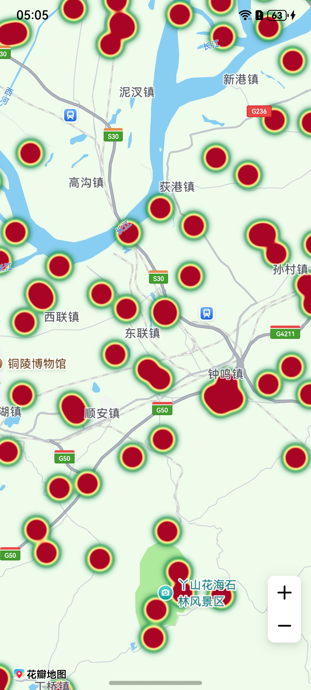

# 热力图

更新时间：2026-04-20 06:34:33

来源：https://developer.huawei.com/consumer/cn/doc/harmonyos-guides/map-heat

#### 场景介绍

新增热力图层，用于展示数据的分布情况。通过热力图功能，将数据用不同颜色的区块在地图上展示，可以直观地描述在地图上某个区域内人群或车辆的密度和分布情况。热力图适用于大数据密度可视化场景，如人流分布，热点区域等。

6.0.0(20)开始，支持热力图功能。





#### 接口说明

热力图功能主要由[HeatmapParams](https://developer.huawei.com/consumer/cn/doc/harmonyos-references/map-common#heatmapparams)、[addHeatmap](https://developer.huawei.com/consumer/cn/doc/harmonyos-references/map-map-mapcomponentcontroller#addheatmap)和[Heatmap](https://developer.huawei.com/consumer/cn/doc/harmonyos-references/map-map-heatmap)提供，更多接口及使用方法请参见[接口文档](https://developer.huawei.com/consumer/cn/doc/harmonyos-references/map-map-heatmap)。

| 接口名 | 描述 |
| --- | --- |
| HeatmapParams | 热力图参数。 |
| addHeatmap(params: mapCommon.HeatmapParams): Promise&lt;Heatmap&gt; | 新增热力图。 |
| Heatmap | 热力图，支持修改和删除热力图，例如：支持设置颜色、设置透明度等。 |


#### 开发步骤
1. 导入相关模块。

  
```text
import { map, mapCommon, MapComponent } from '@kit.MapKit';
import { AsyncCallback } from '@kit.BasicServicesKit';
```

2. 增加热力图。

  
```json
@Entry
@Component
struct HeatMapDemo {
  private TAG = "OHMapSDK_HeatMapDemo";
  private mapOption?: mapCommon.MapOptions;
  private mapController?: map.MapComponentController;
  private callback?: AsyncCallback<map.MapComponentController>;

  aboutToAppear(): void {
    this.mapOption = {
      position: {
        target: {
          latitude: 31.000000,
          longitude: 118.000000
        },
        zoom: 11
      }
    }
    this.callback = async (err, mapController) => {
      console.info(this.TAG, "mapCallback err=" + JSON.stringify(err) +
        "; mapController=" + JSON.stringify(mapController));
      if (!err) {
        this.mapController = mapController;
        let data: mapCommon.WeightedLatLng[] = [];
        // 生成500个随机坐标点，用于热力图数据
        for (let i = 0; i < 500; i++) {
          data.push({
            point: {
              longitude: 118.000000 + Math.random() * 1 - 0.25,
              latitude: 31.000000 + Math.random() * 1 - 0.25
            },
            intensity: 1
          });
        }
        let heatMapOptions: mapCommon.HeatmapParams = {
          id: 'heatmap0001',
          data:data,
          radius:20,
          intensity: {
            2: 1,
            5: 5,
            8: 10
          }
        }
        try {
          // 添加热力图
          await this.mapController?.addHeatmap(heatMapOptions);
        } catch (e) {
          console.error(this.TAG, `code:${e.code}, message:${e.message}`);
        }
      } else {
        console.error(`Failed to initialize the map, code is：${err.code}, message is ${err.message}`);
      }
    }
  }
  build() {
    Stack() {
      Column() {
        MapComponent({ mapOptions: this.mapOption, mapCallback: this.callback })
          .width('100%')
          .height('100%');
      }.width('100%')
    }.height('100%')
  }
}
```
